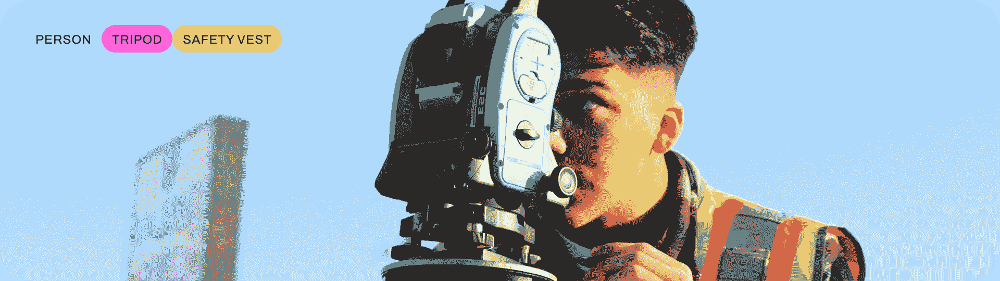

# 图像分类

> 原文：[`docs.ultralytics.com/tasks/classify/`](https://docs.ultralytics.com/tasks/classify/)



图像分类是三项任务中最简单的，它涉及将整个图像分类为预定义类别集中的一类。

图像分类器的输出是一个类标签和置信度分数。当你只需知道图像属于哪个类别，而不需要知道该类别的对象在何处或其确切形状时，图像分类非常有用。

[`www.youtube.com/embed/5BO0Il_YYAg`](https://www.youtube.com/embed/5BO0Il_YYAg)

**观看：** 探索 Ultralytics YOLO 任务：使用 Ultralytics HUB 进行图像分类

提示

YOLOv8 分类模型使用`-cls`后缀，例如`yolov8n-cls.pt`，并且在[ImageNet](https://github.com/ultralytics/ultralytics/blob/main/ultralytics/cfg/datasets/ImageNet.yaml)上进行了预训练。

## [模型](https://github.com/ultralytics/ultralytics/tree/main/ultralytics/cfg/models/v8)

YOLOv8 预训练分类模型显示在此处。检测、分割和姿态模型是在[COCO](https://github.com/ultralytics/ultralytics/blob/main/ultralytics/cfg/datasets/coco.yaml)数据集上预训练的，而分类模型是在[ImageNet](https://github.com/ultralytics/ultralytics/blob/main/ultralytics/cfg/datasets/ImageNet.yaml)数据集上预训练的。

[模型](https://github.com/ultralytics/ultralytics/tree/main/ultralytics/cfg/models)在第一次使用时会从最新的 Ultralytics [发布](https://github.com/ultralytics/assets/releases)自动下载。

| 模型 | 尺寸 ^(像素) | 准确率 ^(top1) | 准确率 ^(top5) | 速度 ^(CPU ONNX

(毫秒)) | 速度 ^(A100 TensorRT

(毫秒)) | 参数 ^((百万)) | FLOPs ^((十亿，以 640 为单位)) |

| --- | --- | --- | --- | --- | --- | --- | --- |
| --- | --- | --- | --- | --- | --- | --- | --- |
| [YOLOv8n-cls](https://github.com/ultralytics/assets/releases/download/v8.2.0/yolov8n-cls.pt) | 224 | 69.0 | 88.3 | 12.9 | 0.31 | 2.7 | 4.3 |
| [YOLOv8s-cls](https://github.com/ultralytics/assets/releases/download/v8.2.0/yolov8s-cls.pt) | 224 | 73.8 | 91.7 | 23.4 | 0.35 | 6.4 | 13.5 |
| [YOLOv8m-cls](https://github.com/ultralytics/assets/releases/download/v8.2.0/yolov8m-cls.pt) | 224 | 76.8 | 93.5 | 85.4 | 0.62 | 17.0 | 42.7 |
| [YOLOv8l-cls](https://github.com/ultralytics/assets/releases/download/v8.2.0/yolov8l-cls.pt) | 224 | 76.8 | 93.5 | 163.0 | 0.87 | 37.5 | 99.7 |
| [YOLOv8x-cls](https://github.com/ultralytics/assets/releases/download/v8.2.0/yolov8x-cls.pt) | 224 | 79.0 | 94.6 | 232.0 | 1.01 | 57.4 | 154.8 |

+   **准确度**值是模型在[ImageNet](https://www.image-net.org/)数据集验证集上的准确性。

    重现命令 `yolo val classify data=path/to/ImageNet device=0`

+   **速度**是通过 ImageNet 验证图像在[Amazon EC2 P4d](https://aws.amazon.com/ec2/instance-types/p4/)实例上平均得出的。

    重现命令 `yolo val classify data=path/to/ImageNet batch=1 device=0|cpu`

## 训练

在图像大小为 64 的 MNIST160 数据集上训练 YOLOv8n-cls 100 个周期。有关所有可用参数的完整列表，请参阅配置页面。

示例

```py
from ultralytics import YOLO

# Load a model
model = YOLO("yolov8n-cls.yaml")  # build a new model from YAML
model = YOLO("yolov8n-cls.pt")  # load a pretrained model (recommended for training)
model = YOLO("yolov8n-cls.yaml").load("yolov8n-cls.pt")  # build from YAML and transfer weights

# Train the model
results = model.train(data="mnist160", epochs=100, imgsz=64) 
```

```py
# Build a new model from YAML and start training from scratch
yolo  classify  train  data=mnist160  model=yolov8n-cls.yaml  epochs=100  imgsz=64

# Start training from a pretrained *.pt model
yolo  classify  train  data=mnist160  model=yolov8n-cls.pt  epochs=100  imgsz=64

# Build a new model from YAML, transfer pretrained weights to it and start training
yolo  classify  train  data=mnist160  model=yolov8n-cls.yaml  pretrained=yolov8n-cls.pt  epochs=100  imgsz=64 
```

### 数据集格式

YOLO 分类数据集格式的详细信息可在数据集指南中找到。

## 验证

在 MNIST160 数据集上验证训练好的 YOLOv8n-cls 模型准确性。作为模型保留其训练数据和参数属性，无需传递任何参数。

示例

```py
from ultralytics import YOLO

# Load a model
model = YOLO("yolov8n-cls.pt")  # load an official model
model = YOLO("path/to/best.pt")  # load a custom model

# Validate the model
metrics = model.val()  # no arguments needed, dataset and settings remembered
metrics.top1  # top1 accuracy
metrics.top5  # top5 accuracy 
```

```py
yolo  classify  val  model=yolov8n-cls.pt  # val official model
yolo  classify  val  model=path/to/best.pt  # val custom model 
```

## 预测

使用训练好的 YOLOv8n-cls 模型对图像进行预测。

示例

```py
from ultralytics import YOLO

# Load a model
model = YOLO("yolov8n-cls.pt")  # load an official model
model = YOLO("path/to/best.pt")  # load a custom model

# Predict with the model
results = model("https://ultralytics.com/images/bus.jpg")  # predict on an image 
```

```py
yolo  classify  predict  model=yolov8n-cls.pt  source='https://ultralytics.com/images/bus.jpg'  # predict with official model
yolo  classify  predict  model=path/to/best.pt  source='https://ultralytics.com/images/bus.jpg'  # predict with custom model 
```

查看完整的预测模式细节，请参阅预测页面。

## 导出

将 YOLOv8n-cls 模型导出为 ONNX、CoreML 等其他格式。

示例

```py
from ultralytics import YOLO

# Load a model
model = YOLO("yolov8n-cls.pt")  # load an official model
model = YOLO("path/to/best.pt")  # load a custom trained model

# Export the model
model.export(format="onnx") 
```

```py
yolo  export  model=yolov8n-cls.pt  format=onnx  # export official model
yolo  export  model=path/to/best.pt  format=onnx  # export custom trained model 
```

可用的 YOLOv8-cls 导出格式如下表所示。您可以使用`format`参数导出到任何格式，例如`format='onnx'`或`format='engine'`。您可以直接在导出的模型上进行预测或验证，例如`yolo predict model=yolov8n-cls.onnx`。导出完成后，示例中将显示您模型的用法。

| 格式 | `format` 参数 | 模型 | 元数据 | 参数 |
| --- | --- | --- | --- | --- |
| [PyTorch](https://pytorch.org/) | - | `yolov8n-cls.pt` | ✅ | - |
| TorchScript | `torchscript` | `yolov8n-cls.torchscript` | ✅ | `imgsz`, `optimize`, `batch` |
| ONNX | `onnx` | `yolov8n-cls.onnx` | ✅ | `imgsz`, `half`, `dynamic`, `simplify`, `opset`, `batch` |
| OpenVINO | `openvino` | `yolov8n-cls_openvino_model/` | ✅ | `imgsz`, `half`, `int8`, `batch`, `dynamic` |
| TensorRT | `engine` | `yolov8n-cls.engine` | ✅ | `imgsz`, `half`, `dynamic`, `simplify`, `workspace`, `int8`, `batch` |
| CoreML | `coreml` | `yolov8n-cls.mlpackage` | ✅ | `imgsz`, `half`, `int8`, `nms`, `batch` |
| TF SavedModel | `saved_model` | `yolov8n-cls_saved_model/` | ✅ | `imgsz`, `keras`, `int8`, `batch` |
| TF GraphDef | `pb` | `yolov8n-cls.pb` | ❌ | `imgsz`, `batch` |
| TF Lite | `tflite` | `yolov8n-cls.tflite` | ✅ | `imgsz`, `half`, `int8`, `batch` |
| TF Edge TPU | `edgetpu` | `yolov8n-cls_edgetpu.tflite` | ✅ | `imgsz` |
| TF.js | `tfjs` | `yolov8n-cls_web_model/` | ✅ | `imgsz`, `half`, `int8`, `batch` |
| PaddlePaddle | `paddle` | `yolov8n-cls_paddle_model/` | ✅ | `imgsz`, `batch` |
| NCNN | `ncnn` | `yolov8n-cls_ncnn_model/` | ✅ | `imgsz`, `half`, `batch` |

查看完整的导出细节，请参阅导出页面。

## 常见问题解答

### YOLOv8 在图像分类中的目的是什么？

YOLOv8 模型（例如`yolov8n-cls.pt`）专为高效的图像分类而设计。它们为整个图像分配单一类别标签，并提供置信度分数。对于仅需知道图像具体类别而无需识别其位置或形状的应用程序，这非常有用。

### 如何训练 YOLOv8 模型进行图像分类？

您可以使用 Python 或 CLI 命令训练 YOLOv8 模型。例如，对于图像大小为 64 的 MNIST160 数据集，可以在 100 个周期内训练`yolov8n-cls`模型：

示例

```py
from ultralytics import YOLO

# Load a model
model = YOLO("yolov8n-cls.pt")  # load a pretrained model (recommended for training)

# Train the model
results = model.train(data="mnist160", epochs=100, imgsz=64) 
```

```py
yolo  classify  train  data=mnist160  model=yolov8n-cls.pt  epochs=100  imgsz=64 
```

欲了解更多配置选项，请访问配置页面。

### 我可以在哪里找到预训练的 YOLOv8 分类模型？

预训练的 YOLOv8 分类模型可以在[模型](https://github.com/ultralytics/ultralytics/tree/main/ultralytics/cfg/models/v8)部分找到。像`yolov8n-cls.pt`、`yolov8s-cls.pt`、`yolov8m-cls.pt`等模型，都是在[ImageNet](https://github.com/ultralytics/ultralytics/blob/main/ultralytics/cfg/datasets/ImageNet.yaml)数据集上进行了预训练，可以轻松下载并用于各种图像分类任务。

### 如何将训练好的 YOLOv8 模型导出到不同的格式？

你可以使用 Python 或 CLI 命令将训练好的 YOLOv8 模型导出到各种格式。例如，要将模型导出为 ONNX 格式：

示例

```py
from ultralytics import YOLO

# Load a model
model = YOLO("yolov8n-cls.pt")  # load the trained model

# Export the model to ONNX
model.export(format="onnx") 
```

```py
yolo  export  model=yolov8n-cls.pt  format=onnx  # export the trained model to ONNX format 
```

欲了解详细的导出选项，请参考导出页面。

### 我如何验证训练好的 YOLOv8 分类模型？

要验证训练好的模型在类似 MNIST160 的数据集上的准确性，可以使用以下 Python 或 CLI 命令：

示例

```py
from ultralytics import YOLO

# Load a model
model = YOLO("yolov8n-cls.pt")  # load the trained model

# Validate the model
metrics = model.val()  # no arguments needed, uses the dataset and settings from training
metrics.top1  # top1 accuracy
metrics.top5  # top5 accuracy 
```

```py
yolo  classify  val  model=yolov8n-cls.pt  # validate the trained model 
```

欲了解更多信息，请访问验证部分。
