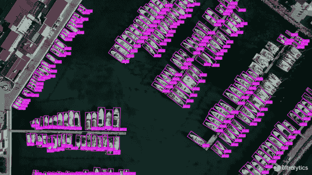
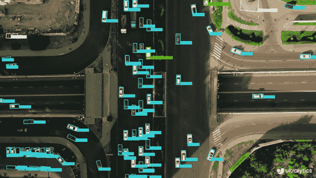

# 定向边界框目标检测

> 原文：[`docs.ultralytics.com/tasks/obb/`](https://docs.ultralytics.com/tasks/obb/)

定向目标检测比普通目标检测更进一步，引入额外的角度以在图像中更准确地定位对象。

定向目标检测器的输出是一组旋转的边界框，精确包围图像中的对象，并附带每个框的类别标签和置信度分数。当您需要识别场景中感兴趣的对象但不需要精确知道对象在哪里或其精确形状时，目标检测是一个不错的选择。

提示

YOLOv8 OBB 模型使用 `-obb` 后缀，例如 `yolov8n-obb.pt` 并在[DOTAv1](https://github.com/ultralytics/ultralytics/blob/main/ultralytics/cfg/datasets/DOTAv1.yaml) 数据集上预训练。

|

[`www.youtube.com/embed/Z7Z9pHF8wJc`](https://www.youtube.com/embed/Z7Z9pHF8wJc)

**观看：** 使用 Ultralytics YOLOv8 定向边界框（YOLOv8-OBB）进行目标检测 |

[`www.youtube.com/embed/uZ7SymQfqKI`](https://www.youtube.com/embed/uZ7SymQfqKI)

**观看：** 使用 Ultralytics HUB 的 YOLOv8-OBB 进行目标检测 |

## 视觉样本

| 使用 OBB 进行船只检测 | 使用 OBB 进行车辆检测 |
| --- | --- |
|  |  |

## [模型](https://github.com/ultralytics/ultralytics/tree/main/ultralytics/cfg/models/v8)

YOLOv8 预训练的 OBB 模型显示在此处，这些模型是在[DOTAv1](https://github.com/ultralytics/ultralytics/blob/main/ultralytics/cfg/datasets/DOTAv1.yaml) 数据集上预训练的。

[模型](https://github.com/ultralytics/ultralytics/tree/main/ultralytics/cfg/models)在首次使用时会自动从最新的 Ultralytics [发布版](https://github.com/ultralytics/assets/releases)下载。

| 模型 | 尺寸 ^((像素)) | mAP^(测试 50) | 速度 ^(CPU ONNX

(ms)) | 速度 ^(A100 TensorRT

(ms)) | 参数 ^((M)) | FLOPs ^((B)) |

| --- | --- | --- | --- | --- | --- | --- |
| --- | --- | --- | --- | --- | --- | --- |
| [YOLOv8n-obb](https://github.com/ultralytics/assets/releases/download/v8.2.0/yolov8n-obb.pt) | 1024 | 78.0 | 204.77 | 3.57 | 3.1 | 23.3 |
| [YOLOv8s-obb](https://github.com/ultralytics/assets/releases/download/v8.2.0/yolov8s-obb.pt) | 1024 | 79.5 | 424.88 | 4.07 | 11.4 | 76.3 |
| [YOLOv8m-obb](https://github.com/ultralytics/assets/releases/download/v8.2.0/yolov8m-obb.pt) | 1024 | 80.5 | 763.48 | 7.61 | 26.4 | 208.6 |
| [YOLOv8l-obb](https://github.com/ultralytics/assets/releases/download/v8.2.0/yolov8l-obb.pt) | 1024 | 80.7 | 1278.42 | 11.83 | 44.5 | 433.8 |
| [YOLOv8x-obb](https://github.com/ultralytics/assets/releases/download/v8.2.0/yolov8x-obb.pt) | 1024 | 81.36 | 1759.10 | 13.23 | 69.5 | 676.7 |

+   **mAP^(测试)** 值是在[DOTAv1 测试](https://captain-whu.github.io/DOTA/index.html) 数据集上的单模型多尺度结果。

    通过 `yolo val obb data=DOTAv1.yaml device=0 split=test` 复现，并将合并结果提交到 [DOTA evaluation](https://captain-whu.github.io/DOTA/evaluation.html)。

+   **Speed** 使用 [Amazon EC2 P4d](https://aws.amazon.com/ec2/instance-types/p4/) 实例在 DOTAv1 val 图像上平均。

    通过 `yolo val obb data=DOTAv1.yaml batch=1 device=0|cpu` 复现

## 训练

在图像尺寸为 640 的情况下，在 `dota8.yaml` 数据集上对 YOLOv8n-obb 进行 100 个 epochs 的训练。查看 Configuration 页面获取所有可用参数的完整列表。

示例

```py
from ultralytics import YOLO

# Load a model
model = YOLO("yolov8n-obb.yaml")  # build a new model from YAML
model = YOLO("yolov8n-obb.pt")  # load a pretrained model (recommended for training)
model = YOLO("yolov8n-obb.yaml").load("yolov8n.pt")  # build from YAML and transfer weights

# Train the model
results = model.train(data="dota8.yaml", epochs=100, imgsz=640) 
```

```py
# Build a new model from YAML and start training from scratch
yolo  obb  train  data=dota8.yaml  model=yolov8n-obb.yaml  epochs=100  imgsz=640

# Start training from a pretrained *.pt model
yolo  obb  train  data=dota8.yaml  model=yolov8n-obb.pt  epochs=100  imgsz=640

# Build a new model from YAML, transfer pretrained weights to it and start training
yolo  obb  train  data=dota8.yaml  model=yolov8n-obb.yaml  pretrained=yolov8n-obb.pt  epochs=100  imgsz=640 
```

### 数据集格式

OBB 数据集格式详细信息可在 Dataset Guide 中找到。

## Val

在 DOTA8 数据集上验证训练好的 YOLOv8n-obb 模型的准确性。不需要传递任何参数，因为`model`保留其训练`data`和参数作为模型属性。

示例

```py
from ultralytics import YOLO

# Load a model
model = YOLO("yolov8n-obb.pt")  # load an official model
model = YOLO("path/to/best.pt")  # load a custom model

# Validate the model
metrics = model.val(data="dota8.yaml")  # no arguments needed, dataset and settings remembered
metrics.box.map  # map50-95(B)
metrics.box.map50  # map50(B)
metrics.box.map75  # map75(B)
metrics.box.maps  # a list contains map50-95(B) of each category 
```

```py
yolo  obb  val  model=yolov8n-obb.pt  data=dota8.yaml  # val official model
yolo  obb  val  model=path/to/best.pt  data=path/to/data.yaml  # val custom model 
```

## 预测

使用训练好的 YOLOv8n-obb 模型对图像进行预测。

示例

```py
from ultralytics import YOLO

# Load a model
model = YOLO("yolov8n-obb.pt")  # load an official model
model = YOLO("path/to/best.pt")  # load a custom model

# Predict with the model
results = model("https://ultralytics.com/images/bus.jpg")  # predict on an image 
```

```py
yolo  obb  predict  model=yolov8n-obb.pt  source='https://ultralytics.com/images/bus.jpg'  # predict with official model
yolo  obb  predict  model=path/to/best.pt  source='https://ultralytics.com/images/bus.jpg'  # predict with custom model 
```

查看 Predict 页面中的完整`predict`模式详细信息。

## 导出

将 YOLOv8n-obb 模型导出为 ONNX、CoreML 等不同格式。

示例

```py
from ultralytics import YOLO

# Load a model
model = YOLO("yolov8n-obb.pt")  # load an official model
model = YOLO("path/to/best.pt")  # load a custom trained model

# Export the model
model.export(format="onnx") 
```

```py
yolo  export  model=yolov8n-obb.pt  format=onnx  # export official model
yolo  export  model=path/to/best.pt  format=onnx  # export custom trained model 
```

可用的 YOLOv8-obb 导出格式列在下表中。您可以使用`format`参数导出任何格式，例如`format='onnx'`或`format='engine'`。您可以直接在导出的模型上进行预测或验证，例如`yolo predict model=yolov8n-obb.onnx`。导出完成后，模型的使用示例将显示在您的模型中。

| Format | `format` 参数 | 模型 | 元数据 | 参数 |
| --- | --- | --- | --- | --- |
| [PyTorch](https://pytorch.org/) | - | `yolov8n-obb.pt` | ✅ | - |
| TorchScript | `torchscript` | `yolov8n-obb.torchscript` | ✅ | `imgsz`, `optimize`, `batch` |
| ONNX | `onnx` | `yolov8n-obb.onnx` | ✅ | `imgsz`, `half`, `dynamic`, `simplify`, `opset`, `batch` |
| OpenVINO | `openvino` | `yolov8n-obb_openvino_model/` | ✅ | `imgsz`, `half`, `int8`, `batch`, `dynamic` |
| TensorRT | `engine` | `yolov8n-obb.engine` | ✅ | `imgsz`, `half`, `dynamic`, `simplify`, `workspace`, `int8`, `batch` |
| CoreML | `coreml` | `yolov8n-obb.mlpackage` | ✅ | `imgsz`, `half`, `int8`, `nms`, `batch` |
| TF SavedModel | `saved_model` | `yolov8n-obb_saved_model/` | ✅ | `imgsz`, `keras`, `int8`, `batch` |
| TF GraphDef | `pb` | `yolov8n-obb.pb` | ❌ | `imgsz`, `batch` |
| TF Lite | `tflite` | `yolov8n-obb.tflite` | ✅ | `imgsz`, `half`, `int8`, `batch` |
| TF Edge TPU | `edgetpu` | `yolov8n-obb_edgetpu.tflite` | ✅ | `imgsz` |
| TF.js | `tfjs` | `yolov8n-obb_web_model/` | ✅ | `imgsz`, `half`, `int8`, `batch` |
| PaddlePaddle | `paddle` | `yolov8n-obb_paddle_model/` | ✅ | `imgsz`, `batch` |
| NCNN | `ncnn` | `yolov8n-obb_ncnn_model/` | ✅ | `imgsz`, `half`, `batch` |

查看 Export 页面中的完整`export`详细信息。

## FAQ

### 什么是有向边界框（OBB），它们与常规边界框有何不同？

定向边界框（OBB）在图像中增加了一个额外的角度，以提高对象定位的准确性。与常规的轴对齐矩形边界框不同，OBB 可以旋转以更好地适应对象的方向。这在需要精确对象放置的应用中特别有用，比如航空或卫星图像（数据集指南）。

### 如何使用自定义数据集训练 YOLOv8n-obb 模型？

要使用自定义数据集训练 YOLOv8n-obb 模型，请按照下面的示例使用 Python 或 CLI：

示例

```py
from ultralytics import YOLO

# Load a pretrained model
model = YOLO("yolov8n-obb.pt")

# Train the model
results = model.train(data="path/to/custom_dataset.yaml", epochs=100, imgsz=640) 
```

```py
yolo  obb  train  data=path/to/custom_dataset.yaml  model=yolov8n-obb.pt  epochs=100  imgsz=640 
```

要了解更多训练参数，请检查配置部分。

### 我可以用什么数据集训练 YOLOv8-OBB 模型？

YOLOv8-OBB 模型预先训练在像 [DOTAv1](https://github.com/ultralytics/ultralytics/blob/main/ultralytics/cfg/datasets/DOTAv1.yaml) 这样的数据集上，但您可以使用任何格式化为 OBB 的数据集。有关 OBB 数据集格式的详细信息，请参阅数据集指南。

### 如何将 YOLOv8-OBB 模型导出为 ONNX 格式？

使用 Python 或 CLI 可以轻松将 YOLOv8-OBB 模型导出为 ONNX 格式：

示例

```py
from ultralytics import YOLO

# Load a model
model = YOLO("yolov8n-obb.pt")

# Export the model
model.export(format="onnx") 
```

```py
yolo  export  model=yolov8n-obb.pt  format=onnx 
```

若要了解更多导出格式和详细信息，请参阅导出页面。

### 如何验证 YOLOv8n-obb 模型的准确性？

要验证 YOLOv8n-obb 模型，您可以使用下面显示的 Python 或 CLI 命令：

示例

```py
from ultralytics import YOLO

# Load a model
model = YOLO("yolov8n-obb.pt")

# Validate the model
metrics = model.val(data="dota8.yaml") 
```

```py
yolo  obb  val  model=yolov8n-obb.pt  data=dota8.yaml 
```

在 Val 部分查看完整的验证细节。
