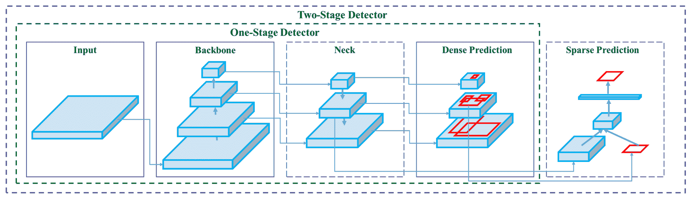

# YOLOv4：高速和精确的物体检测

> 原文：[`docs.ultralytics.com/models/yolov4/`](https://docs.ultralytics.com/models/yolov4/)

欢迎访问 Ultralytics 关于 YOLOv4 的文档页面，这是一款由 Alexey Bochkovskiy 于 2020 年推出的最先进的实时物体检测器，托管在[`github.com/AlexeyAB/darknet`](https://github.com/AlexeyAB/darknet)。YOLOv4 旨在提供速度和准确性之间的最佳平衡，使其成为许多应用的优秀选择。

 **YOLOv4 架构图**。展示了 YOLOv4 的复杂网络设计，包括主干、颈部和头部组件及其互连层，以实现最佳的实时物体检测。

## 介绍

YOLOv4 代表 You Only Look Once 第 4 版。它是一种实时物体检测模型，旨在解决之前 YOLO 版本（如 YOLOv3）和其他物体检测模型的局限性。与其他基于卷积神经网络（CNN）的物体检测器不同，YOLOv4 不仅适用于推荐系统，还适用于独立的过程管理和人员输入减少。它在传统图形处理单元（GPU）上的运行使得可以以实惠的价格进行大规模使用，并且设计成能在传统 GPU 上实时工作，仅需要一台这样的 GPU 进行训练。

## 架构

YOLOv4 利用几种创新功能共同优化其性能。这些功能包括加权残差连接（WRC）、跨阶段部分连接（CSP）、交叉小批量归一化（CmBN）、自对抗训练（SAT）、Mish 激活、马赛克数据增强、DropBlock 正则化和 CIoU 损失。这些特性结合起来实现了最先进的结果。

典型的物体检测器由几部分组成，包括输入、主干、颈部和头部。YOLOv4 的主干在 ImageNet 上进行了预训练，并用于预测物体的类别和边界框。主干可以来自多个模型，包括 VGG、ResNet、ResNeXt 或 DenseNet。检测器的颈部用于从不同阶段收集特征图，通常包括多个自底向上的路径和多个自顶向下的路径。头部部分用于进行最终的物体检测和分类。

## Bag of Freebies

YOLOv4 还利用被称为“freebies 包”的方法，这些技术在训练期间提高模型的准确性而不增加推理成本。数据增强是物体检测中常用的 freebies 包技术，它增加输入图像的变化，以提高模型的鲁棒性。一些数据增强的例子包括光度失真（调整图像的亮度、对比度、色调、饱和度和噪声）和几何失真（添加随机缩放、裁剪、翻转和旋转）。这些技术有助于模型更好地泛化到不同类型的图像。

## 特性和性能

YOLOv4 旨在在目标检测中实现最佳的速度和准确性。YOLOv4 的架构包括 CSPDarknet53 作为骨干网络，PANet 作为颈部，YOLOv3 作为检测头。这种设计使 YOLOv4 能够以令人印象深刻的速度进行目标检测，使其适用于实时应用。YOLOv4 在准确性方面也表现出色，在目标检测基准测试中取得了最新的成果。

## 使用示例

在撰写时，Ultralytics 当前不支持 YOLOv4 模型。因此，有兴趣使用 YOLOv4 的用户需要直接参考 YOLOv4 GitHub 存储库获取安装和使用说明。

这里是您可能用来使用 YOLOv4 的典型步骤的简要概述：

1.  访问 YOLOv4 GitHub 存储库：[`github.com/AlexeyAB/darknet`](https://github.com/AlexeyAB/darknet)。

1.  按照 README 文件中提供的说明进行安装。通常包括克隆存储库，安装必要的依赖项，并设置任何必要的环境变量。

1.  安装完成后，按照存储库中提供的使用说明训练和使用模型。通常包括准备数据集，配置模型参数，训练模型，然后使用训练好的模型进行目标检测。

请注意，具体步骤可能因您的具体用例和 YOLOv4 存储库的当前状态而异。因此，强烈建议直接参考 YOLOv4 GitHub 存储库中提供的说明。

我们对可能引起的任何不便表示歉意，并将努力更新此文档，以包含 Ultralytics 对 YOLOv4 实现支持后的使用示例。

## 结论

YOLOv4 是一种强大且高效的目标检测模型，它在速度和准确性之间取得了良好的平衡。它在训练期间采用独特的特性和 freebies 包技术，使其在实时目标检测任务中表现出色。YOLOv4 可以由任何具有常规 GPU 的人进行训练和使用，使其对各种应用都具有可访问性和实用性。

## 引用和致谢

我们要感谢 YOLOv4 的作者在实时目标检测领域做出的重要贡献：

```py
`@misc{bochkovskiy2020yolov4,   title={YOLOv4: Optimal Speed and Accuracy of Object Detection},   author={Alexey Bochkovskiy and Chien-Yao Wang and Hong-Yuan Mark Liao},   year={2020},   eprint={2004.10934},   archivePrefix={arXiv},   primaryClass={cs.CV} }` 
```

原始的 YOLOv4 论文可以在 [arXiv](https://arxiv.org/abs/2004.10934) 上找到。作者已经公开了他们的工作，并且代码库可以在 [GitHub](https://github.com/AlexeyAB/darknet) 上获取。我们感谢他们在推动领域发展和使他们的工作对更广泛的社区可用方面所作的努力。

## FAQ

### YOLOv4 是什么，为什么我应该用它进行目标检测？

YOLOv4，全称为 “You Only Look Once version 4”，是由 Alexey Bochkovskiy 在 2020 年开发的一种先进的实时目标检测模型。它在速度和准确性之间实现了最佳平衡，非常适合实时应用。YOLOv4 的架构包含几个创新特性，如加权残差连接（WRC）、跨阶段部分连接（CSP）和自对抗训练（SAT），等等，以实现最先进的结果。如果您正在寻找在传统 GPU 上高效运行的高性能模型，YOLOv4 是一个极好的选择。

### YOLOv4 的架构如何增强其性能？

YOLOv4 的架构包括几个关键组件：骨干网络、颈部和头部。骨干网络（如 VGG、ResNet 或 CSPDarknet53）经过预训练，用于预测类别和边界框。颈部利用 PANet 连接来自不同阶段的特征图，进行全面的数据提取。最后，头部使用 YOLOv3 的配置进行最终的目标检测。YOLOv4 还采用了像马赛克数据增强和 DropBlock 正则化等 “bag of freebies” 技术，进一步优化了其速度和准确性。

### 在 YOLOv4 的背景下，“bag of freebies” 是什么？

“Bag of freebies” 指的是在不增加推理成本的情况下，提高 YOLOv4 训练准确性的方法。这些技术包括各种形式的数据增强，如光度扭曲（调整亮度、对比度等）和几何扭曲（缩放、裁剪、翻转、旋转）。通过增加输入图像的变异性，这些增强有助于 YOLOv4 更好地泛化到不同类型的图像，从而提高其鲁棒性和准确性，而不影响其实时性能。

### 为什么 YOLOv4 被认为适合传统 GPU 上的实时目标检测？

YOLOv4 的设计旨在优化速度和准确性，使其成为需要快速和可靠性能的实时目标检测任务的理想选择。它在传统 GPU 上运行效率高，仅需一个 GPU 同时进行训练和推理。这使得它适用于各种应用，从推荐系统到独立流程管理，从而减少了对广泛硬件设置的需求，并使其成为实时目标检测的成本效益解决方案。

### 如果 Ultralytics 当前不支持 YOLOv4，我该如何开始使用？

要开始使用 YOLOv4，请访问官方[YOLOv4 GitHub 代码库](https://github.com/AlexeyAB/darknet)。按照 README 文件中提供的安装说明操作，通常包括克隆代码库、安装依赖项和设置环境变量。安装完成后，您可以通过准备数据集、配置模型参数和按照提供的使用说明来训练模型。由于 Ultralytics 目前不支持 YOLOv4，建议直接参考 YOLOv4 GitHub 获取最新和详细的指导。
