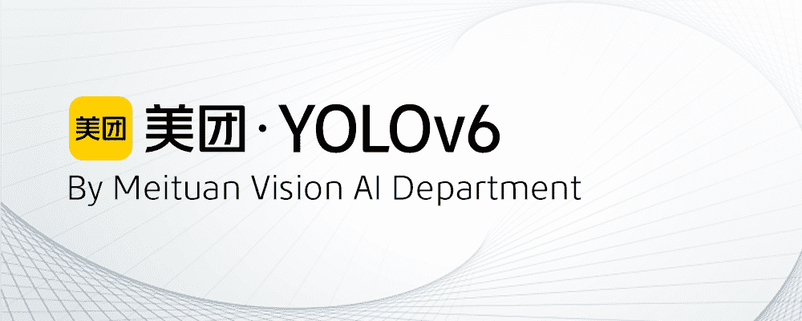
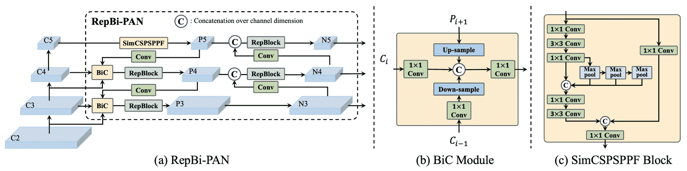

# 美团 YOLOv6

> 原文：[`docs.ultralytics.com/models/yolov6/`](https://docs.ultralytics.com/models/yolov6/)

## 概述

[美团](https://about.meituan.com/) YOLOv6 是一款先进的物体检测器，速度与准确性兼顾，广受实时应用青睐。该模型在架构和训练方案上引入了几个显著的增强，包括双向串联（BiC）模块的实现，锚点辅助训练（AAT）策略以及改进的骨干和 neck 设计，从而在 COCO 数据集上实现了最先进的准确性。

  **YOLOv6 概述。** 模型架构图展示了重新设计的网络组件和训练策略，显著提升了性能。 (a) YOLOv6 的 neck 部分（显示了 N 和 S）。注意，对于 M/L，RepBlocks 被 CSPStackRep 替换。 (b) BiC 模块的结构。 (c) SimCSPSPPF 块。 ([来源](https://arxiv.org/pdf/2301.05586.pdf)).

### 主要特点

+   **双向串联（BiC）模块：** YOLOv6 在检测器的“neck”中引入了一个 BiC 模块，增强了定位信号，并在几乎没有速度降低的情况下提升了性能。

+   **锚点辅助训练（AAT）策略：** 该模型提出了 AAT 策略，旨在享受基于锚点和无锚点范式的优势，同时不影响推理效率。

+   **增强的骨干和 neck 设计：** 通过在 YOLOv6 中加深骨干和 neck 的另一个阶段，该模型在高分辨率输入下在 COCO 数据集上实现了最先进的性能。

+   **自我蒸馏策略：** 实施了一种新的自我蒸馏策略，以提升 YOLOv6 较小模型的性能，在训练期间增强辅助回归分支，并在推理时将其移除，以避免明显的速度下降。

## 性能指标

YOLOv6 提供了多个不同尺度的预训练模型：

+   YOLOv6-N：使用 NVIDIA Tesla T4 GPU 在 COCO val2017 上以 1187 FPS 实现了 37.5%的 AP。

+   YOLOv6-S：在 484 FPS 下达到 45.0%的 AP。

+   YOLOv6-M：在 226 FPS 下达到 50.0%的 AP。

+   YOLOv6-L：在 116 FPS 下达到 52.8%的 AP。

+   YOLOv6-L6：实时条件下的最先进准确性。

YOLOv6 还提供了针对不同精度和移动平台优化的量化模型。

## 使用示例

此示例提供简单的 YOLOv6 训练和推理示例。有关这些以及其他模式的完整文档，请参阅 Predict、Train、Val 和 Export 文档页面。

示例

可以将 PyTorch 预训练的`*.pt`模型和配置文件`*.yaml`传递给`YOLO()`类，在 Python 中创建模型实例：

```py
from ultralytics import YOLO

# Build a YOLOv6n model from scratch
model = YOLO("yolov6n.yaml")

# Display model information (optional)
model.info()

# Train the model on the COCO8 example dataset for 100 epochs
results = model.train(data="coco8.yaml", epochs=100, imgsz=640)

# Run inference with the YOLOv6n model on the 'bus.jpg' image
results = model("path/to/bus.jpg") 
```

可以直接运行模型的 CLI 命令：

```py
# Build a YOLOv6n model from scratch and train it on the COCO8 example dataset for 100 epochs
yolo  train  model=yolov6n.yaml  data=coco8.yaml  epochs=100  imgsz=640

# Build a YOLOv6n model from scratch and run inference on the 'bus.jpg' image
yolo  predict  model=yolov6n.yaml  source=path/to/bus.jpg 
```

## 支持的任务和模式

YOLOv6 系列提供了一系列针对高性能目标检测优化的模型。这些模型适应各种计算需求和准确性要求，非常适合广泛的应用场景。

| 模型类型 | 预训练权重 | 支持的任务 | 推断 | 验证 | 训练 | 导出 |
| --- | --- | --- | --- | --- | --- | --- |
| YOLOv6-N | `yolov6-n.pt` | 目标检测 | ✅ | ✅ | ✅ | ✅ |
| YOLOv6-S | `yolov6-s.pt` | 目标检测 | ✅ | ✅ | ✅ | ✅ |
| YOLOv6-M | `yolov6-m.pt` | 目标检测 | ✅ | ✅ | ✅ | ✅ |
| YOLOv6-L | `yolov6-l.pt` | 目标检测 | ✅ | ✅ | ✅ | ✅ |
| YOLOv6-L6 | `yolov6-l6.pt` | 目标检测 | ✅ | ✅ | ✅ | ✅ |

本表格详细介绍了 YOLOv6 模型的各个变体，突出了它们在目标检测任务中的能力及其与推断、验证、训练和导出等各种操作模式的兼容性。这种全面的支持确保用户可以充分利用 YOLOv6 模型在广泛的目标检测场景中的能力。

## 引用和致谢

我们要感谢在实时目标检测领域作出重要贡献的作者：

```py
@misc{li2023yolov6,
  title={YOLOv6 v3.0: A Full-Scale Reloading},
  author={Chuyi Li and Lulu Li and Yifei Geng and Hongliang Jiang and Meng Cheng and Bo Zhang and Zaidan Ke and Xiaoming Xu and Xiangxiang Chu},
  year={2023},
  eprint={2301.05586},
  archivePrefix={arXiv},
  primaryClass={cs.CV}
} 
```

原始的 YOLOv6 论文可以在 [arXiv](https://arxiv.org/abs/2301.05586) 找到。作者已经公开了他们的工作，并且代码库可以在 [GitHub](https://github.com/meituan/YOLOv6) 上访问。我们感谢他们在推动领域发展和使他们的工作对更广泛的社区可用方面的努力。

## 常见问题解答（FAQ）

### 什么是美团 YOLOv6，它有什么独特之处？

美团 YOLOv6 是一款平衡速度和准确性的先进目标检测器，非常适合实时应用。它具有像双向串联（BiC）模块和锚点辅助训练（AAT）策略这样的显著架构增强。这些创新大大提高了性能，几乎没有速度降低，使 YOLOv6 成为目标检测任务的竞争选择。

### YOLOv6 中的双向串联（BiC）模块如何提高性能？

YOLOv6 中的双向串联（BiC）模块增强了探测器颈部的定位信号，通过有效地组合不同的特征图提高了模型准确检测对象的能力。有关 YOLOv6 的更多功能详情，请参阅主要功能部分。

### 如何使用 Ultralytics 训练 YOLOv6 模型？

您可以使用简单的 Python 或 CLI 命令训练 YOLOv6 模型。例如：

示例

```py
from ultralytics import YOLO

# Build a YOLOv6n model from scratch
model = YOLO("yolov6n.yaml")

# Train the model on the COCO8 example dataset for 100 epochs
results = model.train(data="coco8.yaml", epochs=100, imgsz=640) 
```

```py
yolo  train  model=yolov6n.yaml  data=coco8.yaml  epochs=100  imgsz=640 
```

欲了解更多信息，请访问训练页面。

### YOLOv6 的不同版本及其性能指标是什么？

YOLOv6 提供多个版本，每个版本针对不同的性能需求进行了优化：

+   YOLOv6-N: 37.5% 在 1187 FPS 的 AP

+   YOLOv6-S: 45.0% 在 484 FPS 的 AP

+   YOLOv6-M: 50.0% 在 226 FPS 的 AP

+   YOLOv6-L: 52.8% 在 116 FPS 的 AP

+   YOLOv6-L6：实时场景中的最先进准确性

这些模型使用 NVIDIA Tesla T4 GPU 在 COCO 数据集上进行评估。有关性能指标的更多信息，请参阅性能指标部分。

### 锚辅助训练（AAT）策略如何使 YOLOv6 受益？

YOLOv6 中的锚辅助训练（AAT）结合了基于锚点和无锚点方法的元素，增强了模型的检测能力，而不影响推断效率。该策略在训练过程中利用锚点来改进边界框预测，使 YOLOv6 在多样的目标检测任务中表现出色。

### YOLOv6 模型在 Ultralytics 中支持哪些操作模式？

YOLOv6 支持包括推断、验证、训练和导出在内的各种操作模式。这种灵活性允许用户充分利用模型在不同场景下的能力。详细了解每种模式，请查看支持的任务和模式部分。
