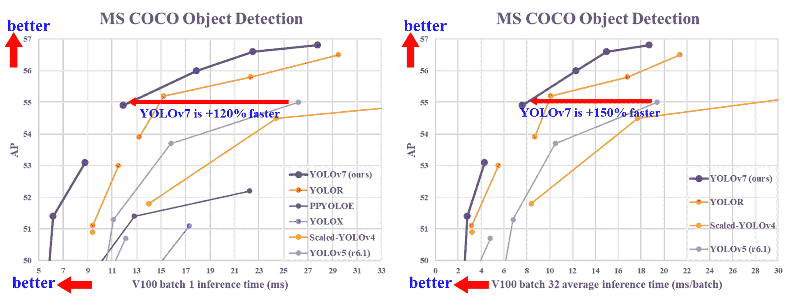

# YOLOv7：可训练的免费功能袋

> 原文：[`docs.ultralytics.com/models/yolov7/`](https://docs.ultralytics.com/models/yolov7/)

YOLOv7 是一款超前的实时目标检测器，在 5 FPS 到 160 FPS 范围内超越所有已知的目标检测器，速度和准确性均卓越。在 GPU V100 上，它以 30 FPS 或更高的速度实现了最高的准确性（56.8% AP）。此外，YOLOv7 在速度和准确性上均优于其他目标检测器，如 YOLOR、YOLOX、Scaled-YOLOv4、YOLOv5 等。该模型完全基于 MS COCO 数据集进行了从零开始的训练，没有使用任何其他数据集或预训练权重。YOLOv7 的源代码可在 GitHub 上找到。



## SOTA 目标检测器比较

根据 YOLO 比较表中的结果，我们知道所提出的方法在速度-准确性平衡方面表现最佳。如果我们将 YOLOv7-tiny-SiLU 与 YOLOv5-N（r6.1）进行比较，我们的方法在 AP 上更快 127 fps，准确性提高了 10.7%。此外，YOLOv7 在 161 fps 的帧率下具有 51.4%的 AP，而具有相同 AP 的 PPYOLOE-L 只有 78 fps 的帧率。在参数使用方面，YOLOv7 比 PPYOLOE-L 少 41%。如果我们将 YOLOv7-X 与具有 99 fps 推理速度的 YOLOv5-L（r6.1）进行比较，YOLOv7-X 可以提高 AP 达到 3.9%。如果将 YOLOv7-X 与相似规模的 YOLOv5-X（r6.1）进行比较，YOLOv7-X 的推理速度比较快 31 fps。此外，在参数量和计算量方面，与 YOLOv5-X（r6.1）相比，YOLOv7-X 减少了 22%的参数和 8%的计算量，但在 AP 上提高了 2.2%（[来源](https://arxiv.org/pdf/2207.02696.pdf)）。

| Model | Params ^((M)) | FLOPs ^((G)) | Size ^((pixels)) | FPS | AP^(test / val 50-95) | AP^(test 50) | AP^(test 75) | AP^(test S) | AP^(test M) | AP^(test L) |
| --- | --- | --- | --- | --- | --- | --- | --- | --- | --- | --- |
| [YOLOX-S](https://github.com/Megvii-BaseDetection/YOLOX) | **9.0M** | **26.8G** | 640 | **102** | 40.5% / 40.5% | - | - | - | - | - |
| [YOLOX-M](https://github.com/Megvii-BaseDetection/YOLOX) | 25.3M | 73.8G | 640 | 81 | 47.2% / 46.9% | - | - | - | - | - |
| [YOLOX-L](https://github.com/Megvii-BaseDetection/YOLOX) | 54.2M | 155.6G | 640 | 69 | 50.1% / 49.7% | - | - | - | - | - |
| [YOLOX-X](https://github.com/Megvii-BaseDetection/YOLOX) | 99.1M | 281.9G | 640 | 58 | **51.5% / 51.1%** | - | - | - | - | - |
|  |  |  |  |  |  |  |  |  |  |  |
| [PPYOLOE-S](https://github.com/PaddlePaddle/PaddleDetection) | **7.9M** | **17.4G** | 640 | **208** | 43.1% / 42.7% | 60.5% | 46.6% | 23.2% | 46.4% | 56.9% |
| [PPYOLOE-M](https://github.com/PaddlePaddle/PaddleDetection) | 23.4M | 49.9G | 640 | 123 | 48.9% / 48.6% | 66.5% | 53.0% | 28.6% | 52.9% | 63.8% |
| [PPYOLOE-L](https://github.com/PaddlePaddle/PaddleDetection) | 52.2M | 110.1G | 640 | 78 | 51.4% / 50.9% | 68.9% | 55.6% | 31.4% | 55.3% | 66.1% |
| [PPYOLOE-X](https://github.com/PaddlePaddle/PaddleDetection) | 98.4M | 206.6G | 640 | 45 | **52.2% / 51.9%** | **69.9%** | **56.5%** | **33.3%** | **56.3%** | **66.4%** |
|  |  |  |  |  |  |  |  |  |  |  |
| [YOLOv5-N (r6.1)](https://github.com/ultralytics/yolov5) | **1.9M** | **4.5G** | 640 | **159** | - / 28.0% | - | - | - | - | - |
| [YOLOv5-S (r6.1)](https://github.com/ultralytics/yolov5) | 7.2M | 16.5G | 640 | 156 | - / 37.4% | - | - | - | - | - |
| [YOLOv5-M (r6.1)](https://github.com/ultralytics/yolov5) | 21.2M | 49.0G | 640 | 122 | - / 45.4% | - | - | - | - | - |
| [YOLOv5-L (r6.1)](https://github.com/ultralytics/yolov5) | 46.5M | 109.1G | 640 | 99 | - / 49.0% | - | - | - | - | - |
| [YOLOv5-X (r6.1)](https://github.com/ultralytics/yolov5) | 86.7M | 205.7G | 640 | 83 | - / **50.7%** | - | - | - | - | - |
|  |  |  |  |  |  |  |  |  |  |  |
| [YOLOR-CSP](https://github.com/WongKinYiu/yolor) | 52.9M | 120.4G | 640 | 106 | 51.1% / 50.8% | 69.6% | 55.7% | 31.7% | 55.3% | 64.7% |
| [YOLOR-CSP-X](https://github.com/WongKinYiu/yolor) | 96.9M | 226.8G | 640 | 87 | 53.0% / 52.7% | 71.4% | 57.9% | 33.7% | 57.1% | 66.8% |
| [YOLOv7-tiny-SiLU](https://github.com/WongKinYiu/yolov7) | **6.2M** | **13.8G** | 640 | **286** | 38.7% / 38.7% | 56.7% | 41.7% | 18.8% | 42.4% | 51.9% |
| [YOLOv7](https://github.com/WongKinYiu/yolov7) | 36.9M | 104.7G | 640 | 161 | 51.4% / 51.2% | 69.7% | 55.9% | 31.8% | 55.5% | 65.0% |
| [YOLOv7-X](https://github.com/WongKinYiu/yolov7) | 71.3M | 189.9G | 640 | 114 | **53.1% / 52.9%** | **71.2%** | **57.8%** | **33.8%** | **57.1%** | **67.4%** |
|  |  |  |  |  |  |  |  |  |  |  |
| [YOLOv5-N6 (r6.1)](https://github.com/ultralytics/yolov5) | **3.2M** | **18.4G** | 1280 | **123** | - / 36.0% | - | - | - | - | - |
| [YOLOv5-S6 (r6.1)](https://github.com/ultralytics/yolov5) | 12.6M | 67.2G | 1280 | 122 | - / 44.8% | - | - | - | - | - |
| [YOLOv5-M6 (r6.1)](https://github.com/ultralytics/yolov5) | 35.7M | 200.0G | 1280 | 90 | - / 51.3% | - | - | - | - | - |
| [YOLOv5-L6 (r6.1)](https://github.com/ultralytics/yolov5) | 76.8M | 445.6G | 1280 | 63 | - / 53.7% | - | - | - | - | - |
| [YOLOv5-X6 (r6.1)](https://github.com/ultralytics/yolov5) | 140.7M | 839.2G | 1280 | 38 | - / **55.0%** | - | - | - | - | - |
|  |  |  |  |  |  |  |  |  |  |  |
| [YOLOR-P6](https://github.com/WongKinYiu/yolor) | **37.2M** | **325.6G** | 1280 | **76** | 53.9% / 53.5% | 71.4% | 58.9% | 36.1% | 57.7% | 65.6% |
| [YOLOR-W6](https://github.com/WongKinYiu/yolor) | 79.8G | 453.2G | 1280 | 66 | 55.2% / 54.8% | 72.7% | 60.5% | 37.7% | 59.1% | 67.1% |
| [YOLOR-E6](https://github.com/WongKinYiu/yolor) | 115.8M | 683.2G | 1280 | 45 | 55.8% / 55.7% | 73.4% | 61.1% | 38.4% | 59.7% | 67.7% |
| [YOLOR-D6](https://github.com/WongKinYiu/yolor) | 151.7M | 935.6G | 1280 | 34 | **56.5% / 56.1%** | **74.1%** | **61.9%** | **38.9%** | **60.4%** | **68.7%** |
|  |  |  |  |  |  |  |  |  |  |  |
| [YOLOv7-W6](https://github.com/WongKinYiu/yolov7) | **70.4M** | **360.0G** | 1280 | **84** | 54.9% / 54.6% | 72.6% | 60.1% | 37.3% | 58.7% | 67.1% |
| [YOLOv7-E6](https://github.com/WongKinYiu/yolov7) | 97.2M | 515.2G | 1280 | 56 | 56.0% / 55.9% | 73.5% | 61.2% | 38.0% | 59.9% | 68.4% |
| [YOLOv7-D6](https://github.com/WongKinYiu/yolov7) | 154.7M | 806.8G | 1280 | 44 | 56.6% / 56.3% | 74.0% | 61.8% | 38.8% | 60.1% | 69.5% |
| [YOLOv7-E6E](https://github.com/WongKinYiu/yolov7) | 151.7M | 843.2G | 1280 | 36 | **56.8% / 56.8%** | **74.4%** | **62.1%** | **39.3%** | **60.5%** | **69.0%** |

## 概览

实时物体检测是许多计算机视觉系统的重要组成部分，包括多目标跟踪、自动驾驶、机器人技术和医学图像分析。近年来，实时物体检测的发展集中在设计高效的架构和提高各种 CPU、GPU 和神经处理单元（NPU）推理速度上。YOLOv7 支持从边缘到云端的移动 GPU 和 GPU 设备。

与传统的实时物体检测器专注于架构优化不同，YOLOv7 引入了专注于训练过程优化的概念。这包括设计用于提高物体检测准确性而不增加推理成本的模块和优化方法，被称为“可训练的免费物品袋”概念。

## 关键特性

YOLOv7 引入了几个关键特性：

1.  **模型重新参数化**：YOLOv7 提出了一种计划好的重新参数化模型，这是一种适用于不同网络中层的策略，具有梯度传播路径概念。

1.  **动态标签分配**：使用多个输出层训练模型提出了一个新问题：“如何为不同分支的输出分配动态目标？”为了解决这个问题，YOLOv7 引入了一种新的标签分配方法，称为粗到细的引导标签分配。

1.  **扩展和复合缩放**：YOLOv7 为实时物体检测器提出了“扩展”和“复合缩放”方法，可以有效利用参数和计算。

1.  **效率**：YOLOv7 提出的方法可以有效地减少最先进实时物体检测器约 40%的参数和 50%的计算量，并具有更快的推理速度和更高的检测精度。

## 使用示例

撰写时，Ultralytics 目前不支持 YOLOv7 模型。因此，有兴趣使用 YOLOv7 的用户需要直接参考 YOLOv7 GitHub 存储库获取安装和使用说明。

这里简要介绍了使用 YOLOv7 可能采取的典型步骤：

1.  访问 YOLOv7 GitHub 存储库：[`github.com/WongKinYiu/yolov7`](https://github.com/WongKinYiu/yolov7)。

1.  跟随 README 文件中提供的说明进行安装。通常包括克隆存储库、安装必要的依赖项以及设置任何必要的环境变量。

1.  安装完成后，您可以按照仓库中提供的使用说明训练和使用模型。这通常包括准备数据集、配置模型参数、训练模型，然后使用训练好的模型进行目标检测。

请注意，具体步骤可能因特定用例和 YOLOv7 仓库的当前状态而有所不同。因此，强烈建议直接参考 YOLOv7 GitHub 仓库中提供的说明。

我们对可能造成的任何不便表示歉意，并将努力在 Ultralytics 支持 YOLOv7 后更新本文档以包含使用示例。

## 引用和致谢

我们要感谢 YOLOv7 的作者在实时目标检测领域所做的重要贡献：

```py
@article{wang2022yolov7,
  title={{YOLOv7}: Trainable bag-of-freebies sets new state-of-the-art for real-time object detectors},
  author={Wang, Chien-Yao and Bochkovskiy, Alexey and Liao, Hong-Yuan Mark},
  journal={arXiv preprint arXiv:2207.02696},
  year={2022}
} 
```

YOLOv7 的原始论文可在 [arXiv](https://arxiv.org/pdf/2207.02696.pdf) 上找到。作者已将他们的工作公开，并且代码库可以在 [GitHub](https://github.com/WongKinYiu/yolov7) 上访问。我们感谢他们在推动领域发展和使他们的工作对更广泛的社区可用方面所做的努力。

## 常见问题解答

### YOLOv7 是什么，为什么它被认为是实时目标检测的突破？

YOLOv7 是一种前沿的实时目标检测模型，实现了无与伦比的速度和准确性。它超越了其他模型，如 YOLOX、YOLOv5 和 PPYOLOE，在参数使用和推断速度上。YOLOv7 的显著特点包括模型重新参数化和动态标签分配，这些优化了其性能而没有增加推断成本。有关其架构和与其他领先的目标检测器的比较指标的更多技术细节，请参阅 [YOLOv7 论文](https://arxiv.org/pdf/2207.02696.pdf)。

### YOLOv7 如何改进之前的 YOLO 模型（如 YOLOv4 和 YOLOv5）？

YOLOv7 引入了几项创新，包括模型重新参数化和动态标签分配，这些创新增强了训练过程并提高了推断准确性。与 YOLOv5 相比，YOLOv7 显著提升了速度和准确性。例如，YOLOv7-X 相比于 YOLOv5-X，提高了 2.2% 的准确性，并减少了 22% 的参数。详细的比较可在 YOLOv7 性能表格和 SOTA 目标检测器的对比中找到。

### 我可以使用 YOLOv7 与 Ultralytics 工具和平台吗？

目前，Ultralytics 平台不直接支持 YOLOv7。有兴趣使用 YOLOv7 的用户需要按照 [YOLOv7 GitHub 仓库](https://github.com/WongKinYiu/yolov7) 中提供的安装和使用说明操作。对于其他领先的模型，您可以使用 Ultralytics HUB 进行探索和训练。

### 如何为自定义目标检测项目安装和运行 YOLOv7？

要安装和运行 YOLOv7，请按照以下步骤操作：

1.  克隆 YOLOv7 仓库：

    ```py
    git  clone  https://github.com/WongKinYiu/yolov7 
    ```

1.  导航至克隆的目录并安装依赖项：

    ```py
    cd  yolov7
    pip  install  -r  requirements.txt 
    ```

1.  根据存储库中提供的[使用说明](https://github.com/WongKinYiu/yolov7)准备您的数据集并配置模型参数。有关更多指导，请访问 YOLOv7 GitHub 存储库以获取最新信息和更新。

### YOLOv7 引入了哪些关键特性和优化？

YOLOv7 提供了几个关键特性，彻底改变了实时目标检测：

+   **模型重参数化**：通过优化梯度传播路径来增强模型的性能。

+   **动态标签分配**：采用粗到细的引导方法为不同分支的输出分配动态目标，提高准确性。

+   **扩展和复合缩放**：有效利用参数和计算资源，以便为各种实时应用扩展模型。

+   **效率**：与其他最先进的模型相比，参数数量减少了 40%，计算量减少了 50%，同时实现了更快的推理速度。有关这些特性的更多详细信息，请参见 YOLOv7 概述部分。
