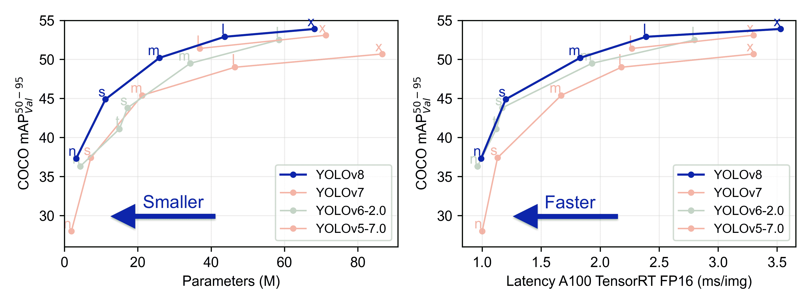

# YOLOv8

> 原文：[`docs.ultralytics.com/models/yolov8/`](https://docs.ultralytics.com/models/yolov8/)

## 概述

YOLOv8 是 YOLO 系列实时物体检测器的最新版本，在精度和速度方面提供先进的性能。基于之前版本的进展，YOLOv8 引入了新的功能和优化，使其成为广泛应用于各种物体检测任务的理想选择。



[`www.youtube.com/embed/Na0HvJ4hkk0`](https://www.youtube.com/embed/Na0HvJ4hkk0)

**观看：** Ultralytics YOLOv8 模型概述

## 主要特点

+   **先进的骨干网络和颈部架构：** YOLOv8 采用先进的骨干网络和颈部架构，提高特征提取和物体检测性能。

+   **基于分离型无锚点 Ultralytics 头部的优势：** YOLOv8 采用基于分离型无锚点 Ultralytics 头部，相比基于锚点的方法，有助于提高准确性和更高效的检测过程。

+   **优化的精度与速度权衡：** YOLOv8 专注于在精度和速度之间保持最佳平衡，适用于各种应用领域中的实时物体检测任务。

+   **多样的预训练模型：** YOLOv8 提供一系列预训练模型，以满足各种任务和性能需求，更易于找到适合特定用例的模型。

## 支持的任务和模式

YOLOv8 系列提供多种模型，每个模型专门针对计算机视觉中特定的任务设计。这些模型旨在满足各种需求，从物体检测到更复杂的任务，如实例分割、姿势/关键点检测、定向物体检测和分类。

YOLOv8 系列的每个变体均针对其各自的任务进行了优化，确保高性能和准确性。此外，这些模型与包括推断、验证、训练和导出在内的各种运行模式兼容，有助于在不同的部署和开发阶段使用。

| Model | 文件名 | 任务 | 推断 | 验证 | 训练 | 导出 |
| --- | --- | --- | --- | --- | --- | --- |
| YOLOv8 | `yolov8n.pt` `yolov8s.pt` `yolov8m.pt` `yolov8l.pt` `yolov8x.pt` | 检测 | ✅ | ✅ | ✅ | ✅ |
| YOLOv8-seg | `yolov8n-seg.pt` `yolov8s-seg.pt` `yolov8m-seg.pt` `yolov8l-seg.pt` `yolov8x-seg.pt` | 实例分割 | ✅ | ✅ | ✅ | ✅ |
| YOLOv8-pose | `yolov8n-pose.pt` `yolov8s-pose.pt` `yolov8m-pose.pt` `yolov8l-pose.pt` `yolov8x-pose.pt` `yolov8x-pose-p6.pt` | 姿势/关键点检测 | ✅ | ✅ | ✅ | ✅ |
| YOLOv8-obb | `yolov8n-obb.pt` `yolov8s-obb.pt` `yolov8m-obb.pt` `yolov8l-obb.pt` `yolov8x-obb.pt` | 定向检测 | ✅ | ✅ | ✅ | ✅ |
| YOLOv8-cls | `yolov8n-cls.pt` `yolov8s-cls.pt` `yolov8m-cls.pt` `yolov8l-cls.pt` `yolov8x-cls.pt` | 分类 | ✅ | ✅ | ✅ | ✅ |

这张表提供了 YOLOv8 模型变体的概述，突出它们在特定任务中的适用性以及它们与多种操作模式（如推断、验证、训练和导出）的兼容性。展示了 YOLOv8 系列的多功能性和稳健性，使其适用于计算机视觉中的多种应用。

## 性能指标

性能

请参阅检测文档，了解在这些模型上使用的 CO​CO 训练示例，其中包括 80 个预训练类别。

| 模型 | 尺寸 ^((像素)) | mAP^(val 50-95) | 速度 ^(CPU ONNX

(ms)) | 速度 ^(A100 TensorRT

(ms)) | 参数 ^((M)) | FLOPs ^((B)) |

| --- | --- | --- | --- | --- | --- | --- |
| --- | --- | --- | --- | --- | --- | --- |
| [YOLOv8n](https://github.com/ultralytics/assets/releases/download/v8.2.0/yolov8n.pt) | 640 | 37.3 | 80.4 | 0.99 | 3.2 | 8.7 |
| [YOLOv8s](https://github.com/ultralytics/assets/releases/download/v8.2.0/yolov8s.pt) | 640 | 44.9 | 128.4 | 1.20 | 11.2 | 28.6 |
| [YOLOv8m](https://github.com/ultralytics/assets/releases/download/v8.2.0/yolov8m.pt) | 640 | 50.2 | 234.7 | 1.83 | 25.9 | 78.9 |
| [YOLOv8l](https://github.com/ultralytics/assets/releases/download/v8.2.0/yolov8l.pt) | 640 | 52.9 | 375.2 | 2.39 | 43.7 | 165.2 |
| [YOLOv8x](https://github.com/ultralytics/assets/releases/download/v8.2.0/yolov8x.pt) | 640 | 53.9 | 479.1 | 3.53 | 68.2 | 257.8 |

请参阅检测文档，了解在这些模型上使用的 Open Image V7 训练示例，其中包括 600 个预训练类别。

| 模型 | 尺寸 ^((像素)) | mAP^(val 50-95) | 速度 ^(CPU ONNX

(ms)) | 速度 ^(A100 TensorRT

(ms)) | 参数 ^((M)) | FLOPs ^((B)) |

| --- | --- | --- | --- | --- | --- | --- |
| --- | --- | --- | --- | --- | --- | --- |
| [YOLOv8n](https://github.com/ultralytics/assets/releases/download/v8.2.0/yolov8n-oiv7.pt) | 640 | 18.4 | 142.4 | 1.21 | 3.5 | 10.5 |
| [YOLOv8s](https://github.com/ultralytics/assets/releases/download/v8.2.0/yolov8s-oiv7.pt) | 640 | 27.7 | 183.1 | 1.40 | 11.4 | 29.7 |
| [YOLOv8m](https://github.com/ultralytics/assets/releases/download/v8.2.0/yolov8m-oiv7.pt) | 640 | 33.6 | 408.5 | 2.26 | 26.2 | 80.6 |
| [YOLOv8l](https://github.com/ultralytics/assets/releases/download/v8.2.0/yolov8l-oiv7.pt) | 640 | 34.9 | 596.9 | 2.43 | 44.1 | 167.4 |
| [YOLOv8x](https://github.com/ultralytics/assets/releases/download/v8.2.0/yolov8x-oiv7.pt) | 640 | 36.3 | 860.6 | 3.56 | 68.7 | 260.6 |

请参阅分割文档，了解在这些模型上使用的 CO​CO 训练示例，其中包括 80 个预训练类别。

| 模型 | 尺寸 ^((像素)) | mAP^(box 50-95) | mAP^(mask 50-95) | 速度 ^(CPU ONNX

(ms)) | 速度 ^(A100 TensorRT

(ms)) | 参数 ^((M)) | FLOPs ^((B)) |

| --- | --- | --- | --- | --- | --- | --- | --- |
| --- | --- | --- | --- | --- | --- | --- | --- |
| [YOLOv8n-seg](https://github.com/ultralytics/assets/releases/download/v8.2.0/yolov8n-seg.pt) | 640 | 36.7 | 30.5 | 96.1 | 1.21 | 3.4 | 12.6 |
| [YOLOv8s-seg](https://github.com/ultralytics/assets/releases/download/v8.2.0/yolov8s-seg.pt) | 640 | 44.6 | 36.8 | 155.7 | 1.47 | 11.8 | 42.6 |
| [YOLOv8m-seg](https://github.com/ultralytics/assets/releases/download/v8.2.0/yolov8m-seg.pt) | 640 | 49.9 | 40.8 | 317.0 | 2.18 | 27.3 | 110.2 |
| [YOLOv8l-seg](https://github.com/ultralytics/assets/releases/download/v8.2.0/yolov8l-seg.pt) | 640 | 52.3 | 42.6 | 572.4 | 2.79 | 46.0 | 220.5 |
| [YOLOv8x-seg](https://github.com/ultralytics/assets/releases/download/v8.2.0/yolov8x-seg.pt) | 640 | 53.4 | 43.4 | 712.1 | 4.02 | 71.8 | 344.1 |

查看分类文档，了解这些在 ImageNet 上训练的模型的使用示例，其中包括 1000 个预训练类别。

| 模型 | 尺寸 ^((像素)) | 准确率 ^(top1) | 准确率 ^(top5) | Speed ^(CPU ONNX

(ms)) | Speed ^(A100 TensorRT

(ms)) | params ^((M)) | FLOPs ^((B) at 640) |

| --- | --- | --- | --- | --- | --- | --- | --- |
| --- | --- | --- | --- | --- | --- | --- | --- |
| [YOLOv8n-cls](https://github.com/ultralytics/assets/releases/download/v8.2.0/yolov8n-cls.pt) | 224 | 69.0 | 88.3 | 12.9 | 0.31 | 2.7 | 4.3 |
| [YOLOv8s-cls](https://github.com/ultralytics/assets/releases/download/v8.2.0/yolov8s-cls.pt) | 224 | 73.8 | 91.7 | 23.4 | 0.35 | 6.4 | 13.5 |
| [YOLOv8m-cls](https://github.com/ultralytics/assets/releases/download/v8.2.0/yolov8m-cls.pt) | 224 | 76.8 | 93.5 | 85.4 | 0.62 | 17.0 | 42.7 |
| [YOLOv8l-cls](https://github.com/ultralytics/assets/releases/download/v8.2.0/yolov8l-cls.pt) | 224 | 76.8 | 93.5 | 163.0 | 0.87 | 37.5 | 99.7 |
| [YOLOv8x-cls](https://github.com/ultralytics/assets/releases/download/v8.2.0/yolov8x-cls.pt) | 224 | 79.0 | 94.6 | 232.0 | 1.01 | 57.4 | 154.8 |

查看姿势估计文档，了解这些在 COCO 上训练的模型的使用示例，其中包括一个预训练类别，'person'。

| 模型 | 尺寸 ^((像素)) | mAP^(姿势 50-95) | mAP^(姿势 50) | Speed ^(CPU ONNX

(ms)) | Speed ^(A100 TensorRT

(ms)) | params ^((M)) | FLOPs ^((B)) |

| --- | --- | --- | --- | --- | --- | --- | --- |
| --- | --- | --- | --- | --- | --- | --- | --- |
| [YOLOv8n-pose](https://github.com/ultralytics/assets/releases/download/v8.2.0/yolov8n-pose.pt) | 640 | 50.4 | 80.1 | 131.8 | 1.18 | 3.3 | 9.2 |
| [YOLOv8s-pose](https://github.com/ultralytics/assets/releases/download/v8.2.0/yolov8s-pose.pt) | 640 | 60.0 | 86.2 | 233.2 | 1.42 | 11.6 | 30.2 |
| [YOLOv8m-pose](https://github.com/ultralytics/assets/releases/download/v8.2.0/yolov8m-pose.pt) | 640 | 65.0 | 88.8 | 456.3 | 2.00 | 26.4 | 81.0 |
| [YOLOv8l-pose](https://github.com/ultralytics/assets/releases/download/v8.2.0/yolov8l-pose.pt) | 640 | 67.6 | 90.0 | 784.5 | 2.59 | 44.4 | 168.6 |
| [YOLOv8x-pose](https://github.com/ultralytics/assets/releases/download/v8.2.0/yolov8x-pose.pt) | 640 | 69.2 | 90.2 | 1607.1 | 3.73 | 69.4 | 263.2 |
| [YOLOv8x-pose-p6](https://github.com/ultralytics/assets/releases/download/v8.2.0/yolov8x-pose-p6.pt) | 1280 | 71.6 | 91.2 | 4088.7 | 10.04 | 99.1 | 1066.4 |

查看定向检测文档，了解这些在 DOTAv1 上训练的模型的使用示例，其中包括 15 个预训练类别。

| 模型 | 尺寸 ^((像素)) | mAP^(测试 50) | Speed ^(CPU ONNX

(ms)) | Speed ^(A100 TensorRT

(ms)) | params ^((M)) | FLOPs ^((B)) |

| --- | --- | --- | --- | --- | --- | --- |
| --- | --- | --- | --- | --- | --- | --- |
| [YOLOv8n-obb](https://github.com/ultralytics/assets/releases/download/v8.2.0/yolov8n-obb.pt) | 1024 | 78.0 | 204.77 | 3.57 | 3.1 | 23.3 |
| [YOLOv8s-obb](https://github.com/ultralytics/assets/releases/download/v8.2.0/yolov8s-obb.pt) | 1024 | 79.5 | 424.88 | 4.07 | 11.4 | 76.3 |
| [YOLOv8m-obb](https://github.com/ultralytics/assets/releases/download/v8.2.0/yolov8m-obb.pt) | 1024 | 80.5 | 763.48 | 7.61 | 26.4 | 208.6 |
| [YOLOv8l-obb](https://github.com/ultralytics/assets/releases/download/v8.2.0/yolov8l-obb.pt) | 1024 | 80.7 | 1278.42 | 11.83 | 44.5 | 433.8 |
| [YOLOv8x-obb](https://github.com/ultralytics/assets/releases/download/v8.2.0/yolov8x-obb.pt) | 1024 | 81.36 | 1759.10 | 13.23 | 69.5 | 676.7 |

## 使用示例

此示例提供了简单的 YOLOv8 训练和推理示例。有关这些以及其他模式的完整文档，请参阅预测，训练，验证和导出文档页面。

注意下面的示例适用于 YOLOv8 检测模型用于目标检测。有关其他支持的任务，请参阅 Segment，Classify，OBB 文档和 Pose 文档。

示例

可以将 PyTorch 预训练的`*.pt`模型以及配置`*.yaml`文件传递给`YOLO()`类，以在 Python 中创建模型实例：

```py
`from ultralytics import YOLO  # Load a COCO-pretrained YOLOv8n model model = YOLO("yolov8n.pt")  # Display model information (optional) model.info()  # Train the model on the COCO8 example dataset for 100 epochs results = model.train(data="coco8.yaml", epochs=100, imgsz=640)  # Run inference with the YOLOv8n model on the 'bus.jpg' image results = model("path/to/bus.jpg")` 
```

CLI 命令可直接运行模型：

```py
`# Load a COCO-pretrained YOLOv8n model and train it on the COCO8 example dataset for 100 epochs yolo  train  model=yolov8n.pt  data=coco8.yaml  epochs=100  imgsz=640  # Load a COCO-pretrained YOLOv8n model and run inference on the 'bus.jpg' image yolo  predict  model=yolov8n.pt  source=path/to/bus.jpg` 
```

## 引用和致谢

如果您在工作中使用 YOLOv8 模型或此存储库中的任何其他软件，请使用以下格式进行引用：

```py
`@software{yolov8_ultralytics,   author  =  {Glenn Jocher and Ayush Chaurasia and Jing Qiu},   title  =  {Ultralytics YOLOv8},   version  =  {8.0.0},   year  =  {2023},   url  =  {https://github.com/ultralytics/ultralytics},   orcid  =  {0000-0001-5950-6979, 0000-0002-7603-6750, 0000-0003-3783-7069},   license  =  {AGPL-3.0} }` 
```

请注意 DOI 正在等待，一旦可用将添加到引用中。YOLOv8 模型根据[AGPL-3.0](https://github.com/ultralytics/ultralytics/blob/main/LICENSE)和[企业](https://ultralytics.com/license)许可证提供。

## 常见问题解答

### YOLOv8 是什么，与之前的 YOLO 版本有何不同？

YOLOv8 是 Ultralytics YOLO 系列的最新版本，旨在通过先进的功能提高实时目标检测性能。与早期版本不同，YOLOv8 包含**无锚分离的 Ultralytics 头部**，最先进的主干和颈部架构，并提供了优化的准确度-速度权衡，使其成为多种应用理想选择。有关详细信息，请查看概述和关键特性部分。

### 如何在不同的计算机视觉任务中使用 YOLOv8？

YOLOv8 支持广泛的计算机视觉任务，包括目标检测，实例分割，姿态/关键点检测，定向物体检测和分类。每个模型变体都针对其特定任务进行了优化，并与各种操作模式（如推理，验证，训练和导出）兼容。有关更多信息，请参阅支持的任务和模式部分。

### YOLOv8 模型的性能指标是什么？

YOLOv8 模型在各种基准数据集上实现了最先进的性能。例如，YOLOv8n 模型在 COCO 数据集上达到了 37.3 的 mAP（平均精度），在 A100 TensorRT 上的速度为 0.99 毫秒。您可以在性能指标部分找到每个模型变体在不同任务和数据集上的详细性能指标。

### 如何训练 YOLOv8 模型？

使用 Python 或 CLI 可以训练 YOLOv8 模型。以下是使用 COCO 预训练的 YOLOv8 模型在 COCO8 数据集上进行 100 个 epoch 训练的示例：

示例

```py
`from ultralytics import YOLO  # Load a COCO-pretrained YOLOv8n model model = YOLO("yolov8n.pt")  # Train the model on the COCO8 example dataset for 100 epochs results = model.train(data="coco8.yaml", epochs=100, imgsz=640)` 
```

```py
`yolo  train  model=yolov8n.pt  data=coco8.yaml  epochs=100  imgsz=640` 
```

欲了解更多详细信息，请访问培训文档。

### 我可以对 YOLOv8 模型进行性能基准测试吗？

是的，YOLOv8 模型可以根据速度和准确性在各种导出格式中进行性能基准测试。您可以使用 PyTorch、ONNX、TensorRT 等进行基准测试。以下是使用 Python 和 CLI 进行基准测试的示例命令：

示例

```py
`from ultralytics.utils.benchmarks import benchmark  # Benchmark on GPU benchmark(model="yolov8n.pt", data="coco8.yaml", imgsz=640, half=False, device=0)` 
```

```py
`yolo  benchmark  model=yolov8n.pt  data='coco8.yaml'  imgsz=640  half=False  device=0` 
```

如需更多信息，请查看性能指标部分。
