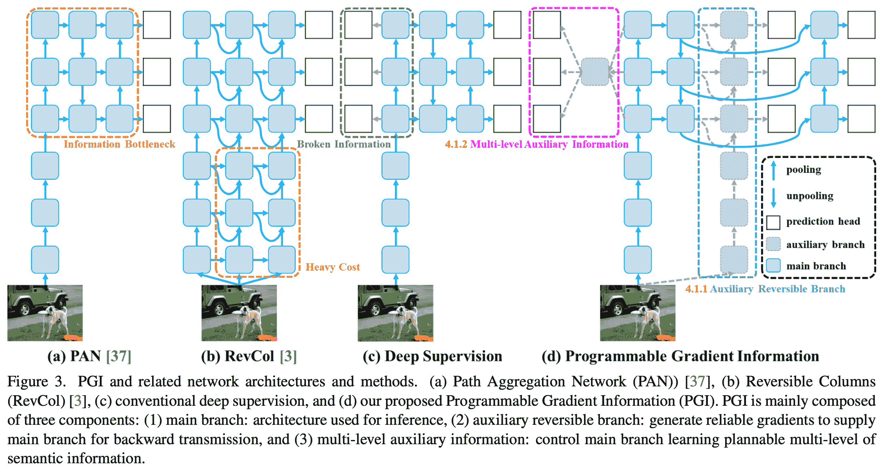
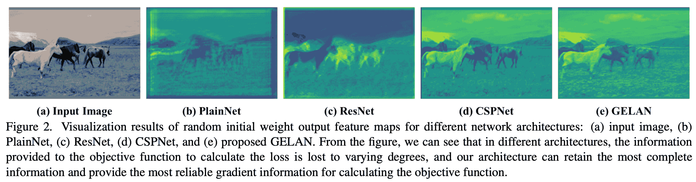

# YOLOv9：目标检测技术的飞跃

> 原文：[`docs.ultralytics.com/models/yolov9/`](https://docs.ultralytics.com/models/yolov9/)

YOLOv9 标志着实时目标检测的重大进展，引入了诸如可编程梯度信息（**PGI**）和广义高效层聚合网络（**GELAN**）等突破性技术。该模型在效率、准确性和适应性方面表现出显著的改进，在 MS COCO 数据集上设定了新的基准。虽然 YOLOv9 项目由一个独立的开源团队开发，但它建立在[Ultralytics](https://ultralytics.com)提供的强大代码库 YOLOv5 之上，展示了 AI 研究社区的合作精神。

[`www.youtube.com/embed/ZF7EAodHn1U`](https://www.youtube.com/embed/ZF7EAodHn1U)

**观看：** 使用 Ultralytics 进行 YOLOv9 自定义数据训练 | 工业包数据集



## YOLOv9 简介

在追求最佳实时目标检测的过程中，YOLOv9 凭借其创新的方法在克服深度神经网络固有的信息损失挑战方面脱颖而出。通过整合**PGI**和多功能的**GELAN**架构，YOLOv9 不仅增强了模型的学习能力，还确保在检测过程中保留关键信息，从而实现卓越的准确性和性能。

## YOLOv9 的核心创新

YOLOv9 的进步深深植根于解决深度神经网络中信息损失所带来的挑战。信息瓶颈原理和可逆函数的创新使用是其设计的核心，确保 YOLOv9 保持高效率和准确性。

### 信息瓶颈原理

信息瓶颈原理揭示了深度学习中的一个基本挑战：随着数据通过网络的连续层，信息损失的潜力增加。这个现象在数学上表示为：

```py
I(X, X) >= I(X, f_theta(X)) >= I(X, g_phi(f_theta(X))) 
```

其中`I`表示互信息，`f`和`g`分别表示具有参数`theta`和`phi`的变换函数。YOLOv9 通过实施可编程梯度信息（**PGI**）来应对这一挑战，帮助在网络深度中保留重要数据，确保更可靠的梯度生成，从而实现更好的模型收敛和性能。

### 可逆函数

可逆函数的概念是 YOLOv9 设计的另一个基石。如果一个函数可以在不损失任何信息的情况下被反转，则该函数被视为可逆的，如下所示：

```py
X = v_zeta(r_psi(X)) 
```

使用`psi`和`zeta`作为可逆函数及其逆函数的参数。这一特性对深度学习架构至关重要，因为它允许网络保持完整的信息流，从而实现对模型参数更精确的更新。YOLOv9 在其架构中引入可逆函数，以减少信息降解的风险，特别是在深层中，确保保留用于目标检测任务的关键数据。

### 对轻量级模型的影响

解决信息丢失问题对于轻量级模型尤为重要，这些模型通常参数较少，在前向传播过程中容易丢失重要信息。YOLOv9 的架构通过使用 PGI 和可逆函数，确保即使是精简的模型，也能保留和有效利用用于准确目标检测所需的关键信息。

### 可编程梯度信息（PGI）

PGI 是 YOLOv9 引入的一种新概念，旨在解决信息瓶颈问题，确保在深层网络中保留必要的数据。这使得可生成可靠的梯度，促进准确的模型更新，提高整体检测性能。

### 广义有效层聚合网络（GELAN）

GELAN 代表了战略性的架构进步，使 YOLOv9 能够实现更高的参数利用率和计算效率。其设计允许灵活集成各种计算模块，使得 YOLOv9 在不牺牲速度或准确性的情况下，适应广泛的应用场景。



## YOLOv9 基准测试

使用[Ultralytics](https://docs.ultralytics.com/modes/benchmark/)对 YOLOv9 进行基准测试，涉及评估您训练和验证的模型在实际场景中的表现。该过程包括：

+   **性能评估：** 评估模型的速度和准确性。

+   **导出格式：** 在不同的导出格式下测试模型，以确保其符合必要的标准并在各种环境中表现良好。

+   **框架支持：** 在 Ultralytics YOLOv8 中提供全面的框架，以促进这些评估并确保一致可靠的结果。

通过基准测试，您可以确保您的模型不仅在控制测试环境中表现良好，而且在实际的现实应用中保持高性能。

[`www.youtube.com/embed/ziJR01lKnio`](https://www.youtube.com/embed/ziJR01lKnio)

**观看：** 如何使用 Ultralytics Python 包对 YOLOv9 模型进行基准测试

## 在 MS COCO 数据集上的性能

YOLOv9 在 COCO 数据集上的表现彰显了其在实时目标检测中的显著进展，为各种模型尺寸设定了新的基准。表格 1 展示了最先进实时目标检测器的全面比较，突显了 YOLOv9 在效率和准确性方面的优势。

**表格 1\. 最先进实时目标检测器比较**

性能

| 模型 | 尺寸 ^((像素)) | mAP^(验证集 50-95) | mAP^(验证集 50) | 参数 ^((百万)) | FLOPs ^((十亿)) |
| --- | --- | --- | --- | --- | --- |
| [YOLOv9t](https://github.com/ultralytics/assets/releases/download/v8.2.0/yolov9t.pt) | 640 | 38.3 | 53.1 | 2.0 | 7.7 |
| [YOLOv9s](https://github.com/ultralytics/assets/releases/download/v8.2.0/yolov9s.pt) | 640 | 46.8 | 63.4 | 7.2 | 26.7 |
| [YOLOv9m](https://github.com/ultralytics/assets/releases/download/v8.2.0/yolov9m.pt) | 640 | 51.4 | 68.1 | 20.1 | 76.8 |
| [YOLOv9c](https://github.com/ultralytics/assets/releases/download/v8.2.0/yolov9c.pt) | 640 | 53.0 | 70.2 | 25.5 | 102.8 |
| [YOLOv9e](https://github.com/ultralytics/assets/releases/download/v8.2.0/yolov9e.pt) | 640 | 55.6 | 72.8 | 58.1 | 192.5 |
| 模型 | 尺寸 ^((像素)) | mAP^(框 50-95) | mAP^(掩码 50-95) | 参数 ^((百万)) | FLOPs ^((十亿)) |
| --- | --- | --- | --- | --- | --- |
| [YOLOv9c-seg](https://github.com/ultralytics/assets/releases/download/v8.2.0/yolov9c-seg.pt) | 640 | 52.4 | 42.2 | 27.9 | 159.4 |
| [YOLOv9e-seg](https://github.com/ultralytics/assets/releases/download/v8.2.0/yolov9e-seg.pt) | 640 | 55.1 | 44.3 | 60.5 | 248.4 |

YOLOv9 的各种变体，从微小的`t`型号到庞大的`e`型号，不仅在精度（mAP 指标）上有所提升，而且在参数和计算需求（FLOPs）上也显著改进。本表突显了 YOLOv9 在保持或减少计算开销的同时，提供高精度的能力。

YOLOv9 相较之下展示了显著的提升：

+   **轻量级模型**: YOLOv9s 在参数效率和计算负荷上超过了 YOLO MS-S，同时在 AP 上提升了 0.4∼0.6%。

+   **中型到大型模型**: YOLOv9m 和 YOLOv9e 在平衡模型复杂性和检测性能方面显示出显著进展，大幅减少了参数和计算量，同时提升了准确性。

特别是 YOLOv9c 模型，突显了架构优化的有效性。它的参数数量和计算需求比 YOLOv7 AF 少了 42%，却达到了可比较的准确性，显示了 YOLOv9 在效率上的显著改进。此外，YOLOv9e 模型为大型模型设定了新标准，比 YOLOv8x 少了 15%的参数和 25%的计算需求，并在 AP 上增加了 1.7%。

这些结果展示了 YOLOv9 在模型设计上的战略性进展，强调了其在不损害实时目标检测任务所必需的精度的情况下提高效率。该模型不仅推动了性能指标的边界，还强调了计算效率的重要性，使其成为计算机视觉领域的重要发展。

## 结论

YOLOv9 代表了实时目标检测中的重要发展，显著改善了效率、准确性和适应性。通过像 PGI 和 GELAN 这样的创新解决方案，解决了关键挑战，YOLOv9 为未来研究和应用设立了新的标准。随着人工智能社区的不断发展，YOLOv9 证明了协作和创新在推动技术进步中的力量。

## 使用示例

此示例提供了简单的 YOLOv9 训练和推断示例。有关这些以及其他模式的完整文档，请参阅预测、训练、验证和导出文档页面。

示例

可以将 PyTorch 预训练的 `*.pt` 模型以及配置 `*.yaml` 文件传递给 `YOLO()` 类以在 Python 中创建模型实例：

```py
from ultralytics import YOLO

# Build a YOLOv9c model from scratch
model = YOLO("yolov9c.yaml")

# Build a YOLOv9c model from pretrained weight
model = YOLO("yolov9c.pt")

# Display model information (optional)
model.info()

# Train the model on the COCO8 example dataset for 100 epochs
results = model.train(data="coco8.yaml", epochs=100, imgsz=640)

# Run inference with the YOLOv9c model on the 'bus.jpg' image
results = model("path/to/bus.jpg") 
```

可以使用 CLI 命令直接运行模型：

```py
# Build a YOLOv9c model from scratch and train it on the COCO8 example dataset for 100 epochs
yolo  train  model=yolov9c.yaml  data=coco8.yaml  epochs=100  imgsz=640

# Build a YOLOv9c model from scratch and run inference on the 'bus.jpg' image
yolo  predict  model=yolov9c.yaml  source=path/to/bus.jpg 
```

## 支持的任务和模式

YOLOv9 系列提供了一系列模型，每个模型都针对高性能目标检测进行了优化。这些模型满足不同的计算需求和准确性要求，使它们在各种应用中都非常灵活。

| 模型 | 文件名 | 任务 | 推断 | 验证 | 训练 | 导出 |
| --- | --- | --- | --- | --- | --- | --- |
| YOLOv9 | `yolov9t` `yolov9s` `yolov9m` `yolov9c.pt` `yolov9e.pt` | 目标检测 | ✅ | ✅ | ✅ | ✅ |
| YOLOv9-seg | `yolov9c-seg.pt` `yolov9e-seg.pt` | 实例分割 | ✅ | ✅ | ✅ | ✅ |

此表格详细介绍了 YOLOv9 模型变体的概述，突出了它们在目标检测任务中的能力以及它们与推断、验证、训练和导出等各种操作模式的兼容性。这种全面的支持确保用户可以充分利用 YOLOv9 模型在广泛的目标检测场景中的能力。

注意

训练 YOLOv9 模型将需要比相同尺寸的 YOLOv8 模型更多的资源和时间。

## 引用和致谢

我们要感谢 YOLOv9 的作者在实时目标检测领域做出的重要贡献：

```py
@article{wang2024yolov9,
  title={{YOLOv9}: Learning What You Want to Learn Using Programmable Gradient Information},
  author={Wang, Chien-Yao  and Liao, Hong-Yuan Mark},
  booktitle={arXiv preprint arXiv:2402.13616},
  year={2024}
} 
```

原始的 YOLOv9 论文可以在 [arXiv](https://arxiv.org/pdf/2402.13616.pdf) 上找到。作者已经公开了他们的工作，并且代码库可以在 [GitHub](https://github.com/WongKinYiu/yolov9) 上访问。我们感谢他们在推动领域进展并使他们的工作对更广泛的社区可用所做的努力。

## 常见问题

### YOLOv9 为实时目标检测引入了哪些创新？

YOLOv9 引入了突破性技术，如可编程梯度信息（PGI）和广义高效层聚合网络（GELAN）。这些创新解决了深度神经网络中的信息丢失挑战，确保高效率、准确性和适应性。PGI 在网络层之间保留了关键数据，而 GELAN 优化了参数利用率和计算效率。了解更多关于 YOLOv9 在 MS COCO 数据集上设立新基准的核心创新。

### YOLOv9 在 MS COCO 数据集上与其他模型相比的表现如何？

YOLOv9 通过实现更高的准确性和效率，优于最先进的实时物体检测器。在 COCO 数据集上，YOLOv9 模型展示了在各种尺寸上优越的 mAP 分数，同时保持或减少计算开销。例如，YOLOv9c 相比 YOLOv7 AF，参数数量减少了 42%，计算需求减少了 21%，但达到了可比较的精度。探索性能比较以获取详细指标。

### 如何使用 Python 和 CLI 训练 YOLOv9 模型？

您可以使用 Python 和 CLI 命令来训练 YOLOv9 模型。对于 Python，可以使用`YOLO`类实例化模型并调用`train`方法：

```py
from ultralytics import YOLO

# Build a YOLOv9c model from pretrained weights and train
model = YOLO("yolov9c.pt")
results = model.train(data="coco8.yaml", epochs=100, imgsz=640) 
```

对于 CLI 训练，执行：

```py
yolo  train  model=yolov9c.yaml  data=coco8.yaml  epochs=100  imgsz=640 
```

了解有关训练和推断用例的更多使用示例。

### 使用 Ultralytics YOLOv9 进行轻量级模型有哪些优势？

YOLOv9 旨在减少信息丢失，这对于经常容易丢失重要信息的轻量级模型尤为重要。通过集成可编程梯度信息（PGI）和可逆函数，YOLOv9 确保重要数据的保留，提升了模型的准确性和效率。这使得它非常适合需要高性能紧凑模型的应用场景。有关更多详细信息，请探索 YOLOv9 对轻量级模型影响的部分。

### YOLOv9 支持哪些任务和模式？

YOLOv9 支持多种任务，包括物体检测和实例分割。它与多种操作模式兼容，例如推断、验证、训练和导出。这种多功能性使 YOLOv9 适用于多样的实时计算机视觉应用。请参考支持的任务和模式部分获取更多信息。
