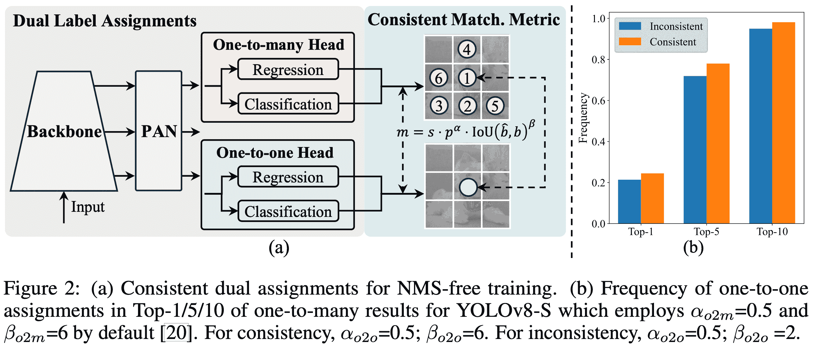
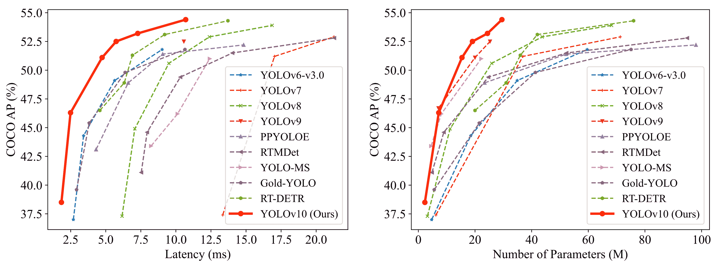

# YOLOv10：实时端到端目标检测

> 原文：[`docs.ultralytics.com/models/yolov10/`](https://docs.ultralytics.com/models/yolov10/)

YOLOv10，由[清华大学](https://www.tsinghua.edu.cn/en/)的研究人员开发，构建在[Ultralytics](https://ultralytics.com)的[Python 包](https://pypi.org/project/ultralytics/)之上，引入了一种新的实时目标检测方法，解决了之前 YOLO 版本中存在的后处理和模型架构缺陷。通过消除非最大抑制（NMS）并优化各种模型组件，YOLOv10 在显著减少计算开销的同时实现了最先进的性能。广泛的实验表明，它在多个模型尺度上具有优越的精度-延迟权衡。



[`www.youtube.com/embed/_gRqR-miFPE`](https://www.youtube.com/embed/_gRqR-miFPE)

**观看:** 如何使用 Ultralytics | Retail 数据集在 SKU-110k 数据集上训练 YOLOv10

## 概述

实时目标检测旨在准确预测图像中的对象类别和位置，并具有低延迟。由于在性能和效率之间的平衡，YOLO 系列一直处于研究前沿。然而，依赖于 NMS 和架构效率低下一直制约着其优化性能。YOLOv10 通过引入一致的双重分配实现了无 NMS 训练，并采用整体的效率-精度驱动的模型设计策略来解决这些问题。

### 架构

YOLOv10 的架构建立在前几个 YOLO 模型的优势基础上，同时引入了几个关键的创新。模型架构包括以下组件：

1.  **Backbone**: 负责特征提取，YOLOv10 中的骨干网络采用增强版的 CSPNet（跨阶段部分网络），以改善梯度流动并减少计算冗余。

1.  **Neck**: 颈部设计用于聚合不同尺度的特征并将其传递给头部。它包括 PAN（路径聚合网络）层，用于有效的多尺度特征融合。

1.  **一对多头部**: 在训练期间为每个对象生成多个预测，提供丰富的监督信号，提高学习精度。

1.  **一对一头部**: 在推断期间为每个对象生成单个最佳预测，消除了 NMS 的需求，从而降低延迟并提高效率。

## 关键特性

1.  **无 NMS 训练**: 利用一致的双重分配来消除 NMS 的需求，降低推断延迟。

1.  **整体模型设计**: 综合优化各种组件，包括轻量级分类头部、空间通道分离下采样和排名引导的块设计，从效率和精度两个角度考虑。

1.  **增强模型能力**: 结合了大卷积核和部分自注意模块，提高性能而不增加显著的计算成本。

## 模型变体

YOLOv10 提供多种模型规模，以满足不同的应用需求：

+   **YOLOv10-N**: 面向极度资源受限环境的纳米版本。

+   **YOLOv10-S**: 平衡速度和准确性的小版本。

+   **YOLOv10-M**: 通用中型版本。

+   **YOLOv10-B**: 增加宽度以提高准确性的平衡版本。

+   **YOLOv10-L**: 高精度大版本，但计算资源需求较高。

+   **YOLOv10-X**: 极大版本，追求最大准确性和性能。

## 性能

YOLOv10 在准确性和效率方面优于以往的 YOLO 版本和其他最先进模型。例如，YOLOv10-S 比 RT-DETR-R18 在 COCO 数据集上速度快 1.8 倍，且具有类似的 AP，而 YOLOv10-B 的延迟比 YOLOv9-C 少 46%，参数少 25%且性能相同。

| 模型 | 输入尺寸 | AP^(val) | FLOPs (G) | 延迟 (ms) |
| --- | --- | --- | --- | --- |
| [YOLOv10-N](https://github.com/ultralytics/assets/releases/download/v8.2.0/yolov10n.pt) | 640 | 38.5 | **6.7** | **1.84** |
| [YOLOv10-S](https://github.com/ultralytics/assets/releases/download/v8.2.0/yolov10s.pt) | 640 | 46.3 | 21.6 | 2.49 |
| [YOLOv10-M](https://github.com/ultralytics/assets/releases/download/v8.2.0/yolov10m.pt) | 640 | 51.1 | 59.1 | 4.74 |
| [YOLOv10-B](https://github.com/ultralytics/assets/releases/download/v8.2.0/yolov10b.pt) | 640 | 52.5 | 92.0 | 5.74 |
| [YOLOv10-L](https://github.com/ultralytics/assets/releases/download/v8.2.0/yolov10l.pt) | 640 | 53.2 | 120.3 | 7.28 |
| [YOLOv10-X](https://github.com/ultralytics/assets/releases/download/v8.2.0/yolov10x.pt) | 640 | **54.4** | 160.4 | 10.70 |

使用 TensorRT FP16 在 T4 GPU 上测量延迟。

## 方法论

### 一致的双赋值，无 NMS 训练

YOLOv10 在训练期间采用双标签赋值，结合一对多和一对一策略，确保丰富的监督并实现高效的端到端部署。一致的匹配度量使得两种策略之间的监督保持一致，在推理过程中增强预测质量。

### 全面的效率-准确度驱动模型设计

#### 效率增强

1.  **轻量级分类头**: 使用深度可分离卷积减少分类头的计算开销。

1.  **空间-通道分离下采样**: 分离空间减少和通道调制，以最小化信息丢失和计算成本。

1.  **排名导向的块设计**: 根据内在阶段冗余调整块设计，确保最佳参数利用率。

#### 准确度增强

1.  **大卷积核**: 扩大感受野以增强特征提取能力。

1.  **部分自注意力（PSA）**: 结合自注意力模块，提高全局表示学习，且开销最小化。

## 实验与结果

YOLOv10 已在像 COCO 这样的标准基准测试中进行了广泛测试，展示了在不同变体中的卓越性能，显示出与之前版本和其他当代检测器相比的潜在改进。

## 比较



与其他最先进的检测器相比：

+   YOLOv10-S / X 的速度比 RT-DETR-R18 / R101 快 1.8× / 1.3×，精度相似

+   YOLOv10-B 的参数比 YOLOv9-C 少 25%，延迟比 YOLOv9-C 低 46%，精度相同

+   YOLOv10-L / X 比 YOLOv8-L / X 表现出 0.3 AP / 0.5 AP 更好，并且参数少 1.8× / 2.3×

这里是 YOLOv10 各个变体与其他最先进模型的详细比较：

| 模型 | 参数 ^((M)) | FLOPs ^((G)) | mAP^(val 50-95) | 延迟 ^((ms)) | 前向延迟 ^((ms)) |
| --- | --- | --- | --- | --- | --- |
| YOLOv6-3.0-N | 4.7 | 11.4 | 37.0 | 2.69 | **1.76** |
| 金牌-YOLO-N | 5.6 | 12.1 | **39.6** | 2.92 | 1.82 |
| YOLOv8-N | 3.2 | 8.7 | 37.3 | 6.16 | 1.77 |
| **[YOLOv10-N](https://github.com/ultralytics/assets/releases/download/v8.2.0/yolov10n.pt)** | **2.3** | **6.7** | 39.5 | **1.84** | 1.79 |
|  |  |  |  |  |  |
| YOLOv6-3.0-S | 18.5 | 45.3 | 44.3 | 3.42 | 2.35 |
| 金牌-YOLO-S | 21.5 | 46.0 | 45.4 | 3.82 | 2.73 |
| YOLOv8-S | 11.2 | 28.6 | 44.9 | 7.07 | **2.33** |
| **[YOLOv10-S](https://github.com/ultralytics/assets/releases/download/v8.2.0/yolov10s.pt)** | **7.2** | **21.6** | **46.8** | **2.49** | 2.39 |
|  |  |  |  |  |  |
| RT-DETR-R18 | 20.0 | 60.0 | 46.5 | **4.58** | **4.49** |
| YOLOv6-3.0-M | 34.9 | 85.8 | 49.1 | 5.63 | 4.56 |
| 金牌-YOLO-M | 41.3 | 87.5 | 49.8 | 6.38 | 5.45 |
| YOLOv8-M | 25.9 | 78.9 | 50.6 | 9.50 | 5.09 |
| **[YOLOv10-M](https://github.com/ultralytics/assets/releases/download/v8.2.0/yolov10m.pt)** | **15.4** | **59.1** | **51.3** | 4.74 | 4.63 |
|  |  |  |  |  |  |
| YOLOv6-3.0-L | 59.6 | 150.7 | 51.8 | 9.02 | 7.90 |
| 金牌-YOLO-L | 75.1 | 151.7 | 51.8 | 10.65 | 9.78 |
| YOLOv8-L | 43.7 | 165.2 | 52.9 | 12.39 | 8.06 |
| RT-DETR-R50 | 42.0 | 136.0 | 53.1 | 9.20 | 9.07 |
| **[YOLOv10-L](https://github.com/ultralytics/assets/releases/download/v8.2.0/yolov10l.pt)** | **24.4** | **120.3** | **53.4** | **7.28** | **7.21** |
|  |  |  |  |  |  |
| YOLOv8-X | 68.2 | 257.8 | 53.9 | 16.86 | 12.83 |
| RT-DETR-R101 | 76.0 | 259.0 | 54.3 | 13.71 | 13.58 |
| **[YOLOv10-X](https://github.com/ultralytics/assets/releases/download/v8.2.0/yolov10x.pt)** | **29.5** | **160.4** | **54.4** | **10.70** | **10.60** |

## 使用示例

用 YOLOv10 预测新图像：

例子

```py
`from ultralytics import YOLO  # Load a pre-trained YOLOv10n model model = YOLO("yolov10n.pt")  # Perform object detection on an image results = model("image.jpg")  # Display the results results[0].show()` 
```

```py
`# Load a COCO-pretrained YOLOv10n model and run inference on the 'bus.jpg' image yolo  detect  predict  model=yolov10n.pt  source=path/to/bus.jpg` 
```

用于在自定义数据集上训练 YOLOv10：

例子

```py
`from ultralytics import YOLO  # Load YOLOv10n model from scratch model = YOLO("yolov10n.yaml")  # Train the model model.train(data="coco8.yaml", epochs=100, imgsz=640)` 
```

```py
`# Build a YOLOv10n model from scratch and train it on the COCO8 example dataset for 100 epochs yolo  train  model=yolov10n.yaml  data=coco8.yaml  epochs=100  imgsz=640  # Build a YOLOv10n model from scratch and run inference on the 'bus.jpg' image yolo  predict  model=yolov10n.yaml  source=path/to/bus.jpg` 
```

## 支持的任务和模式

YOLOv10 模型系列提供一系列优化高性能目标检测的模型，每个模型都针对不同的计算需求和精度要求进行了优化，因此在各种应用中都表现出色。

| Model | Filenames | Tasks | Inference | Validation | Training | Export |
| --- | --- | --- | --- | --- | --- | --- |
| YOLOv10 | `yolov10n.pt` `yolov10s.pt` `yolov10m.pt` `yolov10l.pt` `yolov10x.pt` | 目标检测 | ✅ | ✅ | ✅ | ✅ |

## 导出 YOLOv10

由于 YOLOv10 引入了新的操作，目前并非所有由 Ultralytics 提供的导出格式都得到支持。以下表格概述了使用 Ultralytics 进行 YOLOv10 成功转换的格式。如果您能够提供贡献更改以增加 YOLOv10 其他导出格式的支持，请随时提交拉取请求。

| 导出格式 | 支持情况 |
| --- | --- |
| TorchScript | ✅ |
| ONNX | ✅ |
| OpenVINO | ✅ |
| TensorRT | ✅ |
| CoreML | ❌ |
| TF SavedModel | ✅ |
| TF GraphDef | ✅ |
| TF Lite | ✅ |
| TF Edge TPU | ❌ |
| TF.js | ❌ |
| PaddlePaddle | ❌ |
| NCNN | ❌ |

## 结论

YOLOv10 通过解决以往版本的不足之处并采用创新设计策略，为实时目标检测设定了新的标准。其在低计算成本下能够提供高精度，使其成为广泛实际应用的理想选择。

## 引文和致谢

我们要感谢清华大学的 YOLOv10 作者们，他们在[Ultralytics](https://ultralytics.com)框架中进行了广泛的研究并作出了重大贡献：

```py
`@article{THU-MIGyolov10,   title={YOLOv10: Real-Time End-to-End Object Detection},   author={Ao Wang, Hui Chen, Lihao Liu, et al.},   journal={arXiv preprint arXiv:2405.14458},   year={2024},   institution={Tsinghua University},   license  =  {AGPL-3.0} }` 
```

有关详细的实施、架构创新和实验结果，请参阅清华大学团队的 YOLOv10 [研究论文](https://arxiv.org/pdf/2405.14458)和[GitHub 存储库](https://github.com/THU-MIG/yolov10)。

## 常见问题

### YOLOv10 是什么，它与以前的 YOLO 版本有何不同？

YOLOv10 是由[清华大学](https://www.tsinghua.edu.cn/en/)研究人员开发的，为实时目标检测引入了几项关键创新。它通过在训练过程中采用一致的双重分配和优化模型组件，消除了非极大值抑制（NMS）的需求，从而在性能上表现优异且降低了计算开销。有关其架构和关键特性的更多详细信息，请查看 YOLOv10 概述部分。

### 如何开始使用 YOLOv10 进行推理？

为了便于推理，您可以使用 Ultralytics 的 YOLO Python 库或命令行界面（CLI）。以下是使用 YOLOv10 预测新图像的示例：

示例

```py
`from ultralytics import YOLO  # Load the pre-trained YOLOv10-N model model = YOLO("yolov10n.pt") results = model("image.jpg") results[0].show()` 
```

```py
`yolo  detect  predict  model=yolov10n.pt  source=path/to/image.jpg` 
```

欲了解更多使用示例，请访问我们的使用示例部分。

### YOLOv10 提供了哪些模型变体，它们各自的用途是什么？

YOLOv10 提供了多个模型变体以满足不同的用途：

+   **YOLOv10-N**: 适用于资源极为有限的环境

+   **YOLOv10-S**: 平衡速度和精度

+   **YOLOv10-M**: 通用用途

+   **YOLOv10-B**: 增加宽度以提高精度

+   **YOLOv10-L**: 在计算资源消耗的代价下提供高精度

+   **YOLOv10-X**: 最高的精度和性能

每个变体都针对不同的计算需求和准确性要求进行设计，使其在各种应用中都具有多功能性。有关更多信息，请查看模型变体部分。

### YOLOv10 中的无 NMS 方法如何提高性能？

YOLOv10 通过采用一致的双重分配进行训练，消除了推理过程中对非最大抑制（NMS）的需求。这种方法减少了推理延迟并提高了预测效率。该架构还包括一个一对一的推理头，确保每个对象获得一个最佳预测。有关详细说明，请参见无 NMS 训练的一致双重分配部分。

### 我在哪里可以找到 YOLOv10 模型的导出选项？

YOLOv10 支持多种导出格式，包括 TorchScript、ONNX、OpenVINO 和 TensorRT。然而，由于其新操作，并非所有 Ultralytics 提供的导出格式目前都支持 YOLOv10。有关支持的格式和导出说明的详细信息，请访问导出 YOLOv10 部分。

### YOLOv10 模型的性能基准是什么？

YOLOv10 在准确性和效率上都优于之前的 YOLO 版本和其他最先进的模型。例如，YOLOv10-S 的速度比 RT-DETR-R18 快 1.8 倍，而在 COCO 数据集上的 AP 相似。YOLOv10-B 的延迟减少了 46%，参数比 YOLOv9-C 少 25%，而性能相同。详细的基准测试可以在比较部分找到。
