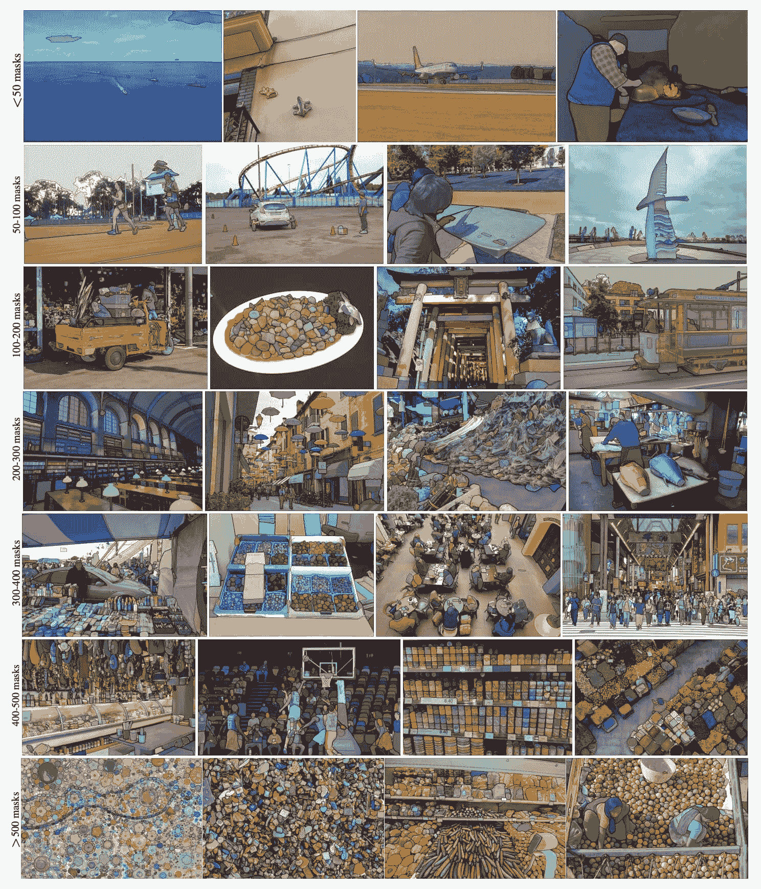

# Segment Anything 模型（SAM）

> 原文：[`docs.ultralytics.com/models/sam/`](https://docs.ultralytics.com/models/sam/)

欢迎来到 Segment Anything 模型（SAM）在图像分割领域的前沿。这一革命性的模型通过引入实时性能的可提示图像分割，改变了游戏规则，树立了领域新标准。

## SAM 简介：Segment Anything 模型

Segment Anything 模型（SAM）是一种先进的图像分割模型，支持可提示的分割，为图像分析任务提供了前所未有的灵活性。SAM 是 Segment Anything 项目的核心，该项目引入了一种新的模型、任务和数据集，用于图像分割。

SAM 的先进设计使其能够在没有先验知识的情况下适应新的图像分布和任务，这一特性称为零射击传输。SAM 在广泛的[SA-1B 数据集](https://ai.facebook.com/datasets/segment-anything/)上进行训练，该数据集包含超过 11 百万张精心策划的图像和 10 亿多的蒙版，SAM 展示了令人印象深刻的零射击性能，在许多情况下超越了以往的完全监督结果。

 **SA-1B 示例图像。** 数据集图像上叠加了新引入的 SA-1B 数据集的蒙版。SA-1B 包含了 1100 万多样化、高分辨率、有许可和隐私保护的图像以及 11 亿高质量的分割蒙版。这些蒙版由 SAM 完全自动注释，并经过人类评分和大量实验验证，质量和多样性很高。图像按照每个图像平均∼100 个蒙版进行了分组可视化。

## Segment Anything 模型（SAM）的关键特性

+   **可提示分割任务：** SAM 设计时考虑了可提示的分割任务，允许它从任何给定的提示生成有效的分割蒙版，例如空间或文本线索，用于识别对象。

+   **先进的架构：** Segment Anything 模型采用强大的图像编码器、提示编码器和轻量级蒙版解码器。这种独特的架构支持灵活的提示、实时蒙版计算和分割任务中的歧义感知。

+   **SA-1B 数据集：** 由 Segment Anything 项目引入的 SA-1B 数据集包含超过 10 亿张图像和 1100 万个蒙版。作为迄今为止最大的分割数据集，它为 SAM 提供了一个多样化且大规模的训练数据来源。

+   **零射击性能：** SAM 在各种分割任务中展现出卓越的零射击性能，使其成为一款可即插即用的工具，在最小的提示工程需求下，适用于多样的应用场景。

欲深入了解 Segment Anything 模型和 SA-1B 数据集，请访问[Segment Anything 网站](https://segment-anything.com)，并查阅研究论文[Segment Anything](https://arxiv.org/abs/2304.02643)。

## 可用模型、支持的任务和操作模式

此表格显示了可用模型及其特定的预训练权重，它们支持的任务以及它们与不同操作模式（如推断、验证、训练和导出）的兼容性，由✅ 表示支持的模式和❌ 表示不支持的模式。

| Model Type | Pre-trained Weights | Tasks Supported | Inference | Validation | Training | Export |
| --- | --- | --- | --- | --- | --- | --- |
| SAM base | [sam_b.pt](https://github.com/ultralytics/assets/releases/download/v8.2.0/sam_b.pt) | 实例分割 | ✅ | ❌ | ❌ | ❌ |
| SAM large | [sam_l.pt](https://github.com/ultralytics/assets/releases/download/v8.2.0/sam_l.pt) | 实例分割 | ✅ | ❌ | ❌ | ❌ |

## 如何使用 SAM：图像分割中的多功能和强大

Segment Anything 模型可用于多种超出其训练数据范围的下游任务，包括边缘检测、对象提议生成、实例分割和初步文本到遮罩预测。通过提示工程，SAM 可以以零-shot 方式快速适应新任务和数据分布，使其成为您所有图像分割需求的多功能和强大工具。

### SAM 预测示例

使用提示分割

使用给定提示分割图像。

```py
`from ultralytics import SAM  # Load a model model = SAM("sam_b.pt")  # Display model information (optional) model.info()  # Run inference with bboxes prompt results = model("ultralytics/assets/zidane.jpg", bboxes=[439, 437, 524, 709])  # Run inference with points prompt results = model("ultralytics/assets/zidane.jpg", points=[900, 370], labels=[1])` 
```

分割所有内容

分割整个图像。

```py
`from ultralytics import SAM  # Load a model model = SAM("sam_b.pt")  # Display model information (optional) model.info()  # Run inference model("path/to/image.jpg")` 
```

```py
`# Run inference with a SAM model yolo  predict  model=sam_b.pt  source=path/to/image.jpg` 
```

+   此处的逻辑是，如果您没有传递任何提示（边界框/点/遮罩），则对整个图像进行分割。

SAMPredictor 示例

通过此方法，您可以一次设置图像，并多次运行提示推断，而无需多次运行图像编码器。

```py
`from ultralytics.models.sam import Predictor as SAMPredictor  # Create SAMPredictor overrides = dict(conf=0.25, task="segment", mode="predict", imgsz=1024, model="mobile_sam.pt") predictor = SAMPredictor(overrides=overrides)  # Set image predictor.set_image("ultralytics/assets/zidane.jpg")  # set with image file predictor.set_image(cv2.imread("ultralytics/assets/zidane.jpg"))  # set with np.ndarray results = predictor(bboxes=[439, 437, 524, 709]) results = predictor(points=[900, 370], labels=[1])  # Reset image predictor.reset_image()` 
```

使用附加参数分割所有内容。

```py
`from ultralytics.models.sam import Predictor as SAMPredictor  # Create SAMPredictor overrides = dict(conf=0.25, task="segment", mode="predict", imgsz=1024, model="mobile_sam.pt") predictor = SAMPredictor(overrides=overrides)  # Segment with additional args results = predictor(source="ultralytics/assets/zidane.jpg", crop_n_layers=1, points_stride=64)` 
```

注意

所有上述示例中返回的`results`都是 Results 对象，可以轻松访问预测的遮罩和源图像。

+   有关`Segment everything`的更多附加参数，请参阅`Predictor/generate` 参考资料。

## SAM 与 YOLOv8 的比较

在这里，我们将 Meta 的最小 SAM 模型 SAM-b 与 Ultralytics 的最小分割模型 YOLOv8n-seg 进行比较：

| Model | Size | Parameters | Speed (CPU) |
| --- | --- | --- | --- |
| Meta's SAM-b | 358 MB | 94.7 M | 51096 ms/im |
| MobileSAM | 40.7 MB | 10.1 M | 46122 ms/im |
| FastSAM-s with YOLOv8 backbone | 23.7 MB | 11.8 M | 115 ms/im |
| Ultralytics YOLOv8n-seg | **6.7 MB** (53.4 倍更小) | **3.4 M** (27.9 倍更少) | **59 ms/im** (866 倍更快) |

此比较显示了不同模型大小和速度之间的数量级差异。虽然 SAM 提供了自动分割的独特能力，但它并非 YOLOv8 分割模型的直接竞争对手，后者更小、更快且更高效。

在 2023 年的 Apple M2 MacBook 上运行的测试，配备 16GB RAM。要重现此测试：

示例

```py
`from ultralytics import SAM, YOLO, FastSAM  # Profile SAM-b model = SAM("sam_b.pt") model.info() model("ultralytics/assets")  # Profile MobileSAM model = SAM("mobile_sam.pt") model.info() model("ultralytics/assets")  # Profile FastSAM-s model = FastSAM("FastSAM-s.pt") model.info() model("ultralytics/assets")  # Profile YOLOv8n-seg model = YOLO("yolov8n-seg.pt") model.info() model("ultralytics/assets")` 
```

## 自动标注：快速路径到分割数据集

自动注释是 SAM 的一个关键特性，允许用户使用预训练的检测模型生成分割数据集。这一功能使得能够快速而准确地对大量图像进行注释，避免了耗时的手动标记过程。

### 使用检测模型生成您的分割数据集

要使用 Ultralytics 框架自动注释您的数据集，请按照下面的方式使用`auto_annotate`函数：

示例

```py
`from ultralytics.data.annotator import auto_annotate  auto_annotate(data="path/to/images", det_model="yolov8x.pt", sam_model="sam_b.pt")` 
```

| 参数 | 类型 | 描述 | 默认值 |
| --- | --- | --- | --- |
| `data` | `str` | 包含待注释图像的文件夹路径。 |  |
| `det_model` | `str`，可选项 | 预训练的 YOLO 检测模型。默认为'yolov8x.pt'。 | `'yolov8x.pt'` |
| `sam_model` | `str`，可选项 | 预训练的 SAM 分割模型。默认为'sam_b.pt'。 | `'sam_b.pt'` |
| `device` | `str`，可选项 | 在其上运行模型的设备。默认为空字符串（CPU 或 GPU，如果可用）。 |  |
| `output_dir` | `str`，`None`，可选项 | 保存带注释结果的目录。默认为与'data'文件夹相同目录下的'labels'文件夹。 | `None` |

`auto_annotate`函数接受您的图像路径，可选参数指定预训练检测和 SAM 分割模型，运行模型的设备以及保存带注释结果的输出目录。

使用预训练模型进行自动注释，可以大大减少创建高质量分割数据集所需的时间和精力。这一功能对于处理大型图像集合的研究人员和开发人员尤其有益，因为它使他们能够集中精力于模型的开发和评估，而不是手动注释。

## 引用和致谢

如果您在研究或开发工作中发现 SAM 有用，请考虑引用我们的论文：

```py
`@misc{kirillov2023segment,   title={Segment Anything},   author={Alexander Kirillov and Eric Mintun and Nikhila Ravi and Hanzi Mao and Chloe Rolland and Laura Gustafson and Tete Xiao and Spencer Whitehead and Alexander C. Berg and Wan-Yen Lo and Piotr Dollár and Ross Girshick},   year={2023},   eprint={2304.02643},   archivePrefix={arXiv},   primaryClass={cs.CV} }` 
```

我们要感谢 Meta AI 为计算机视觉社区创建和维护这一宝贵资源。

## 常见问题解答

### 什么是 Ultralytics 的段落任意模型（SAM）？

Ultralytics 的段落任意模型（SAM）是一种革命性的图像分割模型，专为可提示分割任务设计。它利用先进的架构，包括图像和提示编码器以及轻量级掩模解码器，从诸如空间或文本提示等各种提示生成高质量的分割掩模。在广泛的[SA-1B 数据集](https://ai.facebook.com/datasets/segment-anything/)上进行训练，SAM 在零-shot 性能方面表现出色，能够适应新的图像分布和任务，无需先验知识。在这里了解更多信息。

### 如何使用段落任意模型（SAM）进行图像分割？

你可以通过使用段落任意模型（SAM）进行图像分割，通过运行推理，使用各种提示，如边界框或点。以下是一个使用 Python 的示例：

```py
`from ultralytics import SAM  # Load a model model = SAM("sam_b.pt")  # Segment with bounding box prompt model("ultralytics/assets/zidane.jpg", bboxes=[439, 437, 524, 709])  # Segment with points prompt model("ultralytics/assets/zidane.jpg", points=[900, 370], labels=[1])` 
```

或者，您可以在命令行界面（CLI）中使用 SAM 进行推理：

```py
`yolo  predict  model=sam_b.pt  source=path/to/image.jpg` 
```

获取更详细的使用说明，请访问分割部分。

### SAM 和 YOLOv8 在性能上有什么区别？

与 YOLOv8 相比，SAM 模型如 SAM-b 和 FastSAM-s 更大且速度较慢，但提供了独特的自动分割能力。例如，Ultralytics 的 YOLOv8n-seg 比 SAM-b 小 53.4 倍，速度快 866 倍。然而，SAM 的零样本表现使其在多样化、未训练的任务中非常灵活和高效。了解 SAM 与 YOLOv8 的性能比较更多信息，请访问这里。

### 如何使用 SAM 自动注释我的数据集？

Ultralytics 的 SAM 提供了一个自动注释功能，允许使用预训练检测模型生成分割数据集。以下是 Python 的一个示例：

```py
`from ultralytics.data.annotator import auto_annotate  auto_annotate(data="path/to/images", det_model="yolov8x.pt", sam_model="sam_b.pt")` 
```

此功能接受图像路径和预训练检测以及 SAM 分割模型的可选参数，以及设备和输出目录的规格说明。有关完整指南，请参阅自动注释。

### 哪些数据集用于训练 Segment Anything Model（SAM）？

SAM 是基于广泛的[SA-1B 数据集](https://ai.facebook.com/datasets/segment-anything/)进行训练的，该数据集包含超过 11 百万张图像中的 10 亿多个掩码。SA-1B 是迄今为止最大的分割数据集，提供高质量且多样化的训练数据，确保在各种分割任务中具有令人印象深刻的零样本性能。有关更多详细信息，请访问数据集部分。
