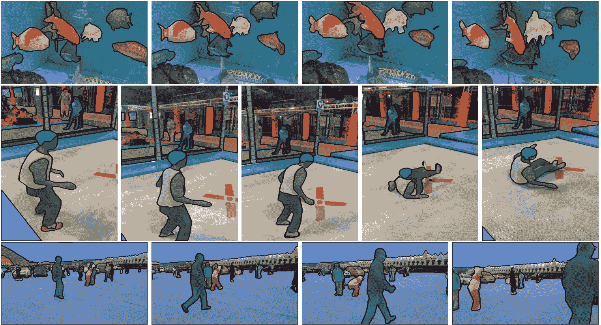
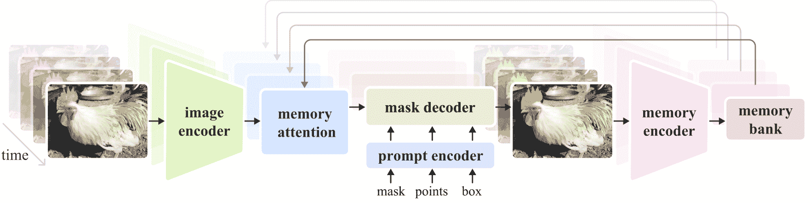

# SAM 2：Segment Anything Model 2

> 原文：[`docs.ultralytics.com/models/sam-2/`](https://docs.ultralytics.com/models/sam-2/)

SAM 2，Meta 的 Segment Anything Model (SAM) 的后继者，是一个为图像和视频中全面对象分割而设计的前沿工具。通过支持实时处理和零射击泛化的统一、可提示的模型架构，它在处理复杂视觉数据方面表现出色。



## 关键特性

### 统一模型架构

SAM 2 将图像和视频分割的能力结合到单一模型中。这种统一简化了部署，并允许在不同媒体类型上保持一致的性能。它利用灵活的基于提示的接口，使用户能够通过各种提示类型（如点、边界框或掩码）指定感兴趣的对象。

### 实时性能

该模型实现了实时推断速度，每秒处理约 44 帧。这使得 SAM 2 适用于需要即时反馈的应用，如视频编辑和增强现实。

### 零射击泛化

SAM 2 能够分割它从未遇到过的对象，展示出强大的零射击泛化能力。这在多样化或不断变化的视觉领域特别有用，预定义的类别可能无法涵盖所有可能的对象。

### 交互式完善

用户可以通过提供额外提示来逐步完善分割结果，从而精确控制输出。这种互动性对于在视频注释或医学成像等应用中微调结果至关重要。

### 高级视觉挑战处理

SAM 2 包括管理常见视频分割挑战的机制，如对象遮挡和重新出现。它使用先进的内存机制跟踪对象跨帧，确保即使对象暂时被遮挡或退出再进入场景，也能保持连续性。

欲了解 SAM 2 的架构和能力更深入的理解，请查阅 [SAM 2 研究论文](https://arxiv.org/abs/2401.12741)。

## 性能和技术细节

SAM 2 在领域中树立了新的标准，在各种指标上优于先前的模型：

| 指标 | SAM 2 | 先前的 SOTA |
| --- | --- | --- |
| **交互式视频分割** | **最佳** | - |
| **需要人类交互** | **少 3 倍** | 基准 |
| **图像分割准确性** | **提升** | SAM |
| **推断速度** | **快 6 倍** | SAM |

## 模型架构

### 核心组件

+   **图像和视频编码器**：利用基于 Transformer 的架构从图像和视频帧中提取高级特征。该组件负责理解每个时间步的视觉内容。

+   **提示编码器**：处理用户提供的提示（点、框、掩码）以指导分割任务。这使得 SAM 2 能够适应用户输入并针对场景中特定对象进行目标定位。

+   **存储机制**：包括内存编码器、内存存储器和内存注意模块。这些组件共同存储并利用过去帧的信息，使模型能够随时间保持一致的对象跟踪。

+   **掩模解码器**：根据编码图像特征和提示生成最终的分割掩模。在视频中，它还使用内存上下文确保跨帧的准确跟踪。



### 存储机制和遮挡处理

存储机制使得 SAM 2 能够处理视频数据中的时间依赖性和遮挡。当对象移动和交互时，SAM 2 将它们的特征记录在内存存储器中。当一个对象被遮挡时，模型可以依靠这些记忆来预测它再次出现时的位置和外观。遮挡头特别处理对象不可见的情况，预测对象被遮挡的可能性。

### 多掩模歧义解析

在存在歧义的情况下（例如重叠对象），SAM 2 可以生成多个掩模预测。这一功能对于准确表达复杂场景至关重要，其中单个掩模可能不足以描述场景的细微差别。

## SA-V 数据集

为 SAM 2 的训练而开发的 SA-V 数据集是目前最大和最多样化的视频分割数据集之一。它包括：

+   **51,000+ 视频**：来自 47 个国家，提供了广泛的真实场景。

+   **600,000+ 掩模标注**：详细的时空掩模标注，称为“掩模片段”，涵盖了整个对象和部分对象。

+   **数据集规模**：比之前最大的数据集包含的视频多了 4.5 倍，标注多了 53 倍，提供了前所未有的多样性和复杂性。

## 基准测试

### 视频对象分割

SAM 2 在主要视频分割基准测试中展示了优越的性能：

| 数据集 | J&F | J | F |
| --- | --- | --- | --- |
| **DAVIS 2017** | 82.5 | 79.8 | 85.2 |
| **YouTube-VOS** | 81.2 | 78.9 | 83.5 |

### 交互式分割

在交互式分割任务中，SAM 2 表现出显著的效率和准确性：

| 数据集 | NoC@90 | AUC |
| --- | --- | --- |
| **DAVIS Interactive** | 1.54 | 0.872 |

## 安装

要安装 SAM 2，请使用以下命令。首次使用时，所有 SAM 2 模型将自动下载。

```py
`pip  install  ultralytics` 
```

## 如何使用 SAM 2：在图像和视频分割中的多功能性

下表详细说明了可用的 SAM 2 模型、它们的预训练权重、支持的任务以及与推断、验证、训练和导出等不同操作模式的兼容性。

| 模型类型 | 预训练权重 | 支持的任务 | 推断 | 验证 | 训练 | 导出 |
| --- | --- | --- | --- | --- | --- | --- |
| SAM 2 tiny | [sam2_t.pt](https://github.com/ultralytics/assets/releases/download/v8.2.0/sam2_t.pt) | 实例分割 | ✅ | ❌ | ❌ | ❌ |
| SAM 2 小型 | [sam2_s.pt](https://github.com/ultralytics/assets/releases/download/v8.2.0/sam2_s.pt) | 实例分割 | ✅ | ❌ | ❌ | ❌ |
| SAM 2 基础 | [sam2_b.pt](https://github.com/ultralytics/assets/releases/download/v8.2.0/sam2_b.pt) | 实例分割 | ✅ | ❌ | ❌ | ❌ |
| SAM 2 大型 | [sam2_l.pt](https://github.com/ultralytics/assets/releases/download/v8.2.0/sam2_l.pt) | 实例分割 | ✅ | ❌ | ❌ | ❌ |

### SAM 2 预测示例

SAM 2 可在广泛的任务范围内使用，包括实时视频编辑、医学成像和自主系统。其分割静态和动态视觉数据的能力使其成为研究人员和开发人员的多功能工具。

#### 分段提示

分段提示

使用提示来分割图像或视频中的特定对象。

```py
`from ultralytics import SAM  # Load a model model = SAM("sam2_b.pt")  # Display model information (optional) model.info()  # Segment with bounding box prompt results = model("path/to/image.jpg", bboxes=[100, 100, 200, 200])  # Segment with point prompt results = model("path/to/image.jpg", points=[150, 150], labels=[1])` 
```

#### 分割所有内容

分割所有内容

分割整个图像或视频内容，无需特定提示。

```py
`from ultralytics import SAM  # Load a model model = SAM("sam2_b.pt")  # Display model information (optional) model.info()  # Run inference model("path/to/video.mp4")` 
```

```py
`# Run inference with a SAM 2 model yolo  predict  model=sam2_b.pt  source=path/to/video.mp4` 
```

+   该示例演示了如果不提供提示（边界框/点/掩模），如何使用 SAM 2 分割图像或视频的整个内容。

## SAM 与 YOLOv8 的比较

这里我们比较了 Meta 最小的 SAM 模型 SAM-b 和 Ultralytics 最小的分割模型 YOLOv8n-seg：

| 模型 | 大小 | 参数 | 速度（CPU） |
| --- | --- | --- | --- |
| Meta's SAM-b | 358 MB | 94.7 M | 51096 ms/im |
| MobileSAM | 40.7 MB | 10.1 M | 46122 ms/im |
| 基于 YOLOv8 骨干的 FastSAM-s | 23.7 MB | 11.8 M | 115 ms/im |
| Ultralytics YOLOv8n-seg | **6.7 MB** (53.4x 更小) | **3.4 M** (27.9x 较少) | **59 ms/im** (866x 更快) |

此比较显示了模型大小和速度之间数量级的差异。虽然 SAM 提供了自动分割的独特能力，但它并非 YOLOv8 分割模型的直接竞争对手，后者更小、更快且更高效。

测试在 2023 年配备 16GB RAM 的 Apple M2 MacBook 上运行。要重现此测试：

示例

```py
`from ultralytics import SAM, YOLO, FastSAM  # Profile SAM-b model = SAM("sam_b.pt") model.info() model("ultralytics/assets")  # Profile MobileSAM model = SAM("mobile_sam.pt") model.info() model("ultralytics/assets")  # Profile FastSAM-s model = FastSAM("FastSAM-s.pt") model.info() model("ultralytics/assets")  # Profile YOLOv8n-seg model = YOLO("yolov8n-seg.pt") model.info() model("ultralytics/assets")` 
```

## 自动注释：高效数据集创建

自动注释是 SAM 2 的一个强大功能，通过利用预训练模型，使用户能够快速准确地生成分段数据集。这一功能特别适用于创建大规模、高质量的数据集，无需大量手动操作。

### 如何使用 SAM 2 进行自动注释

若要使用 SAM 2 自动注释您的数据集，请参考此示例：

自动注释示例

```py
`from ultralytics.data.annotator import auto_annotate  auto_annotate(data="path/to/images", det_model="yolov8x.pt", sam_model="sam2_b.pt")` 
```

| 参数 | 类型 | 描述 | 默认值 |
| --- | --- | --- | --- |
| `data` | `str` | 包含要注释的图像的文件夹路径。 |  |
| `det_model` | `str`, 可选 | 预训练的 YOLO 检测模型。默认为 'yolov8x.pt'。 | `'yolov8x.pt'` |
| `sam_model` | `str`, 可选 | 预训练的 SAM 2 分割模型。默认为 'sam2_b.pt'。 | `'sam2_b.pt'` |
| `device` | `str`, 可选 | 运行模型的设备。默认为空字符串（CPU 或 GPU，如果可用）。 |  |
| `output_dir` | `str`, `None`, 可选 | 保存注释结果的目录。默认为与 'data' 目录同级的 'labels' 文件夹。 | `None` |

此功能有助于快速创建高质量的分割数据集，非常适合希望加速项目的研究人员和开发者。

## 限制

尽管其优点，SAM 2 也有一些限制：

+   **跟踪稳定性**：在长序列或视角显著变化期间，SAM 2 可能会丢失对象的跟踪。

+   **对象混淆**：模型有时会在拥挤场景中混淆看起来相似的对象。

+   **多对象效率**：由于缺乏对象间通信，处理多个对象时，分段效率会降低。

+   **细节精度**：可能会错过细小的细节，特别是在快速移动对象时。额外的提示可以部分解决这个问题，但不能保证时间上的平滑。

## 引用和致谢

如果 SAM 2 对你的研究或开发工作至关重要，请引用以下参考文献：

```py
`@article{ravi2024sam2,   title={SAM 2: Segment Anything in Images and Videos},   author={Ravi, Nikhila and Gabeur, Valentin and Hu, Yuan-Ting and Hu, Ronghang and Ryali, Chaitanya and Ma, Tengyu and Khedr, Haitham and R{\"a}dle, Roman and Rolland, Chloe and Gustafson, Laura and Mintun, Eric and Pan, Junting and Alwala, Kalyan Vasudev and Carion, Nicolas and Wu, Chao-Yuan and Girshick, Ross and Doll{\'a}r, Piotr and Feichtenhofer, Christoph},   journal={arXiv preprint},   year={2024} }` 
```

我们要感谢 Meta AI 为 AI 社区做出的贡献，使用这一开创性的模型和数据集。

## 常见问题解答

### SAM 2 是什么，它如何改进原始的 Segment Anything Model（SAM）？

SAM 2 是 Meta 的 Segment Anything Model（SAM）的继任者，是一种专为图像和视频中全面对象分割而设计的尖端工具。它通过统一的可提示模型架构，在处理复杂视觉数据方面表现出色，支持实时处理和零样本泛化。SAM 2 相比原始 SAM 有多项改进，包括：

+   **统一模型架构**：将图像和视频分割能力结合在单一模型中。

+   **实时性能**：每秒处理约 44 帧，适用于需要即时反馈的应用程序。

+   **零样本泛化**：能够分割它从未遇到过的对象，在各种视觉领域非常有用。

+   **交互式优化**：允许用户通过提供额外的提示来迭代地优化分割结果。

+   **高级视觉挑战处理**：管理常见的视频分割挑战，如对象遮挡和重新出现。

关于 SAM 2 的架构和能力的更多细节，请查看[《SAM 2 研究论文》](https://arxiv.org/abs/2401.12741)。

### 如何在实时视频分割中使用 SAM 2？

通过利用其可提示的界面和实时推断能力，SAM 2 可以用于实时视频分割。以下是一个基本示例：

带提示的分段

使用提示来分割图像或视频中的特定对象。

```py
`from ultralytics import SAM  # Load a model model = SAM("sam2_b.pt")  # Display model information (optional) model.info()  # Segment with bounding box prompt results = model("path/to/image.jpg", bboxes=[100, 100, 200, 200])  # Segment with point prompt results = model("path/to/image.jpg", points=[150, 150], labels=[1])` 
```

欲了解更详细的使用方法，请参阅如何使用 SAM 2 部分。

### 用于训练 SAM 2 的数据集是什么，它们如何提升其性能？

SAM 2 是在 SA-V 数据集上训练的，这是目前可用的最大和最多样化的视频分割数据集之一。SA-V 数据集包括：

+   **51,000+ 视频**：涵盖了 47 个国家，提供了广泛的真实场景。

+   **超过 600,000 个掩码注释**：详细的时空掩码注释，称为“掩码片”，覆盖整个对象和部分。

+   **数据集规模**：比之前最大数据集的视频数量多 4.5 倍，注释数量多 53 倍，提供前所未有的多样性和复杂性。

这一广泛的数据集使 SAM 2 能够在主要视频分割基准测试中取得卓越性能，并增强其零样本泛化能力。有关更多信息，请参阅 SA-V 数据集部分。

### SAM 2 如何处理视频分割中的遮挡和物体再出现问题？

SAM 2 包含一种复杂的内存机制，用于管理视频数据中的时间依赖性和遮挡。该内存机制包括：

+   **内存编码器和内存存储库**：存储来自过去帧的特征。

+   **内存注意模块**：利用存储的信息维持随时间的一致对象追踪。

+   **遮挡头**：专门处理物体不可见的情况，预测物体被遮挡的可能性。

即使对象暂时被遮挡或退出并重新进入场景，该机制也确保连续性。更多详情请参阅内存机制和遮挡处理部分。

### SAM 2 与 YOLOv8 等其他分割模型相比如何？

SAM 2 和 Ultralytics YOLOv8 在不同领域有不同的优势和用途。SAM 2 专为具有零样本泛化和实时性能等先进功能的全面对象分割而设计，而 YOLOv8 则专为物体检测和分割任务中的速度和效率进行了优化。以下是比较：

| 模型 | 大小 | 参数 | 速度（CPU） |
| --- | --- | --- | --- |
| Meta's SAM-b | 358 MB | 94.7 M | 51096 ms/im |
| MobileSAM | 40.7 MB | 10.1 M | 46122 ms/im |
| FastSAM-s（采用 YOLOv8 骨干） | 23.7 MB | 11.8 M | 115 ms/im |
| Ultralytics YOLOv8n-seg | **6.7 MB**（缩小 53.4 倍） | **3.4 M**（减少 27.9 倍） | **59 ms/im**（快了 866 倍） |

更多详情，请参阅 SAM 与 YOLOv8 的比较部分。
