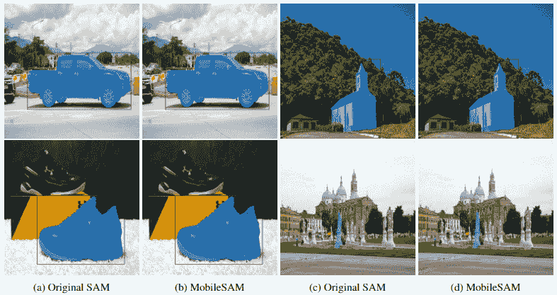

# 移动端任意分割（MobileSAM）

> 原文：[`docs.ultralytics.com/models/mobile-sam/`](https://docs.ultralytics.com/models/mobile-sam/)


MobileSAM 的论文现已在[arXiv](https://arxiv.org/pdf/2306.14289.pdf)上发布。

可以通过此[演示链接](https://huggingface.co/spaces/dhkim2810/MobileSAM)访问 MobileSAM 在 CPU 上运行的演示。在 Mac i5 CPU 上，每张图片大约需要 3 秒。在 Hugging Face 的演示中，界面和性能较低的 CPU 导致响应速度较慢，但功能仍然有效。

MobileSAM 已在多个项目中实施，包括[Grounding-SAM](https://github.com/IDEA-Research/Grounded-Segment-Anything)，[AnyLabeling](https://github.com/vietanhdev/anylabeling)，以及[3D 中的任意分割](https://github.com/Jumpat/SegmentAnythingin3D)。

MobileSAM 在单个 GPU 上训练，使用了 100k 数据集（原始图像的 1%）不到一天时间。该训练的代码将在未来公布。

## 可用模型、支持的任务和操作模式

此表显示了可用模型及其特定的预训练权重，它们支持的任务以及它们与不同操作模式（支持的模式用✅标示，不支持的模式用❌标示）的兼容性。

| 模型类型 | 预训练权重 | 支持的任务 | 推理 | 验证 | 训练 | 导出 |
| --- | --- | --- | --- | --- | --- | --- |
| MobileSAM | [mobile_sam.pt](https://github.com/ultralytics/assets/releases/download/v8.2.0/mobile_sam.pt) | 实例分割 | ✅ | ❌ | ❌ | ❌ |

## 从 SAM 适配到 MobileSAM

由于 MobileSAM 保留了与原始 SAM 相同的管道，我们已经整合了原始的预处理、后处理和所有其他接口。因此，当前使用原始 SAM 的用户可以以最小的努力过渡到 MobileSAM。

MobileSAM 在执行方面与原始 SAM 相媲美，并且保留了相同的管道，只是更改了图像编码器。具体来说，我们用更小的 Tiny-ViT（5M）替换了原始的重型 ViT-H 编码器（632M）。在单个 GPU 上，MobileSAM 每张图片的操作时间约为 12ms：图像编码器为 8ms，蒙版解码器为 4ms。

下表提供了基于 ViT 的图像编码器的比较：

| 图像编码器 | 原始 SAM | MobileSAM |
| --- | --- | --- |
| 参数 | 611M | 5M |
| 速度 | 452ms | 8ms |

原始 SAM 和 MobileSAM 都利用相同的提示引导蒙版解码器：

| 蒙版解码器 | 原始 SAM | MobileSAM |
| --- | --- | --- |
| 参数 | 3.876M | 3.876M |
| 速度 | 4ms | 4ms |

下面是整体管道的比较：

| 整体管道（Enc+Dec） | 原始 SAM | MobileSAM |
| --- | --- | --- |
| 参数 | 615M | 9.66M |
| 速度 | 456ms | 12ms |

MobileSAM 和原始 SAM 的性能通过点和框提示进行演示。




凭借其卓越的性能，MobileSAM 比当前的 FastSAM 大约小了 5 倍，速度快了 7 倍。更多细节请参阅 [MobileSAM 项目页面](https://github.com/ChaoningZhang/MobileSAM)。

## 在 Ultralytics 中测试 MobileSAM

就像原始的 SAM 一样，我们在 Ultralytics 中提供了一种简单直接的测试方法，包括点和框提示的模式。

### 模型下载

您可以在 [这里](https://github.com/ChaoningZhang/MobileSAM/blob/master/weights/mobile_sam.pt) 下载该模型。

### 点提示

示例

```py
from ultralytics import SAM

# Load the model
model = SAM("mobile_sam.pt")

# Predict a segment based on a point prompt
model.predict("ultralytics/assets/zidane.jpg", points=[900, 370], labels=[1]) 
```

### 框提示

示例

```py
from ultralytics import SAM

# Load the model
model = SAM("mobile_sam.pt")

# Predict a segment based on a box prompt
model.predict("ultralytics/assets/zidane.jpg", bboxes=[439, 437, 524, 709]) 
```

我们使用相同的 API 实现了 `MobileSAM` 和 `SAM`。有关更多使用信息，请参阅 SAM 页面。

## 引用和致谢

如果您在研究或开发工作中发现 MobileSAM 有用，请考虑引用我们的论文：

```py
@article{mobile_sam,
  title={Faster Segment Anything: Towards Lightweight SAM for Mobile Applications},
  author={Zhang, Chaoning and Han, Dongshen and Qiao, Yu and Kim, Jung Uk and Bae, Sung Ho and Lee, Seungkyu and Hong, Choong Seon},
  journal={arXiv preprint arXiv:2306.14289},
  year={2023}
} 
```

## 常见问题

### MobileSAM 是什么，它与原始 SAM 模型有什么不同？

MobileSAM 是一种专为移动应用设计的轻量级快速图像分割模型。它保留了与原始 SAM 相同的管道，但将笨重的 ViT-H 编码器（632M 参数）替换为较小的 Tiny-ViT 编码器（5M 参数）。这一改变使 MobileSAM 大约小了 5 倍，速度快了 7 倍。例如，MobileSAM 每张图像的操作速度约为 12 毫秒，而原始 SAM 则为 456 毫秒。您可以在各种项目中了解更多关于 MobileSAM 实现的信息 [这里](https://github.com/ChaoningZhang/MobileSAM)。

### 如何使用 Ultralytics 测试 MobileSAM？

通过简单的方法即可完成在 Ultralytics 中测试 MobileSAM。您可以使用点和框提示来预测段。以下是使用点提示的示例：

```py
from ultralytics import SAM

# Load the model
model = SAM("mobile_sam.pt")

# Predict a segment based on a point prompt
model.predict("ultralytics/assets/zidane.jpg", points=[900, 370], labels=[1]) 
```

您还可以参考《测试 MobileSAM》部分获取更多详细信息。

### 为什么我应该在我的移动应用中使用 MobileSAM？

由于其轻量级架构和快速推理速度，MobileSAM 非常适合移动应用。与原始的 SAM 相比，MobileSAM 大约小了 5 倍，速度快了 7 倍，适合计算资源有限的环境。这种效率确保了移动设备可以在没有显著延迟的情况下进行实时图像分割。此外，MobileSAM 的模型（如推理模型）已经优化，以提升移动性能。

### MobileSAM 是如何训练的，训练代码是否可用？

MobileSAM 在少于一天的时间内使用单个 GPU 训练了一个包含 10 万张数据集的模型，这相当于原始图像的 1%。虽然训练代码将来会公开，但目前您可以在 [MobileSAM GitHub 仓库](https://github.com/ultralytics/assets/releases/download/v8.2.0/mobile_sam.pt) 中了解 MobileSAM 的其他方面。该仓库包括预训练权重和各种应用的实现细节。

### MobileSAM 的主要用例是什么？

MobileSAM 旨在移动环境中实现快速高效的图像分割。主要用例包括：

+   **移动应用的实时目标检测和分割**。

+   **低延迟图像处理**，适用于计算资源有限的设备。

+   **人工智能驱动的移动应用中的集成**，用于增强现实（AR）和实时分析等任务。

有关更详细的用例和性能比较，请参见从 SAM 到 MobileSAM 的适应部分。
