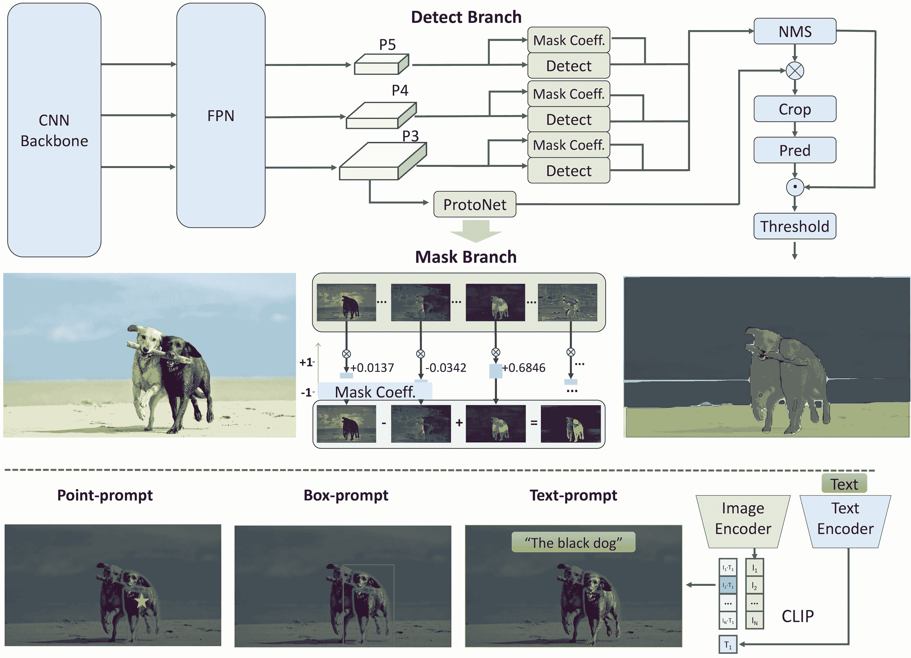

# Fast Segment Anything Model (FastSAM)

> 原文：[`docs.ultralytics.com/models/fast-sam/`](https://docs.ultralytics.com/models/fast-sam/)

Fast Segment Anything Model (FastSAM) 是一种新颖的基于实时 CNN 的解决方案，用于任意分段任务。该任务旨在基于各种可能的用户交互提示对图像中的任意对象进行分割。FastSAM 显著降低了计算需求，同时保持了竞争性能，使其成为各种视觉任务的实用选择。

[`www.youtube.com/embed/F7db-EHhxss`](https://www.youtube.com/embed/F7db-EHhxss)

**观看：** 使用 FastSAM 进行对象跟踪与 Ultralytics

## 模型架构



## 概述

FastSAM 的设计旨在解决 Segment Anything Model (SAM) 的局限性，SAM 是一个具有重大计算资源要求的沉重 Transformer 模型。FastSAM 将任意分段任务解耦为两个连续阶段：所有实例分割和提示引导选择。第一阶段使用 YOLOv8-seg 生成图像中所有实例的分割蒙版。在第二阶段，它输出与提示相对应的感兴趣区域。

## 关键特点

1.  **实时解决方案：** 利用 CNN 的计算效率，FastSAM 提供了针对任意分段任务的实时解决方案，对于需要快速结果的工业应用非常有价值。

1.  **效率和性能：** FastSAM 在不影响性能质量的前提下，显著减少了计算和资源需求。它实现了与 SAM 相当的性能，但计算资源大大减少，能够实时应用。

1.  **提示引导分割：** FastSAM 可以根据各种可能的用户交互提示分割图像中的任意对象，在不同场景中提供灵活性和适应性。

1.  **基于 YOLOv8-seg：** FastSAM 基于 YOLOv8-seg，这是一个装备有实例分割分支的物体检测器。这使得它能够有效地生成图像中所有实例的分割蒙版。

1.  **在基准测试中的竞争结果：** 在单个 NVIDIA RTX 3090 上，FastSAM 在 MS COCO 的对象提议任务上以显著更快的速度取得了高分，比 SAM 更有效率和能力强大。

1.  **实际应用：** 所提出的方法以极高的速度为大量视觉任务提供了新的实用解决方案，比当前方法快十倍甚至百倍。

1.  **模型压缩可行性：** FastSAM 展示了通过引入结构人工先验显著减少计算工作的路径的可行性，从而为一般视觉任务的大型模型架构开辟了新的可能性。

## 可用模型、支持任务和操作模式

此表格显示了可用模型及其特定的预训练权重，它们支持的任务以及它们与不同操作模式（推断、验证、训练和导出）的兼容性。支持的模式用✅表示，不支持的模式用❌表示。

| 模型类型 | 预训练权重 | 支持的任务 | 推断 | 验证 | 训练 | 导出 |
| --- | --- | --- | --- | --- | --- | --- |
| FastSAM-s | [FastSAM-s.pt](https://github.com/ultralytics/assets/releases/download/v8.2.0/FastSAM-s.pt) | 实例分割 | ✅ | ❌ | ❌ | ✅ |
| FastSAM-x | [FastSAM-x.pt](https://github.com/ultralytics/assets/releases/download/v8.2.0/FastSAM-x.pt) | 实例分割 | ✅ | ❌ | ❌ | ✅ |

## 使用示例

FastSAM 模型易于集成到您的 Python 应用程序中。Ultralytics 提供了用户友好的 Python API 和 CLI 命令，以简化开发流程。

### 预测用法

要在图像上执行目标检测，使用如下所示的`predict`方法：

示例

```py
from ultralytics import FastSAM

# Define an inference source
source = "path/to/bus.jpg"

# Create a FastSAM model
model = FastSAM("FastSAM-s.pt")  # or FastSAM-x.pt

# Run inference on an image
everything_results = model(source, device="cpu", retina_masks=True, imgsz=1024, conf=0.4, iou=0.9)

# Run inference with bboxes prompt
results = model(source, bboxes=[439, 437, 524, 709])

# Run inference with points prompt
results = model(source, points=[[200, 200]], labels=[1])

# Run inference with texts prompt
results = model(source, texts="a photo of a dog")

# Run inference with bboxes and points and texts prompt at the same time
results = model(source, bboxes=[439, 437, 524, 709], points=[[200, 200]], labels=[1], texts="a photo of a dog") 
```

```py
# Load a FastSAM model and segment everything with it
yolo  segment  predict  model=FastSAM-s.pt  source=path/to/bus.jpg  imgsz=640 
```

此代码段演示了加载预训练模型并在图像上运行预测的简易性。

FastSAMPredictor 示例

通过这种方式，您可以在图像上运行推断并一次性获取所有段`results`，而无需多次运行推断。

```py
from ultralytics.models.fastsam import FastSAMPredictor

# Create FastSAMPredictor
overrides = dict(conf=0.25, task="segment", mode="predict", model="FastSAM-s.pt", save=False, imgsz=1024)
predictor = FastSAMPredictor(overrides=overrides)

# Segment everything
everything_results = predictor("ultralytics/assets/bus.jpg")

# Prompt inference
bbox_results = predictor.prompt(everything_results, bboxes=[[200, 200, 300, 300]])
point_results = predictor.prompt(everything_results, points=[200, 200])
text_results = predictor.prompt(everything_results, texts="a photo of a dog") 
```

注意

上述示例中所有返回的`results`都是 Results 对象，可以轻松访问预测的掩模和源图像。

### 验证用法

在数据集上验证模型可以按以下步骤完成：

示例

```py
from ultralytics import FastSAM

# Create a FastSAM model
model = FastSAM("FastSAM-s.pt")  # or FastSAM-x.pt

# Validate the model
results = model.val(data="coco8-seg.yaml") 
```

```py
# Load a FastSAM model and validate it on the COCO8 example dataset at image size 640
yolo  segment  val  model=FastSAM-s.pt  data=coco8.yaml  imgsz=640 
```

请注意，FastSAM 仅支持单类对象的检测和分割。这意味着它将所有对象识别并分割为相同的类别。因此，在准备数据集时，需要将所有对象的类别 ID 转换为 0。

### 跟踪用法

要在图像上执行目标跟踪，使用如下所示的`track`方法：

示例

```py
from ultralytics import FastSAM

# Create a FastSAM model
model = FastSAM("FastSAM-s.pt")  # or FastSAM-x.pt

# Track with a FastSAM model on a video
results = model.track(source="path/to/video.mp4", imgsz=640) 
```

```py
yolo  segment  track  model=FastSAM-s.pt  source="path/to/video/file.mp4"  imgsz=640 
```

## FastSAM 官方用法

FastSAM 还可以直接从[`github.com/CASIA-IVA-Lab/FastSAM`](https://github.com/CASIA-IVA-Lab/FastSAM)存储库获取。这里简要介绍了使用 FastSAM 的典型步骤：

### 安装

1.  克隆 FastSAM 存储库：

    ```py
    git  clone  https://github.com/CASIA-IVA-Lab/FastSAM.git 
    ```

1.  创建并激活一个带有 Python 3.9 的 Conda 环境：

    ```py
    conda  create  -n  FastSAM  python=3.9
    conda  activate  FastSAM 
    ```

1.  导航至克隆的存储库并安装所需的包：

    ```py
    cd  FastSAM
    pip  install  -r  requirements.txt 
    ```

1.  安装 CLIP 模型：

    ```py
    pip  install  git+https://github.com/ultralytics/CLIP.git 
    ```

### 用法示例

1.  下载[模型检查点](https://drive.google.com/file/d/1m1sjY4ihXBU1fZXdQ-Xdj-mDltW-2Rqv/view?usp=sharing)。

1.  使用 FastSAM 进行推断。示例命令：

    +   在图像中分割所有内容：

        ```py
        python  Inference.py  --model_path  ./weights/FastSAM.pt  --img_path  ./images/dogs.jpg 
        ```

    +   使用文本提示分割特定对象：

        ```py
        python  Inference.py  --model_path  ./weights/FastSAM.pt  --img_path  ./images/dogs.jpg  --text_prompt  "the yellow dog" 
        ```

    +   在边界框内分割对象（以 xywh 格式提供框坐标）：

        ```py
        python  Inference.py  --model_path  ./weights/FastSAM.pt  --img_path  ./images/dogs.jpg  --box_prompt  "[570,200,230,400]" 
        ```

    +   在特定点附近分割对象：

        ```py
        python  Inference.py  --model_path  ./weights/FastSAM.pt  --img_path  ./images/dogs.jpg  --point_prompt  "[[520,360],[620,300]]"  --point_label  "[1,0]" 
        ```

此外，您可以通过[Colab 演示](https://colab.research.google.com/drive/1oX14f6IneGGw612WgVlAiy91UHwFAvr9?usp=sharing)或[HuggingFace 网络演示](https://huggingface.co/spaces/An-619/FastSAM)来尝试 FastSAM，获得视觉体验。

## 引文和致谢

我们要感谢 FastSAM 的作者在实时实例分割领域做出的重要贡献：

```py
@misc{zhao2023fast,
  title={Fast Segment Anything},
  author={Xu Zhao and Wenchao Ding and Yongqi An and Yinglong Du and Tao Yu and Min Li and Ming Tang and Jinqiao Wang},
  year={2023},
  eprint={2306.12156},
  archivePrefix={arXiv},
  primaryClass={cs.CV}
} 
```

最初的 FastSAM 论文可以在[arXiv](https://arxiv.org/abs/2306.12156)上找到。作者已经公开了他们的工作，并且代码库可以在[GitHub](https://github.com/CASIA-IVA-Lab/FastSAM)上访问。我们感谢他们在推动该领域发展并使其工作对更广泛的社区可用的努力。

## 常见问题解答（FAQ）

### FastSAM 是什么，与 SAM 有何不同？

FastSAM，即快速任意物体模型，是基于实时卷积神经网络（CNN）的解决方案，旨在减少计算需求，同时在物体分割任务中保持高性能。与使用更重的基于 Transformer 的架构的 Segment Anything Model（SAM）不同，FastSAM 利用 Ultralytics YOLOv8-seg 在两个阶段进行高效实例分割：全对象分割，然后是提示引导选择。

### FastSAM 如何实现实时分割性能？

FastSAM 通过将分割任务解耦成全对象分割和提示引导选择两个阶段实现了实时分割。利用 CNN 的计算效率，FastSAM 在减少计算和资源需求方面取得了显著成效，同时保持竞争性能。这种双阶段方法使 FastSAM 能够提供适用于需要快速结果的应用的快速高效的分割。

### FastSAM 的实际应用有哪些？

FastSAM 非常适用于需要实时分割性能的各种计算机视觉任务。应用包括：

+   用于质量控制和保证的工业自动化

+   用于安全监控和监视的实时视频分析

+   用于物体检测和分割的自动驾驶车辆

+   用于精确和快速分割任务的医学影像

其处理各种用户交互提示的能力使 FastSAM 适应性强，能够在各种情景下灵活应用。

### 如何在 Python 中使用 FastSAM 模型进行推理？

要在 Python 中使用 FastSAM 进行推理，可以参考以下示例：

```py
from ultralytics import FastSAM

# Define an inference source
source = "path/to/bus.jpg"

# Create a FastSAM model
model = FastSAM("FastSAM-s.pt")  # or FastSAM-x.pt

# Run inference on an image
everything_results = model(source, device="cpu", retina_masks=True, imgsz=1024, conf=0.4, iou=0.9)

# Run inference with bboxes prompt
results = model(source, bboxes=[439, 437, 524, 709])

# Run inference with points prompt
results = model(source, points=[[200, 200]], labels=[1])

# Run inference with texts prompt
results = model(source, texts="a photo of a dog")

# Run inference with bboxes and points and texts prompt at the same time
results = model(source, bboxes=[439, 437, 524, 709], points=[[200, 200]], labels=[1], texts="a photo of a dog") 
```

有关推理方法的详细信息，请查看文档的预测使用部分。

### FastSAM 支持哪些提示类型用于分割任务？

FastSAM 支持多种提示类型来引导分割任务：

+   **全对象提示**：为所有可见对象生成分割结果。

+   **边界框（BBox）提示**：在指定的边界框内分割对象。

+   **文本提示**：使用描述性文本来分割与描述匹配的对象。

+   **点提示**：根据用户定义的特定点附近分割对象。

这种灵活性使 FastSAM 能够适应广泛的用户交互场景，增强其在不同应用中的实用性。有关使用这些提示的更多信息，请参阅关键特性部分。
