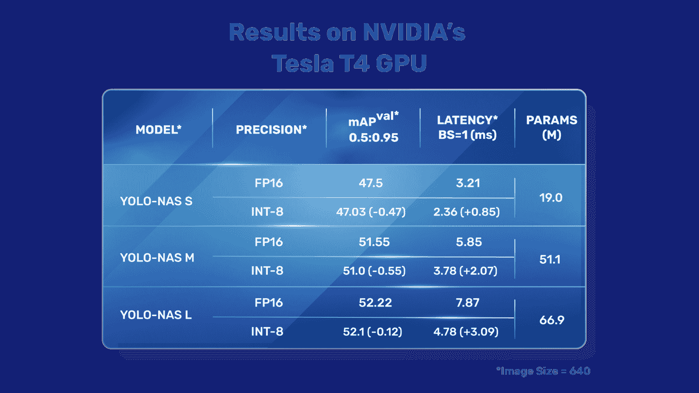

# YOLO-NAS

> 原文：[`docs.ultralytics.com/models/yolo-nas/`](https://docs.ultralytics.com/models/yolo-nas/)

## 概述

由 Deci AI 开发，YOLO-NAS 是一个开创性的物体检测基础模型。它是先进的神经架构搜索技术的产物，精心设计以解决以往 YOLO 模型的局限性。通过在量化支持和精度-延迟权衡方面显著改进，YOLO-NAS 代表了物体检测领域的重大进步。

 **YOLO-NAS 概述。** YOLO-NAS 采用量化感知块和选择性量化以实现最佳性能。当转换为其 INT8 量化版本时，该模型经历了最小的精度下降，远优于其他模型。这些进步使其成为一个具有突出物体检测能力和出色性能的优越架构。

### 主要特点

+   **Quantization-Friendly Basic Block:** YOLO-NAS 引入了一种新的基本块，非常适合量化，解决了以往 YOLO 模型的一个显著限制。

+   **Sophisticated Training and Quantization:** YOLO-NAS 利用先进的训练方案和后训练量化来增强性能。

+   **AutoNAC Optimization and Pre-training:** YOLO-NAS 利用 AutoNAC 优化，并在著名数据集如 COCO、Objects365 和 Roboflow 100 上进行了预训练。这种预训练使其在生产环境中非常适合下游目标检测任务。

## 预训练模型

通过 Ultralytics 提供的预训练 YOLO-NAS 模型，体验下一代物体检测的强大功能。这些模型旨在在速度和准确性方面提供一流性能。根据您的特定需求选择多种选项：

| 模型 | mAP | 延迟（毫秒） |
| --- | --- | --- |
| YOLO-NAS S | 47.5 | 3.21 |
| YOLO-NAS M | 51.55 | 5.85 |
| YOLO-NAS L | 52.22 | 7.87 |
| YOLO-NAS S INT-8 | 47.03 | 2.36 |
| YOLO-NAS M INT-8 | 51.0 | 3.78 |
| YOLO-NAS L INT-8 | 52.1 | 4.78 |

每个模型变体都旨在在均值平均精度（mAP）和延迟之间提供平衡，帮助您优化目标检测任务的性能和速度。

## 使用示例

Ultralytics 已经通过我们的`ultralytics` Python 包，使 YOLO-NAS 模型易于集成到您的 Python 应用程序中。该包提供了一个用户友好的 Python API，以简化整个过程。

以下示例展示了如何使用`ultralytics`包中的 YOLO-NAS 模型进行推断和验证：

### 推断和验证示例

在这个示例中，我们在 COCO8 数据集上验证了 YOLO-NAS-s。

示例

此示例提供了 YOLO-NAS 的简单推断和验证代码。有关处理推断结果，请参见预测模式。有关使用具有其他模式的 YOLO-NAS，请参见 Val 和 Export。`ultralytics`包中的 YOLO-NAS 不支持训练。

可以将 PyTorch 预训练的`*.pt`模型文件传递给`NAS()`类以在 Python 中创建一个模型实例：

```py
`from ultralytics import NAS  # Load a COCO-pretrained YOLO-NAS-s model model = NAS("yolo_nas_s.pt")  # Display model information (optional) model.info()  # Validate the model on the COCO8 example dataset results = model.val(data="coco8.yaml")  # Run inference with the YOLO-NAS-s model on the 'bus.jpg' image results = model("path/to/bus.jpg")` 
```

可以直接运行模型的 CLI 命令：

```py
`# Load a COCO-pretrained YOLO-NAS-s model and validate it's performance on the COCO8 example dataset yolo  val  model=yolo_nas_s.pt  data=coco8.yaml  # Load a COCO-pretrained YOLO-NAS-s model and run inference on the 'bus.jpg' image yolo  predict  model=yolo_nas_s.pt  source=path/to/bus.jpg` 
```

## 支持的任务和模式

我们提供了 YOLO-NAS 模型的三个变体：小型（s）、中型（m）和大型（l）。每个变体都设计用于满足不同的计算和性能需求：

+   **YOLO-NAS-s**：针对计算资源有限但效率至关重要的环境进行了优化。

+   **YOLO-NAS-m**：提供了一种平衡的方法，适用于具有更高准确性的通用物体检测。

+   **YOLO-NAS-l**：为需要最高准确性场景量身定制，计算资源不再是限制因素。

下面详细介绍了每个模型，包括它们预训练权重的链接、它们支持的任务以及它们与不同操作模式的兼容性。

| 模型类型 | 预训练权重 | 支持的任务 | 推理 | 验证 | 训练 | 导出 |
| --- | --- | --- | --- | --- | --- | --- |
| YOLO-NAS-s | [yolo_nas_s.pt](https://github.com/ultralytics/assets/releases/download/v8.2.0/yolo_nas_s.pt) | 物体检测 | ✅ | ✅ | ❌ | ✅ |
| YOLO-NAS-m | [yolo_nas_m.pt](https://github.com/ultralytics/assets/releases/download/v8.2.0/yolo_nas_m.pt) | 物体检测 | ✅ | ✅ | ❌ | ✅ |
| YOLO-NAS-l | [yolo_nas_l.pt](https://github.com/ultralytics/assets/releases/download/v8.2.0/yolo_nas_l.pt) | 物体检测 | ✅ | ✅ | ❌ | ✅ |

## 引用和致谢

如果您在研究或开发工作中使用 YOLO-NAS，请引用 SuperGradients：

```py
`@misc{supergradients,   doi  =  {10.5281/ZENODO.7789328},   url  =  {https://zenodo.org/record/7789328},   author  =  {Aharon,  Shay and {Louis-Dupont} and {Ofri Masad} and Yurkova,  Kate and {Lotem Fridman} and {Lkdci} and Khvedchenya,  Eugene and Rubin,  Ran and Bagrov,  Natan and Tymchenko,  Borys and Keren,  Tomer and Zhilko,  Alexander and {Eran-Deci}},   title  =  {Super-Gradients},   publisher  =  {GitHub},   journal  =  {GitHub repository},   year  =  {2021}, }` 
```

我们感谢 Deci AI 的[SuperGradients](https://github.com/Deci-AI/super-gradients/)团队为计算机视觉社区创造和维护这一宝贵资源所付出的努力。我们相信 YOLO-NAS 以其创新的架构和卓越的物体检测能力，将成为开发者和研究人员的重要工具。

## 常见问题解答

### YOLO-NAS 是什么，它如何改进之前的 YOLO 模型？

YOLO-NAS 是由 Deci AI 开发的一种先进的物体检测模型，利用先进的神经架构搜索（NAS）技术。它通过引入量化友好的基本块和复杂的训练方案来解决之前 YOLO 模型的限制。这导致在性能上有显著改进，特别是在计算资源有限的环境中。YOLO-NAS 还支持量化，在转换为其 INT8 版本时保持高准确性，增强了其在生产环境中的适用性。有关更多详细信息，请参阅概述部分。

### 如何将 YOLO-NAS 模型集成到我的 Python 应用程序中？

您可以使用`ultralytics`包轻松集成 YOLO-NAS 模型到您的 Python 应用程序中。这里是一个加载预训练 YOLO-NAS 模型并进行推断的简单示例：

```py
`from ultralytics import NAS  # Load a COCO-pretrained YOLO-NAS-s model model = NAS("yolo_nas_s.pt")  # Validate the model on the COCO8 example dataset results = model.val(data="coco8.yaml")  # Run inference with the YOLO-NAS-s model on the 'bus.jpg' image results = model("path/to/bus.jpg")` 
```

获取推理和验证示例的更多信息，请参考。

### YOLO-NAS 的关键特性及其为何值得考虑使用的原因是什么？

YOLO-NAS 引入了几个关键特性，使其成为对象检测任务的优选：

+   **量化友好的基本块：**增强架构，在量化后最小化精度损失的同时提高模型性能。

+   **精细化训练和量化：**采用先进的训练方案和训练后量化技术。

+   **AutoNAC 优化和预训练：**利用 AutoNAC 优化并预训练于 COCO、Objects365 和 Roboflow 100 等知名数据集。这些特性提高了其在高精度、高效性能及适合生产环境部署方面的表现。详细了解请参考关键特性部分。

### YOLO-NAS 模型支持哪些任务和模式？

YOLO-NAS 模型支持各种对象检测任务和模式，如推理、验证和导出。它们不支持训练。支持的模型包括 YOLO-NAS-s、YOLO-NAS-m 和 YOLO-NAS-l，每个模型都针对不同的计算能力和性能需求进行了优化。详细概述请参考支持的任务和模式部分。

### 是否有预训练的 YOLO-NAS 模型可用，如何访问它们？

是的，Ultralytics 提供了预训练的 YOLO-NAS 模型，您可以直接访问。这些模型在诸如 COCO 等数据集上进行了预训练，保证了在速度和准确性方面的高性能。您可以通过预训练模型部分提供的链接下载这些模型。以下是一些示例：

+   [YOLO-NAS-s](https://github.com/ultralytics/assets/releases/download/v8.2.0/yolo_nas_s.pt)

+   [YOLO-NAS-m](https://github.com/ultralytics/assets/releases/download/v8.2.0/yolo_nas_m.pt)

+   [YOLO-NAS-l](https://github.com/ultralytics/assets/releases/download/v8.2.0/yolo_nas_l.pt)
