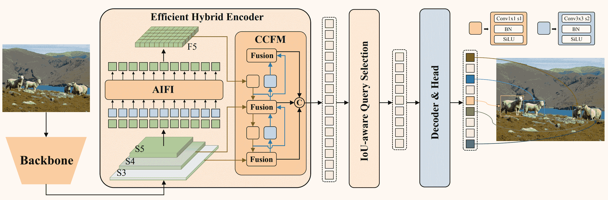

# 百度的 RT-DETR：基于视觉 Transformer 的实时目标检测器

> 原文：[`docs.ultralytics.com/models/rtdetr/`](https://docs.ultralytics.com/models/rtdetr/)

## 概述

由百度开发的实时检测变压器（RT-DETR）是一种先进的端到端目标检测器，提供实时性能的同时保持高准确性。它基于 DETR（无 NMS 框架）的思想，同时引入了基于卷积的骨干和高效的混合编码器以实现实时速度。RT-DETR 通过解耦内部尺度交互和跨尺度融合高效处理多尺度特征。该模型高度灵活，支持使用不同的解码器层调整推理速度，无需重新训练。RT-DETR 在像 CUDA 与 TensorRT 这样的加速后端上表现优异，胜过许多其他实时目标检测器。

[`www.youtube.com/embed/SArFQs6CHwk`](https://www.youtube.com/embed/SArFQs6CHwk)

**监视：** 实时检测变压器（RT-DETR）

 **百度 RT-DETR 概述。** RT-DETR 模型架构图显示了作为编码器输入的骨干网的最后三个阶段 {S3, S4, S5}。高效的混合编码器通过内部尺度特征交互（AIFI）和跨尺度特征融合模块（CCFM），将多尺度特征转换为图像特征序列。使用 IoU 感知查询选择来选择一定数量的图像特征，作为解码器的初始对象查询。最后，解码器通过辅助预测头迭代优化对象查询，生成框和置信度分数（[来源](https://arxiv.org/pdf/2304.08069.pdf)）。

### 主要特点

+   **高效的混合编码器：** 百度的 RT-DETR 采用高效的混合编码器，通过解耦内部尺度交互和跨尺度融合来处理多尺度特征。这种基于视觉 Transformer 的独特设计降低了计算成本，实现了实时目标检测。

+   **IoU 感知查询选择：** 百度的 RT-DETR 通过使用 IoU 感知查询选择来改进对象查询初始化。这使得模型能够集中精力处理场景中最相关的对象，从而提高检测精度。

+   **可调节的推理速度：** 百度的 RT-DETR 通过使用不同的解码器层，无需重新训练即可支持灵活调整推理速度。这种适应性促进了在各种实时目标检测场景中的实际应用。

## 预训练模型

Ultralytics Python API 提供了预训练的 PaddlePaddle RT-DETR 模型，具有不同的规模：

+   RT-DETR-L：在 COCO val2017 上达到 53.0%的 AP，T4 GPU 上的帧率为 114 FPS

+   RT-DETR-X：在 COCO val2017 上达到 54.8%的 AP，T4 GPU 上的帧率为 74 FPS

## 使用示例

本示例提供了简单的 RT-DETR 训练和推理示例。有关这些以及其他模式的完整文档，请参阅预测、训练、验证和导出文档页面。

示例

```py
from ultralytics import RTDETR

# Load a COCO-pretrained RT-DETR-l model
model = RTDETR("rtdetr-l.pt")

# Display model information (optional)
model.info()

# Train the model on the COCO8 example dataset for 100 epochs
results = model.train(data="coco8.yaml", epochs=100, imgsz=640)

# Run inference with the RT-DETR-l model on the 'bus.jpg' image
results = model("path/to/bus.jpg") 
```

```py
# Load a COCO-pretrained RT-DETR-l model and train it on the COCO8 example dataset for 100 epochs
yolo  train  model=rtdetr-l.pt  data=coco8.yaml  epochs=100  imgsz=640

# Load a COCO-pretrained RT-DETR-l model and run inference on the 'bus.jpg' image
yolo  predict  model=rtdetr-l.pt  source=path/to/bus.jpg 
```

## 支持的任务和模式

该表格展示了各个模型类型、具体的预训练权重、每个模型支持的任务，以及通过✅表情符号表示的各种模式（训练、验证、预测、导出）。

| 模型类型 | 预训练权重 | 支持的任务 | 推断 | 验证 | 训练 | 导出 |
| --- | --- | --- | --- | --- | --- | --- |
| RT-DETR 大型 | [rtdetr-l.pt](https://github.com/ultralytics/assets/releases/download/v8.2.0/rtdetr-l.pt) | 目标检测 | ✅ | ✅ | ✅ | ✅ |
| RT-DETR 超大型 | [rtdetr-x.pt](https://github.com/ultralytics/assets/releases/download/v8.2.0/rtdetr-x.pt) | 目标检测 | ✅ | ✅ | ✅ | ✅ |

## 引用和致谢

如果您在研究或开发工作中使用百度的 RT-DETR，请引用[原始论文](https://arxiv.org/abs/2304.08069)：

```py
@misc{lv2023detrs,
  title={DETRs Beat YOLOs on Real-time Object Detection},
  author={Wenyu Lv and Shangliang Xu and Yian Zhao and Guanzhong Wang and Jinman Wei and Cheng Cui and Yuning Du and Qingqing Dang and Yi Liu},
  year={2023},
  eprint={2304.08069},
  archivePrefix={arXiv},
  primaryClass={cs.CV}
} 
```

我们要感谢百度和[PaddlePaddle](https://github.com/PaddlePaddle/PaddleDetection)团队为计算机视觉社区创建和维护这一宝贵资源。他们通过开发基于 Vision Transformers 的实时目标检测器 RT-DETR，为该领域做出了重要贡献，深受赞赏。

## 常见问题

### 百度的 RT-DETR 模型是什么，它是如何工作的？

百度的 RT-DETR（Real-Time Detection Transformer）是基于 Vision Transformer 架构构建的先进实时目标检测器。它通过其高效的混合编码器有效处理多尺度特征，通过解耦内尺度交互和跨尺度融合。通过采用 IoU 感知的查询选择，该模型专注于最相关的对象，增强了检测精度。其可调节的推断速度，通过调整解码器层而无需重新训练，使 RT-DETR 适用于各种实时目标检测场景。在这里了解更多关于 RT-DETR 的特性[链接](https://arxiv.org/pdf/2304.08069.pdf)。

### 我如何使用 Ultralytics 提供的预训练 RT-DETR 模型？

你可以利用 Ultralytics Python API 使用预训练的 PaddlePaddle RT-DETR 模型。例如，要加载在 COCO val2017 上预训练的 RT-DETR-l 模型，并在 T4 GPU 上实现高 FPS，您可以使用以下示例：

示例

```py
from ultralytics import RTDETR

# Load a COCO-pretrained RT-DETR-l model
model = RTDETR("rtdetr-l.pt")

# Display model information (optional)
model.info()

# Train the model on the COCO8 example dataset for 100 epochs
results = model.train(data="coco8.yaml", epochs=100, imgsz=640)

# Run inference with the RT-DETR-l model on the 'bus.jpg' image
results = model("path/to/bus.jpg") 
```

```py
# Load a COCO-pretrained RT-DETR-l model and train it on the COCO8 example dataset for 100 epochs
yolo  train  model=rtdetr-l.pt  data=coco8.yaml  epochs=100  imgsz=640

# Load a COCO-pretrained RT-DETR-l model and run inference on the 'bus.jpg' image
yolo  predict  model=rtdetr-l.pt  source=path/to/bus.jpg 
```

### 为什么应该选择百度的 RT-DETR 而不是其他实时目标检测器？

百度的 RT-DETR 凭借其高效的混合编码器和 IoU 感知的查询选择而脱颖而出，大幅降低计算成本同时保持高准确性。其通过使用不同的解码器层而无需重新训练来调整推断速度的独特能力，增加了显著的灵活性。这使得它特别适用于在 CUDA 与 TensorRT 等加速后端上需要实时性能的应用，胜过许多其他实时目标检测器。

### RT-DETR 如何支持不同实时应用的可调节推断速度？

Baidu 的 RT-DETR 可以通过使用不同的解码器层来灵活调整推理速度，而无需重新训练。这种适应性对于在各种实时目标检测任务中提升性能至关重要。无论您需要更快的处理以满足低精度需求，还是更慢但更精确的检测，RT-DETR 都可以定制以满足您的特定要求。

### 我能在其他 Ultralytics 模式下使用 RT-DETR 模型吗，比如训练、验证和导出？

是的，RT-DETR 模型与包括训练、验证、预测和导出在内的多种 Ultralytics 模式兼容。您可以参考相应的文档以获取如何利用这些模式的详细说明：Train、Val、Predict 和 Export。这确保了开发和部署您的目标检测解决方案的全面工作流程。
