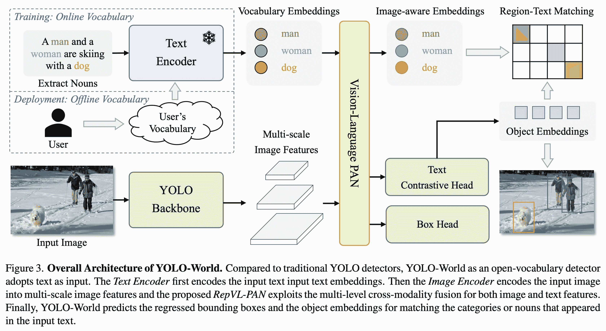
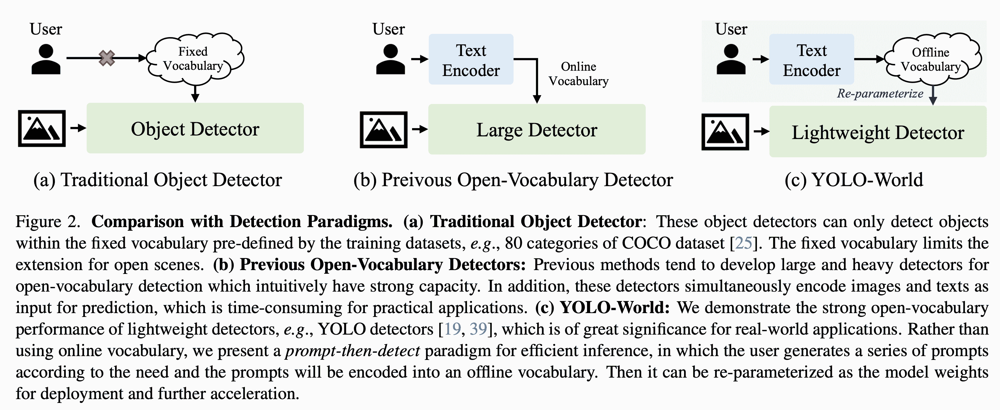

# YOLO-World 模型

> 原文：[`docs.ultralytics.com/models/yolo-world/`](https://docs.ultralytics.com/models/yolo-world/)

YOLO-World 模型引入了基于 Ultralytics YOLOv8 的先进实时方法，用于开放词汇检测任务。该创新能够根据描述性文本在图像中检测任何对象。通过显著降低计算需求，同时保持竞争性能，YOLO-World 成为多种基于视觉的应用的多功能工具。

[`www.youtube.com/embed/cfTKj96TjSE`](https://www.youtube.com/embed/cfTKj96TjSE)

**观看：** YOLO World 自定义数据集的训练工作流程



## 概览

YOLO-World 解决了传统开放词汇检测模型面临的挑战，这些模型通常依赖于耗费大量计算资源的繁琐 Transformer 模型。这些模型对预定义的物体类别的依赖也限制了它们在动态场景中的实用性。YOLO-World 通过视觉语言建模和在大规模数据集上的预训练，在零-shot 场景中卓越地识别广泛对象。

## 主要特点

1.  **实时解决方案：** 利用 CNN 的计算速度，YOLO-World 提供了快速的开放词汇检测解决方案，满足需要即时结果的行业需求。

1.  **效率与性能：** YOLO-World 在不牺牲性能的情况下大幅削减了计算和资源需求，提供了 SAM 等模型的强大替代方案，但计算成本仅为其一小部分，支持实时应用。

1.  **离线词汇推断：** YOLO-World 引入了一种“提示-检测”策略，采用离线词汇进一步提升效率。这种方法允许使用预先计算的自定义提示，如标题或类别，作为离线词汇嵌入进行编码和存储，从而简化检测过程。

1.  **由 YOLOv8 驱动：** 基于 Ultralytics YOLOv8 构建的 YOLO-World，利用实时目标检测的最新进展，实现了开放词汇检测，具有无与伦比的准确性和速度。

1.  **基准卓越：** YOLO-World 在标准基准测试中表现优于现有的开放词汇检测器，包括 MDETR 和 GLIP 系列，展示了 YOLOv8 在单个 NVIDIA V100 GPU 上的卓越能力。

1.  **多用途应用：** YOLO-World 的创新方法为多种视觉任务开辟了新的可能性，大幅提升了速度，比现有方法快上数个数量级。

## 可用模型、支持的任务和操作模式

此部分详细介绍了具体预训练权重的可用模型、它们支持的任务以及它们与各种操作模式的兼容性，推理、验证、训练和导出分别用✅表示支持和❌表示不支持。

Note

所有 YOLOv8-World 的权重都直接从官方[YOLO-World](https://github.com/AILab-CVC/YOLO-World)存储库迁移，突显了它们的卓越贡献。

| Model Type | 预训练权重 | 支持的任务 | 推理 | 验证 | 训练 | 导出 |
| --- | --- | --- | --- | --- | --- | --- |
| YOLOv8s-world | [yolov8s-world.pt](https://github.com/ultralytics/assets/releases/download/v8.2.0/yolov8s-world.pt) | 目标检测 | ✅ | ✅ | ✅ | ❌ |
| YOLOv8s-worldv2 | [yolov8s-worldv2.pt](https://github.com/ultralytics/assets/releases/download/v8.2.0/yolov8s-worldv2.pt) | 目标检测 | ✅ | ✅ | ✅ | ✅ |
| YOLOv8m-world | [yolov8m-world.pt](https://github.com/ultralytics/assets/releases/download/v8.2.0/yolov8m-world.pt) | 目标检测 | ✅ | ✅ | ✅ | ❌ |
| YOLOv8m-worldv2 | [yolov8m-worldv2.pt](https://github.com/ultralytics/assets/releases/download/v8.2.0/yolov8m-worldv2.pt) | 目标检测 | ✅ | ✅ | ✅ | ✅ |
| YOLOv8l-world | [yolov8l-world.pt](https://github.com/ultralytics/assets/releases/download/v8.2.0/yolov8l-world.pt) | 目标检测 | ✅ | ✅ | ✅ | ❌ |
| YOLOv8l-worldv2 | [yolov8l-worldv2.pt](https://github.com/ultralytics/assets/releases/download/v8.2.0/yolov8l-worldv2.pt) | 目标检测 | ✅ | ✅ | ✅ | ✅ |
| YOLOv8x-world | [yolov8x-world.pt](https://github.com/ultralytics/assets/releases/download/v8.2.0/yolov8x-world.pt) | 目标检测 | ✅ | ✅ | ✅ | ❌ |
| YOLOv8x-worldv2 | [yolov8x-worldv2.pt](https://github.com/ultralytics/assets/releases/download/v8.2.0/yolov8x-worldv2.pt) | 目标检测 | ✅ | ✅ | ✅ | ✅ |

## 在 COCO 数据集上进行零-shot 转移

| Model Type | mAP | mAP50 | mAP75 |
| --- | --- | --- | --- |
| yolov8s-world | 37.4 | 52.0 | 40.6 |
| yolov8s-worldv2 | 37.7 | 52.2 | 41.0 |
| yolov8m-world | 42.0 | 57.0 | 45.6 |
| yolov8m-worldv2 | 43.0 | 58.4 | 46.8 |
| yolov8l-world | 45.7 | 61.3 | 49.8 |
| yolov8l-worldv2 | 45.8 | 61.3 | 49.8 |
| yolov8x-world | 47.0 | 63.0 | 51.2 |
| yolov8x-worldv2 | 47.1 | 62.8 | 51.4 |

## 用法示例

YOLO-World 模型易于集成到您的 Python 应用程序中。Ultralytics 提供了用户友好的 Python API 和 CLI 命令，以简化开发。

### 训练用法

Tip

强烈推荐使用`yolov8-worldv2`模型进行自定义训练，因为它支持确定性训练，并且容易导出其他格式，例如 onnx/tensorrt。

使用`train`方法进行目标检测非常简单，如下所示：

示例

可以将预训练的 PyTorch `*.pt`模型以及配置`*.yaml`文件传递给`YOLOWorld()`类，在 Python 中创建模型实例：

```py
`from ultralytics import YOLOWorld  # Load a pretrained YOLOv8s-worldv2 model model = YOLOWorld("yolov8s-worldv2.pt")  # Train the model on the COCO8 example dataset for 100 epochs results = model.train(data="coco8.yaml", epochs=100, imgsz=640)  # Run inference with the YOLOv8n model on the 'bus.jpg' image results = model("path/to/bus.jpg")` 
```

```py
`# Load a pretrained YOLOv8s-worldv2 model and train it on the COCO8 example dataset for 100 epochs yolo  train  model=yolov8s-worldv2.yaml  data=coco8.yaml  epochs=100  imgsz=640` 
```

### 预测用法

使用`predict`方法进行目标检测非常简单，如下所示：

示例

```py
`from ultralytics import YOLOWorld  # Initialize a YOLO-World model model = YOLOWorld("yolov8s-world.pt")  # or select yolov8m/l-world.pt for different sizes  # Execute inference with the YOLOv8s-world model on the specified image results = model.predict("path/to/image.jpg")  # Show results results[0].show()` 
```

```py
`# Perform object detection using a YOLO-World model yolo  predict  model=yolov8s-world.pt  source=path/to/image.jpg  imgsz=640` 
```

此代码片段展示了加载预训练模型并在图像上进行预测的简易性。

### Val 使用

在数据集上进行模型验证的简化步骤如下：

示例

```py
`from ultralytics import YOLO  # Create a YOLO-World model model = YOLO("yolov8s-world.pt")  # or select yolov8m/l-world.pt for different sizes  # Conduct model validation on the COCO8 example dataset metrics = model.val(data="coco8.yaml")` 
```

```py
`# Validate a YOLO-World model on the COCO8 dataset with a specified image size yolo  val  model=yolov8s-world.pt  data=coco8.yaml  imgsz=640` 
```

### 跟踪使用情况

使用 YOLO-World 模型在视频/图像上进行对象跟踪的简化步骤如下：

示例

```py
`from ultralytics import YOLO  # Create a YOLO-World model model = YOLO("yolov8s-world.pt")  # or select yolov8m/l-world.pt for different sizes  # Track with a YOLO-World model on a video results = model.track(source="path/to/video.mp4")` 
```

```py
`# Track with a YOLO-World model on the video with a specified image size yolo  track  model=yolov8s-world.pt  imgsz=640  source="path/to/video/file.mp4"` 
```

注意

由 Ultralytics 提供的 YOLO-World 模型已预配置为离线词汇表的 COCO 数据集类别的一部分，提升了立即应用的效率。这种集成使得 YOLOv8-World 模型能直接识别和预测 COCO 数据集定义的 80 个标准类别，无需额外的设置或定制。

### 设置提示



YOLO-World 框架允许通过自定义提示动态指定类别，让用户根据特定需求定制模型，**无需重新训练**。此功能特别适用于将模型适应原始训练数据中未包含的新领域或特定任务。通过设置自定义提示，用户可以引导模型关注感兴趣的对象，从而提高检测结果的相关性和准确性。

例如，如果您的应用程序只需要检测'人'和'公交车'对象，您可以直接指定这些类别：

示例

```py
`from ultralytics import YOLO  # Initialize a YOLO-World model model = YOLO("yolov8s-world.pt")  # or choose yolov8m/l-world.pt  # Define custom classes model.set_classes(["person", "bus"])  # Execute prediction for specified categories on an image results = model.predict("path/to/image.jpg")  # Show results results[0].show()` 
```

在设置自定义类后，您还可以保存模型。通过这样做，您可以创建一个专门针对特定用例的 YOLO-World 模型版本。此过程将您的自定义类定义直接嵌入到模型文件中，使得模型准备好使用您指定的类别，无需进一步调整。按照以下步骤保存和加载您的自定义 YOLOv8 模型：

示例

首先加载一个 YOLO-World 模型，为其设置自定义类别并保存：

```py
`from ultralytics import YOLO  # Initialize a YOLO-World model model = YOLO("yolov8s-world.pt")  # or select yolov8m/l-world.pt  # Define custom classes model.set_classes(["person", "bus"])  # Save the model with the defined offline vocabulary model.save("custom_yolov8s.pt")` 
```

保存后，custom_yolov8s.pt 模型与任何其他预训练的 YOLOv8 模型一样工作，但有一个关键区别：它现在优化为仅检测您定义的类别。这种定制可以显著提高特定应用场景中的检测性能和效率。

```py
`from ultralytics import YOLO  # Load your custom model model = YOLO("custom_yolov8s.pt")  # Run inference to detect your custom classes results = model.predict("path/to/image.jpg")  # Show results results[0].show()` 
```

### 保存具有自定义词汇的好处

+   **效率**：通过专注于相关对象，简化检测过程，减少计算开销并加快推理速度。

+   **灵活性**：允许轻松调整模型以适应新的或小众检测任务，无需进行大量的重新训练或数据收集。

+   **简易性**：通过在运行时消除重复指定自定义类的需要，简化部署，使模型直接可用于其内置词汇表。

+   **性能**：通过专注于识别定义的对象，增强特定类别的检测精度，优化模型的注意力和资源分配。

该方法为定制最先进的目标检测模型提供了强大手段，使得先进的 AI 技术更加易于访问和应用于更广泛的实际应用领域。

## 从零开始重现官方结果（实验性）

### 准备数据集

+   训练数据

| 数据集 | 类型 | 样本数 | 盒数 | 注释文件 |
| --- | --- | --- | --- | --- |
| [Objects365v1](https://opendatalab.com/OpenDataLab/Objects365_v1) | 检测 | 609k | 9621k | [objects365_train.json](https://opendatalab.com/OpenDataLab/Objects365_v1) |
| [GQA](https://nlp.stanford.edu/data/gqa/images.zip) | 确定性 | 621k | 3681k | [final_mixed_train_no_coco.json](https://huggingface.co/GLIPModel/GLIP/blob/main/mdetr_annotations/final_mixed_train_no_coco.json) |
| [Flickr30k](https://shannon.cs.illinois.edu/DenotationGraph/) | 确定性 | 149k | 641k | [final_flickr_separateGT_train.json](https://huggingface.co/GLIPModel/GLIP/blob/main/mdetr_annotations/final_flickr_separateGT_train.json) |

+   验证数据

| 数据集 | 类型 | 注释文件 |
| --- | --- | --- |
| [LVIS minival](https://github.com/ultralytics/ultralytics/blob/main/ultralytics/cfg/datasets/lvis.yaml) | 检测 | [minival.txt](https://github.com/ultralytics/ultralytics/blob/main/ultralytics/cfg/datasets/lvis.yaml) |

### 从零开始启动训练

注意

`WorldTrainerFromScratch` 极大地定制化，允许同时在检测数据集和确定性数据集上训练 yolo-world 模型。更多细节请查看 [ultralytics.model.yolo.world.train_world.py](https://github.com/ultralytics/ultralytics/blob/main/ultralytics/models/yolo/world/train_world.py)。

示例

```py
`from ultralytics import YOLOWorld from ultralytics.models.yolo.world.train_world import WorldTrainerFromScratch  data = dict(     train=dict(         yolo_data=["Objects365.yaml"],         grounding_data=[             dict(                 img_path="../datasets/flickr30k/images",                 json_file="../datasets/flickr30k/final_flickr_separateGT_train.json",             ),             dict(                 img_path="../datasets/GQA/images",                 json_file="../datasets/GQA/final_mixed_train_no_coco.json",             ),         ],     ),     val=dict(yolo_data=["lvis.yaml"]), ) model = YOLOWorld("yolov8s-worldv2.yaml") model.train(data=data, batch=128, epochs=100, trainer=WorldTrainerFromScratch)` 
```

## 引用和致谢

我们对 [腾讯 AI 实验室计算机视觉中心](https://ai.tencent.com/) 在实时开放词汇目标检测领域与 YOLO-World 的开创性工作表示感谢：

```py
`@article{cheng2024yolow, title={YOLO-World: Real-Time Open-Vocabulary Object Detection}, author={Cheng, Tianheng and Song, Lin and Ge, Yixiao and Liu, Wenyu and Wang, Xinggang and Shan, Ying}, journal={arXiv preprint arXiv:2401.17270}, year={2024} }` 
```

想进一步阅读，YOLO-World 的原始论文可在 [arXiv](https://arxiv.org/pdf/2401.17270v2.pdf) 获得。项目的源代码和其他资源可以通过他们的 [GitHub 仓库](https://github.com/AILab-CVC/YOLO-World) 获取。我们感谢他们在推动领域进步和与社区分享宝贵见解的努力。

## 常见问题解答

### YOLO-World 模型是什么以及其工作原理？

YOLO-World 模型是基于 Ultralytics YOLOv8 框架的先进实时目标检测方法。它通过识别基于描述性文本的图像内对象，在开放词汇检测任务中表现出色。利用视觉语言建模和在大型数据集上的预训练，YOLO-World 实现了高效和性能，并显著减少了计算需求，非常适合各行业的实时应用。

### YOLO-World 如何处理自定义提示的推理？

YOLO-World 支持“提示-检测”策略，利用离线词汇表增强效率。像标题或特定对象类别这样的自定义提示会被预先编码并存储为离线词汇表嵌入。这种方法简化了检测过程，无需重新训练即可动态设置这些提示以适应特定的检测任务，如下所示：

```py
`from ultralytics import YOLOWorld  # Initialize a YOLO-World model model = YOLOWorld("yolov8s-world.pt")  # Define custom classes model.set_classes(["person", "bus"])  # Execute prediction on an image results = model.predict("path/to/image.jpg")  # Show results results[0].show()` 
```

### 为什么应该选择 YOLO-World 而不是传统的开放词汇检测模型？

YOLO-World 相比传统的开放词汇检测模型提供了多个优势：

+   **实时性能：** 它利用 CNN 的计算速度提供快速、高效的检测。

+   **高效性和低资源需求：** YOLO-World 在显著减少计算和资源需求的同时，保持了高性能。

+   **可定制的提示：** 模型支持动态提示设置，允许用户指定自定义检测类别而无需重新训练。

+   **基准卓越性：** 在标准基准测试中，它在速度和效率上均优于其他开放词汇检测器，如 MDETR 和 GLIP。

### 如何在我的数据集上训练 YOLO-World 模型？

使用提供的 Python API 或 CLI 命令，训练 YOLO-World 模型的数据集非常简单。以下是如何开始使用 Python 进行训练的示例：

```py
`from ultralytics import YOLOWorld  # Load a pretrained YOLOv8s-worldv2 model model = YOLOWorld("yolov8s-worldv2.pt")  # Train the model on the COCO8 dataset for 100 epochs results = model.train(data="coco8.yaml", epochs=100, imgsz=640)` 
```

或者使用 CLI：

```py
`yolo  train  model=yolov8s-worldv2.yaml  data=coco8.yaml  epochs=100  imgsz=640` 
```

### 可用的预训练 YOLO-World 模型及其支持的任务是什么？

Ultralytics 提供多个预训练的 YOLO-World 模型，支持各种任务和操作模式：

| 模型类型 | 预训练权重 | 支持的任务 | 推断 | 验证 | 训练 | 导出 |
| --- | --- | --- | --- | --- | --- | --- |
| YOLOv8s-world | [yolov8s-world.pt](https://github.com/ultralytics/assets/releases/download/v8.2.0/yolov8s-world.pt) | 目标检测 | ✅ | ✅ | ✅ | ❌ |
| YOLOv8s-worldv2 | [yolov8s-worldv2.pt](https://github.com/ultralytics/assets/releases/download/v8.2.0/yolov8s-worldv2.pt) | 目标检测 | ✅ | ✅ | ✅ | ✅ |
| YOLOv8m-world | [yolov8m-world.pt](https://github.com/ultralytics/assets/releases/download/v8.2.0/yolov8m-world.pt) | 目标检测 | ✅ | ✅ | ✅ | ❌ |
| YOLOv8m-worldv2 | [yolov8m-worldv2.pt](https://github.com/ultralytics/assets/releases/download/v8.2.0/yolov8m-worldv2.pt) | 目标检测 | ✅ | ✅ | ✅ | ✅ |
| YOLOv8l-world | [yolov8l-world.pt](https://github.com/ultralytics/assets/releases/download/v8.2.0/yolov8l-world.pt) | 目标检测 | ✅ | ✅ | ✅ | ❌ |
| YOLOv8l-worldv2 | [yolov8l-worldv2.pt](https://github.com/ultralytics/assets/releases/download/v8.2.0/yolov8l-worldv2.pt) | 目标检测 | ✅ | ✅ | ✅ | ✅ |
| YOLOv8x-world | [yolov8x-world.pt](https://github.com/ultralytics/assets/releases/download/v8.2.0/yolov8x-world.pt) | 目标检测 | ✅ | ✅ | ✅ | ❌ |
| YOLOv8x-worldv2 | [yolov8x-worldv2.pt](https://github.com/ultralytics/assets/releases/download/v8.2.0/yolov8x-worldv2.pt) | 目标检测 | ✅ | ✅ | ✅ | ✅ |

### 我如何从头开始复现 YOLO-World 的官方结果？

要从头开始复现官方结果，您需要准备数据集并使用提供的代码启动训练。训练过程涉及创建数据字典，并使用自定义训练器运行`train`方法：

```py
`from ultralytics import YOLOWorld from ultralytics.models.yolo.world.train_world import WorldTrainerFromScratch  data = {     "train": {         "yolo_data": ["Objects365.yaml"],         "grounding_data": [             {                 "img_path": "../datasets/flickr30k/images",                 "json_file": "../datasets/flickr30k/final_flickr_separateGT_train.json",             },             {                 "img_path": "../datasets/GQA/images",                 "json_file": "../datasets/GQA/final_mixed_train_no_coco.json",             },         ],     },     "val": {"yolo_data": ["lvis.yaml"]}, }  model = YOLOWorld("yolov8s-worldv2.yaml") model.train(data=data, batch=128, epochs=100, trainer=WorldTrainerFromScratch)` 
```
