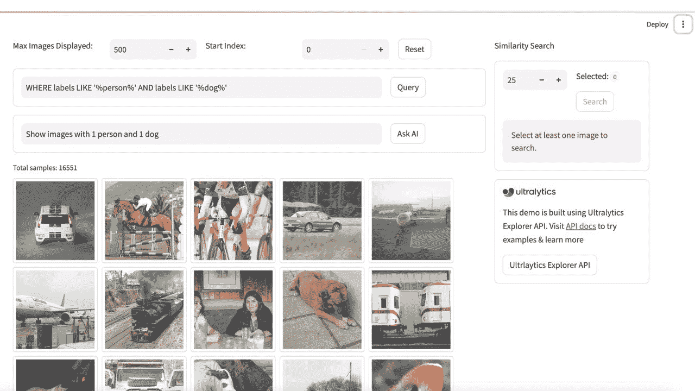

# 数据集概述

> 原文：[`docs.ultralytics.com/datasets/`](https://docs.ultralytics.com/datasets/)

Ultralytics 提供对各种数据集的支持，以促进计算机视觉任务，如检测、实例分割、姿态估计、分类和多对象跟踪。以下是主要的 Ultralytics 数据集列表，随后是每个计算机视觉任务和相应数据集的摘要。

[`www.youtube.com/embed/YDXKa1EljmU`](https://www.youtube.com/embed/YDXKa1EljmU)

**Watch:** Ultralytics 数据集概述

## NEW 🚀 Ultralytics Explorer

为您的数据集创建嵌入，搜索相似图像，运行 SQL 查询，执行语义搜索甚至使用自然语言进行搜索！您可以使用我们的 GUI 应用程序开始或使用 API 构建您自己的应用程序。在这里了解更多信息。



+   尝试 GUI 演示

+   了解更多有关 Explorer API 的信息

## 物体检测

边界框物体检测是一种计算机视觉技术，通过在每个物体周围绘制边界框来检测和定位图像中的物体。

+   Argoverse：一个包含来自城市环境的 3D 跟踪和运动预测数据的数据集，具有丰富的注释信息。

+   COCO：Common Objects in Context (COCO) 是一个大规模物体检测、分割和字幕数据集，包含 80 个物体类别。

+   LVIS：一个大规模物体检测、分割和字幕数据集，包含 1203 个物体类别。

+   COCO8：从 COCO 训练集和验证集中提取的前 4 张图像的较小子集，适用于快速测试。

+   Global Wheat 2020：一个包含小麦穗图像的数据集，用于全球小麦挑战赛 2020。

+   Objects365：一个包含 365 个物体类别和超过 60 万张标注图像的高质量大规模物体检测数据集。

+   OpenImagesV7：由 Google 提供的综合数据集，包括 170 万张训练图像和 42,000 张验证图像。

+   SKU-110K：一个展示零售环境中密集物体检测的数据集，包含超过 11,000 张图像和 170 万个边界框。

+   VisDrone：一个包含来自无人机捕获图像的物体检测和多对象跟踪数据的数据集，包括超过 10,000 张图像和视频序列。

+   VOC：Pascal Visual Object Classes (VOC) 数据集，用于物体检测和分割，包含 20 个物体类别和超过 11,000 张图像。

+   xView：一个用于航拍图像中物体检测的数据集，包含 60 个物体类别和超过 100 万个标注物体。

+   Roboflow 100：一个多样化的物体检测基准数据集，涵盖了七个影像领域的 100 个数据集，用于全面评估模型。

+   Brain-tumor：一个用于检测脑肿瘤的数据集，包括具有关于肿瘤存在、位置和特征的 MRI 或 CT 扫描图像。

+   African-wildlife：一个展示非洲野生动物图像的数据集，包括水牛、大象、犀牛和斑马。

+   Signature：一个展示各种文档图像和标注签名的数据集，支持文档验证和欺诈检测研究。

## 实例分割

实例分割是一种计算机视觉技术，涉及在像素级别识别和定位图像中的对象。

+   COCO：一个大规模数据集，设计用于对象检测、分割和字幕任务，包含超过 200,000 张标记图像。

+   COCO8-seg：用于实例分割任务的较小数据集，包含 8 张带有分割注释的 COCO 图像子集。

+   Crack-seg：专为检测道路和墙壁上裂缝而制作的数据集，适用于目标检测和分割任务。

+   Package-seg：专为仓库或工业环境中识别包裹而设计的数据集，适用于目标检测和分割应用。

+   Carparts-seg：专为识别车辆部件而设计的数据集，适用于设计、制造和研究需求。用于目标检测和分割任务。

## 姿态估计

姿态估计是一种技术，用于确定对象相对于摄像机或世界坐标系的姿态。

+   COCO：一个带有人体姿态注释的大规模数据集，设计用于姿态估计任务。

+   COCO8-pose：用于姿态估计任务的较小数据集，包含 8 张带有人体姿态注释的 COCO 图像子集。

+   Tiger-pose：一个紧凑的数据集，包含 263 张专注于老虎的图像，每只老虎有 12 个关键点用于姿态估计任务。

## 分类

图像分类是一种计算机视觉任务，涉及根据图像的视觉内容将图像分类到一个或多个预定义类别中。

+   Caltech 101：包含 101 种物体类别图像的数据集，用于图像分类任务。

+   Caltech 256：Caltech 101 的扩展版本，包含 256 个物体类别和更具挑战性的图像。

+   CIFAR-10：包含 60,000 张 32x32 像素彩色图像的数据集，分为 10 个类别，每个类别包含 6,000 张图像。

+   CIFAR-100：CIFAR-10 的扩展版本，包含 100 个物体类别和每类 600 张图像。

+   Fashion-MNIST：一个包含 70,000 张灰度图像的数据集，涵盖 10 种时尚类别，用于图像分类任务。

+   ImageNet：一个大规模的数据集，用于对象检测和图像分类，包含超过 1400 万张图像和 20,000 个类别。

+   ImageNet-10：ImageNet 的一个较小子集，包含 10 个类别，用于更快的实验和测试。

+   Imagenette：ImageNet 的一个较小子集，包含 10 个易于区分的类别，用于快速训练和测试。

+   Imagewoof：ImageNet 的一个更具挑战性的子集，包含 10 种狗种类的图像，用于图像分类任务。

+   MNIST：包含 70,000 张手写数字灰度图像的数据集，用于图像分类任务。

## Oriented Bounding Boxes (OBB)

Oriented Bounding Boxes (OBB)：计算机视觉中用于检测图像中角度对象的方法，使用旋转边界框，通常应用于航空和卫星图像。

+   DOTA-v2：一个流行的 OBB 航空影像数据集，包含 1.7 百万个实例和 11,268 张图像。

## 多目标跟踪

多对象跟踪是一种计算机视觉技术，涉及在视频序列中随时间检测和跟踪多个对象。

+   Argoverse：一个数据集，包含来自城市环境的 3D 跟踪和运动预测数据，并带有用于多对象跟踪任务的丰富注释。

+   VisDrone：一个数据集，包含来自无人机拍摄的图像和视频序列的目标检测和多目标跟踪数据，共有超过 10K 张图像。

## 贡献新数据集

贡献新数据集涉及几个步骤，以确保其与现有基础设施对齐。以下是必要的步骤：

### 贡献新数据集的步骤

1.  **收集图像**：收集属于数据集的图像。这些图像可以来自各种来源，如公共数据库或您自己的收藏。

1.  **标注图像**：使用边界框、片段或关键点对这些图像进行标注，具体取决于任务。

1.  **导出注释**：将这些注释转换为 YOLO `*.txt`文件格式，Ultralytics 支持该格式。

1.  **整理数据集**：将数据集整理成正确的文件夹结构。你应该有`train/`和`val/`两个顶级目录，在每个目录中，还应有`images/`和`labels/`子目录。

    ```py
    dataset/
    ├── train/
    │   ├── images/
    │   └── labels/
    └── val/
        ├── images/
        └── labels/ 
    ```

1.  **创建`data.yaml`文件**：在数据集的根目录下，创建一个`data.yaml`文件，描述数据集、类别和其他必要信息。

1.  **优化图像（可选）**：如果您希望减小数据集的大小以进行更高效的处理，可以使用以下代码优化图像。这不是必需的，但建议用于较小的数据集大小和更快的下载速度。

1.  **压缩数据集**：将整个数据集文件夹压缩成一个 zip 文件。

1.  **文档和 PR**：创建描述您的数据集及其如何与现有框架结合的文档页面。然后，提交一个 Pull Request（PR）。有关如何提交 PR 的详细信息，请参阅[Ultralytics 贡献指南](https://docs.ultralytics.com/help/contributing)。

### 优化和压缩数据集的示例代码

优化和压缩数据集

```py
from pathlib import Path

from ultralytics.data.utils import compress_one_image
from ultralytics.utils.downloads import zip_directory

# Define dataset directory
path = Path("path/to/dataset")

# Optimize images in dataset (optional)
for f in path.rglob("*.jpg"):
    compress_one_image(f)

# Zip dataset into 'path/to/dataset.zip'
zip_directory(path) 
```

遵循这些步骤，您可以贡献一个新的数据集，使其与 Ultralytics 的现有结构很好地整合。

## 常见问题解答

### Ultralytics 支持哪些用于目标检测的数据集？

Ultralytics 支持各种用于目标检测的数据集，包括：

这些数据集有助于为各种目标检测应用程序训练稳健的模型。

### 我如何向 Ultralytics 贡献新数据集？

贡献新数据集涉及几个步骤： 1\. **收集图像**：从公共数据库或个人收藏中收集图像。 2\. **标注图像**：根据任务应用边界框、分割或关键点。 3\. **导出标注**：将标注转换为 YOLO `*.txt` 格式。 4\. **组织数据集**：使用包含 `train/` 和 `val/` 子目录的文件夹结构，每个子目录包含 `images/` 和 `labels/` 子目录。 5\. **创建 `data.yaml` 文件**：包括数据集描述、类别和其他相关信息。 6\. **优化图像（可选）**：为提高效率减少数据集大小。 7\. **压缩数据集**：将数据集压缩为 zip 文件。 8\. **文档和 PR**：描述您的数据集并按照[Ultralytics 贡献指南](https://docs.ultralytics.com/help/contributing)提交 Pull Request。

访问《贡献新数据集》获取全面指南。

### 为什么我应该使用 Ultralytics Explorer 处理我的数据集？

Ultralytics Explorer 提供强大的数据集分析功能，包括： - **嵌入生成**：为图像创建向量嵌入。 - **语义搜索**：使用嵌入或人工智能搜索相似图像。 - **SQL 查询**：运行高级 SQL 查询进行详细数据分析。 - **自然语言搜索**：使用简单语言查询以便使用。

探索 Ultralytics Explorer 以获取更多信息并尝试 GUI 演示。

### Ultralytics YOLO 模型在计算机视觉中有哪些独特特性？

Ultralytics YOLO 模型提供几个独特特性： - **实时性能**：高速推理和训练。 - **多功能性**：适用于检测、分割、分类和姿态估计任务。 - **预训练模型**：访问高性能的预训练模型，适用于各种应用。 - **广泛的社区支持**：活跃的社区和全面的文档，用于故障排除和开发。

在[Ultralytics YOLO](https://www.ultralytics.com/yolo)页面了解更多。

### 我如何使用 Ultralytics 工具优化和压缩数据集？

要使用 Ultralytics 工具优化和压缩数据集，请参考以下示例代码：

优化和压缩数据集

```py
from pathlib import Path

from ultralytics.data.utils import compress_one_image
from ultralytics.utils.downloads import zip_directory

# Define dataset directory
path = Path("path/to/dataset")

# Optimize images in dataset (optional)
for f in path.rglob("*.jpg"):
    compress_one_image(f)

# Zip dataset into 'path/to/dataset.zip'
zip_directory(path) 
```

了解如何优化和压缩数据集。
