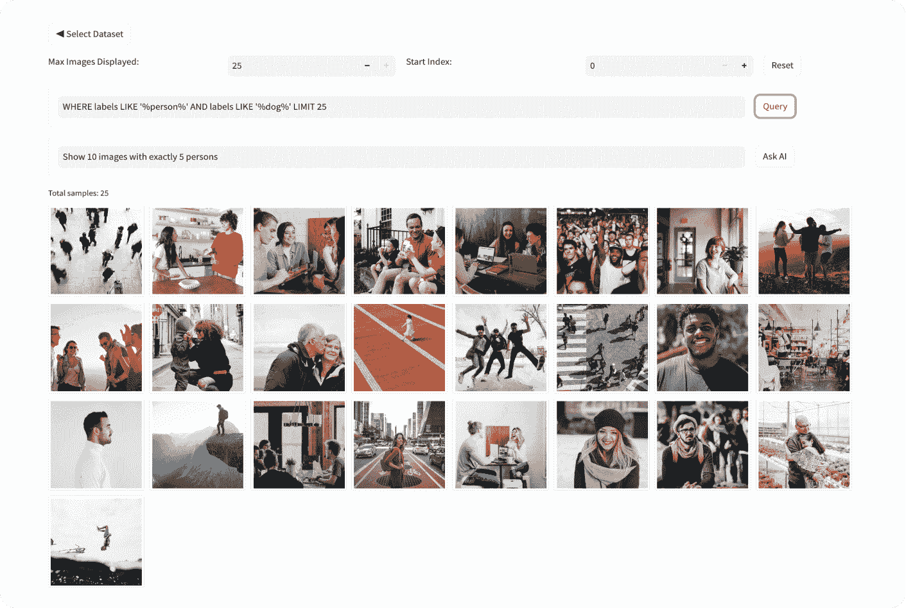
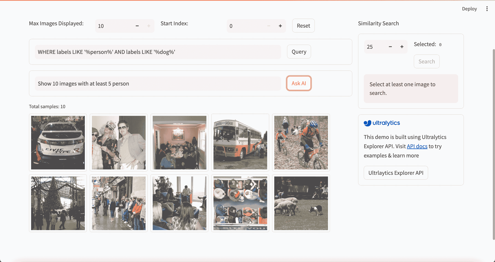

# Ultralytics Explorer

> 原文：[`docs.ultralytics.com/datasets/explorer/`](https://docs.ultralytics.com/datasets/explorer/)



 Ultralytics Explorer 是一个用于使用语义搜索、SQL 查询、向量相似性搜索甚至自然语言探索 CV 数据集的工具。它也是一个 Python API，用于访问相同的功能。

[`www.youtube.com/embed/3VryynorQeo`](https://www.youtube.com/embed/3VryynorQeo)

**观看:** Ultralytics Explorer API | 语义搜索，SQL 查询和 Ask AI 功能

### 可选依赖项的安装

Explorer 依赖于某些功能的外部库。这些库在使用时会自动安装。要手动安装这些依赖项，请使用以下命令：

```py
`pip  install  ultralytics[explorer]` 
```

提示

Explorer 在嵌入/语义搜索和 SQL 查询方面运作，并由[LanceDB](https://lancedb.com/) 无服务器向量数据库提供支持。与传统的内存数据库不同，它在磁盘上持久保存，而不会影响性能，因此您可以在本地扩展到像 COCO 这样的大型数据集而不会耗尽内存。

### Explorer API

这是一个用于探索数据集的 Python API。它还支持 GUI 资源管理器。您可以使用它来创建自己的探索性笔记本或脚本，以深入了解您的数据集。

在这里了解更多有关 Explorer API 的信息。

## GUI 资源管理器使用说明

GUI 演示在您的浏览器中运行，允许您为数据集创建嵌入并搜索相似图像，运行 SQL 查询和执行语义搜索。可以使用以下命令运行：

```py
`yolo  explorer` 
```

注意

Ask AI 功能使用 OpenAI，因此在首次运行 GUI 时，您将被提示设置 OpenAI 的 API 密钥。您可以像这样设置它 - `yolo settings openai_api_key="..."`



## 常见问题解答

### 什么是 Ultralytics Explorer，它如何帮助 CV 数据集？

Ultralytics Explorer 是一个强大的工具，专为通过语义搜索、SQL 查询、向量相似性搜索甚至自然语言来探索计算机视觉（CV）数据集而设计。这个多功能工具提供了 GUI 和 Python API，允许用户与其数据集无缝交互。通过利用像 LanceDB 这样的技术，Ultralytics Explorer 确保了对大型数据集的高效可扩展访问，而不会出现过多的内存使用。无论您是进行详细的数据集分析还是探索数据模式，Ultralytics Explorer 都简化了整个过程。

了解更多关于 Explorer API 的信息。

### 我如何安装 Ultralytics Explorer 的依赖项？

要手动安装 Ultralytics Explorer 所需的可选依赖项，您可以使用以下`pip`命令：

```py
`pip  install  ultralytics[explorer]` 
```

这些依赖项对语义搜索和 SQL 查询的完整功能至关重要。通过包含由[LanceDB](https://lancedb.com/)支持的库，安装确保数据库操作保持高效和可扩展性，即使处理像 COCO 这样的大型数据集。

### 我如何使用 Ultralytics Explorer 的 GUI 版本？

使用 Ultralytics Explorer 的 GUI 版本非常简单。安装必要的依赖项后，您可以使用以下命令启动 GUI：

```py
`yolo  explorer` 
```

GUI 提供了一个用户友好的界面，用于创建数据集嵌入、搜索相似图像、运行 SQL 查询和进行语义搜索。此外，与 OpenAI 的 Ask AI 功能集成使您能够使用自然语言查询数据集，增强了灵活性和易用性。

对于存储和可扩展性信息，请查看我们的安装说明。

### Ultralytics Explorer 中的 Ask AI 功能是什么？

Ultralytics Explorer 中的 Ask AI 功能允许用户使用自然语言查询与其数据集进行交互。通过 OpenAI 提供支持，此功能使您能够提出复杂问题并获得深刻见解，而无需编写 SQL 查询或类似命令。要使用此功能，您需要在第一次运行 GUI 时设置您的 OpenAI API 密钥：

```py
`yolo  settings  openai_api_key="YOUR_API_KEY"` 
```

欲了解更多此功能及其集成方法，请参阅我们的 GUI Explorer 使用部分。

### 我可以在 Google Colab 中运行 Ultralytics Explorer 吗？

是的，Ultralytics Explorer 可以在 Google Colab 中运行，为数据集探索提供了方便而强大的环境。您可以通过打开提供的 Colab 笔记本来开始，该笔记本已预先配置了所有必要的设置：


这个设置允许您充分探索数据集，充分利用 Google 的云资源。在我们的 Google Colab 指南中了解更多。
