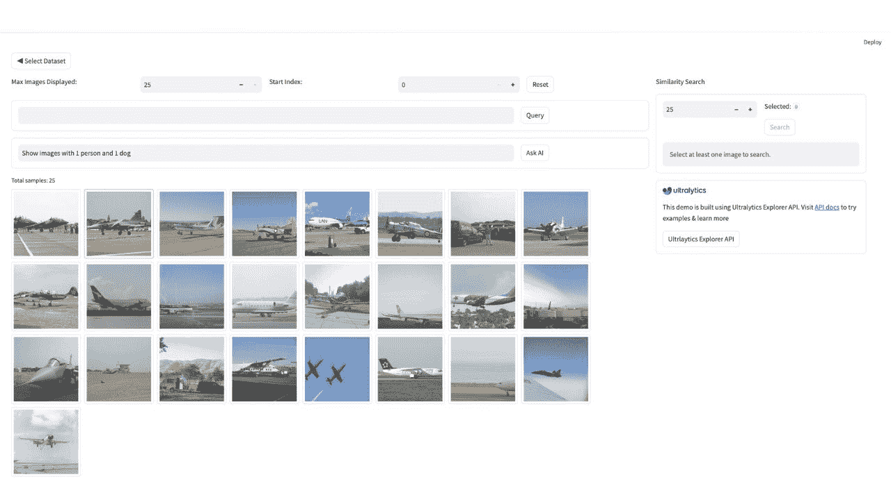
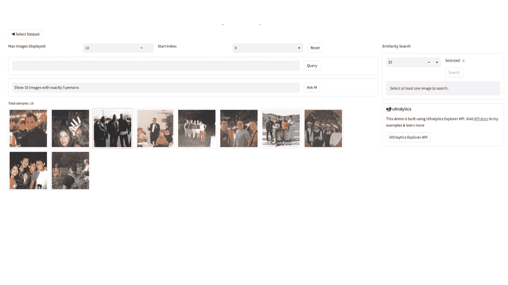
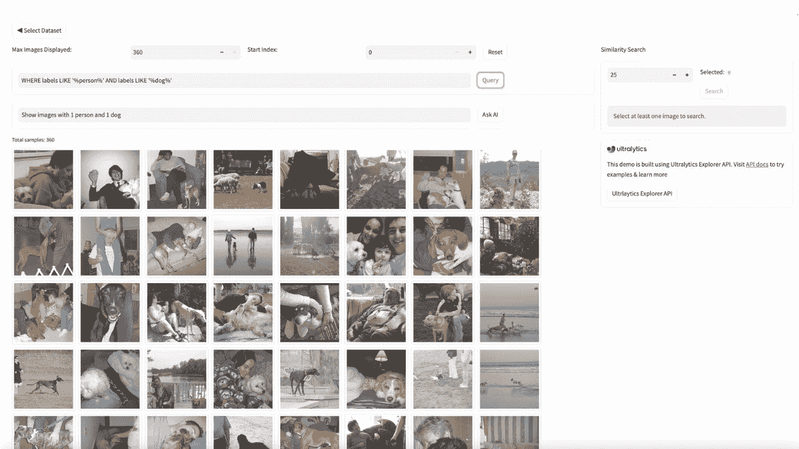

# Explorer GUI

> 原文：[`docs.ultralytics.com/datasets/explorer/dashboard/`](https://docs.ultralytics.com/datasets/explorer/dashboard/)

Explorer GUI 就像一个使用 Ultralytics Explorer API 构建的游乐场。它允许你运行语义/向量相似性搜索、SQL 查询，甚至使用我们的 AI 询问功能通过自然语言进行搜索，这一切都由 LLMs 提供支持。


[`www.youtube.com/embed/3VryynorQeo?start=306`](https://www.youtube.com/embed/3VryynorQeo?start=306)

**观看：** Ultralytics Explorer 仪表板概述

### 安装

```py
`pip  install  ultralytics[explorer]` 
```

注意

询问 AI 功能使用 OpenAI，因此在你第一次运行 GUI 时，会提示你设置 OpenAI 的 API 密钥。你可以这样设置 - `yolo settings openai_api_key="..."`

## 向量语义相似性搜索

语义搜索是一种查找与给定图像相似图像的技术。它基于相似图像将具有相似嵌入的想法。在用户界面中，你可以选择一张或多张图像，并搜索与它们相似的图像。当你想找到与给定图像或一组表现不如预期的图像相似的图像时，这将非常有用。

例如：在这个 VOC 探索仪表板中，用户选择了几张飞机图像，如下所示：


在执行相似性搜索时，你应该会看到类似的结果：



## 询问 AI

这允许你使用自然语言编写如何过滤数据集的方式。你不必精通 SQL 查询的编写。我们的 AI 驱动的查询生成器将在后台自动完成。例如 - 你可以说 - “给我展示 100 张恰好有一个人和 2 只狗的图像。也可以有其他物体。”它会在内部生成查询并向你展示这些结果。当被要求“展示 10 张恰好有 5 个人的图像”时，你会看到这样的结果：



注意：这在后台使用 LLMs，因此结果是概率性的，有时可能会出错。

## 在你的 CV 数据集上运行 SQL 查询

你可以在数据集上运行 SQL 查询以进行过滤。如果只提供 WHERE 子句，它也能正常工作。示例 SQL 查询将仅显示至少包含 1 个人和 1 只狗的图像：

```py
`WHERE  labels  LIKE  '%person%'  AND  labels  LIKE  '%dog%'` 
```



这是一个使用 Explorer API 构建的演示版本。你可以使用该 API 构建自己的探索性笔记本或脚本，以获取对数据集的洞察。了解更多关于 Explorer API 的信息。

## 常见问题解答

### 什么是 Ultralytics Explorer GUI，如何安装它？

Ultralytics Explorer GUI 是一个强大的界面，通过 Ultralytics Explorer API 解锁先进的数据探索能力。它允许你运行语义/向量相似性搜索、SQL 查询，并使用由大型语言模型（LLMs）提供支持的 Ask AI 功能进行自然语言查询。

要安装 Explorer GUI，您可以使用 pip：

```py
`pip  install  ultralytics[explorer]` 
```

注意：要使用由大型语言模型（LLMs）提供支持的 Ask AI 功能，您需要设置 OpenAI API 密钥：`yolo settings openai_api_key="..."`。

### Ultralytics Explorer GUI 中的语义搜索功能是如何工作的？

Ultralytics Explorer GUI 中的语义搜索功能允许你根据它们的嵌入向量找到与给定图像相似的图像。这种技术对于识别和探索视觉相似的图像非常有用。要使用此功能，在界面中选择一个或多个图像，然后执行搜索相似图像的操作。结果将显示与所选图像紧密相似的图像，有助于进行高效的数据集探索和异常检测。

通过访问功能概述部分了解更多关于语义搜索和其他功能的信息。

### 我可以在 Ultralytics Explorer GUI 中使用自然语言来过滤数据集吗？

是的，借助由大型语言模型（LLMs）提供支持的 Ask AI 功能，您可以使用自然语言查询来过滤数据集，无需精通 SQL。例如，您可以询问“显示 100 张只有一个人和两只狗的图像。还可以有其他对象”，AI 将在背后生成适当的查询以提供所需的结果。

在这里看一个自然语言查询的示例。

### 我如何在 Ultralytics Explorer GUI 上运行 SQL 查询来处理数据集？

Ultralytics Explorer GUI 允许你直接在数据集上运行 SQL 查询，以便高效地过滤和管理数据。要运行查询，导航到 GUI 中的 SQL 查询部分，并编写你的查询。例如，要显示至少有一个人和一只狗的图像，你可以使用：

```py
`WHERE  labels  LIKE  '%person%'  AND  labels  LIKE  '%dog%'` 
```

你也可以仅提供 WHERE 子句，使查询过程更加灵活。

欲了解更多详情，请参阅 SQL 查询部分。

### 使用 Ultralytics Explorer GUI 进行数据探索的好处是什么？

Ultralytics Explorer GUI 通过语义搜索、SQL 查询和通过 Ask AI 功能进行的自然语言交互增强了数据探索功能。这些能力允许用户： - 高效地查找视觉上相似的图像。 - 使用复杂的 SQL 查询过滤数据集。 - 利用 AI 进行自然语言搜索，无需高级 SQL 技能。

这些功能使它成为开发人员、研究人员和数据科学家的多功能工具，帮助他们更深入地了解他们的数据集。

了解更多关于 Explorer GUI 文档中这些功能的信息。
