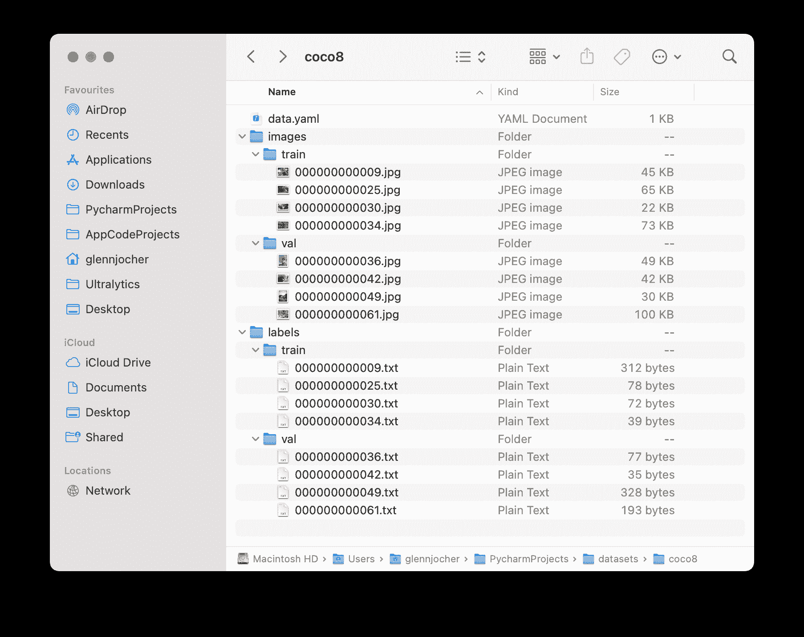

# 对象检测数据集概述

> 原文：[`docs.ultralytics.com/datasets/detect/`](https://docs.ultralytics.com/datasets/detect/)

训练强大而准确的对象检测模型需要一个全面的数据集。本指南介绍了与 Ultralytics YOLO 模型兼容的各种数据集格式，以及它们的结构、用法以及如何在不同格式之间转换的见解。

## 支持的数据集格式

### Ultralytics YOLO 格式

Ultralytics YOLO 格式是一种数据集配置格式，允许您定义数据集根目录、与训练/验证/测试图像目录或包含图像路径的`*.txt`文件的相对路径，以及一个类名字典。以下是一个示例：

```py
`# Train/val/test sets as 1) dir: path/to/imgs, 2) file: path/to/imgs.txt, or 3) list: [path/to/imgs1, path/to/imgs2, ..] path:  ../datasets/coco8  # dataset root dir train:  images/train  # train images (relative to 'path') 4 images val:  images/val  # val images (relative to 'path') 4 images test:  # test images (optional)  # Classes (80 COCO classes) names:   0:  person   1:  bicycle   2:  car   # ...   77:  teddy bear   78:  hair drier   79:  toothbrush` 
```

此格式的标签应导出为 YOLO 格式，每个图像一个`*.txt`文件。如果图像中没有物体，则不需要`*.txt`文件。`*.txt`文件应按`class x_center y_center width height`格式进行格式化。框坐标必须采用**归一化 xywh**格式（从 0 到 1）。如果您的框以像素表示，应将`x_center`和`width`除以图像宽度，将`y_center`和`height`除以图像高度。类号应从零开始索引。


对应上述图像的标签文件包含 2 个人（类`0`）和一条领带（类`27`）：


在使用 Ultralytics YOLO 格式时，应按照下面 COCO8 数据集示例所示组织您的训练和验证图像及标签。



## 用法

下面是如何使用这些格式来训练您的模型：

示例

```py
`from ultralytics import YOLO  # Load a model model = YOLO("yolov8n.pt")  # load a pretrained model (recommended for training)  # Train the model results = model.train(data="coco8.yaml", epochs=100, imgsz=640)` 
```

```py
`# Start training from a pretrained *.pt model yolo  detect  train  data=coco8.yaml  model=yolov8n.pt  epochs=100  imgsz=640` 
```

## 支持的数据集

下面是支持的数据集列表及每个数据集的简要描述：

+   Argoverse：一个包含来自城市环境的 3D 跟踪和运动预测数据的数据集，具有丰富的注释。

+   COCO：Common Objects in Context（COCO）是一个包含 80 个对象类别的大规模对象检测、分割和字幕数据集。

+   LVIS：一个包含 1203 个对象类别的大规模对象检测、分割和字幕数据集。

+   COCO8：COCO 训练集和 COCO 验证集中的前 4 张图像的较小子集，适合快速测试。

+   Global Wheat 2020：一个包含小麦头图像的数据集，用于全球小麦挑战 2020。

+   Objects365：一个高质量的大规模对象检测数据集，包含 365 个对象类别和超过 60 万个标记图像。

+   OpenImagesV7：由 Google 提供的全面数据集，包含 170 万训练图像和 42000 个验证图像。

+   SKU-110K：一个在零售环境中进行密集对象检测的数据集，包含超过 1.1 万张图像和 170 万个边界框。

+   VisDrone：一个包含来自无人机捕获图像的对象检测和多对象跟踪数据的数据集，包括超过 1 万张图像和视频序列。

+   VOC：Pascal 视觉对象类数据集（VOC），用于对象检测和分割，包含 20 个对象类别和超过 11K 张图像。

+   xView：用于航拍图像中对象检测的数据集，包含 60 个对象类别和超过 100 万个注释对象。

+   Roboflow 100：一个包括七个图像领域的 100 个数据集的多样化目标检测基准，用于全面评估模型。

+   Brain-tumor：一个用于检测脑肿瘤的数据集，包括 MRI 或 CT 扫描图像，并提供有关肿瘤出现、位置和特征的详细信息。

+   African-wildlife：一个展示非洲野生动物图像的数据集，包括水牛、大象、犀牛和斑马。

+   Signature：一个展示各种文件中带有标注签名的图像的数据集，支持文件验证和欺诈检测研究。

### 添加您自己的数据集

如果您有自己的数据集并希望使用它来训练使用 Ultralytics YOLO 格式的检测模型，请确保它遵循上述“Ultralytics YOLO 格式”中指定的格式。将您的注释转换为所需的格式，并在 YAML 配置文件中指定路径、类别数和类名。

## Port or Convert Label Formats

### COCO 数据集格式到 YOLO 格式

您可以使用以下代码片段轻松将标签从流行的 COCO 数据集格式转换为 YOLO 格式：

示例

```py
`from ultralytics.data.converter import convert_coco  convert_coco(labels_dir="path/to/coco/annotations/")` 
```

此转换工具可用于将 COCO 数据集或任何符合 COCO 格式的数据集转换为 Ultralytics YOLO 格式。

请记得仔细检查所需使用的数据集是否与您的模型兼容，并遵循必要的格式约定。正确格式化的数据集对于成功训练对象检测模型至关重要。

## 常见问题解答

### 什么是 Ultralytics YOLO 数据集格式以及如何结构化它？

Ultralytics YOLO 格式是定义训练项目中数据集结构的结构化配置。它涉及设置训练、验证和测试图像及其相应标签的路径。例如：

```py
`path:  ../datasets/coco8  # dataset root directory train:  images/train  # training images (relative to 'path') val:  images/val  # validation images (relative to 'path') test:  # optional test images names:   0:  person   1:  bicycle   2:  car   # ...` 
```

标签保存在以 `*.txt` 格式保存的文件中，每个图像一个文件，格式为 `class x_center y_center width height`，使用标准化的坐标。如需详细指南，请参阅 COCO8 数据集示例。

### 如何将 COCO 数据集转换为 YOLO 格式？

您可以使用 Ultralytics 转换工具将 COCO 数据集转换为 YOLO 格式。以下是一个快速方法：

```py
`from ultralytics.data.converter import convert_coco  convert_coco(labels_dir="path/to/coco/annotations/")` 
```

这段代码将会把你的 COCO 标注转换成 YOLO 格式，从而实现与 Ultralytics YOLO 模型的无缝集成。有关详细信息，请访问 Port or Convert Label Formats 部分。

### Ultralytics YOLO 为对象检测支持哪些数据集？

Ultralytics YOLO 支持广泛的数据集，包括：

+   Argoverse

+   COCO

+   LVIS

+   COCO8

+   Global Wheat 2020

+   Objects365

+   OpenImagesV7

每个数据集页面提供了针对高效 YOLOv8 训练量身定制的结构和使用详细信息。在支持的数据集部分查看完整列表。

### 如何开始使用我的数据集训练 YOLOv8 模型？

要开始训练 YOLOv8 模型，请确保数据集格式正确，并在 YAML 文件中定义路径。使用以下脚本开始训练：

示例

```py
`from ultralytics import YOLO  model = YOLO("yolov8n.pt")  # Load a pretrained model results = model.train(data="path/to/your_dataset.yaml", epochs=100, imgsz=640)` 
```

```py
`yolo  detect  train  data=path/to/your_dataset.yaml  model=yolov8n.pt  epochs=100  imgsz=640` 
```

参考使用部分，了解如何使用不同的模式，包括 CLI 命令的详细信息。

### 我在哪里可以找到使用 Ultralytics YOLO 进行物体检测的实际示例？

Ultralytics 提供了许多示例和实用指南，展示了在各种应用中使用 YOLOv8 的方法。要全面了解，请访问[Ultralytics Blog](https://www.ultralytics.com/blog)，那里有案例研究、详细教程和社区故事，展示了使用 YOLOv8 进行物体检测、分割等。要查看具体示例，请查看文档中的使用部分。
