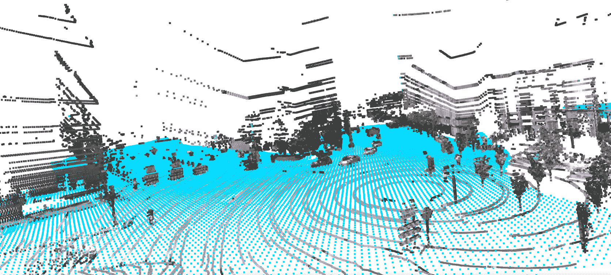

# Argoverse 数据集

> 原文：[`docs.ultralytics.com/datasets/detect/argoverse/`](https://docs.ultralytics.com/datasets/detect/argoverse/)

[Argoverse](https://www.argoverse.org/)数据集是由 Argo AI 开发的数据集，旨在支持自动驾驶任务的研究，如 3D 跟踪、运动预测和立体深度估计。该数据集提供多种高质量传感器数据，包括高分辨率图像、LiDAR 点云和地图数据。

注意

由于福特关闭 Argo AI 后，用于训练的 Argoverse 数据集`*.zip`文件已从 Amazon S3 中删除，但我们已在[Google Drive](https://drive.google.com/file/d/1st9qW3BeIwQsnR0t8mRpvbsSWIo16ACi/view?usp=drive_link)上提供手动下载。

## 主要特性

+   Argoverse 包含超过 290K 个标记的 3D 对象轨迹和 1263 个不同场景中的 500 万个对象实例。

+   数据集包括高分辨率相机图像、LiDAR 点云和丰富的 HD 地图标注。

+   标注包括对象的 3D 边界框、对象轨迹和轨迹信息。

+   Argoverse 为不同任务提供多个子集，如 3D 跟踪、运动预测和立体深度估计。

## 数据集结构

Argoverse 数据集分为三个主要子集：

1.  **Argoverse 3D 跟踪**：该子集包含 113 个场景，超过 290K 个标记的 3D 对象轨迹，专注于 3D 对象跟踪任务。包括 LiDAR 点云、相机图像和传感器校准信息。

1.  **Argoverse 运动预测**：该子集包含来自 60 小时驾驶数据的 324K 车辆轨迹，适用于运动预测任务。

1.  **Argoverse 立体深度估计**：该子集专为立体深度估计任务设计，包括超过 10K 个立体图像对及相应的 LiDAR 点云，用于地面真实深度估计。

## 应用

Argoverse 数据集广泛用于训练和评估深度学习模型，用于自动驾驶任务，如 3D 对象跟踪、运动预测和立体深度估计。该数据集多样的传感器数据、对象标注和地图信息使其成为自动驾驶领域研究人员和从业者的宝贵资源。

## 数据集 YAML

使用 YAML（又一种标记语言）文件来定义数据集配置。它包含关于数据集路径、类别和其他相关信息。对于 Argoverse 数据集，`Argoverse.yaml`文件维护在[`github.com/ultralytics/ultralytics/blob/main/ultralytics/cfg/datasets/Argoverse.yaml`](https://github.com/ultralytics/ultralytics/blob/main/ultralytics/cfg/datasets/Argoverse.yaml)。

ultralytics/cfg/datasets/Argoverse.yaml

```py
`# Ultralytics YOLO 🚀, AGPL-3.0 license # Argoverse-HD dataset (ring-front-center camera) https://www.cs.cmu.edu/~mengtial/proj/streaming/ by Argo AI # Documentation: https://docs.ultralytics.com/datasets/detect/argoverse/ # Example usage: yolo train data=Argoverse.yaml # parent # ├── ultralytics # └── datasets #     └── Argoverse  ← downloads here (31.5 GB)  # Train/val/test sets as 1) dir: path/to/imgs, 2) file: path/to/imgs.txt, or 3) list: [path/to/imgs1, path/to/imgs2, ..] path:  ../datasets/Argoverse  # dataset root dir train:  Argoverse-1.1/images/train/  # train images (relative to 'path') 39384 images val:  Argoverse-1.1/images/val/  # val images (relative to 'path') 15062 images test:  Argoverse-1.1/images/test/  # test images (optional) https://eval.ai/web/challenges/challenge-page/800/overview  # Classes names:   0:  person   1:  bicycle   2:  car   3:  motorcycle   4:  bus   5:  truck   6:  traffic_light   7:  stop_sign  # Download script/URL (optional) --------------------------------------------------------------------------------------- download:  |   import json   from tqdm import tqdm   from ultralytics.utils.downloads import download   from pathlib import Path    def argoverse2yolo(set):   labels = {}   a = json.load(open(set, "rb"))   for annot in tqdm(a['annotations'], desc=f"Converting {set} to YOLOv5 format..."):   img_id = annot['image_id']   img_name = a['images'][img_id]['name']   img_label_name = f'{img_name[:-3]}txt'    cls = annot['category_id']  # instance class id   x_center, y_center, width, height = annot['bbox']   x_center = (x_center + width / 2) / 1920.0  # offset and scale   y_center = (y_center + height / 2) / 1200.0  # offset and scale   width /= 1920.0  # scale   height /= 1200.0  # scale    img_dir = set.parents[2] / 'Argoverse-1.1' / 'labels' / a['seq_dirs'][a['images'][annot['image_id']]['sid']]   if not img_dir.exists():   img_dir.mkdir(parents=True, exist_ok=True)    k = str(img_dir / img_label_name)   if k not in labels:   labels[k] = []   labels[k].append(f"{cls} {x_center} {y_center} {width} {height}\n")    for k in labels:   with open(k, "w") as f:   f.writelines(labels[k])     # Download 'https://argoverse-hd.s3.us-east-2.amazonaws.com/Argoverse-HD-Full.zip' (deprecated S3 link)   dir = Path(yaml['path'])  # dataset root dir   urls = ['https://drive.google.com/file/d/1st9qW3BeIwQsnR0t8mRpvbsSWIo16ACi/view?usp=drive_link']   print("\n\nWARNING: Argoverse dataset MUST be downloaded manually, autodownload will NOT work.")   print(f"WARNING: Manually download Argoverse dataset '{urls[0]}' to '{dir}' and re-run your command.\n\n")   # download(urls, dir=dir)    # Convert   annotations_dir = 'Argoverse-HD/annotations/'   (dir / 'Argoverse-1.1' / 'tracking').rename(dir / 'Argoverse-1.1' / 'images')  # rename 'tracking' to 'images'   for d in "train.json", "val.json":   argoverse2yolo(dir / annotations_dir / d)  # convert Argoverse annotations to YOLO labels` 
```

## 使用方法

要在 Argoverse 数据集上使用 YOLOv8n 模型进行 100 个 epoch 的训练，图像大小为 640，请使用以下代码片段。有关可用参数的全面列表，请参阅模型训练页面。

训练示例

```py
`from ultralytics import YOLO  # Load a model model = YOLO("yolov8n.pt")  # load a pretrained model (recommended for training)  # Train the model results = model.train(data="Argoverse.yaml", epochs=100, imgsz=640)` 
```

```py
`# Start training from a pretrained *.pt model yolo  detect  train  data=Argoverse.yaml  model=yolov8n.pt  epochs=100  imgsz=640` 
```

## 样本数据和注释

Argoverse 数据集包含各种传感器数据，包括摄像头图像、LiDAR 点云和高清地图信息，为自动驾驶任务提供丰富的背景信息。以下是数据集中的一些示例数据及其对应的注释：



+   **Argoverse 3D 跟踪**：此图展示了 3D 物体跟踪的示例，物体用 3D 边界框进行了注释。数据集提供 LiDAR 点云和摄像头图像，以促进为此任务开发模型。

该示例展示了 Argoverse 数据集中数据的多样性和复杂性，并突显了高质量传感器数据在自动驾驶任务中的重要性。

## 引用和致谢

如果您在研究或开发工作中使用 Argoverse 数据集，请引用以下论文：

```py
`@inproceedings{chang2019argoverse,   title={Argoverse: 3D Tracking and Forecasting with Rich Maps},   author={Chang, Ming-Fang and Lambert, John and Sangkloy, Patsorn and Singh, Jagjeet and Bak, Slawomir and Hartnett, Andrew and Wang, Dequan and Carr, Peter and Lucey, Simon and Ramanan, Deva and others},   booktitle={Proceedings of the IEEE/CVF Conference on Computer Vision and Pattern Recognition},   pages={8748--8757},   year={2019} }` 
```

我们要感谢 Argo AI 创建和维护 Argoverse 数据集，作为自动驾驶研究社区的宝贵资源。有关 Argoverse 数据集及其创建者的更多信息，请访问[Argoverse 数据集网站](https://www.argoverse.org/)。

## 常见问题解答

### 什么是 Argoverse 数据集及其主要特点？

由 Argo AI 开发的[Argoverse](https://www.argoverse.org/)数据集支持自动驾驶研究。它包括超过 290K 个标记的 3D 物体轨迹和 1,263 个独特场景中的 5 百万个物体实例。数据集提供高分辨率摄像头图像、LiDAR 点云和标记的高清地图，对于 3D 跟踪、运动预测和立体深度估计等任务非常有价值。

### 如何使用 Argoverse 数据集训练 Ultralytics YOLO 模型？

要使用 Argoverse 数据集训练 YOLOv8 模型，请使用提供的 YAML 配置文件和以下代码：

训练示例

```py
`from ultralytics import YOLO  # Load a model model = YOLO("yolov8n.pt")  # load a pretrained model (recommended for training)  # Train the model results = model.train(data="Argoverse.yaml", epochs=100, imgsz=640)` 
```

```py
`# Start training from a pretrained *.pt model yolo  detect  train  data=Argoverse.yaml  model=yolov8n.pt  epochs=100  imgsz=640` 
```

有关参数详细说明，请参考模型训练页面。

### Argoverse 数据集中提供了哪些数据类型和注释？

Argoverse 数据集包括各种传感器数据类型，如高分辨率摄像头图像、LiDAR 点云和高清地图数据。注释包括 3D 边界框、物体轨迹和轨迹信息。这些全面的注释对于准确地在 3D 物体跟踪、运动预测和立体深度估计等任务中进行模型训练至关重要。

### Argoverse 数据集的结构是如何的？

数据集分为三个主要子集：

1.  **Argoverse 3D 跟踪**：包括 113 个场景，超过 290K 个标记的 3D 物体轨迹，重点关注 3D 物体跟踪任务。它包括 LiDAR 点云、摄像头图像和传感器校准信息。

1.  **Argoverse 运动预测**：包括从 60 小时驾驶数据中收集的 324K 车辆轨迹，适用于运动预测任务。

1.  **Argoverse 立体深度估计**：包含超过 10K 对立体图像和相应的 LiDAR 点云，用于地面真实深度估计。

### Argoverse 数据集已从 Amazon S3 中移除，我现在从哪里可以下载？

之前在 Amazon S3 上可用的 Argoverse 数据集`*.zip`文件现在可以从[Google Drive](https://drive.google.com/file/d/1st9qW3BeIwQsnR0t8mRpvbsSWIo16ACi/view?usp=drive_link)手动下载。

### Argoverse 数据集中的 YAML 配置文件用于什么目的？

一个 YAML 文件包含数据集的路径、类别和其他重要信息。对于 Argoverse 数据集，配置文件`Argoverse.yaml`可以在以下链接找到：[Argoverse.yaml](https://github.com/ultralytics/ultralytics/blob/main/ultralytics/cfg/datasets/Argoverse.yaml)。

欲了解有关 YAML 配置的更多信息，请参阅我们的数据集指南。
