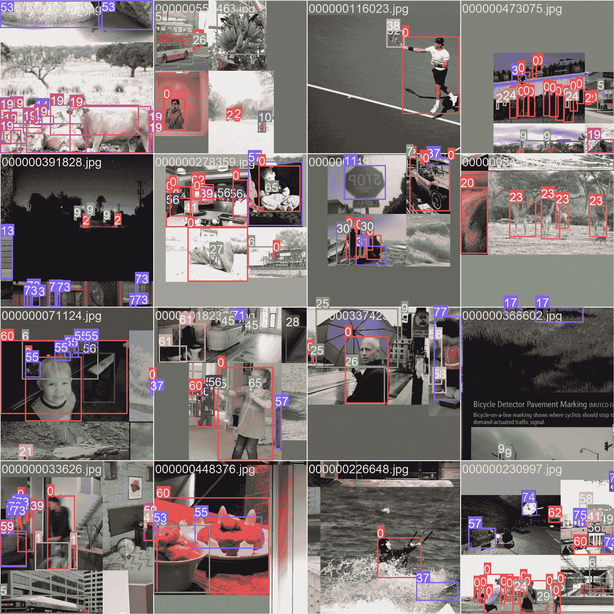

# COCO 数据集

> 原文：[`docs.ultralytics.com/datasets/detect/coco/`](https://docs.ultralytics.com/datasets/detect/coco/)

[COCO](https://cocodataset.org/#home)（上下文中的常见对象）数据集是一个大规模对象检测、分割和字幕数据集。它旨在鼓励研究各种对象类别，并且通常用于计算机视觉模型的基准测试。对于从事对象检测、分割和姿态估计任务的研究人员和开发人员来说，它是一个必不可少的数据集。

[`www.youtube.com/embed/uDrn9QZJ2lk`](https://www.youtube.com/embed/uDrn9QZJ2lk)

**Watch:** Ultralytics COCO 数据集概述

## COCO 预训练模型

| 模型 | 尺寸 ^((像素)) | mAP^(val 50-95) | 速度 ^(CPU ONNX

(ms)) | 速度 ^(A100 TensorRT

(ms)) | params ^((M)) | FLOPs ^((B)) |

| --- | --- | --- | --- | --- | --- | --- |
| --- | --- | --- | --- | --- | --- | --- |
| [YOLOv8n](https://github.com/ultralytics/assets/releases/download/v8.2.0/yolov8n.pt) | 640 | 37.3 | 80.4 | 0.99 | 3.2 | 8.7 |
| [YOLOv8s](https://github.com/ultralytics/assets/releases/download/v8.2.0/yolov8s.pt) | 640 | 44.9 | 128.4 | 1.20 | 11.2 | 28.6 |
| [YOLOv8m](https://github.com/ultralytics/assets/releases/download/v8.2.0/yolov8m.pt) | 640 | 50.2 | 234.7 | 1.83 | 25.9 | 78.9 |
| [YOLOv8l](https://github.com/ultralytics/assets/releases/download/v8.2.0/yolov8l.pt) | 640 | 52.9 | 375.2 | 2.39 | 43.7 | 165.2 |
| [YOLOv8x](https://github.com/ultralytics/assets/releases/download/v8.2.0/yolov8x.pt) | 640 | 53.9 | 479.1 | 3.53 | 68.2 | 257.8 |

## 主要特点

+   COCO 包含 330K 张图像，其中 200K 张图像具有对象检测、分割和字幕任务的注释。

+   数据集包括 80 个对象类别，包括常见对象如汽车、自行车和动物，以及更具体的类别，如雨伞、手提包和运动设备。

+   注释包括每个图像的对象边界框、分割蒙版和字幕。

+   COCO 提供了标准化的评估指标，如对象检测的平均精度（mAP）和分割任务的平均召回率（mAR），适合于比较模型性能。

## 数据集结构

COCO 数据集分为三个子集：

1.  **Train2017**: 这个子集包含 118K 张用于训练对象检测、分割和字幕模型的图像。

1.  **Val2017**: 这个子集包含用于模型训练验证目的的 5K 张图像。

1.  **Test2017**: 这个子集包含用于测试和基准测试训练模型的 20K 张图像。该子集的地面实况标注并未公开，结果将提交至[COCO 评估服务器](https://codalab.lisn.upsaclay.fr/competitions/7384)进行性能评估。

## 应用

COCO 数据集广泛用于训练和评估深度学习模型，包括目标检测（如 YOLO、Faster R-CNN 和 SSD）、实例分割（如 Mask R-CNN）和关键点检测（如 OpenPose）。该数据集具有多样的对象类别集合、大量注释图像以及标准化的评估指标，使其成为计算机视觉研究人员和从业者的重要资源。

## 数据集 YAML

YAML（Yet Another Markup Language）文件用于定义数据集配置。它包含有关数据集路径、类别和其他相关信息的信息。在 COCO 数据集的情况下，`coco.yaml` 文件维护在 [`github.com/ultralytics/ultralytics/blob/main/ultralytics/cfg/datasets/coco.yaml`](https://github.com/ultralytics/ultralytics/blob/main/ultralytics/cfg/datasets/coco.yaml)。

ultralytics/cfg/datasets/coco.yaml

```py
`# Ultralytics YOLO 🚀, AGPL-3.0 license # COCO 2017 dataset https://cocodataset.org by Microsoft # Documentation: https://docs.ultralytics.com/datasets/detect/coco/ # Example usage: yolo train data=coco.yaml # parent # ├── ultralytics # └── datasets #     └── coco  ← downloads here (20.1 GB)  # Train/val/test sets as 1) dir: path/to/imgs, 2) file: path/to/imgs.txt, or 3) list: [path/to/imgs1, path/to/imgs2, ..] path:  ../datasets/coco  # dataset root dir train:  train2017.txt  # train images (relative to 'path') 118287 images val:  val2017.txt  # val images (relative to 'path') 5000 images test:  test-dev2017.txt  # 20288 of 40670 images, submit to https://competitions.codalab.org/competitions/20794  # Classes names:   0:  person   1:  bicycle   2:  car   3:  motorcycle   4:  airplane   5:  bus   6:  train   7:  truck   8:  boat   9:  traffic light   10:  fire hydrant   11:  stop sign   12:  parking meter   13:  bench   14:  bird   15:  cat   16:  dog   17:  horse   18:  sheep   19:  cow   20:  elephant   21:  bear   22:  zebra   23:  giraffe   24:  backpack   25:  umbrella   26:  handbag   27:  tie   28:  suitcase   29:  frisbee   30:  skis   31:  snowboard   32:  sports ball   33:  kite   34:  baseball bat   35:  baseball glove   36:  skateboard   37:  surfboard   38:  tennis racket   39:  bottle   40:  wine glass   41:  cup   42:  fork   43:  knife   44:  spoon   45:  bowl   46:  banana   47:  apple   48:  sandwich   49:  orange   50:  broccoli   51:  carrot   52:  hot dog   53:  pizza   54:  donut   55:  cake   56:  chair   57:  couch   58:  potted plant   59:  bed   60:  dining table   61:  toilet   62:  tv   63:  laptop   64:  mouse   65:  remote   66:  keyboard   67:  cell phone   68:  microwave   69:  oven   70:  toaster   71:  sink   72:  refrigerator   73:  book   74:  clock   75:  vase   76:  scissors   77:  teddy bear   78:  hair drier   79:  toothbrush  # Download script/URL (optional) download:  |   from ultralytics.utils.downloads import download   from pathlib import Path    # Download labels   segments = True  # segment or box labels   dir = Path(yaml['path'])  # dataset root dir   url = 'https://github.com/ultralytics/assets/releases/download/v0.0.0/'   urls = [url + ('coco2017labels-segments.zip' if segments else 'coco2017labels.zip')]  # labels   download(urls, dir=dir.parent)   # Download data   urls = ['http://images.cocodataset.org/zips/train2017.zip',  # 19G, 118k images   'http://images.cocodataset.org/zips/val2017.zip',  # 1G, 5k images   'http://images.cocodataset.org/zips/test2017.zip']  # 7G, 41k images (optional)   download(urls, dir=dir / 'images', threads=3)` 
```

## 使用

要在 COCO 数据集上训练 100 个 epochs 的 YOLOv8n 模型，并使用 640 的图像大小，可以使用以下代码片段。有关可用参数的详细列表，请参阅模型训练页面。

训练示例

```py
`from ultralytics import YOLO  # Load a model model = YOLO("yolov8n.pt")  # load a pretrained model (recommended for training)  # Train the model results = model.train(data="coco.yaml", epochs=100, imgsz=640)` 
```

```py
`# Start training from a pretrained *.pt model yolo  detect  train  data=coco.yaml  model=yolov8n.pt  epochs=100  imgsz=640` 
```

## 样本图像和注释

COCO 数据集包含多样的图像集，具有各种对象类别和复杂场景。以下是数据集中的一些图像示例，以及它们的相应注释：



+   **镶嵌图像**：这幅图像展示了由镶嵌数据集图像组成的训练批次。镶嵌是训练过程中使用的一种技术，将多个图像合并成单个图像，以增加每个训练批次中对象和场景的多样性。这有助于提高模型对不同对象大小、长宽比和上下文的泛化能力。

该示例展示了 COCO 数据集中图像的多样性和复杂性，以及在训练过程中使用镶嵌技术的好处。

## 引用和致谢

如果您在研究或开发工作中使用 COCO 数据集，请引用以下论文：

```py
`@misc{lin2015microsoft,   title={Microsoft COCO: Common Objects in Context},   author={Tsung-Yi Lin and Michael Maire and Serge Belongie and Lubomir Bourdev and Ross Girshick and James Hays and Pietro Perona and Deva Ramanan and C. Lawrence Zitnick and Piotr Dollár},   year={2015},   eprint={1405.0312},   archivePrefix={arXiv},   primaryClass={cs.CV} }` 
```

我们希望感谢 COCO 联合体为计算机视觉社区创建和维护这一宝贵资源。有关 COCO 数据集及其创建者的更多信息，请访问[COCO 数据集网站](https://cocodataset.org/#home)。

## 常见问题

### COCO 数据集是什么，对计算机视觉的重要性在哪里？

[COCO 数据集](https://cocodataset.org/#home)（上下文中的常见对象）是用于目标检测、分割和字幕的大规模数据集。它包含了 33 万张图像，并对 80 种对象类别进行了详细的注释，因此对于基准测试和训练计算机视觉模型至关重要。研究人员使用 COCO 数据集，因为它包含多样的类别和标准化的评估指标，如平均精度（mAP）。

### 如何使用 COCO 数据集训练 YOLO 模型？

要使用 COCO 数据集训练 YOLOv8 模型，可以使用以下代码片段：

训练示例

```py
`from ultralytics import YOLO  # Load a model model = YOLO("yolov8n.pt")  # load a pretrained model (recommended for training)  # Train the model results = model.train(data="coco.yaml", epochs=100, imgsz=640)` 
```

```py
`# Start training from a pretrained *.pt model yolo  detect  train  data=coco.yaml  model=yolov8n.pt  epochs=100  imgsz=640` 
```

参考训练页面以获取更多关于可用参数的详细信息。

### COCO 数据集的关键特征是什么？

COCO 数据集包括：

+   包括 330K 张图像，其中有 200K 张用于目标检测、分割和字幕。

+   包括 80 个物体类别，从常见物品如汽车和动物到特定物品如手提包和运动装备。

+   标准化的目标检测评估指标（mAP）和分割评估指标（平均召回率 mAR）。

+   **Mosaicing** 技术用于训练批次，以增强模型对各种物体尺寸和背景的泛化能力。

### 在哪里可以找到在 COCO 数据集上训练的预训练 YOLOv8 模型？

在文档中提供的链接可以下载在 COCO 数据集上预训练的 YOLOv8 模型。例如：

+   [YOLOv8n](https://github.com/ultralytics/assets/releases/download/v8.2.0/yolov8n.pt)

+   [YOLOv8s](https://github.com/ultralytics/assets/releases/download/v8.2.0/yolov8s.pt)

+   [YOLOv8m](https://github.com/ultralytics/assets/releases/download/v8.2.0/yolov8m.pt)

这些模型在大小、mAP 和推理速度上各有不同，为不同性能和资源需求提供了选择。

### COCO 数据集的结构及其使用方法？

COCO 数据集分为三个子集：

1.  **Train2017**: 用于训练的 118K 张图像。

1.  **Val2017**: 用于训练验证的 5K 张图像。

1.  **Test2017**: 用于评估训练模型的 20K 张图像。需将结果提交至[COCO 评估服务器](https://codalab.lisn.upsaclay.fr/competitions/7384)进行性能评估。

数据集的 YAML 配置文件可在[coco.yaml](https://github.com/ultralytics/ultralytics/blob/main/ultralytics/cfg/datasets/coco.yaml)找到，定义了路径、类别和数据集的详细信息。
