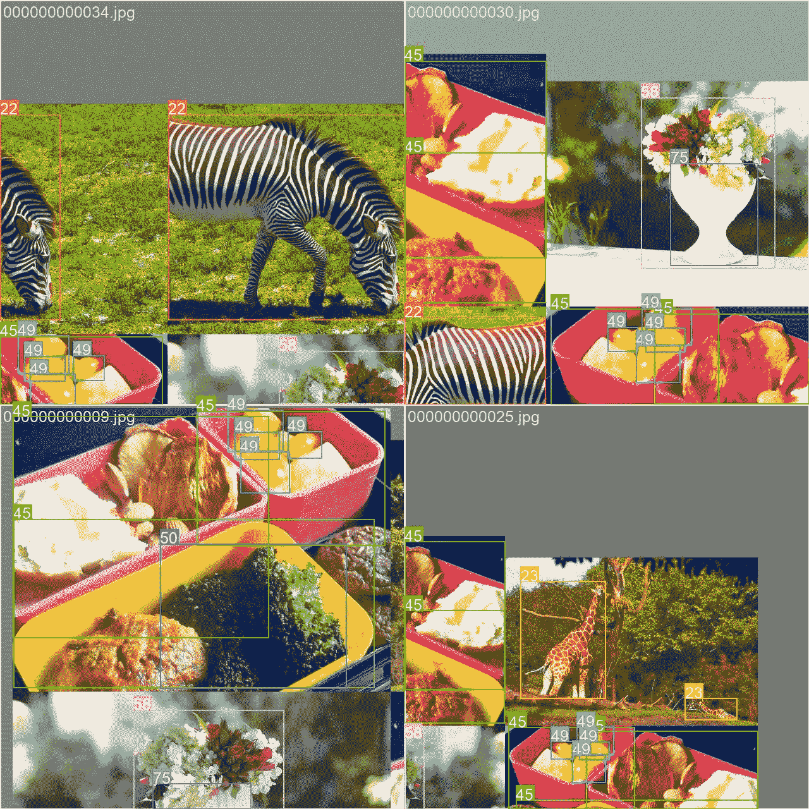

# COCO8 数据集

> 原文：[`docs.ultralytics.com/datasets/detect/coco8/`](https://docs.ultralytics.com/datasets/detect/coco8/)

## 简介

[Ultralytics](https://ultralytics.com) COCO8 是一个小型但多用途的物体检测数据集，由 COCO train 2017 集的前 8 张图像组成，其中 4 张用于训练，4 张用于验证。此数据集非常适合测试和调试物体检测模型，或者尝试新的检测方法。由于只有 8 张图像，它非常易于管理，但又足够多样化，可以用于检查训练管道中的错误，并在训练更大数据集之前进行健全性检查。

[`www.youtube.com/embed/uDrn9QZJ2lk`](https://www.youtube.com/embed/uDrn9QZJ2lk)

**观看：** Ultralytics COCO 数据集概述

该数据集适用于 Ultralytics 的[HUB](https://hub.ultralytics.com)和[YOLOv8](https://github.com/ultralytics/ultralytics)使用。

## 数据集 YAML

YAML（另一种标记语言）文件用于定义数据集配置。它包含有关数据集路径、类别和其他相关信息。对于 COCO8 数据集，`coco8.yaml`文件位于[`github.com/ultralytics/ultralytics/blob/main/ultralytics/cfg/datasets/coco8.yaml`](https://github.com/ultralytics/ultralytics/blob/main/ultralytics/cfg/datasets/coco8.yaml)。

ultralytics/cfg/datasets/coco8.yaml

```py
# Ultralytics YOLO 🚀, AGPL-3.0 license
# COCO8 dataset (first 8 images from COCO train2017) by Ultralytics
# Documentation: https://docs.ultralytics.com/datasets/detect/coco8/
# Example usage: yolo train data=coco8.yaml
# parent
# ├── ultralytics
# └── datasets
#     └── coco8  ← downloads here (1 MB)

# Train/val/test sets as 1) dir: path/to/imgs, 2) file: path/to/imgs.txt, or 3) list: [path/to/imgs1, path/to/imgs2, ..]
path:  ../datasets/coco8  # dataset root dir
train:  images/train  # train images (relative to 'path') 4 images
val:  images/val  # val images (relative to 'path') 4 images
test:  # test images (optional)

# Classes
names:
  0:  person
  1:  bicycle
  2:  car
  3:  motorcycle
  4:  airplane
  5:  bus
  6:  train
  7:  truck
  8:  boat
  9:  traffic light
  10:  fire hydrant
  11:  stop sign
  12:  parking meter
  13:  bench
  14:  bird
  15:  cat
  16:  dog
  17:  horse
  18:  sheep
  19:  cow
  20:  elephant
  21:  bear
  22:  zebra
  23:  giraffe
  24:  backpack
  25:  umbrella
  26:  handbag
  27:  tie
  28:  suitcase
  29:  frisbee
  30:  skis
  31:  snowboard
  32:  sports ball
  33:  kite
  34:  baseball bat
  35:  baseball glove
  36:  skateboard
  37:  surfboard
  38:  tennis racket
  39:  bottle
  40:  wine glass
  41:  cup
  42:  fork
  43:  knife
  44:  spoon
  45:  bowl
  46:  banana
  47:  apple
  48:  sandwich
  49:  orange
  50:  broccoli
  51:  carrot
  52:  hot dog
  53:  pizza
  54:  donut
  55:  cake
  56:  chair
  57:  couch
  58:  potted plant
  59:  bed
  60:  dining table
  61:  toilet
  62:  tv
  63:  laptop
  64:  mouse
  65:  remote
  66:  keyboard
  67:  cell phone
  68:  microwave
  69:  oven
  70:  toaster
  71:  sink
  72:  refrigerator
  73:  book
  74:  clock
  75:  vase
  76:  scissors
  77:  teddy bear
  78:  hair drier
  79:  toothbrush

# Download script/URL (optional)
download:  https://github.com/ultralytics/assets/releases/download/v0.0.0/coco8.zip 
```

## 使用

要在 COCO8 数据集上训练一个 YOLOv8n 模型，使用 640 的图像大小进行 100 个 epoch，您可以使用以下代码片段。有关可用参数的详细列表，请参考模型训练页面。

训练示例

```py
from ultralytics import YOLO

# Load a model
model = YOLO("yolov8n.pt")  # load a pretrained model (recommended for training)

# Train the model
results = model.train(data="coco8.yaml", epochs=100, imgsz=640) 
```

```py
# Start training from a pretrained *.pt model
yolo  detect  train  data=coco8.yaml  model=yolov8n.pt  epochs=100  imgsz=640 
```

## 样本图像和注释

下面是 COCO8 数据集中一些图像的示例，以及它们相应的注释：



+   **马赛克图像：** 此图展示了由马赛克数据集图像组成的训练批次。马赛克是一种在训练过程中使用的技术，将多个图像组合成单个图像，以增加每个训练批次中对象和场景的多样性。这有助于提高模型对不同对象大小、长宽比和背景情境的泛化能力。

该示例展示了 COCO8 数据集图像的多样性和复杂性，以及在训练过程中使用马赛克的好处。

## 引用和致谢

如果您在研究或开发工作中使用 COCO 数据集，请引用以下论文：

```py
@misc{lin2015microsoft,
  title={Microsoft COCO: Common Objects in Context},
  author={Tsung-Yi Lin and Michael Maire and Serge Belongie and Lubomir Bourdev and Ross Girshick and James Hays and Pietro Perona and Deva Ramanan and C. Lawrence Zitnick and Piotr Dollár},
  year={2015},
  eprint={1405.0312},
  archivePrefix={arXiv},
  primaryClass={cs.CV}
} 
```

我们要感谢 COCO 联盟为计算机视觉社区创建和维护这一宝贵资源。有关 COCO 数据集及其创建者的更多信息，请访问[COCO 数据集网站](https://cocodataset.org/#home)。

## 常见问题解答

### Ultralytics COCO8 数据集用于什么？

Ultralytics COCO8 数据集是一个紧凑而多功能的目标检测数据集，包括来自 COCO 2017 训练集的前 8 张图像，其中有 4 张用于训练，4 张用于验证。它旨在用于测试和调试目标检测模型，以及尝试新的检测方法。尽管规模较小，COCO8 提供了足够的多样性，可用作在部署更大数据集之前对训练流水线进行验收测试。详细信息请查看[COCO8 数据集](https://github.com/ultralytics/ultralytics/blob/main/ultralytics/cfg/datasets/coco8.yaml)。

### 如何使用 COCO8 数据集训练 YOLOv8 模型？

要在 COCO8 数据集上训练 YOLOv8 模型，您可以使用 Python 或 CLI 命令。以下是如何开始的方式：

**训练示例**

```py
from ultralytics import YOLO

# Load a model
model = YOLO("yolov8n.pt")  # load a pretrained model (recommended for training)

# Train the model
results = model.train(data="coco8.yaml", epochs=100, imgsz=640) 
```

```py
# Start training from a pretrained *.pt model
yolo  detect  train  data=coco8.yaml  model=yolov8n.pt  epochs=100  imgsz=640 
```

欲获取所有可用参数的详尽列表，请参阅模型训练页面。

### 为何应使用 Ultralytics HUB 管理我的 COCO8 训练？

**Ultralytics HUB** 是一个全方位的网络工具，旨在简化 YOLO 模型的训练和部署，包括 Ultralytics YOLOv8 模型在 COCO8 数据集上的应用。它提供云端训练、实时跟踪和无缝数据集管理。HUB 允许您一键启动训练，避免手动设置的复杂性。了解更多关于[Ultralytics HUB](https://hub.ultralytics.com)及其优势。

### 在使用 COCO8 数据集进行训练时，采用马赛克增强有什么好处？

在 COCO8 数据集中演示的马赛克增强技术，在训练期间将多个图像合并成单个图像。此技术增加了每个训练批次中对象和场景的多样性，提高了模型在不同对象大小、长宽比和场景背景下的泛化能力。从而形成更强大的目标检测模型。详细信息请参阅训练指南。

### 如何验证在 COCO8 数据集上训练的 YOLOv8 模型？

使用模型的验证命令，可以验证在 COCO8 数据集上训练的 YOLOv8 模型。您可以通过 CLI 或 Python 脚本调用验证模式，评估模型在精确指标下的性能。详细指南请访问验证页面。
