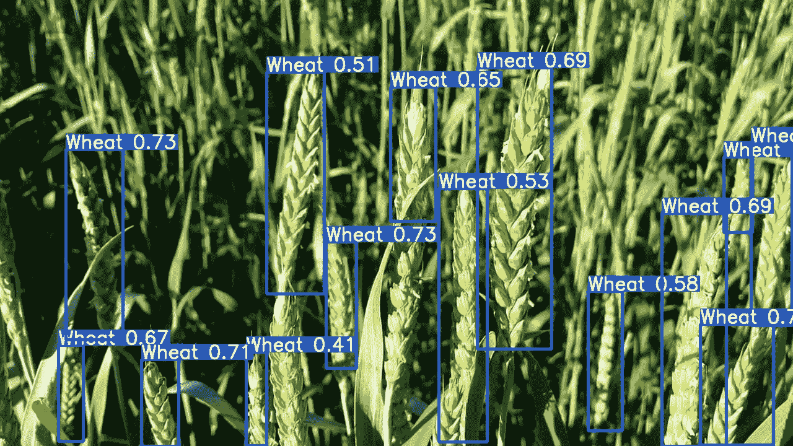

# 全球小麦穗数据集

> 原文：[`docs.ultralytics.com/datasets/detect/globalwheat2020/`](https://docs.ultralytics.com/datasets/detect/globalwheat2020/)

[全球小麦穗数据集](https://www.global-wheat.com/)是一个图像集合，旨在支持精确的小麦穗检测模型开发，用于小麦表型和作物管理应用。小麦穗，也称为穗，是小麦植物的结实部分。准确估计小麦穗密度和大小对于评估作物健康、成熟度和产量潜力至关重要。该数据集由来自七个国家的九个研究机构合作创建，覆盖多个生长地区，以确保模型在不同环境中泛化良好。

## 主要特点

+   数据集包含来自欧洲（法国、英国、瑞士）和北美（加拿大）的超过 3,000 张训练图像。

+   它包括来自澳大利亚、日本和中国的大约 1,000 张测试图像。

+   图像为户外田间图像，捕捉小麦穗外观的自然变异。

+   注释包括小麦穗边界框，支持物体检测任务。

## 数据集结构

全球小麦穗数据集分为两个主要子集：

1.  **训练集**：该子集包含来自欧洲和北美的超过 3,000 张图像。这些图像标有小麦穗边界框，为训练物体检测模型提供了真实数据。

1.  **测试集**：该子集包含来自澳大利亚、日本和中国的大约 1,000 张图像。这些图像用于评估训练模型在未见基因型、环境和观测条件下的表现。

## 应用

全球小麦穗数据集广泛用于训练和评估小麦穗检测任务中的深度学习模型。数据集中多样的图像集合，捕捉了广泛的外观、环境和条件变化，使其成为植物表型和作物管理领域的研究人员和从业者的宝贵资源。

## 数据集 YAML

一个 YAML（另一种标记语言）文件用于定义数据集的配置。它包含关于数据集路径、类别和其他相关信息的信息。对于全球小麦穗数据集，`GlobalWheat2020.yaml` 文件位于 [`github.com/ultralytics/ultralytics/blob/main/ultralytics/cfg/datasets/GlobalWheat2020.yaml`](https://github.com/ultralytics/ultralytics/blob/main/ultralytics/cfg/datasets/GlobalWheat2020.yaml)。

ultralytics/cfg/datasets/GlobalWheat2020.yaml

```py
`# Ultralytics YOLO 🚀, AGPL-3.0 license # Global Wheat 2020 dataset https://www.global-wheat.com/ by University of Saskatchewan # Documentation: https://docs.ultralytics.com/datasets/detect/globalwheat2020/ # Example usage: yolo train data=GlobalWheat2020.yaml # parent # ├── ultralytics # └── datasets #     └── GlobalWheat2020  ← downloads here (7.0 GB)  # Train/val/test sets as 1) dir: path/to/imgs, 2) file: path/to/imgs.txt, or 3) list: [path/to/imgs1, path/to/imgs2, ..] path:  ../datasets/GlobalWheat2020  # dataset root dir train:  # train images (relative to 'path') 3422 images   -  images/arvalis_1   -  images/arvalis_2   -  images/arvalis_3   -  images/ethz_1   -  images/rres_1   -  images/inrae_1   -  images/usask_1 val:  # val images (relative to 'path') 748 images (WARNING: train set contains ethz_1)   -  images/ethz_1 test:  # test images (optional) 1276 images   -  images/utokyo_1   -  images/utokyo_2   -  images/nau_1   -  images/uq_1  # Classes names:   0:  wheat_head  # Download script/URL (optional) --------------------------------------------------------------------------------------- download:  |   from ultralytics.utils.downloads import download   from pathlib import Path    # Download   dir = Path(yaml['path'])  # dataset root dir   urls = ['https://zenodo.org/record/4298502/files/global-wheat-codalab-official.zip',   'https://github.com/ultralytics/assets/releases/download/v0.0.0/GlobalWheat2020_labels.zip']   download(urls, dir=dir)    # Make Directories   for p in 'annotations', 'images', 'labels':   (dir / p).mkdir(parents=True, exist_ok=True)    # Move   for p in 'arvalis_1', 'arvalis_2', 'arvalis_3', 'ethz_1', 'rres_1', 'inrae_1', 'usask_1', \   'utokyo_1', 'utokyo_2', 'nau_1', 'uq_1':   (dir / 'global-wheat-codalab-official' / p).rename(dir / 'images' / p)  # move to /images   f = (dir / 'global-wheat-codalab-official' / p).with_suffix('.json')  # json file   if f.exists():   f.rename((dir / 'annotations' / p).with_suffix('.json'))  # move to /annotations` 
```

## 使用方法

要在全球小麦穗数据集上使用图像大小为 640 的 YOLOv8n 模型进行 100 个时期的训练，您可以使用以下代码片段。有关可用参数的全面列表，请参考模型训练页面。

训练示例

```py
`from ultralytics import YOLO  # Load a model model = YOLO("yolov8n.pt")  # load a pretrained model (recommended for training)  # Train the model results = model.train(data="GlobalWheat2020.yaml", epochs=100, imgsz=640)` 
```

```py
`# Start training from a pretrained *.pt model yolo  detect  train  data=GlobalWheat2020.yaml  model=yolov8n.pt  epochs=100  imgsz=640` 
```

## 样本数据和注释

全球小麦穗数据集包含多样的户外田野图像，捕捉了小麦穗外观、环境和条件的自然变异。以下是数据集中一些数据的示例，以及它们对应的注释：



+   **小麦穗检测**：本图展示了小麦穗检测的示例，其中小麦穗用边界框标注。该数据集提供了多种图像，以促进为此任务开发模型。

这个示例展示了全球小麦穗数据集中数据的多样性和复杂性，并突显了对小麦表型和作物管理应用中精确检测小麦穗的重要性。

## 引用和致谢

如果您在研究或开发工作中使用全球小麦穗数据集，请引用以下论文：

```py
`@article{david2020global,   title={Global Wheat Head Detection (GWHD) Dataset: A Large and Diverse Dataset of High-Resolution RGB-Labelled Images to Develop and Benchmark Wheat Head Detection Methods},   author={David, Etienne and Madec, Simon and Sadeghi-Tehran, Pouria and Aasen, Helge and Zheng, Bangyou and Liu, Shouyang and Kirchgessner, Norbert and Ishikawa, Goro and Nagasawa, Koichi and Badhon, Minhajul and others},   journal={arXiv preprint arXiv:2005.02162},   year={2020} }` 
```

我们要感谢那些为全球小麦穗数据集的创建和维护做出贡献的研究人员和机构，这是植物表型和作物管理研究社区的宝贵资源。有关数据集及其创建者的更多信息，请访问[全球小麦穗数据集网站](https://www.global-wheat.com/)。

## 常见问题解答

### 全球小麦穗数据集用于什么？

全球小麦穗数据集主要用于开发和训练旨在检测小麦穗的深度学习模型。这对于小麦表型和作物管理应用至关重要，能够更准确地估计小麦穗的密度、大小和整体产量潜力。准确的检测方法有助于评估作物的健康状况和成熟度，对于高效的作物管理至关重要。

### 如何在全球小麦穗数据集上训练 YOLOv8n 模型？

要在全球小麦穗数据集上训练 YOLOv8n 模型，您可以使用以下代码片段。确保您有指定数据集路径和类别的`GlobalWheat2020.yaml`配置文件：

训练示例

```py
`from ultralytics import YOLO  # Load a pre-trained model (recommended for training) model = YOLO("yolov8n.pt")  # Train the model results = model.train(data="GlobalWheat2020.yaml", epochs=100, imgsz=640)` 
```

```py
`# Start training from a pretrained *.pt model yolo  detect  train  data=GlobalWheat2020.yaml  model=yolov8n.pt  epochs=100  imgsz=640` 
```

要获取所有可用参数的详细列表，请参阅模型训练页面。

### 全球小麦穗数据集的关键特点是什么？

全球小麦穗数据集的关键特点包括：

+   来自欧洲（法国、英国、瑞士）和北美（加拿大）的 3,000 多张训练图像。

+   来自澳大利亚、日本和中国的约 1,000 张测试图像。

+   由于不同的生长环境，小麦穗外观存在高度变异性。

+   带有小麦穗边界框的详细注释，有助于物体检测模型。

这些特点有助于开发能够在多个地区通用的强健模型。

### 我在哪里可以找到全球小麦穗数据集的配置 YAML 文件？

全球小麦穗数据集的配置 YAML 文件名为 `GlobalWheat2020.yaml`，可以在 GitHub 上获取。您可以访问这个 [链接](https://github.com/ultralytics/ultralytics/blob/main/ultralytics/cfg/datasets/GlobalWheat2020.yaml)。这个文件包含关于数据集路径、类别和其他配置细节的必要信息，用于在 Ultralytics YOLO 中进行模型训练。

### 小麦穗检测在农作物管理中为何如此重要？

小麦穗检测在农作物管理中至关重要，因为它能够准确估计小麦穗的密度和大小，这对评估农作物的健康、成熟度和产量潜力至关重要。通过利用在全球小麦穗数据集等数据集上训练的深度学习模型，农民和研究人员可以更好地监测和管理农作物，从而提高生产力并优化农业实践中的资源利用。这种技术进步支持可持续农业和粮食安全倡议。

欲了解更多关于人工智能在农业中应用的信息，请访问 [人工智能在农业中的应用](https://www.ultralytics.com/solutions/ai-in-agriculture)。
