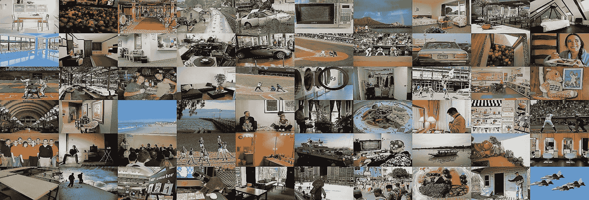

# Objects365 数据集

> 原文：[`docs.ultralytics.com/datasets/detect/objects365/`](https://docs.ultralytics.com/datasets/detect/objects365/)

[Objects365](https://www.objects365.org/) 数据集是一个大规模、高质量的数据集，旨在促进对野外多样物体进行目标检测的研究。由[Megvii](https://en.megvii.com/)研究人员团队创建，该数据集提供了广泛的高分辨率图像，并包含了覆盖 365 个物体类别的全面注释边界框。

## 主要特点

+   Objects365 包含 365 个物体类别，200 万张图像和超过 3000 万个边界框。

+   该数据集包含各种场景中的多样化物体，为目标检测任务提供了丰富且具有挑战性的基准。

+   注释包括物体的边界框，适合用于目标检测模型的训练和评估。

+   Objects365 预训练模型在各种任务上明显优于 ImageNet 预训练模型，提高了泛化性能。

## 数据集结构

Objects365 数据集被组织为一组图像及其对应的注释：

+   **图像**：该数据集包含了 200 万张高分辨率图像，每张图像涵盖了 365 个类别中的多种物体。

+   **注释**：图像标注了超过 3000 万个边界框，为目标检测任务提供了全面的真实信息。

## 应用

Objects365 数据集广泛用于深度学习模型在目标检测任务中的训练和评估。数据集中多样的物体类别和高质量的注释使其成为计算机视觉领域研究人员和从业者的宝贵资源。

## 数据集 YAML

用于定义数据集配置的 YAML（Yet Another Markup Language）文件包含了关于数据集路径、类别及其他相关信息的内容。对于 Objects365 数据集，`Objects365.yaml` 文件位于[`github.com/ultralytics/ultralytics/blob/main/ultralytics/cfg/datasets/Objects365.yaml`](https://github.com/ultralytics/ultralytics/blob/main/ultralytics/cfg/datasets/Objects365.yaml)。

ultralytics/cfg/datasets/Objects365.yaml

```py
`# Ultralytics YOLO 🚀, AGPL-3.0 license # Objects365 dataset https://www.objects365.org/ by Megvii # Documentation: https://docs.ultralytics.com/datasets/detect/objects365/ # Example usage: yolo train data=Objects365.yaml # parent # ├── ultralytics # └── datasets #     └── Objects365  ← downloads here (712 GB = 367G data + 345G zips)  # Train/val/test sets as 1) dir: path/to/imgs, 2) file: path/to/imgs.txt, or 3) list: [path/to/imgs1, path/to/imgs2, ..] path:  ../datasets/Objects365  # dataset root dir train:  images/train  # train images (relative to 'path') 1742289 images val:  images/val  # val images (relative to 'path') 80000 images test:  # test images (optional)  # Classes names:   0:  Person   1:  Sneakers   2:  Chair   3:  Other Shoes   4:  Hat   5:  Car   6:  Lamp   7:  Glasses   8:  Bottle   9:  Desk   10:  Cup   11:  Street Lights   12:  Cabinet/shelf   13:  Handbag/Satchel   14:  Bracelet   15:  Plate   16:  Picture/Frame   17:  Helmet   18:  Book   19:  Gloves   20:  Storage box   21:  Boat   22:  Leather Shoes   23:  Flower   24:  Bench   25:  Potted Plant   26:  Bowl/Basin   27:  Flag   28:  Pillow   29:  Boots   30:  Vase   31:  Microphone   32:  Necklace   33:  Ring   34:  SUV   35:  Wine Glass   36:  Belt   37:  Monitor/TV   38:  Backpack   39:  Umbrella   40:  Traffic Light   41:  Speaker   42:  Watch   43:  Tie   44:  Trash bin Can   45:  Slippers   46:  Bicycle   47:  Stool   48:  Barrel/bucket   49:  Van   50:  Couch   51:  Sandals   52:  Basket   53:  Drum   54:  Pen/Pencil   55:  Bus   56:  Wild Bird   57:  High Heels   58:  Motorcycle   59:  Guitar   60:  Carpet   61:  Cell Phone   62:  Bread   63:  Camera   64:  Canned   65:  Truck   66:  Traffic cone   67:  Cymbal   68:  Lifesaver   69:  Towel   70:  Stuffed Toy   71:  Candle   72:  Sailboat   73:  Laptop   74:  Awning   75:  Bed   76:  Faucet   77:  Tent   78:  Horse   79:  Mirror   80:  Power outlet   81:  Sink   82:  Apple   83:  Air Conditioner   84:  Knife   85:  Hockey Stick   86:  Paddle   87:  Pickup Truck   88:  Fork   89:  Traffic Sign   90:  Balloon   91:  Tripod   92:  Dog   93:  Spoon   94:  Clock   95:  Pot   96:  Cow   97:  Cake   98:  Dinning Table   99:  Sheep   100:  Hanger   101:  Blackboard/Whiteboard   102:  Napkin   103:  Other Fish   104:  Orange/Tangerine   105:  Toiletry   106:  Keyboard   107:  Tomato   108:  Lantern   109:  Machinery Vehicle   110:  Fan   111:  Green Vegetables   112:  Banana   113:  Baseball Glove   114:  Airplane   115:  Mouse   116:  Train   117:  Pumpkin   118:  Soccer   119:  Skiboard   120:  Luggage   121:  Nightstand   122:  Tea pot   123:  Telephone   124:  Trolley   125:  Head Phone   126:  Sports Car   127:  Stop Sign   128:  Dessert   129:  Scooter   130:  Stroller   131:  Crane   132:  Remote   133:  Refrigerator   134:  Oven   135:  Lemon   136:  Duck   137:  Baseball Bat   138:  Surveillance Camera   139:  Cat   140:  Jug   141:  Broccoli   142:  Piano   143:  Pizza   144:  Elephant   145:  Skateboard   146:  Surfboard   147:  Gun   148:  Skating and Skiing shoes   149:  Gas stove   150:  Donut   151:  Bow Tie   152:  Carrot   153:  Toilet   154:  Kite   155:  Strawberry   156:  Other Balls   157:  Shovel   158:  Pepper   159:  Computer Box   160:  Toilet Paper   161:  Cleaning Products   162:  Chopsticks   163:  Microwave   164:  Pigeon   165:  Baseball   166:  Cutting/chopping Board   167:  Coffee Table   168:  Side Table   169:  Scissors   170:  Marker   171:  Pie   172:  Ladder   173:  Snowboard   174:  Cookies   175:  Radiator   176:  Fire Hydrant   177:  Basketball   178:  Zebra   179:  Grape   180:  Giraffe   181:  Potato   182:  Sausage   183:  Tricycle   184:  Violin   185:  Egg   186:  Fire Extinguisher   187:  Candy   188:  Fire Truck   189:  Billiards   190:  Converter   191:  Bathtub   192:  Wheelchair   193:  Golf Club   194:  Briefcase   195:  Cucumber   196:  Cigar/Cigarette   197:  Paint Brush   198:  Pear   199:  Heavy Truck   200:  Hamburger   201:  Extractor   202:  Extension Cord   203:  Tong   204:  Tennis Racket   205:  Folder   206:  American Football   207:  earphone   208:  Mask   209:  Kettle   210:  Tennis   211:  Ship   212:  Swing   213:  Coffee Machine   214:  Slide   215:  Carriage   216:  Onion   217:  Green beans   218:  Projector   219:  Frisbee   220:  Washing Machine/Drying Machine   221:  Chicken   222:  Printer   223:  Watermelon   224:  Saxophone   225:  Tissue   226:  Toothbrush   227:  Ice cream   228:  Hot-air balloon   229:  Cello   230:  French Fries   231:  Scale   232:  Trophy   233:  Cabbage   234:  Hot dog   235:  Blender   236:  Peach   237:  Rice   238:  Wallet/Purse   239:  Volleyball   240:  Deer   241:  Goose   242:  Tape   243:  Tablet   244:  Cosmetics   245:  Trumpet   246:  Pineapple   247:  Golf Ball   248:  Ambulance   249:  Parking meter   250:  Mango   251:  Key   252:  Hurdle   253:  Fishing Rod   254:  Medal   255:  Flute   256:  Brush   257:  Penguin   258:  Megaphone   259:  Corn   260:  Lettuce   261:  Garlic   262:  Swan   263:  Helicopter   264:  Green Onion   265:  Sandwich   266:  Nuts   267:  Speed Limit Sign   268:  Induction Cooker   269:  Broom   270:  Trombone   271:  Plum   272:  Rickshaw   273:  Goldfish   274:  Kiwi fruit   275:  Router/modem   276:  Poker Card   277:  Toaster   278:  Shrimp   279:  Sushi   280:  Cheese   281:  Notepaper   282:  Cherry   283:  Pliers   284:  CD   285:  Pasta   286:  Hammer   287:  Cue   288:  Avocado   289:  Hamimelon   290:  Flask   291:  Mushroom   292:  Screwdriver   293:  Soap   294:  Recorder   295:  Bear   296:  Eggplant   297:  Board Eraser   298:  Coconut   299:  Tape Measure/Ruler   300:  Pig   301:  Showerhead   302:  Globe   303:  Chips   304:  Steak   305:  Crosswalk Sign   306:  Stapler   307:  Camel   308:  Formula 1   309:  Pomegranate   310:  Dishwasher   311:  Crab   312:  Hoverboard   313:  Meat ball   314:  Rice Cooker   315:  Tuba   316:  Calculator   317:  Papaya   318:  Antelope   319:  Parrot   320:  Seal   321:  Butterfly   322:  Dumbbell   323:  Donkey   324:  Lion   325:  Urinal   326:  Dolphin   327:  Electric Drill   328:  Hair Dryer   329:  Egg tart   330:  Jellyfish   331:  Treadmill   332:  Lighter   333:  Grapefruit   334:  Game board   335:  Mop   336:  Radish   337:  Baozi   338:  Target   339:  French   340:  Spring Rolls   341:  Monkey   342:  Rabbit   343:  Pencil Case   344:  Yak   345:  Red Cabbage   346:  Binoculars   347:  Asparagus   348:  Barbell   349:  Scallop   350:  Noddles   351:  Comb   352:  Dumpling   353:  Oyster   354:  Table Tennis paddle   355:  Cosmetics Brush/Eyeliner Pencil   356:  Chainsaw   357:  Eraser   358:  Lobster   359:  Durian   360:  Okra   361:  Lipstick   362:  Cosmetics Mirror   363:  Curling   364:  Table Tennis  # Download script/URL (optional) --------------------------------------------------------------------------------------- download:  |   from tqdm import tqdm    from ultralytics.utils.checks import check_requirements   from ultralytics.utils.downloads import download   from ultralytics.utils.ops import xyxy2xywhn    import numpy as np   from pathlib import Path    check_requirements(('pycocotools>=2.0',))   from pycocotools.coco import COCO    # Make Directories   dir = Path(yaml['path'])  # dataset root dir   for p in 'images', 'labels':   (dir / p).mkdir(parents=True, exist_ok=True)   for q in 'train', 'val':   (dir / p / q).mkdir(parents=True, exist_ok=True)    # Train, Val Splits   for split, patches in [('train', 50 + 1), ('val', 43 + 1)]:   print(f"Processing {split} in {patches} patches ...")   images, labels = dir / 'images' / split, dir / 'labels' / split    # Download   url = f"https://dorc.ks3-cn-beijing.ksyun.com/data-set/2020Objects365%E6%95%B0%E6%8D%AE%E9%9B%86/{split}/"   if split == 'train':   download([f'{url}zhiyuan_objv2_{split}.tar.gz'], dir=dir)  # annotations json   download([f'{url}patch{i}.tar.gz' for i in range(patches)], dir=images, curl=True, threads=8)   elif split == 'val':   download([f'{url}zhiyuan_objv2_{split}.json'], dir=dir)  # annotations json   download([f'{url}images/v1/patch{i}.tar.gz' for i in range(15 + 1)], dir=images, curl=True, threads=8)   download([f'{url}images/v2/patch{i}.tar.gz' for i in range(16, patches)], dir=images, curl=True, threads=8)    # Move   for f in tqdm(images.rglob('*.jpg'), desc=f'Moving {split} images'):   f.rename(images / f.name)  # move to /images/{split}    # Labels   coco = COCO(dir / f'zhiyuan_objv2_{split}.json')   names = [x["name"] for x in coco.loadCats(coco.getCatIds())]   for cid, cat in enumerate(names):   catIds = coco.getCatIds(catNms=[cat])   imgIds = coco.getImgIds(catIds=catIds)   for im in tqdm(coco.loadImgs(imgIds), desc=f'Class {cid + 1}/{len(names)} {cat}'):   width, height = im["width"], im["height"]   path = Path(im["file_name"])  # image filename   try:   with open(labels / path.with_suffix('.txt').name, 'a') as file:   annIds = coco.getAnnIds(imgIds=im["id"], catIds=catIds, iscrowd=None)   for a in coco.loadAnns(annIds):   x, y, w, h = a['bbox']  # bounding box in xywh (xy top-left corner)   xyxy = np.array([x, y, x + w, y + h])[None]  # pixels(1,4)   x, y, w, h = xyxy2xywhn(xyxy, w=width, h=height, clip=True)[0]  # normalized and clipped   file.write(f"{cid} {x:.5f} {y:.5f} {w:.5f} {h:.5f}\n")   except Exception as e:   print(e)` 
```

## 使用

若要在 Objects365 数据集上使用图像大小为 640、进行 100 个 epochs 的 YOLOv8n 模型训练，可以使用以下代码片段。有关可用参数的全面列表，请参阅模型训练页面。

训练示例

```py
`from ultralytics import YOLO  # Load a model model = YOLO("yolov8n.pt")  # load a pretrained model (recommended for training)  # Train the model results = model.train(data="Objects365.yaml", epochs=100, imgsz=640)` 
```

```py
`# Start training from a pretrained *.pt model yolo  detect  train  data=Objects365.yaml  model=yolov8n.pt  epochs=100  imgsz=640` 
```

## 样本数据和注释

Objects365 数据集包含了一系列高分辨率图像，展示了来自 365 个类别的各种物体，为目标检测任务提供了丰富的上下文信息。以下是数据集中的一些示例图像：



+   **Objects365**：这幅图展示了一个目标检测的示例，其中物体用边界框标注。该数据集提供了各种图像，以便开发针对此任务的模型。

该示例展示了 Objects365 数据集中数据的多样性和复杂性，并突显了准确目标检测在计算机视觉应用中的重要性。

## 引用和致谢

如果您在研究或开发工作中使用 Objects365 数据集，请引用以下论文：

```py
`@inproceedings{shao2019objects365,   title={Objects365: A Large-scale, High-quality Dataset for Object Detection},   author={Shao, Shuai and Li, Zeming and Zhang, Tianyuan and Peng, Chao and Yu, Gang and Li, Jing and Zhang, Xiangyu and Sun, Jian},   booktitle={Proceedings of the IEEE/CVF International Conference on Computer Vision},   pages={8425--8434},   year={2019} }` 
```

我们要感谢创建和维护 Objects365 数据集的研究团队，作为计算机视觉研究社区的宝贵资源。有关 Objects365 数据集及其创建者的更多信息，请访问 [Objects365 数据集网站](https://www.objects365.org/)。

## 常见问题解答

### Objects365 数据集用于什么？

[Objects365 数据集](https://www.objects365.org/) 是为机器学习和计算机视觉中的目标检测任务设计的。它提供了一个大规模高质量的数据集，包含 200 万张标注图像和 3000 万个边界框，覆盖了 365 个类别。利用这样一个多样化的数据集有助于提高目标检测模型的性能和泛化能力，对于该领域的研究和开发至关重要。

### 如何在 Objects365 数据集上训练 YOLOv8 模型？

要使用 Objects365 数据集训练一个 YOLOv8n 模型，进行 100 个 epoch，并设置图像尺寸为 640，请按照以下说明操作：

训练示例

```py
`from ultralytics import YOLO  # Load a model model = YOLO("yolov8n.pt")  # load a pretrained model (recommended for training)  # Train the model results = model.train(data="Objects365.yaml", epochs=100, imgsz=640)` 
```

```py
`# Start training from a pretrained *.pt model yolo  detect  train  data=Objects365.yaml  model=yolov8n.pt  epochs=100  imgsz=640` 
```

请参考培训页面以获取可用参数的全面列表。

### 为什么应该在我的目标检测项目中使用 Objects365 数据集？

Objects365 数据集在目标检测任务中具有几个优势：

### 您可以在哪里找到 Objects365 数据集的 YAML 配置文件？

Objects365 数据集的 YAML 配置文件可在 [Objects365.yaml](https://github.com/ultralytics/ultralytics/blob/main/ultralytics/cfg/datasets/Objects365.yaml) 找到。该文件包含诸如数据集路径和类别标签等关键信息，对于设置您的训练环境至关重要。

### Objects365 数据集的数据集结构如何增强目标检测建模？

[Objects365 数据集](https://www.objects365.org/) 组织结构清晰，包含 200 万张高分辨率图像和超过 3000 万个边界框的详细标注。这种结构确保了一个强大的数据集，用于训练深度学习模型进行目标检测，提供了丰富的对象和场景。这种多样性和数量有助于开发更准确并能良好泛化到实际应用的模型。有关数据集结构的更多详细信息，请参考数据集 YAML 部分。
