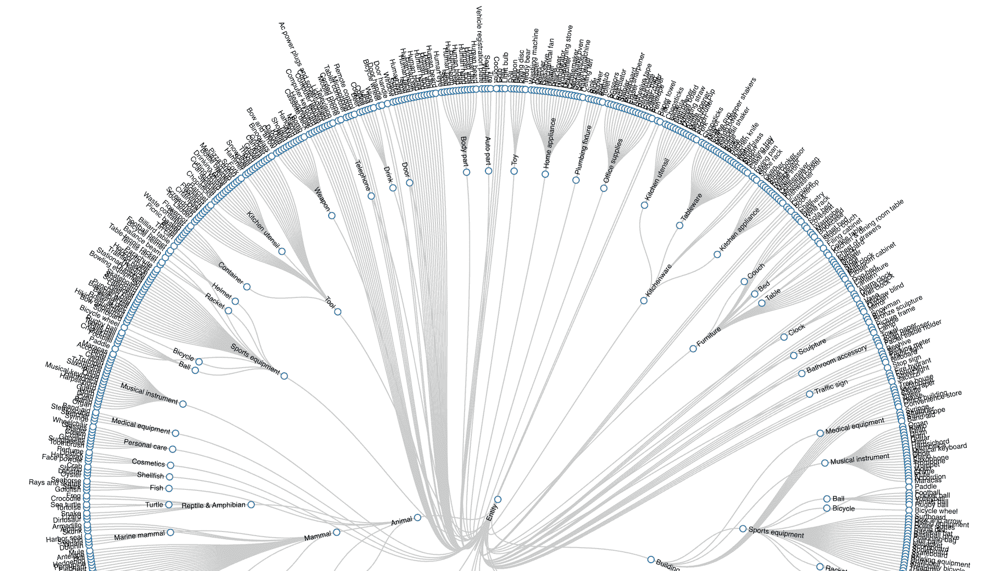
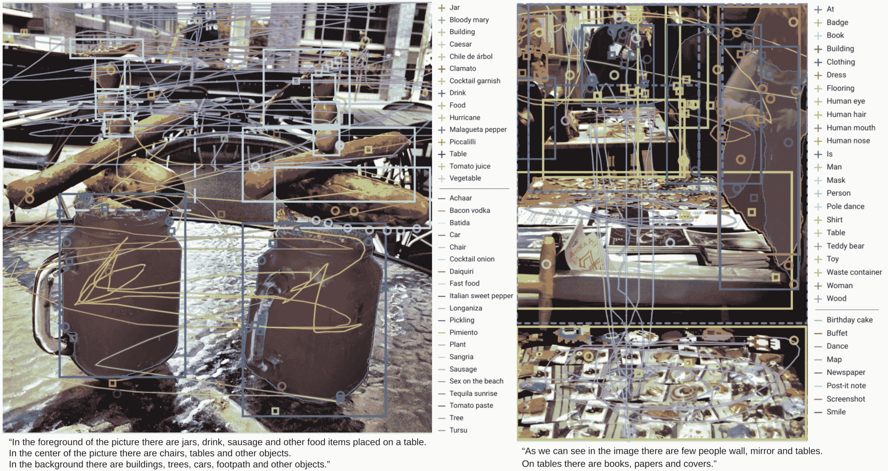

# Open Images V7 数据集

> 原文：[`docs.ultralytics.com/datasets/detect/open-images-v7/`](https://docs.ultralytics.com/datasets/detect/open-images-v7/)

[Open Images V7](https://storage.googleapis.com/openimages/web/index.html) 是由 Google 领导的多功能且广阔的数据集。旨在推动计算机视觉领域的研究，它拥有大量图像，并用多种数据进行了注释，包括图像级标签、物体边界框、物体分割蒙版、视觉关系和本地化叙述。

[`www.youtube.com/embed/u3pLlgzUeV8`](https://www.youtube.com/embed/u3pLlgzUeV8)

**观看：** 使用 OpenImagesV7 预训练模型进行物体检测

## Open Images V7 预训练模型

| 模型 | 大小 ^((像素)) | mAP ^(val 50-95) | 速度 ^(CPU ONNX

(毫秒)) | 速度 ^(A100 TensorRT

(毫秒)) | 参数 ^((M)) | FLOPs ^((B)) |

| --- | --- | --- | --- | --- | --- | --- |
| --- | --- | --- | --- | --- | --- | --- |
| [YOLOv8n](https://github.com/ultralytics/assets/releases/download/v8.2.0/yolov8n-oiv7.pt) | 640 | 18.4 | 142.4 | 1.21 | 3.5 | 10.5 |
| [YOLOv8s](https://github.com/ultralytics/assets/releases/download/v8.2.0/yolov8s-oiv7.pt) | 640 | 27.7 | 183.1 | 1.40 | 11.4 | 29.7 |
| [YOLOv8m](https://github.com/ultralytics/assets/releases/download/v8.2.0/yolov8m-oiv7.pt) | 640 | 33.6 | 408.5 | 2.26 | 26.2 | 80.6 |
| [YOLOv8l](https://github.com/ultralytics/assets/releases/download/v8.2.0/yolov8l-oiv7.pt) | 640 | 34.9 | 596.9 | 2.43 | 44.1 | 167.4 |
| [YOLOv8x](https://github.com/ultralytics/assets/releases/download/v8.2.0/yolov8x-oiv7.pt) | 640 | 36.3 | 860.6 | 3.56 | 68.7 | 260.6 |



## 主要特征

+   涵盖了以多种方式注释的约 900 万张图像，以适应多种计算机视觉任务。

+   在 190 万张图像中，共有 1600 万个边界框跨越 600 个物体类别。这些框主要由专家手绘，确保高精度。

+   提供了 330 万个可视关系注释，详细说明了 1466 个独特的关系三元组、物体属性和人类活动。

+   V5 引入了对 350 个类别中 2.8M 个物体的分割蒙版。

+   V6 引入了 67.5 万个本地化叙述，融合了语音、文本和鼠标轨迹，突出描述的物体。

+   V7 引入了在 140 万张图像上的 6640 万个点级标签，涵盖了 5827 个类别。

+   涵盖了 20638 个类别中共 6140 万个图像级标签。

+   提供了一个统一的平台，用于图像分类、物体检测、关系检测、实例分割和多模态图像描述。

## 数据集结构

Open Images V7 是一个由多个组件组成的结构，旨在满足多样化的计算机视觉挑战：

+   **图像**：约 900 万张图像，通常展示复杂场景，平均每张图像有 8.3 个物体。

+   **边界框**：超过 1600 万个框，标示了跨越 600 个类别的物体。

+   **分割蒙版**：详细描述了 350 个类别中 2.8M 个物体的确切边界。

+   **视觉关系**：3.3M 注释，指示对象关系、属性和动作。

+   **本地化叙述**：675k 描述，结合语音、文本和鼠标轨迹。

+   **点级标签**：66.4M 标签跨越 1.4M 图像，适用于零/少次语义分割。

## 应用

Open Images V7 是在各种计算机视觉任务中训练和评估最先进模型的基石。数据集的广泛范围和高质量的标注使其对专注于计算机视觉的研究人员和开发者不可或缺。

## 数据集 YAML

通常，数据集配备一个 YAML（Yet Another Markup Language）文件，该文件详细说明了数据集的配置。对于 Open Images V7 来说，可能存在一个假设的 `OpenImagesV7.yaml`。为了准确的路径和配置，应参考数据集的官方存储库或文档。

OpenImagesV7.yaml

```py
# Ultralytics YOLO 🚀, AGPL-3.0 license
# Open Images v7 dataset https://storage.googleapis.com/openimages/web/index.html by Google
# Documentation: https://docs.ultralytics.com/datasets/detect/open-images-v7/
# Example usage: yolo train data=open-images-v7.yaml
# parent
# ├── ultralytics
# └── datasets
#     └── open-images-v7  ← downloads here (561 GB)

# Train/val/test sets as 1) dir: path/to/imgs, 2) file: path/to/imgs.txt, or 3) list: [path/to/imgs1, path/to/imgs2, ..]
path:  ../datasets/open-images-v7  # dataset root dir
train:  images/train  # train images (relative to 'path') 1743042 images
val:  images/val  # val images (relative to 'path') 41620 images
test:  # test images (optional)

# Classes
names:
  0:  Accordion
  1:  Adhesive tape
  2:  Aircraft
  3:  Airplane
  4:  Alarm clock
  5:  Alpaca
  6:  Ambulance
  7:  Animal
  8:  Ant
  9:  Antelope
  10:  Apple
  11:  Armadillo
  12:  Artichoke
  13:  Auto part
  14:  Axe
  15:  Backpack
  16:  Bagel
  17:  Baked goods
  18:  Balance beam
  19:  Ball
  20:  Balloon
  21:  Banana
  22:  Band-aid
  23:  Banjo
  24:  Barge
  25:  Barrel
  26:  Baseball bat
  27:  Baseball glove
  28:  Bat (Animal)
  29:  Bathroom accessory
  30:  Bathroom cabinet
  31:  Bathtub
  32:  Beaker
  33:  Bear
  34:  Bed
  35:  Bee
  36:  Beehive
  37:  Beer
  38:  Beetle
  39:  Bell pepper
  40:  Belt
  41:  Bench
  42:  Bicycle
  43:  Bicycle helmet
  44:  Bicycle wheel
  45:  Bidet
  46:  Billboard
  47:  Billiard table
  48:  Binoculars
  49:  Bird
  50:  Blender
  51:  Blue jay
  52:  Boat
  53:  Bomb
  54:  Book
  55:  Bookcase
  56:  Boot
  57:  Bottle
  58:  Bottle opener
  59:  Bow and arrow
  60:  Bowl
  61:  Bowling equipment
  62:  Box
  63:  Boy
  64:  Brassiere
  65:  Bread
  66:  Briefcase
  67:  Broccoli
  68:  Bronze sculpture
  69:  Brown bear
  70:  Building
  71:  Bull
  72:  Burrito
  73:  Bus
  74:  Bust
  75:  Butterfly
  76:  Cabbage
  77:  Cabinetry
  78:  Cake
  79:  Cake stand
  80:  Calculator
  81:  Camel
  82:  Camera
  83:  Can opener
  84:  Canary
  85:  Candle
  86:  Candy
  87:  Cannon
  88:  Canoe
  89:  Cantaloupe
  90:  Car
  91:  Carnivore
  92:  Carrot
  93:  Cart
  94:  Cassette deck
  95:  Castle
  96:  Cat
  97:  Cat furniture
  98:  Caterpillar
  99:  Cattle
  100:  Ceiling fan
  101:  Cello
  102:  Centipede
  103:  Chainsaw
  104:  Chair
  105:  Cheese
  106:  Cheetah
  107:  Chest of drawers
  108:  Chicken
  109:  Chime
  110:  Chisel
  111:  Chopsticks
  112:  Christmas tree
  113:  Clock
  114:  Closet
  115:  Clothing
  116:  Coat
  117:  Cocktail
  118:  Cocktail shaker
  119:  Coconut
  120:  Coffee
  121:  Coffee cup
  122:  Coffee table
  123:  Coffeemaker
  124:  Coin
  125:  Common fig
  126:  Common sunflower
  127:  Computer keyboard
  128:  Computer monitor
  129:  Computer mouse
  130:  Container
  131:  Convenience store
  132:  Cookie
  133:  Cooking spray
  134:  Corded phone
  135:  Cosmetics
  136:  Couch
  137:  Countertop
  138:  Cowboy hat
  139:  Crab
  140:  Cream
  141:  Cricket ball
  142:  Crocodile
  143:  Croissant
  144:  Crown
  145:  Crutch
  146:  Cucumber
  147:  Cupboard
  148:  Curtain
  149:  Cutting board
  150:  Dagger
  151:  Dairy Product
  152:  Deer
  153:  Desk
  154:  Dessert
  155:  Diaper
  156:  Dice
  157:  Digital clock
  158:  Dinosaur
  159:  Dishwasher
  160:  Dog
  161:  Dog bed
  162:  Doll
  163:  Dolphin
  164:  Door
  165:  Door handle
  166:  Doughnut
  167:  Dragonfly
  168:  Drawer
  169:  Dress
  170:  Drill (Tool)
  171:  Drink
  172:  Drinking straw
  173:  Drum
  174:  Duck
  175:  Dumbbell
  176:  Eagle
  177:  Earrings
  178:  Egg (Food)
  179:  Elephant
  180:  Envelope
  181:  Eraser
  182:  Face powder
  183:  Facial tissue holder
  184:  Falcon
  185:  Fashion accessory
  186:  Fast food
  187:  Fax
  188:  Fedora
  189:  Filing cabinet
  190:  Fire hydrant
  191:  Fireplace
  192:  Fish
  193:  Flag
  194:  Flashlight
  195:  Flower
  196:  Flowerpot
  197:  Flute
  198:  Flying disc
  199:  Food
  200:  Food processor
  201:  Football
  202:  Football helmet
  203:  Footwear
  204:  Fork
  205:  Fountain
  206:  Fox
  207:  French fries
  208:  French horn
  209:  Frog
  210:  Fruit
  211:  Frying pan
  212:  Furniture
  213:  Garden Asparagus
  214:  Gas stove
  215:  Giraffe
  216:  Girl
  217:  Glasses
  218:  Glove
  219:  Goat
  220:  Goggles
  221:  Goldfish
  222:  Golf ball
  223:  Golf cart
  224:  Gondola
  225:  Goose
  226:  Grape
  227:  Grapefruit
  228:  Grinder
  229:  Guacamole
  230:  Guitar
  231:  Hair dryer
  232:  Hair spray
  233:  Hamburger
  234:  Hammer
  235:  Hamster
  236:  Hand dryer
  237:  Handbag
  238:  Handgun
  239:  Harbor seal
  240:  Harmonica
  241:  Harp
  242:  Harpsichord
  243:  Hat
  244:  Headphones
  245:  Heater
  246:  Hedgehog
  247:  Helicopter
  248:  Helmet
  249:  High heels
  250:  Hiking equipment
  251:  Hippopotamus
  252:  Home appliance
  253:  Honeycomb
  254:  Horizontal bar
  255:  Horse
  256:  Hot dog
  257:  House
  258:  Houseplant
  259:  Human arm
  260:  Human beard
  261:  Human body
  262:  Human ear
  263:  Human eye
  264:  Human face
  265:  Human foot
  266:  Human hair
  267:  Human hand
  268:  Human head
  269:  Human leg
  270:  Human mouth
  271:  Human nose
  272:  Humidifier
  273:  Ice cream
  274:  Indoor rower
  275:  Infant bed
  276:  Insect
  277:  Invertebrate
  278:  Ipod
  279:  Isopod
  280:  Jacket
  281:  Jacuzzi
  282:  Jaguar (Animal)
  283:  Jeans
  284:  Jellyfish
  285:  Jet ski
  286:  Jug
  287:  Juice
  288:  Kangaroo
  289:  Kettle
  290:  Kitchen & dining room table
  291:  Kitchen appliance
  292:  Kitchen knife
  293:  Kitchen utensil
  294:  Kitchenware
  295:  Kite
  296:  Knife
  297:  Koala
  298:  Ladder
  299:  Ladle
  300:  Ladybug
  301:  Lamp
  302:  Land vehicle
  303:  Lantern
  304:  Laptop
  305:  Lavender (Plant)
  306:  Lemon
  307:  Leopard
  308:  Light bulb
  309:  Light switch
  310:  Lighthouse
  311:  Lily
  312:  Limousine
  313:  Lion
  314:  Lipstick
  315:  Lizard
  316:  Lobster
  317:  Loveseat
  318:  Luggage and bags
  319:  Lynx
  320:  Magpie
  321:  Mammal
  322:  Man
  323:  Mango
  324:  Maple
  325:  Maracas
  326:  Marine invertebrates
  327:  Marine mammal
  328:  Measuring cup
  329:  Mechanical fan
  330:  Medical equipment
  331:  Microphone
  332:  Microwave oven
  333:  Milk
  334:  Miniskirt
  335:  Mirror
  336:  Missile
  337:  Mixer
  338:  Mixing bowl
  339:  Mobile phone
  340:  Monkey
  341:  Moths and butterflies
  342:  Motorcycle
  343:  Mouse
  344:  Muffin
  345:  Mug
  346:  Mule
  347:  Mushroom
  348:  Musical instrument
  349:  Musical keyboard
  350:  Nail (Construction)
  351:  Necklace
  352:  Nightstand
  353:  Oboe
  354:  Office building
  355:  Office supplies
  356:  Orange
  357:  Organ (Musical Instrument)
  358:  Ostrich
  359:  Otter
  360:  Oven
  361:  Owl
  362:  Oyster
  363:  Paddle
  364:  Palm tree
  365:  Pancake
  366:  Panda
  367:  Paper cutter
  368:  Paper towel
  369:  Parachute
  370:  Parking meter
  371:  Parrot
  372:  Pasta
  373:  Pastry
  374:  Peach
  375:  Pear
  376:  Pen
  377:  Pencil case
  378:  Pencil sharpener
  379:  Penguin
  380:  Perfume
  381:  Person
  382:  Personal care
  383:  Personal flotation device
  384:  Piano
  385:  Picnic basket
  386:  Picture frame
  387:  Pig
  388:  Pillow
  389:  Pineapple
  390:  Pitcher (Container)
  391:  Pizza
  392:  Pizza cutter
  393:  Plant
  394:  Plastic bag
  395:  Plate
  396:  Platter
  397:  Plumbing fixture
  398:  Polar bear
  399:  Pomegranate
  400:  Popcorn
  401:  Porch
  402:  Porcupine
  403:  Poster
  404:  Potato
  405:  Power plugs and sockets
  406:  Pressure cooker
  407:  Pretzel
  408:  Printer
  409:  Pumpkin
  410:  Punching bag
  411:  Rabbit
  412:  Raccoon
  413:  Racket
  414:  Radish
  415:  Ratchet (Device)
  416:  Raven
  417:  Rays and skates
  418:  Red panda
  419:  Refrigerator
  420:  Remote control
  421:  Reptile
  422:  Rhinoceros
  423:  Rifle
  424:  Ring binder
  425:  Rocket
  426:  Roller skates
  427:  Rose
  428:  Rugby ball
  429:  Ruler
  430:  Salad
  431:  Salt and pepper shakers
  432:  Sandal
  433:  Sandwich
  434:  Saucer
  435:  Saxophone
  436:  Scale
  437:  Scarf
  438:  Scissors
  439:  Scoreboard
  440:  Scorpion
  441:  Screwdriver
  442:  Sculpture
  443:  Sea lion
  444:  Sea turtle
  445:  Seafood
  446:  Seahorse
  447:  Seat belt
  448:  Segway
  449:  Serving tray
  450:  Sewing machine
  451:  Shark
  452:  Sheep
  453:  Shelf
  454:  Shellfish
  455:  Shirt
  456:  Shorts
  457:  Shotgun
  458:  Shower
  459:  Shrimp
  460:  Sink
  461:  Skateboard
  462:  Ski
  463:  Skirt
  464:  Skull
  465:  Skunk
  466:  Skyscraper
  467:  Slow cooker
  468:  Snack
  469:  Snail
  470:  Snake
  471:  Snowboard
  472:  Snowman
  473:  Snowmobile
  474:  Snowplow
  475:  Soap dispenser
  476:  Sock
  477:  Sofa bed
  478:  Sombrero
  479:  Sparrow
  480:  Spatula
  481:  Spice rack
  482:  Spider
  483:  Spoon
  484:  Sports equipment
  485:  Sports uniform
  486:  Squash (Plant)
  487:  Squid
  488:  Squirrel
  489:  Stairs
  490:  Stapler
  491:  Starfish
  492:  Stationary bicycle
  493:  Stethoscope
  494:  Stool
  495:  Stop sign
  496:  Strawberry
  497:  Street light
  498:  Stretcher
  499:  Studio couch
  500:  Submarine
  501:  Submarine sandwich
  502:  Suit
  503:  Suitcase
  504:  Sun hat
  505:  Sunglasses
  506:  Surfboard
  507:  Sushi
  508:  Swan
  509:  Swim cap
  510:  Swimming pool
  511:  Swimwear
  512:  Sword
  513:  Syringe
  514:  Table
  515:  Table tennis racket
  516:  Tablet computer
  517:  Tableware
  518:  Taco
  519:  Tank
  520:  Tap
  521:  Tart
  522:  Taxi
  523:  Tea
  524:  Teapot
  525:  Teddy bear
  526:  Telephone
  527:  Television
  528:  Tennis ball
  529:  Tennis racket
  530:  Tent
  531:  Tiara
  532:  Tick
  533:  Tie
  534:  Tiger
  535:  Tin can
  536:  Tire
  537:  Toaster
  538:  Toilet
  539:  Toilet paper
  540:  Tomato
  541:  Tool
  542:  Toothbrush
  543:  Torch
  544:  Tortoise
  545:  Towel
  546:  Tower
  547:  Toy
  548:  Traffic light
  549:  Traffic sign
  550:  Train
  551:  Training bench
  552:  Treadmill
  553:  Tree
  554:  Tree house
  555:  Tripod
  556:  Trombone
  557:  Trousers
  558:  Truck
  559:  Trumpet
  560:  Turkey
  561:  Turtle
  562:  Umbrella
  563:  Unicycle
  564:  Van
  565:  Vase
  566:  Vegetable
  567:  Vehicle
  568:  Vehicle registration plate
  569:  Violin
  570:  Volleyball (Ball)
  571:  Waffle
  572:  Waffle iron
  573:  Wall clock
  574:  Wardrobe
  575:  Washing machine
  576:  Waste container
  577:  Watch
  578:  Watercraft
  579:  Watermelon
  580:  Weapon
  581:  Whale
  582:  Wheel
  583:  Wheelchair
  584:  Whisk
  585:  Whiteboard
  586:  Willow
  587:  Window
  588:  Window blind
  589:  Wine
  590:  Wine glass
  591:  Wine rack
  592:  Winter melon
  593:  Wok
  594:  Woman
  595:  Wood-burning stove
  596:  Woodpecker
  597:  Worm
  598:  Wrench
  599:  Zebra
  600:  Zucchini

# Download script/URL (optional) ---------------------------------------------------------------------------------------
download:  |
  from ultralytics.utils import LOGGER, SETTINGS, Path, is_ubuntu, get_ubuntu_version
  from ultralytics.utils.checks import check_requirements, check_version

  check_requirements('fiftyone')
  if is_ubuntu() and check_version(get_ubuntu_version(), '>=22.04'):
  # Ubuntu>=22.04 patch https://github.com/voxel51/fiftyone/issues/2961#issuecomment-1666519347
  check_requirements('fiftyone-db-ubuntu2204')

  import fiftyone as fo
  import fiftyone.zoo as foz
  import warnings

  name = 'open-images-v7'
  fraction = 1.0  # fraction of full dataset to use
  LOGGER.warning('WARNING ⚠️ Open Images V7 dataset requires at least **561 GB of free space. Starting download...')
  for split in 'train', 'validation':  # 1743042 train, 41620 val images
  train = split == 'train'

  # Load Open Images dataset
  dataset = foz.load_zoo_dataset(name,
  split=split,
  label_types=['detections'],
  dataset_dir=Path(SETTINGS['datasets_dir']) / 'fiftyone' / name,
  max_samples=round((1743042 if train else 41620) * fraction))

  # Define classes
  if train:
  classes = dataset.default_classes  # all classes
  # classes = dataset.distinct('ground_truth.detections.label')  # only observed classes

  # Export to YOLO format
  with warnings.catch_warnings():
  warnings.filterwarnings("ignore", category=UserWarning, module="fiftyone.utils.yolo")
  dataset.export(export_dir=str(Path(SETTINGS['datasets_dir']) / name),
  dataset_type=fo.types.YOLOv5Dataset,
  label_field='ground_truth',
  split='val' if split == 'validation' else split,
  classes=classes,
  overwrite=train) 
```

## 使用

要在 Open Images V7 数据集上用 YOLOv8n 模型进行 100 个 epoch 的训练，并且图像大小为 640，您可以使用以下代码片段。有关可用参数的详细列表，请参考模型训练页面。

警告

完整的 Open Images V7 数据集包括 1,743,042 张训练图像和 41,620 张验证图像，下载后需要约 **561 GB 的存储空间**。

执行以下提供的命令将自动下载完整数据集（如果本地尚未存在）。在运行以下示例之前，关键是：

+   确保您的设备有足够的存储空间。

+   确保稳定且高速的互联网连接。

训练示例

```py
from ultralytics import YOLO

# Load a COCO-pretrained YOLOv8n model
model = YOLO("yolov8n.pt")

# Train the model on the Open Images V7 dataset
results = model.train(data="open-images-v7.yaml", epochs=100, imgsz=640) 
```

```py
# Train a COCO-pretrained YOLOv8n model on the Open Images V7 dataset
yolo  detect  train  data=open-images-v7.yaml  model=yolov8n.pt  epochs=100  imgsz=640 
```

## 样本数据和注释

数据集的示例图可以帮助深入了解其丰富性：



+   **Open Images V7**：这幅图展示了可用的注释深度和细节，包括边界框、关系和分割掩模。

研究人员可以从数据集解决的一系列计算机视觉挑战中获得宝贵的见解，从基本的物体检测到复杂的关系识别。

## 引用和致谢

对于那些在工作中使用 Open Images V7 的人，引用相关论文并承认创建者是明智之举：

```py
@article{OpenImages,
  author  =  {Alina Kuznetsova and Hassan Rom and Neil Alldrin and Jasper Uijlings and Ivan Krasin and Jordi Pont-Tuset and Shahab Kamali and Stefan Popov and Matteo Malloci and Alexander Kolesnikov and Tom Duerig and Vittorio Ferrari},
  title  =  {The Open Images Dataset V4: Unified image classification, object detection, and visual relationship detection at scale},
  year  =  {2020},
  journal  =  {IJCV}
} 
```

由衷感谢谷歌 AI 团队创建和维护 Open Images V7 数据集。要深入了解数据集及其提供的内容，请访问[官方 Open Images V7 网站](https://storage.googleapis.com/openimages/web/index.html)。

## 常见问题

### Open Images V7 数据集是什么？

Open Images V7 是由谷歌创建的广泛而多功能的数据集，旨在推动计算机视觉研究。它包括图像级标签、物体边界框、物体分割掩模、视觉关系和本地化叙述，非常适合各种计算机视觉任务，如物体检测、分割和关系检测。

### 我如何在 Open Images V7 数据集上训练 YOLOv8 模型？

在 Open Images V7 数据集上训练 YOLOv8 模型，您可以使用 Python 和 CLI 命令。以下是使用图像尺寸为 640 训练 YOLOv8n 模型 100 个 epochs 的示例：

训练示例

```py
from ultralytics import YOLO

# Load a COCO-pretrained YOLOv8n model
model = YOLO("yolov8n.pt")

# Train the model on the Open Images V7 dataset
results = model.train(data="open-images-v7.yaml", epochs=100, imgsz=640) 
```

```py
# Train a COCO-pretrained YOLOv8n model on the Open Images V7 dataset
yolo  detect  train  data=open-images-v7.yaml  model=yolov8n.pt  epochs=100  imgsz=640 
```

关于参数和设置的更多详细信息，请参阅训练页面。

### Open Images V7 数据集的一些关键特性是什么？

Open Images V7 数据集包括大约 900 万张图像，具有各种注释：- **边界框**：跨越 600 个对象类别的 1600 万个边界框。- **分割蒙版**：涵盖 350 个类别的 280 万个对象的蒙版。- **视觉关系**：表示关系、属性和动作的 330 万个注释。- **本地化叙述**：结合语音、文本和鼠标轨迹的 67.5 万个描述。- **点级标签**：跨 140 万个图像的 6640 万个标签。- **图像级标签**：跨 20,638 个类别的 6140 万个标签。

### Open Images V7 数据集有哪些预训练模型可用？

Ultralytics 为 Open Images V7 数据集提供了几个预训练的 YOLOv8 模型，每个模型具有不同的尺寸和性能指标：

| 模型 | 尺寸 ^((像素)) | mAP^(val 50-95) | 速度 ^(CPU ONNX

(ms)) | 速度 ^(A100 TensorRT

(ms)) | 参数 ^((M)) | FLOPs ^((B)) |

| --- | --- | --- | --- | --- | --- | --- |
| --- | --- | --- | --- | --- | --- | --- |
| [YOLOv8n](https://github.com/ultralytics/assets/releases/download/v8.2.0/yolov8n-oiv7.pt) | 640 | 18.4 | 142.4 | 1.21 | 3.5 | 10.5 |
| [YOLOv8s](https://github.com/ultralytics/assets/releases/download/v8.2.0/yolov8s-oiv7.pt) | 640 | 27.7 | 183.1 | 1.40 | 11.4 | 29.7 |
| [YOLOv8m](https://github.com/ultralytics/assets/releases/download/v8.2.0/yolov8m-oiv7.pt) | 640 | 33.6 | 408.5 | 2.26 | 26.2 | 80.6 |
| [YOLOv8l](https://github.com/ultralytics/assets/releases/download/v8.2.0/yolov8l-oiv7.pt) | 640 | 34.9 | 596.9 | 2.43 | 44.1 | 167.4 |
| [YOLOv8x](https://github.com/ultralytics/assets/releases/download/v8.2.0/yolov8x-oiv7.pt) | 640 | 36.3 | 860.6 | 3.56 | 68.7 | 260.6 |

### Open Images V7 数据集可以用于哪些应用？

Open Images V7 数据集支持多种计算机视觉任务，包括：- **图像分类** - **目标检测** - **实例分割** - **视觉关系检测** - **多模态图像描述**

其详尽的标注和广泛的范围使其适用于训练和评估先进的机器学习模型，如在我们的应用程序部分详细说明的实际用例中所强调的。
