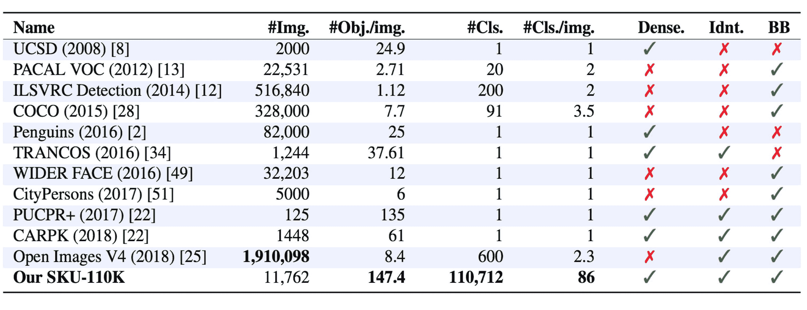
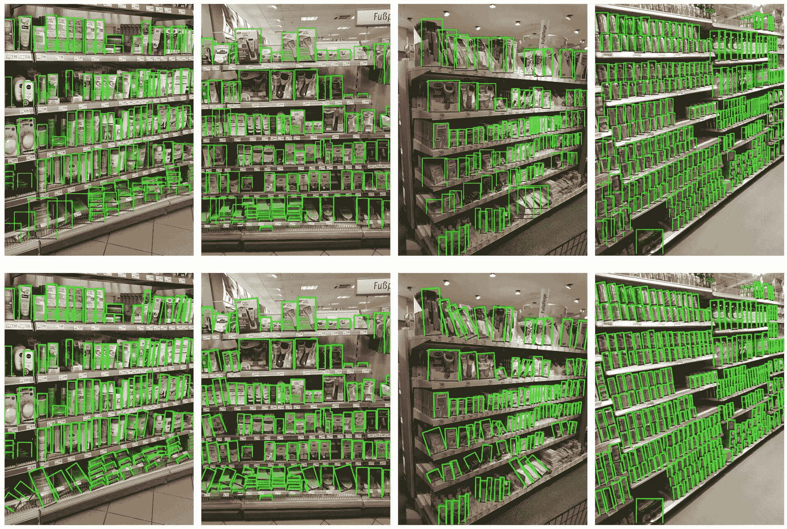

# SKU-110k 数据集

> 原文：[`docs.ultralytics.com/datasets/detect/sku-110k/`](https://docs.ultralytics.com/datasets/detect/sku-110k/)

[SKU-110k](https://github.com/eg4000/SKU110K_CVPR19)数据集是一组密集包装的零售货架图像，旨在支持对象检测任务的研究。由 Eran Goldman 等人开发，数据集包含超过 110,000 个独特的店内存货单位（SKU）类别，其中密集包装的物体通常外观相似甚至相同，放置在紧密的位置。

[`www.youtube.com/embed/_gRqR-miFPE`](https://www.youtube.com/embed/_gRqR-miFPE)

**观看：**如何使用 Ultralytics 在 SKU-110k 数据集上训练 YOLOv10 | 零售数据集



## 主要特点

+   SKU-110k 包含来自世界各地商店货架的图像，其中密集包装的物体对最先进的目标检测器构成挑战。

+   数据集包括超过 110,000 个独特的 SKU 类别，提供多样化的物体外观。

+   注释包括物体的边界框和 SKU 类别标签。

## 数据集结构

SKU-110k 数据集分为三个主要子集：

1.  **训练集**：这个子集包含用于训练目标检测模型的图像和注释。

1.  **验证集**：这个子集包含用于训练期间模型验证的图像和注释。

1.  **测试集**：这个子集旨在对训练好的目标检测模型进行最终评估。

## 应用

SKU-110k 数据集被广泛用于训练和评估对象检测任务中的深度学习模型，特别是在零售货架展示等密集包装场景中。数据集丰富的 SKU 类别和密集包装的物体排列使其成为计算机视觉领域研究人员和实践者的宝贵资源。

## 数据集 YAML

使用 YAML（另一种标记语言）文件定义数据集配置。它包含有关数据集路径、类别和其他相关信息的信息。对于 SKU-110K 数据集，`SKU-110K.yaml`文件位于[`github.com/ultralytics/ultralytics/blob/main/ultralytics/cfg/datasets/SKU-110K.yaml`](https://github.com/ultralytics/ultralytics/blob/main/ultralytics/cfg/datasets/SKU-110K.yaml)。

ultralytics/cfg/datasets/SKU-110K.yaml

```py
`# Ultralytics YOLO 🚀, AGPL-3.0 license # SKU-110K retail items dataset https://github.com/eg4000/SKU110K_CVPR19 by Trax Retail # Documentation: https://docs.ultralytics.com/datasets/detect/sku-110k/ # Example usage: yolo train data=SKU-110K.yaml # parent # ├── ultralytics # └── datasets #     └── SKU-110K  ← downloads here (13.6 GB)  # Train/val/test sets as 1) dir: path/to/imgs, 2) file: path/to/imgs.txt, or 3) list: [path/to/imgs1, path/to/imgs2, ..] path:  ../datasets/SKU-110K  # dataset root dir train:  train.txt  # train images (relative to 'path')  8219 images val:  val.txt  # val images (relative to 'path')  588 images test:  test.txt  # test images (optional)  2936 images  # Classes names:   0:  object  # Download script/URL (optional) --------------------------------------------------------------------------------------- download:  |   import shutil   from pathlib import Path    import numpy as np   import pandas as pd   from tqdm import tqdm    from ultralytics.utils.downloads import download   from ultralytics.utils.ops import xyxy2xywh    # Download   dir = Path(yaml['path'])  # dataset root dir   parent = Path(dir.parent)  # download dir   urls = ['http://trax-geometry.s3.amazonaws.com/cvpr_challenge/SKU110K_fixed.tar.gz']   download(urls, dir=parent)    # Rename directories   if dir.exists():   shutil.rmtree(dir)   (parent / 'SKU110K_fixed').rename(dir)  # rename dir   (dir / 'labels').mkdir(parents=True, exist_ok=True)  # create labels dir    # Convert labels   names = 'image', 'x1', 'y1', 'x2', 'y2', 'class', 'image_width', 'image_height'  # column names   for d in 'annotations_train.csv', 'annotations_val.csv', 'annotations_test.csv':   x = pd.read_csv(dir / 'annotations' / d, names=names).values  # annotations   images, unique_images = x[:, 0], np.unique(x[:, 0])   with open((dir / d).with_suffix('.txt').__str__().replace('annotations_', ''), 'w') as f:   f.writelines(f'./images/{s}\n' for s in unique_images)   for im in tqdm(unique_images, desc=f'Converting {dir / d}'):   cls = 0  # single-class dataset   with open((dir / 'labels' / im).with_suffix('.txt'), 'a') as f:   for r in x[images == im]:   w, h = r[6], r[7]  # image width, height   xywh = xyxy2xywh(np.array([[r[1] / w, r[2] / h, r[3] / w, r[4] / h]]))[0]  # instance   f.write(f"{cls} {xywh[0]:.5f} {xywh[1]:.5f} {xywh[2]:.5f} {xywh[3]:.5f}\n")  # write label` 
```

## 使用

要在 SKU-110K 数据集上训练一个 YOLOv8n 模型，使用 640 的图像大小进行 100 个 epochs，可以使用以下代码片段。要获取可用参数的全面列表，请参阅模型训练页面。

训练示例

```py
`from ultralytics import YOLO  # Load a model model = YOLO("yolov8n.pt")  # load a pretrained model (recommended for training)  # Train the model results = model.train(data="SKU-110K.yaml", epochs=100, imgsz=640)` 
```

```py
`# Start training from a pretrained *.pt model yolo  detect  train  data=SKU-110K.yaml  model=yolov8n.pt  epochs=100  imgsz=640` 
```

## 示例数据和注释

SKU-110k 数据集包含丰富的零售货架图像，其中物体密集包装，为对象检测任务提供丰富的上下文。以下是数据集中的一些示例数据及其相应的注释：



+   **密集包装的零售货架图像**：此图展示了零售货架设置中密集包装物体的示例。物体带有边界框和 SKU 类别标签的注释。

这个示例展示了 SKU-110k 数据集中数据的多样性和复杂性，并突显了高质量数据对目标检测任务的重要性。

## 引用和致谢

如果您在研究或开发工作中使用 SKU-110k 数据集，请引用以下论文：

```py
`@inproceedings{goldman2019dense,   author  =  {Eran Goldman and Roei Herzig and Aviv Eisenschtat and Jacob Goldberger and Tal Hassner},   title  =  {Precise Detection in Densely Packed Scenes},   booktitle  =  {Proc. Conf. Comput. Vision Pattern Recognition (CVPR)},   year  =  {2019} }` 
```

我们要感谢 Eran Goldman 等人为创建和维护 SKU-110k 数据集作为计算机视觉研究社区的宝贵资源。有关 SKU-110k 数据集及其创建者的更多信息，请访问 [SKU-110k 数据集 GitHub 仓库](https://github.com/eg4000/SKU110K_CVPR19)。

## 常见问题解答

### SKU-110k 数据集是什么以及对目标检测的重要性？

SKU-110k 数据集由 Eran Goldman 等人开发，包括超过 110,000 个独特的 SKU 类别的密集包装零售货架图像，旨在帮助目标检测研究。其重要性在于其挑战最先进的目标检测器处理多样化物体外观和近距离的能力，使其成为计算机视觉研究和实践者的宝贵资源。在我们的 SKU-110k 数据集部分了解更多关于数据集结构和应用的信息。

### 我如何使用 SKU-110k 数据集训练 YOLOv8 模型？

在 SKU-110k 数据集上训练 YOLOv8 模型非常简单。以下是一个训练 YOLOv8n 模型的示例，使用 640 的图像尺寸进行 100 个 epochs：

训练示例

```py
`from ultralytics import YOLO  # Load a model model = YOLO("yolov8n.pt")  # load a pretrained model (recommended for training)  # Train the model results = model.train(data="SKU-110K.yaml", epochs=100, imgsz=640)` 
```

```py
`# Start training from a pretrained *.pt model yolo  detect  train  data=SKU-110K.yaml  model=yolov8n.pt  epochs=100  imgsz=640` 
```

欲获得可用参数的详细列表，请参阅模型训练页面。

### SKU-110k 数据集的主要子集是什么？

SKU-110k 数据集分为三个主要子集：

1.  **训练集**：包含用于训练目标检测模型的图像和注释。

1.  **验证集**：包含用于模型训练过程中验证的图像和注释。

1.  **测试集**：用于最终评估已训练的目标检测模型。

有关更多详细信息，请参阅数据集结构部分。

### 我如何配置 SKU-110k 数据集进行训练？

SKU-110k 数据集的配置在一个 YAML 文件中定义，其中包括关于数据集路径、类别和其他相关信息的细节。`SKU-110K.yaml` 文件维护在 [SKU-110K.yaml](https://github.com/ultralytics/ultralytics/blob/main/ultralytics/cfg/datasets/SKU-110K.yaml)。例如，您可以根据我们的使用示例使用此配置来训练模型。

### SKU-110k 数据集在深度学习背景下的关键特征是什么？

SKU-110k 数据集包含来自世界各地的商店货架图像，展示了密集包装的物体，对目标检测器提出了重大挑战：

+   超过 110,000 个独特的 SKU 类别

+   多样化物体外观

+   注释包括边界框和 SKU 类别标签

这些特点使得 SKU-110k 数据集在目标检测任务中特别有价值，用于训练和评估深度学习模型。更多详细信息，请参阅关键特点部分。

### 我如何在我的研究中引用 SKU-110k 数据集？

如果您在研究或开发工作中使用 SKU-110k 数据集，请引用以下论文：

```py
`@inproceedings{goldman2019dense,   author  =  {Eran Goldman and Roei Herzig and Aviv Eisenschtat and Jacob Goldberger and Tal Hassner},   title  =  {Precise Detection in Densely Packed Scenes},   booktitle  =  {Proc. Conf. Comput. Vision Pattern Recognition (CVPR)},   year  =  {2019} }` 
```

数据集的更多信息可以在引用和致谢部分找到。
