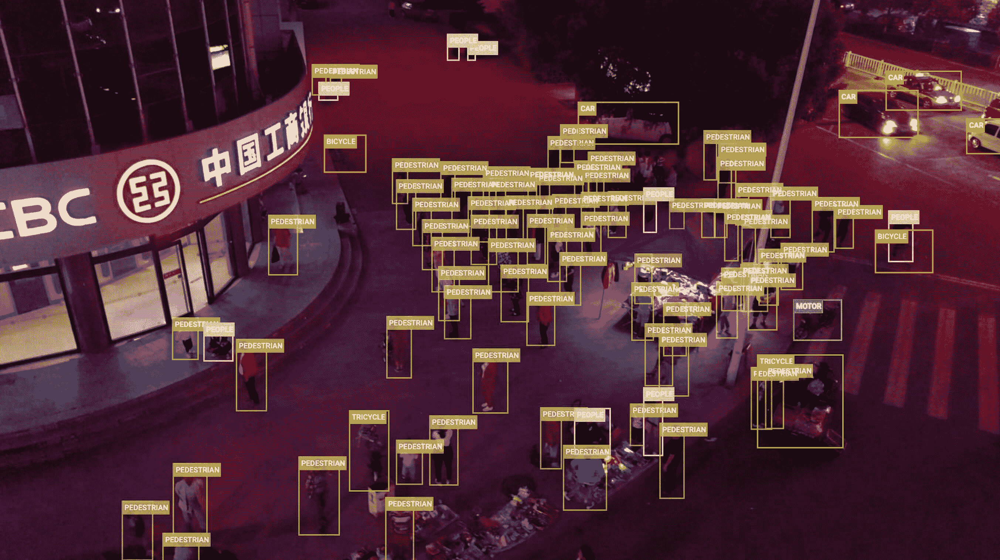

# VisDrone 数据集

> 原文：[`docs.ultralytics.com/datasets/detect/visdrone/`](https://docs.ultralytics.com/datasets/detect/visdrone/)

[VisDrone 数据集](https://github.com/VisDrone/VisDrone-Dataset)是由中国天津大学机器学习与数据挖掘实验室的 AISKYEYE 团队创建的大规模基准数据集。它包含针对与无人机图像和视频分析相关的各种计算机视觉任务的精心注释的真实数据。

VisDrone 由 288 个视频片段、261,908 帧和 10,209 张静态图像组成，这些图像由各种无人机搭载的相机捕获。该数据集涵盖了广泛的方面，包括位置（中国的 14 个不同城市）、环境（城市和乡村）、物体（行人、车辆、自行车等）和密度（稀疏和拥挤场景）。该数据集是在不同场景、天气和光照条件下使用各种无人机平台收集的。这些帧手动标注了超过 260 万个目标的边界框，如行人、汽车、自行车和三轮车。还提供了场景可见性、物体类别和遮挡等属性，以便更好地利用数据。

## 数据集结构

VisDrone 数据集分为五个主要子集，每个子集专注于特定任务：

1.  **任务 1**：图像中的物体检测

1.  **任务 2**：视频中的物体检测

1.  **任务 3**：单目标跟踪

1.  **任务 4**：多目标跟踪

1.  **任务 5**：人群计数

## 应用程序

VisDrone 数据集广泛用于训练和评估深度学习模型在基于无人机的计算机视觉任务中的表现，如物体检测、物体跟踪和人群计数。该数据集多样的传感器数据、物体注释和属性使其成为无人机计算机视觉领域研究人员和从业者的宝贵资源。

## 数据集 YAML

YAML（Yet Another Markup Language）文件用于定义数据集配置。它包含有关数据集路径、类别和其他相关信息。在 VisDrone 数据集的情况下，`VisDrone.yaml` 文件维护在 [`github.com/ultralytics/ultralytics/blob/main/ultralytics/cfg/datasets/VisDrone.yaml`](https://github.com/ultralytics/ultralytics/blob/main/ultralytics/cfg/datasets/VisDrone.yaml)。

ultralytics/cfg/datasets/VisDrone.yaml

```py
# Ultralytics YOLO 🚀, AGPL-3.0 license
# VisDrone2019-DET dataset https://github.com/VisDrone/VisDrone-Dataset by Tianjin University
# Documentation: https://docs.ultralytics.com/datasets/detect/visdrone/
# Example usage: yolo train data=VisDrone.yaml
# parent
# ├── ultralytics
# └── datasets
#     └── VisDrone  ← downloads here (2.3 GB)

# Train/val/test sets as 1) dir: path/to/imgs, 2) file: path/to/imgs.txt, or 3) list: [path/to/imgs1, path/to/imgs2, ..]
path:  ../datasets/VisDrone  # dataset root dir
train:  VisDrone2019-DET-train/images  # train images (relative to 'path')  6471 images
val:  VisDrone2019-DET-val/images  # val images (relative to 'path')  548 images
test:  VisDrone2019-DET-test-dev/images  # test images (optional)  1610 images

# Classes
names:
  0:  pedestrian
  1:  people
  2:  bicycle
  3:  car
  4:  van
  5:  truck
  6:  tricycle
  7:  awning-tricycle
  8:  bus
  9:  motor

# Download script/URL (optional) ---------------------------------------------------------------------------------------
download:  |
  import os
  from pathlib import Path

  from ultralytics.utils.downloads import download

  def visdrone2yolo(dir):
  from PIL import Image
  from tqdm import tqdm

  def convert_box(size, box):
  # Convert VisDrone box to YOLO xywh box
  dw = 1\. / size[0]
  dh = 1\. / size[1]
  return (box[0] + box[2] / 2) * dw, (box[1] + box[3] / 2) * dh, box[2] * dw, box[3] * dh

  (dir / 'labels').mkdir(parents=True, exist_ok=True)  # make labels directory
  pbar = tqdm((dir / 'annotations').glob('*.txt'), desc=f'Converting {dir}')
  for f in pbar:
  img_size = Image.open((dir / 'images' / f.name).with_suffix('.jpg')).size
  lines = []
  with open(f, 'r') as file:  # read annotation.txt
  for row in [x.split(',') for x in file.read().strip().splitlines()]:
  if row[4] == '0':  # VisDrone 'ignored regions' class 0
  continue
  cls = int(row[5]) - 1
  box = convert_box(img_size, tuple(map(int, row[:4])))
  lines.append(f"{cls} {' '.join(f'{x:.6f}' for x in box)}\n")
  with open(str(f).replace(f'{os.sep}annotations{os.sep}', f'{os.sep}labels{os.sep}'), 'w') as fl:
  fl.writelines(lines)  # write label.txt

  # Download
  dir = Path(yaml['path'])  # dataset root dir
  urls = ['https://github.com/ultralytics/assets/releases/download/v0.0.0/VisDrone2019-DET-train.zip',
  'https://github.com/ultralytics/assets/releases/download/v0.0.0/VisDrone2019-DET-val.zip',
  'https://github.com/ultralytics/assets/releases/download/v0.0.0/VisDrone2019-DET-test-dev.zip',
  'https://github.com/ultralytics/assets/releases/download/v0.0.0/VisDrone2019-DET-test-challenge.zip']
  download(urls, dir=dir, curl=True, threads=4)

  # Convert
  for d in 'VisDrone2019-DET-train', 'VisDrone2019-DET-val', 'VisDrone2019-DET-test-dev':
  visdrone2yolo(dir / d)  # convert VisDrone annotations to YOLO labels 
```

## 用法

要在 VisDrone 数据集上训练 YOLOv8n 模型 100 个周期，图像大小为 640，可以使用以下代码片段。有关可用参数的完整列表，请参阅模型训练页面。

训练示例

```py
from ultralytics import YOLO

# Load a model
model = YOLO("yolov8n.pt")  # load a pretrained model (recommended for training)

# Train the model
results = model.train(data="VisDrone.yaml", epochs=100, imgsz=640) 
```

```py
# Start training from a pretrained *.pt model
yolo  detect  train  data=VisDrone.yaml  model=yolov8n.pt  epochs=100  imgsz=640 
```

## 示例数据和注释

VisDrone 数据集包含由无人机搭载的相机捕获的多样化图像和视频。以下是数据集中一些数据的示例及其相应的注释：



+   **任务 1**：图像中的物体检测 - 本图展示了图像中的物体检测示例，其中物体用边界框注释。数据集提供了来自不同位置、环境和密度的各种图像，以促进模型开发。

该示例展示了 VisDrone 数据集中数据的多样性和复杂性，并突出了对于基于无人机的计算机视觉任务而言高质量传感器数据的重要性。

## 引用和致谢

如果您在研究或开发工作中使用 VisDrone 数据集，请引用以下论文：

```py
@ARTICLE{9573394,
  author={Zhu, Pengfei and Wen, Longyin and Du, Dawei and Bian, Xiao and Fan, Heng and Hu, Qinghua and Ling, Haibin},
  journal={IEEE Transactions on Pattern Analysis and Machine Intelligence},
  title={Detection and Tracking Meet Drones Challenge},
  year={2021},
  volume={},
  number={},
  pages={1-1},
  doi={10.1109/TPAMI.2021.3119563}} 
```

我们要感谢中国天津大学机器学习与数据挖掘实验室的 AISKYEYE 团队创建和维护 VisDrone 数据集，作为无人机计算机视觉研究社区的宝贵资源。有关 VisDrone 数据集及其创建者的更多信息，请访问[VisDrone 数据集 GitHub 仓库](https://github.com/VisDrone/VisDrone-Dataset)。

## 常见问题解答

### 什么是 VisDrone 数据集，其主要特点是什么？

[VisDrone 数据集](https://github.com/VisDrone/VisDrone-Dataset)是中国天津大学 AISKYEYE 团队创建的大规模基准，旨在处理与无人机图像和视频分析相关的各种计算机视觉任务。其主要特点包括：- **组成**：288 个视频剪辑，261,908 帧和 10,209 张静态图像。- **注释**：超过 260 万个边界框，用于行人、汽车、自行车和三轮车等对象。- **多样性**：收集于 14 个城市，包括城市和农村设置，不同的天气和光照条件。- **任务**：分为五个主要任务 - 图像和视频中的物体检测，单个和多个物体跟踪，以及人群计数。

### 我如何使用 VisDrone 数据集训练 YOLOv8 模型与 Ultralytics？

要在 VisDrone 数据集上使用 YOLOv8 模型进行 100 个 epochs 的训练，图像大小为 640，您可以按照以下步骤操作：

训练示例

```py
from ultralytics import YOLO

# Load a pretrained model
model = YOLO("yolov8n.pt")

# Train the model
results = model.train(data="VisDrone.yaml", epochs=100, imgsz=640) 
```

```py
# Start training from a pretrained *.pt model
yolo  detect  train  data=VisDrone.yaml  model=yolov8n.pt  epochs=100  imgsz=640 
```

对于额外的配置选项，请参考模型训练页面。

### VisDrone 数据集的主要子集及其应用是什么？

VisDrone 数据集分为五个主要子集，每个子集都针对特定的计算机视觉任务：1\. **任务 1**：图像中的物体检测。2\. **任务 2**：视频中的物体检测。3\. **任务 3**：单个物体跟踪。4\. **任务 4**：多个物体跟踪。5\. **任务 5**：人群计数。

这些子集广泛用于训练和评估基于无人机的应用中深度学习模型，如监视、交通监控和公共安全。

### 我在 Ultralytics 中如何找到 VisDrone 数据集的配置文件？

VisDrone 数据集的配置文件，`VisDrone.yaml`，可以在 Ultralytics 仓库的以下链接找到：[VisDrone.yaml](https://github.com/ultralytics/ultralytics/blob/main/ultralytics/cfg/datasets/VisDrone.yaml)。

### 如果我在研究中使用 VisDrone 数据集，如何引用它？

如果您在研究或开发工作中使用 VisDrone 数据集，请引用以下论文：

BibTeX

```py
@ARTICLE{9573394,
  author={Zhu, Pengfei and Wen, Longyin and Du, Dawei and Bian, Xiao and Fan, Heng and Hu, Qinghua and Ling, Haibin},
  journal={IEEE Transactions on Pattern Analysis and Machine Intelligence},
  title={Detection and Tracking Meet Drones Challenge},
  year={2021},
  volume={},
  number={},
  pages={1-1},
  doi={10.1109/TPAMI.2021.3119563}} 
```
