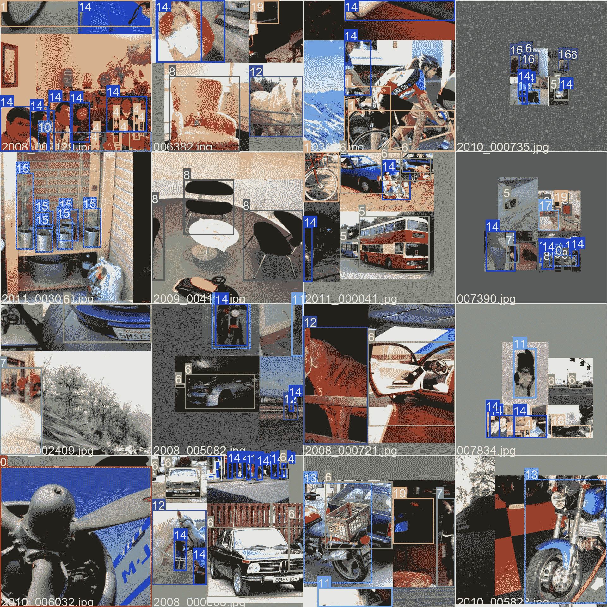

# VOC 数据集

> 原文：[`docs.ultralytics.com/datasets/detect/voc/`](https://docs.ultralytics.com/datasets/detect/voc/)

[PASCAL VOC](http://host.robots.ox.ac.uk/pascal/VOC/)（视觉对象类别）数据集是一个著名的物体检测、分割和分类数据集。它旨在促进对各种物体类别的研究，并常用于评估计算机视觉模型。对于从事物体检测、分割和分类任务的研究人员和开发者来说，这是一个必备的数据集。

## 主要特点

+   VOC 数据集包括两个主要挑战：VOC2007 和 VOC2012。

+   该数据集包含 20 种物体类别，包括常见的如汽车、自行车和动物，以及更具体的类别如船只、沙发和餐桌。

+   注释包括物体检测和分类任务的对象边界框和类标签，以及分割任务的分割蒙版。

+   VOC 提供标准化的评估指标，如平均精度（mAP），用于物体检测和分类，使其适合比较模型性能。

## 数据集结构

VOC 数据集分为三个子集：

1.  **训练集**：该子集包含用于训练物体检测、分割和分类模型的图像。

1.  **验证集**：该子集包含用于模型训练期间验证目的的图像。

1.  **测试集**：该子集包含用于测试和基准测试已训练模型的图像。此子集的地面真实注释不公开，其结果提交至[PASCAL VOC 评估服务器](http://host.robots.ox.ac.uk:8080/leaderboard/displaylb.php)进行性能评估。

## 应用

VOC 数据集广泛用于训练和评估深度学习模型，包括物体检测（如 YOLO、Faster R-CNN 和 SSD）、实例分割（如 Mask R-CNN）和图像分类。数据集具有多样的物体类别集合、大量标注图像和标准化评估指标，使其成为计算机视觉研究人员和从业者的重要资源。

## 数据集 YAML

YAML（另一种标记语言）文件用于定义数据集配置。它包含关于数据集路径、类别和其他相关信息的信息。在 VOC 数据集的情况下，`VOC.yaml`文件维护在[`github.com/ultralytics/ultralytics/blob/main/ultralytics/cfg/datasets/VOC.yaml`](https://github.com/ultralytics/ultralytics/blob/main/ultralytics/cfg/datasets/VOC.yaml)。

ultralytics/cfg/datasets/VOC.yaml

```py
`# Ultralytics YOLO 🚀, AGPL-3.0 license # PASCAL VOC dataset http://host.robots.ox.ac.uk/pascal/VOC by University of Oxford # Documentation: # Documentation: https://docs.ultralytics.com/datasets/detect/voc/ # Example usage: yolo train data=VOC.yaml # parent # ├── ultralytics # └── datasets #     └── VOC  ← downloads here (2.8 GB)  # Train/val/test sets as 1) dir: path/to/imgs, 2) file: path/to/imgs.txt, or 3) list: [path/to/imgs1, path/to/imgs2, ..] path:  ../datasets/VOC train:  # train images (relative to 'path')  16551 images   -  images/train2012   -  images/train2007   -  images/val2012   -  images/val2007 val:  # val images (relative to 'path')  4952 images   -  images/test2007 test:  # test images (optional)   -  images/test2007  # Classes names:   0:  aeroplane   1:  bicycle   2:  bird   3:  boat   4:  bottle   5:  bus   6:  car   7:  cat   8:  chair   9:  cow   10:  diningtable   11:  dog   12:  horse   13:  motorbike   14:  person   15:  pottedplant   16:  sheep   17:  sofa   18:  train   19:  tvmonitor  # Download script/URL (optional) --------------------------------------------------------------------------------------- download:  |   import xml.etree.ElementTree as ET    from tqdm import tqdm   from ultralytics.utils.downloads import download   from pathlib import Path    def convert_label(path, lb_path, year, image_id):   def convert_box(size, box):   dw, dh = 1\. / size[0], 1\. / size[1]   x, y, w, h = (box[0] + box[1]) / 2.0 - 1, (box[2] + box[3]) / 2.0 - 1, box[1] - box[0], box[3] - box[2]   return x * dw, y * dh, w * dw, h * dh    in_file = open(path / f'VOC{year}/Annotations/{image_id}.xml')   out_file = open(lb_path, 'w')   tree = ET.parse(in_file)   root = tree.getroot()   size = root.find('size')   w = int(size.find('width').text)   h = int(size.find('height').text)    names = list(yaml['names'].values())  # names list   for obj in root.iter('object'):   cls = obj.find('name').text   if cls in names and int(obj.find('difficult').text) != 1:   xmlbox = obj.find('bndbox')   bb = convert_box((w, h), [float(xmlbox.find(x).text) for x in ('xmin', 'xmax', 'ymin', 'ymax')])   cls_id = names.index(cls)  # class id   out_file.write(" ".join(str(a) for a in (cls_id, *bb)) + '\n')     # Download   dir = Path(yaml['path'])  # dataset root dir   url = 'https://github.com/ultralytics/assets/releases/download/v0.0.0/'   urls = [f'{url}VOCtrainval_06-Nov-2007.zip',  # 446MB, 5012 images   f'{url}VOCtest_06-Nov-2007.zip',  # 438MB, 4953 images   f'{url}VOCtrainval_11-May-2012.zip']  # 1.95GB, 17126 images   download(urls, dir=dir / 'images', curl=True, threads=3, exist_ok=True)  # download and unzip over existing paths (required)    # Convert   path = dir / 'images/VOCdevkit'   for year, image_set in ('2012', 'train'), ('2012', 'val'), ('2007', 'train'), ('2007', 'val'), ('2007', 'test'):   imgs_path = dir / 'images' / f'{image_set}{year}'   lbs_path = dir / 'labels' / f'{image_set}{year}'   imgs_path.mkdir(exist_ok=True, parents=True)   lbs_path.mkdir(exist_ok=True, parents=True)    with open(path / f'VOC{year}/ImageSets/Main/{image_set}.txt') as f:   image_ids = f.read().strip().split()   for id in tqdm(image_ids, desc=f'{image_set}{year}'):   f = path / f'VOC{year}/JPEGImages/{id}.jpg'  # old img path   lb_path = (lbs_path / f.name).with_suffix('.txt')  # new label path   f.rename(imgs_path / f.name)  # move image   convert_label(path, lb_path, year, id)  # convert labels to YOLO format` 
```

## 使用

若要在 VOC 数据集上使用 640 像素大小进行 100 轮次的 YOLOv8n 模型训练，可以使用以下代码片段。有关可用参数的详细列表，请参阅模型训练页面。

训练示例

```py
`from ultralytics import YOLO  # Load a model model = YOLO("yolov8n.pt")  # load a pretrained model (recommended for training)  # Train the model results = model.train(data="VOC.yaml", epochs=100, imgsz=640)` 
```

```py
`# Start training from a pretrained *.pt model yolo  detect  train  data=VOC.yaml  model=yolov8n.pt  epochs=100  imgsz=640` 
```

## 样本图像和注释

VOC 数据集包含多种类别和复杂场景的图像。以下是数据集中一些图像的示例，以及它们对应的标注：



+   **拼贴图像**：这张图展示了由拼贴数据集图像组成的训练批次。拼贴是一种在训练过程中使用的技术，将多个图像合并成一张图像，以增加每个训练批次中对象和场景的多样性。这有助于提高模型对不同对象大小、长宽比和环境背景的泛化能力。

这个示例展示了 VOC 数据集中图像的多样性和复杂性，以及在训练过程中使用拼贴的好处。

## 引用和致谢

如果您在研究或开发中使用 VOC 数据集，请引用以下论文：

```py
`@misc{everingham2010pascal,   title={The PASCAL Visual Object Classes (VOC) Challenge},   author={Mark Everingham and Luc Van Gool and Christopher K. I. Williams and John Winn and Andrew Zisserman},   year={2010},   eprint={0909.5206},   archivePrefix={arXiv},   primaryClass={cs.CV} }` 
```

我们要感谢 PASCAL VOC 联盟为计算机视觉社区创建和维护这一宝贵资源。有关 VOC 数据集及其创建者的更多信息，请访问 [PASCAL VOC 数据集网站](http://host.robots.ox.ac.uk/pascal/VOC/)。

## 常见问题解答

### PASCAL VOC 数据集是什么，为何在计算机视觉任务中如此重要？

[PASCAL VOC](http://host.robots.ox.ac.uk/pascal/VOC/)（视觉对象类别）数据集是计算机视觉中物体检测、分割和分类的著名基准。它包含了跨 20 种不同对象类别的详细标注，如边界框、类别标签和分割掩码。研究人员广泛使用它来评估 Faster R-CNN、YOLO 和 Mask R-CNN 等模型的性能，因为它具有如均值平均精度（mAP）等标准化评估指标。

### 如何使用 VOC 数据集训练 YOLOv8 模型？

要使用 VOC 数据集训练 YOLOv8 模型，您需要在 YAML 文件中配置数据集。以下是一个示例，用于开始训练一个图像大小为 640 的 YOLOv8n 模型，训练 100 个 epochs：

训练示例

```py
`from ultralytics import YOLO  # Load a model model = YOLO("yolov8n.pt")  # load a pretrained model (recommended for training)  # Train the model results = model.train(data="VOC.yaml", epochs=100, imgsz=640)` 
```

```py
`# Start training from a pretrained *.pt model yolo  detect  train  data=VOC.yaml  model=yolov8n.pt  epochs=100  imgsz=640` 
```

### VOC 数据集中包含的主要挑战是什么？

VOC 数据集包括两个主要挑战：VOC2007 和 VOC2012。这些挑战涵盖了物体检测、分割和分类在 20 种不同对象类别上的测试。每张图像都经过详细标注，包括边界框、类别标签和分割掩码。这些挑战提供了像 mAP 这样的标准化指标，便于比较和基准测试不同的计算机视觉模型。

### PASCAL VOC 数据集如何增强模型的基准测试和评估？

PASCAL VOC 数据集通过其详细的标注和均值平均精度（mAP）等标准化指标增强了模型的基准测试和评估。这些指标对于评估物体检测和分类模型的性能至关重要。数据集中多样且复杂的图像确保了对各种现实场景进行全面的模型评估。

### 如何在 YOLO 模型中使用 VOC 数据集进行语义分割？

要在 YOLO 模型中使用 VOC 数据集进行语义分割任务，您需要在 YAML 文件中正确配置数据集。YAML 文件定义了训练语义分割模型所需的路径和类别。详细的设置请查看 [VOC.yaml](https://github.com/ultralytics/ultralytics/blob/main/ultralytics/cfg/datasets/VOC.yaml) 中的 VOC 数据集 YAML 配置文件。
