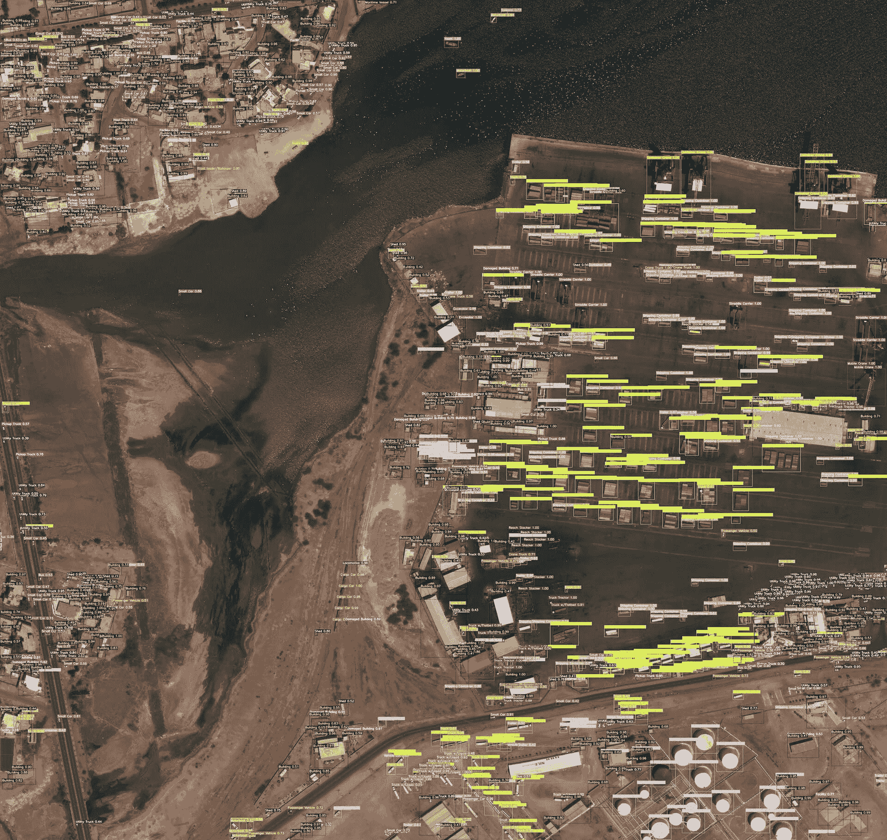

# xView 数据集

> 原文：[`docs.ultralytics.com/datasets/detect/xview/`](https://docs.ultralytics.com/datasets/detect/xview/)

[xView](http://xviewdataset.org/)数据集是最大的公共可用高空图像数据集之一，包含来自世界各地复杂场景的图像，并使用边界框进行注释。xView 数据集的目标是加速四个计算机视觉前沿领域的进展：

1.  降低检测的最小分辨率。

1.  提高学习效率。

1.  使发现更多物体类别成为可能。

1.  改善对细粒度类别的检测。

xView 建立在像“上下文中的常见物体”（COCO）这样的挑战成功之上，旨在利用计算机视觉分析来自太空的日益增长的可用图像，以便以新的方式理解视觉世界并解决一系列重要应用。

## 关键特性

+   xView 包含超过 100 万个物体实例，跨越 60 个类别。

+   该数据集的分辨率为 0.3 米，提供比大多数公共卫星影像数据集更高分辨率的图像。

+   xView 具有多样化的小型、稀有、细粒度和多类型物体的边界框注释集合。

+   附带一个使用 TensorFlow 物体检测 API 的预训练基线模型和一个 PyTorch 示例。

## 数据集结构

xView 数据集由从 WorldView-3 卫星收集的卫星图像组成，具有 0.3 米的地面采样距离。它包含超过 100 万个物体，跨越 60 个类别，覆盖超过 1,400 平方公里的图像。

## 应用

xView 数据集广泛用于训练和评估用于高空图像物体检测的深度学习模型。该数据集多样的物体类别和高分辨率图像使其成为计算机视觉领域研究人员和从业者的宝贵资源，特别是在卫星图像分析方面。

## 数据集 YAML

YAML（Yet Another Markup Language）文件用于定义数据集配置。它包含有关数据集路径、类别和其他相关信息的信息。在 xView 数据集中，`xView.yaml`文件维护在[`github.com/ultralytics/ultralytics/blob/main/ultralytics/cfg/datasets/xView.yaml`](https://github.com/ultralytics/ultralytics/blob/main/ultralytics/cfg/datasets/xView.yaml)。

ultralytics/cfg/datasets/xView.yaml

```py
# Ultralytics YOLO 🚀, AGPL-3.0 license
# DIUx xView 2018 Challenge https://challenge.xviewdataset.org by U.S. National Geospatial-Intelligence Agency (NGA)
# --------  DOWNLOAD DATA MANUALLY and jar xf val_images.zip to 'datasets/xView' before running train command!  --------
# Documentation: https://docs.ultralytics.com/datasets/detect/xview/
# Example usage: yolo train data=xView.yaml
# parent
# ├── ultralytics
# └── datasets
#     └── xView  ← downloads here (20.7 GB)

# Train/val/test sets as 1) dir: path/to/imgs, 2) file: path/to/imgs.txt, or 3) list: [path/to/imgs1, path/to/imgs2, ..]
path:  ../datasets/xView  # dataset root dir
train:  images/autosplit_train.txt  # train images (relative to 'path') 90% of 847 train images
val:  images/autosplit_val.txt  # train images (relative to 'path') 10% of 847 train images

# Classes
names:
  0:  Fixed-wing Aircraft
  1:  Small Aircraft
  2:  Cargo Plane
  3:  Helicopter
  4:  Passenger Vehicle
  5:  Small Car
  6:  Bus
  7:  Pickup Truck
  8:  Utility Truck
  9:  Truck
  10:  Cargo Truck
  11:  Truck w/Box
  12:  Truck Tractor
  13:  Trailer
  14:  Truck w/Flatbed
  15:  Truck w/Liquid
  16:  Crane Truck
  17:  Railway Vehicle
  18:  Passenger Car
  19:  Cargo Car
  20:  Flat Car
  21:  Tank car
  22:  Locomotive
  23:  Maritime Vessel
  24:  Motorboat
  25:  Sailboat
  26:  Tugboat
  27:  Barge
  28:  Fishing Vessel
  29:  Ferry
  30:  Yacht
  31:  Container Ship
  32:  Oil Tanker
  33:  Engineering Vehicle
  34:  Tower crane
  35:  Container Crane
  36:  Reach Stacker
  37:  Straddle Carrier
  38:  Mobile Crane
  39:  Dump Truck
  40:  Haul Truck
  41:  Scraper/Tractor
  42:  Front loader/Bulldozer
  43:  Excavator
  44:  Cement Mixer
  45:  Ground Grader
  46:  Hut/Tent
  47:  Shed
  48:  Building
  49:  Aircraft Hangar
  50:  Damaged Building
  51:  Facility
  52:  Construction Site
  53:  Vehicle Lot
  54:  Helipad
  55:  Storage Tank
  56:  Shipping container lot
  57:  Shipping Container
  58:  Pylon
  59:  Tower

# Download script/URL (optional) ---------------------------------------------------------------------------------------
download:  |
  import json
  import os
  from pathlib import Path

  import numpy as np
  from PIL import Image
  from tqdm import tqdm

  from ultralytics.data.utils import autosplit
  from ultralytics.utils.ops import xyxy2xywhn

  def convert_labels(fname=Path('xView/xView_train.geojson')):
  # Convert xView geoJSON labels to YOLO format
  path = fname.parent
  with open(fname) as f:
  print(f'Loading {fname}...')
  data = json.load(f)

  # Make dirs
  labels = Path(path / 'labels' / 'train')
  os.system(f'rm -rf {labels}')
  labels.mkdir(parents=True, exist_ok=True)

  # xView classes 11-94 to 0-59
  xview_class2index = [-1, -1, -1, -1, -1, -1, -1, -1, -1, -1, -1, 0, 1, 2, -1, 3, -1, 4, 5, 6, 7, 8, -1, 9, 10, 11,
  12, 13, 14, 15, -1, -1, 16, 17, 18, 19, 20, 21, 22, -1, 23, 24, 25, -1, 26, 27, -1, 28, -1,
  29, 30, 31, 32, 33, 34, 35, 36, 37, -1, 38, 39, 40, 41, 42, 43, 44, 45, -1, -1, -1, -1, 46,
  47, 48, 49, -1, 50, 51, -1, 52, -1, -1, -1, 53, 54, -1, 55, -1, -1, 56, -1, 57, -1, 58, 59]

  shapes = {}
  for feature in tqdm(data['features'], desc=f'Converting {fname}'):
  p = feature['properties']
  if p['bounds_imcoords']:
  id = p['image_id']
  file = path / 'train_images' / id
  if file.exists():  # 1395.tif missing
  try:
  box = np.array([int(num) for num in p['bounds_imcoords'].split(",")])
  assert box.shape[0] == 4, f'incorrect box shape {box.shape[0]}'
  cls = p['type_id']
  cls = xview_class2index[int(cls)]  # xView class to 0-60
  assert 59 >= cls >= 0, f'incorrect class index {cls}'

  # Write YOLO label
  if id not in shapes:
  shapes[id] = Image.open(file).size
  box = xyxy2xywhn(box[None].astype(np.float), w=shapes[id][0], h=shapes[id][1], clip=True)
  with open((labels / id).with_suffix('.txt'), 'a') as f:
  f.write(f"{cls} {' '.join(f'{x:.6f}' for x in box[0])}\n")  # write label.txt
  except Exception as e:
  print(f'WARNING: skipping one label for {file}: {e}')

  # Download manually from https://challenge.xviewdataset.org
  dir = Path(yaml['path'])  # dataset root dir
  # urls = ['https://d307kc0mrhucc3.cloudfront.net/train_labels.zip',  # train labels
  #         'https://d307kc0mrhucc3.cloudfront.net/train_images.zip',  # 15G, 847 train images
  #         'https://d307kc0mrhucc3.cloudfront.net/val_images.zip']  # 5G, 282 val images (no labels)
  # download(urls, dir=dir)

  # Convert labels
  convert_labels(dir / 'xView_train.geojson')

  # Move images
  images = Path(dir / 'images')
  images.mkdir(parents=True, exist_ok=True)
  Path(dir / 'train_images').rename(dir / 'images' / 'train')
  Path(dir / 'val_images').rename(dir / 'images' / 'val')

  # Split
  autosplit(dir / 'images' / 'train') 
```

## 使用

要在 xView 数据集上训练一个模型 100 个周期，图像大小为 640，可以使用以下代码片段。有关可用参数的完整列表，请参阅模型训练页面。

训练示例

```py
from ultralytics import YOLO

# Load a model
model = YOLO("yolov8n.pt")  # load a pretrained model (recommended for training)

# Train the model
results = model.train(data="xView.yaml", epochs=100, imgsz=640) 
```

```py
# Start training from a pretrained *.pt model
yolo  detect  train  data=xView.yaml  model=yolov8n.pt  epochs=100  imgsz=640 
```

## 示例数据和注释

xView 数据集包含高分辨率卫星图像，具有多样化的物体，使用边界框进行注释。以下是来自该数据集的一些数据示例及其相应的注释：



+   **航拍图像**：这幅图像展示了航拍图像中对象检测的示例，其中对象用边界框进行了注释。该数据集提供高分辨率卫星图像，以便为该任务开发模型。

此示例展示了 xView 数据集中数据的多样性和复杂性，并突显了高质量卫星图像对对象检测任务的重要性。

## 引用和致谢

如果您在研究或开发工作中使用 xView 数据集，请引用以下论文：

```py
@misc{lam2018xview,
  title={xView: Objects in Context in Overhead Imagery},
  author={Darius Lam and Richard Kuzma and Kevin McGee and Samuel Dooley and Michael Laielli and Matthew Klaric and Yaroslav Bulatov and Brendan McCord},
  year={2018},
  eprint={1802.07856},
  archivePrefix={arXiv},
  primaryClass={cs.CV}
} 
```

我们要感谢[国防创新单位](https://www.diu.mil/)（DIU）和 xView 数据集的创建者，感谢他们为计算机视觉研究社区做出的宝贵贡献。有关 xView 数据集及其创建者的更多信息，请访问[xView 数据集网站](http://xviewdataset.org/)。

## 常见问题解答

### xView 数据集是什么，以及它如何促进计算机视觉研究？

[xView](http://xviewdataset.org/)数据集是最大的公开高分辨率航拍图像集合之一，包含 60 个类别的超过 100 万个对象实例。它旨在增强计算机视觉研究的各个方面，如降低检测的最小分辨率、提高学习效率、发现更多对象类别以及推进细粒度对象检测。

### 如何使用 Ultralytics YOLO 在 xView 数据集上训练模型？

使用 Ultralytics YOLO 在 xView 数据集上训练模型，请按照以下步骤进行：

训练示例

```py
from ultralytics import YOLO

# Load a model
model = YOLO("yolov8n.pt")  # load a pretrained model (recommended for training)

# Train the model
results = model.train(data="xView.yaml", epochs=100, imgsz=640) 
```

```py
# Start training from a pretrained *.pt model
yolo  detect  train  data=xView.yaml  model=yolov8n.pt  epochs=100  imgsz=640 
```

有关详细的参数和设置，请参阅模型训练页面。

### xView 数据集的关键特性是什么？

xView 数据集以其全面的特性脱颖而出：- 超过 100 万个 60 个不同类别的对象实例。- 地面分辨率为 0.3 米的高分辨率影像。- 包括小型、稀有和细粒度对象类型，所有这些都用边界框进行了注释。- 提供了一个预训练的基线模型和 TensorFlow 和 PyTorch 的示例。

### xView 数据集的数据结构及其如何标注？

xView 数据集由 WorldView-3 卫星收集的高分辨率卫星图像组成，地面采样距离为 0.3 米。它包含约 1400 平方公里的影像中超过 100 万个对象，涵盖 60 个类别。数据集中的每个对象都用边界框进行了注释，非常适合用于训练和评估用于航拍图像中对象检测的深度学习模型。有关详细概述，请参阅此处的数据集结构部分。

### 如何在我的研究中引用 xView 数据集？

如果您在研究中使用 xView 数据集，请引用以下论文：

BibTeX

```py
@misc{lam2018xview,
  title={xView: Objects in Context in Overhead Imagery},
  author={Darius Lam and Richard Kuzma and Kevin McGee and Samuel Dooley and Michael Laielli and Matthew Klaric and Yaroslav Bulatov and Brendan McCord},
  year={2018},
  eprint={1802.07856},
  archivePrefix={arXiv},
  primaryClass={cs.CV}
} 
```

关于 xView 数据集的更多信息，请访问官方[xView 数据集网站](http://xviewdataset.org/)。
