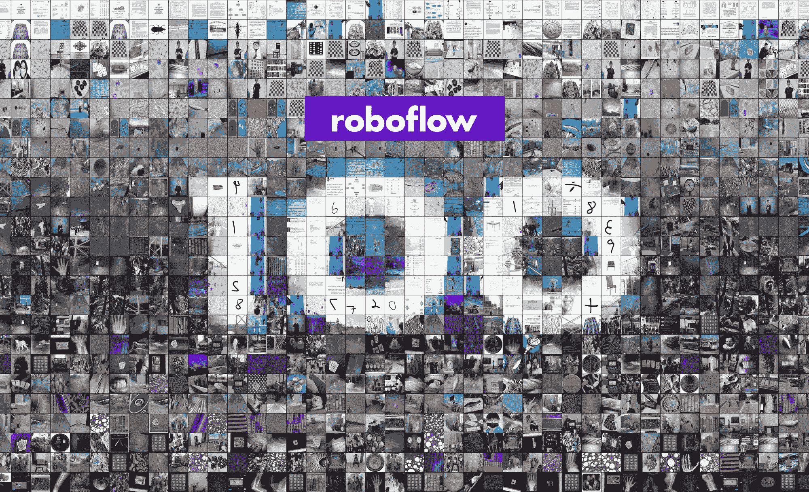
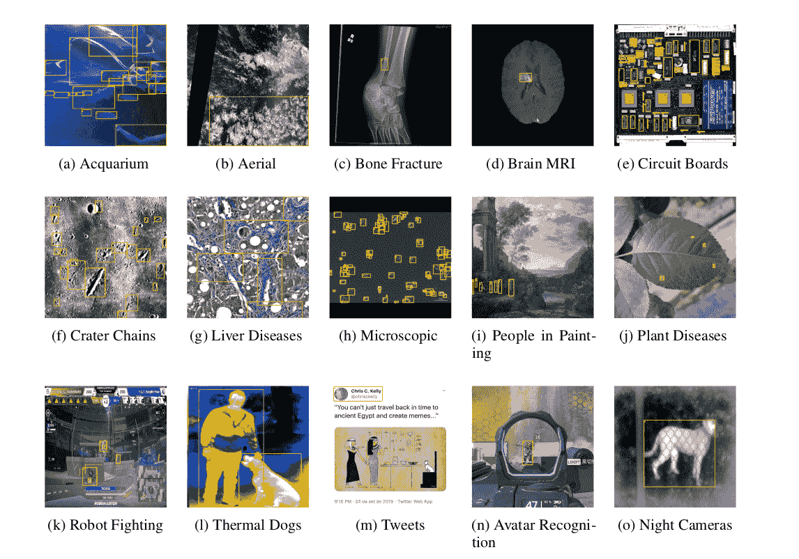

# Roboflow 100 数据集

> 原文：[`docs.ultralytics.com/datasets/detect/roboflow-100/`](https://docs.ultralytics.com/datasets/detect/roboflow-100/)

Roboflow 100 由[Roboflow](https://roboflow.com/?ref=ultralytics)开发，由英特尔赞助，是一个突破性的物体检测基准。它包括从超过 90,000 个公共数据集中抽样的 100 个多样化数据集。该基准旨在测试模型对包括医疗、航空影像和视频游戏在内的各种领域的适应性。



## 主要特点

+   包括来自七个领域的 100 个数据集：航空影像、视频游戏、显微镜下、水下、文档、电磁和现实世界。

+   该基准包括 224,714 张图像，涵盖 805 个类别，感谢超过 11,170 小时的标注工作。

+   所有图像均调整为 640x640 像素，重点消除类别模糊和过滤不充分的类别。

+   标注包括物体的边界框，适合用于训练和评估物体检测模型。

## 数据集结构

Roboflow 100 数据集分为七个类别，每个类别包含一组独特的数据集、图像和类别：

+   **航空影像**：包括 7 个数据集，共计 9,683 张图像，涵盖 24 个不同类别。

+   **视频游戏**：包括 7 个数据集，共计 11,579 张图像，涵盖 88 个类别。

+   **显微镜下**：包括 11 个数据集，共计 13,378 张图像，涵盖 28 个类别。

+   **水下**：包括 5 个数据集，共计 18,003 张图像，涵盖 39 个类别。

+   **文档**：包括 8 个数据集，共计 24,813 张图像，分为 90 个类别。

+   **电磁**：包括 12 个数据集，共计 36,381 张图像，涵盖 41 个类别。

+   **现实世界**：最大的类别，包括 50 个数据集，共计 110,615 张图像，涵盖 495 个类别。

这种结构为物体检测模型提供了一个多样化和广泛的测试平台，反映了真实的应用场景。

## 基准测试

数据集基准测试通过使用像准确率、平均精度和 F1 分数等标准化指标，评估特定数据集上机器学习模型的性能。

基准测试

基准测试结果将存储在"ultralytics-benchmarks/evaluation.txt"中。

基准测试示例

```py
`import os import shutil from pathlib import Path  from ultralytics.utils.benchmarks import RF100Benchmark  # Initialize RF100Benchmark and set API key benchmark = RF100Benchmark() benchmark.set_key(api_key="YOUR_ROBOFLOW_API_KEY")  # Parse dataset and define file paths names, cfg_yamls = benchmark.parse_dataset() val_log_file = Path("ultralytics-benchmarks") / "validation.txt" eval_log_file = Path("ultralytics-benchmarks") / "evaluation.txt"  # Run benchmarks on each dataset in RF100 for ind, path in enumerate(cfg_yamls):     path = Path(path)     if path.exists():         # Fix YAML file and run training         benchmark.fix_yaml(str(path))         os.system(f"yolo detect train data={path} model=yolov8s.pt epochs=1 batch=16")          # Run validation and evaluate         os.system(f"yolo detect val data={path} model=runs/detect/train/weights/best.pt > {val_log_file} 2>&1")         benchmark.evaluate(str(path), str(val_log_file), str(eval_log_file), ind)          # Remove the 'runs' directory         runs_dir = Path.cwd() / "runs"         shutil.rmtree(runs_dir)     else:         print("YAML file path does not exist")         continue  print("RF100 Benchmarking completed!")` 
```

## 应用场景

Roboflow 100 对于与计算机视觉和深度学习相关的各种应用至关重要。研究人员和工程师可以利用这一基准来：

+   在多领域背景下评估物体检测模型的性能。

+   测试模型在超越常见物体识别的真实场景中的适应性。

+   通过在包括医疗、航空影像和视频游戏等多样数据集上进行基准测试，评估物体检测模型的能力。

欲了解更多关于实际应用的想法和灵感，请务必查看我们关于实际项目的指南。

## 使用方法

Roboflow 100 数据集可在 [GitHub](https://github.com/roboflow/roboflow-100-benchmark) 和 [Roboflow Universe](https://universe.roboflow.com/roboflow-100) 上找到。

您可以直接从 Roboflow 100 GitHub 仓库访问它。此外，在 Roboflow Universe 上，您可以通过单击每个数据集内的导出按钮灵活下载各个数据集。

## 样本数据和注释

Roboflow 100 包含了来自各个角度和领域的多样化图像和视频数据集。以下是 RF100 基准测试中带注释图像的示例。



上述 Roboflow 100 基准测试中的多样性是传统基准测试的重大进步，传统基准测试通常集中于优化有限领域内的单一指标。

## 引用和致谢

如果您在研究或开发工作中使用 Roboflow 100 数据集，请引用以下论文：

```py
`@misc{2211.13523,   Author  =  {Floriana Ciaglia and Francesco Saverio Zuppichini and Paul Guerrie and Mark McQuade and Jacob Solawetz},   Title  =  {Roboflow 100: A Rich, Multi-Domain Object Detection Benchmark},   Eprint  =  {arXiv:2211.13523}, }` 
```

我们衷心感谢 Roboflow 团队和所有贡献者在创建和维护 Roboflow 100 数据集中所作的努力。

如果您有兴趣探索更多数据集以增强您的目标检测和机器学习项目，请随时访问我们的全面数据集收藏。

## FAQ

### Roboflow 100 数据集是什么，对目标检测有何重要意义？

**Roboflow 100** 数据集由 [Roboflow](https://roboflow.com/?ref=ultralytics) 开发，并由 Intel 赞助，是一个重要的目标检测基准。它包括来自超过 90,000 个公共数据集的 100 个多样化数据集，涵盖了健康医疗、航空影像和视频游戏等多个领域。这种多样性确保模型能够适应各种真实场景，增强其鲁棒性和性能。

### 如何使用 Roboflow 100 数据集对我的目标检测模型进行基准测试？

要使用 Roboflow 100 数据集进行基准测试，您可以从 Ultralytics 库中实现 RF100Benchmark 类。以下是一个简单的示例：

基准测试示例

```py
`import os import shutil from pathlib import Path  from ultralytics.utils.benchmarks import RF100Benchmark  # Initialize RF100Benchmark and set API key benchmark = RF100Benchmark() benchmark.set_key(api_key="YOUR_ROBOFLOW_API_KEY")  # Parse dataset and define file paths names, cfg_yamls = benchmark.parse_dataset() val_log_file = Path("ultralytics-benchmarks") / "validation.txt" eval_log_file = Path("ultralytics-benchmarks") / "evaluation.txt"  # Run benchmarks on each dataset in RF100 for ind, path in enumerate(cfg_yamls):     path = Path(path)     if path.exists():         # Fix YAML file and run training         benchmark.fix_yaml(str(path))         os.system(f"yolo detect train data={path} model=yolov8s.pt epochs=1 batch=16")          # Run validation and evaluate         os.system(f"yolo detect val data={path} model=runs/detect/train/weights/best.pt > {val_log_file} 2>&1")         benchmark.evaluate(str(path), str(val_log_file), str(eval_log_file), ind)          # Remove 'runs' directory         runs_dir = Path.cwd() / "runs"         shutil.rmtree(runs_dir)     else:         print("YAML file path does not exist")         continue  print("RF100 Benchmarking completed!")` 
```

### Roboflow 100 数据集涵盖了哪些领域？

**Roboflow 100** 数据集涵盖了七个领域，每个领域都为目标检测模型提供了独特的挑战和应用：

1.  **Aerial**: 7 个数据集，9,683 张图像，24 个类别

1.  **Video Games**: 7 个数据集，11,579 张图像，88 个类别

1.  **Microscopic**: 11 个数据集，13,378 张图像，28 个类别

1.  **Underwater**: 5 个数据集，18,003 张图像，39 个类别

1.  **Documents**: 8 个数据集，24,813 张图像，90 个类别

1.  **Electromagnetic**: 12 个数据集，36,381 张图像，41 个类别

1.  **Real World**: 50 个数据集，110,615 张图像，495 个类别

这种设置允许在不同的真实应用程序中进行广泛和多样化的模型测试。

### 如何访问和下载 Roboflow 100 数据集？

**Roboflow 100** 数据集可在 [GitHub](https://github.com/roboflow/roboflow-100-benchmark) 和 [Roboflow Universe](https://universe.roboflow.com/roboflow-100) 上获取。你可以从 GitHub 下载整个数据集，或者使用 Roboflow Universe 上的导出按钮选择个别数据集。

### 在我的研究中引用 Roboflow 100 数据集时应包括什么？

在你的研究中使用 Roboflow 100 数据集时，请确保正确引用。以下是推荐的引用方式：

引用

```py
`@misc{2211.13523,   Author  =  {Floriana Ciaglia and Francesco Saverio Zuppichini and Paul Guerrie and Mark McQuade and Jacob Solawetz},   Title  =  {Roboflow 100: A Rich, Multi-Domain Object Detection Benchmark},   Eprint  =  {arXiv:2211.13523}, }` 
```

欲了解更多详情，请参阅我们的全面数据集收藏。
