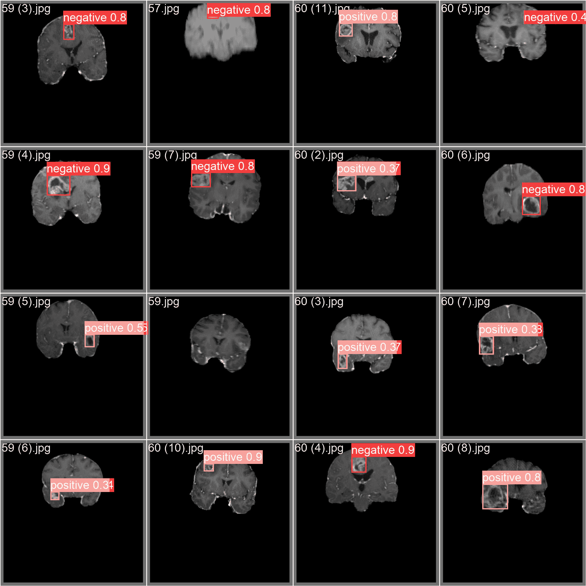

# 脑瘤数据集

> 原文：[`docs.ultralytics.com/datasets/detect/brain-tumor/`](https://docs.ultralytics.com/datasets/detect/brain-tumor/)

脑瘤检测数据集包含来自 MRI 或 CT 扫描的医学图像，包括有关脑瘤存在、位置和特征的信息。这些数据集对于训练计算机视觉算法以自动化脑瘤识别至关重要，有助于早期诊断和治疗规划。

[`www.youtube.com/embed/ogTBBD8McRk`](https://www.youtube.com/embed/ogTBBD8McRk)

**观看**：使用 Ultralytics HUB 进行脑瘤检测

## 数据集结构

脑瘤数据集分为两个子集：

+   **训练集**：包含 893 张图像，每张图像均配有相应的标注。

+   **测试集**：包括 223 张图像，每张图像均配有相应的标注。

## 应用

利用计算机视觉进行脑瘤检测的应用能够实现早期诊断、治疗规划和肿瘤进展的监测。通过分析 MRI 或 CT 扫描等医学影像数据，计算机视觉系统能够准确识别脑瘤，有助于及时的医疗干预和个性化治疗策略。

## 数据集 YAML

YAML（Yet Another Markup Language）文件用于定义数据集配置。它包含有关数据集路径、类别和其他相关信息的信息。对于脑瘤数据集，`brain-tumor.yaml` 文件保存在 [`github.com/ultralytics/ultralytics/blob/main/ultralytics/cfg/datasets/brain-tumor.yaml`](https://github.com/ultralytics/ultralytics/blob/main/ultralytics/cfg/datasets/brain-tumor.yaml)。

ultralytics/cfg/datasets/brain-tumor.yaml

```py
`# Ultralytics YOLO 🚀, AGPL-3.0 license # Brain-tumor dataset by Ultralytics # Documentation: https://docs.ultralytics.com/datasets/detect/brain-tumor/ # Example usage: yolo train data=brain-tumor.yaml # parent # ├── ultralytics # └── datasets #     └── brain-tumor  ← downloads here (4.05 MB)  # Train/val/test sets as 1) dir: path/to/imgs, 2) file: path/to/imgs.txt, or 3) list: [path/to/imgs1, path/to/imgs2, ..] path:  ../datasets/brain-tumor  # dataset root dir train:  train/images  # train images (relative to 'path') 893 images val:  valid/images  # val images (relative to 'path') 223 images test:  # test images (relative to 'path')  # Classes names:   0:  negative   1:  positive  # Download script/URL (optional) download:  https://github.com/ultralytics/assets/releases/download/v0.0.0/brain-tumor.zip` 
```

## 用法

若要在脑瘤数据集上使用大小为 640 的图像训练一个 YOLOv8n 模型，可以使用提供的代码片段进行 100 个 epoch 的训练。有关可用参数的详细列表，请参阅模型的训练页面。

训练示例

```py
`from ultralytics import YOLO  # Load a model model = YOLO("yolov8n.pt")  # load a pretrained model (recommended for training)  # Train the model results = model.train(data="brain-tumor.yaml", epochs=100, imgsz=640)` 
```

```py
`# Start training from a pretrained *.pt model yolo  detect  train  data=brain-tumor.yaml  model=yolov8n.pt  epochs=100  imgsz=640` 
```

推理示例

```py
`from ultralytics import YOLO  # Load a model model = YOLO("path/to/best.pt")  # load a brain-tumor fine-tuned model  # Inference using the model results = model.predict("https://ultralytics.com/assets/brain-tumor-sample.jpg")` 
```

```py
`# Start prediction with a finetuned *.pt model yolo  detect  predict  model='path/to/best.pt'  imgsz=640  source="https://ultralytics.com/assets/brain-tumor-sample.jpg"` 
```

## 样本图像和标注

脑瘤数据集涵盖了大量展示多种物体类别和复杂场景的图像。以下展示了数据集中的图像示例及其相应的标注。



+   **镶嵌图像**：这里展示了一个包含镶嵌数据集图像的训练批次。镶嵌是一种训练技术，将多个图像合并成一个，增强了批处理的多样性。这种方法有助于提高模型在各种物体大小、长宽比和背景情境中的泛化能力。

此示例突显了脑瘤数据集内图像的多样性和复杂性，强调在训练阶段引入镶嵌技术的优势。

## 引用和致谢

该数据集已根据 [AGPL-3.0 许可](https://github.com/ultralytics/ultralytics/blob/main/LICENSE) 发布。

## 常见问题解答

### Ultralytics 文档中可用的大脑肿瘤数据集的结构是什么？

大脑肿瘤数据集分为两个子集：**训练集**包含 893 张图像及其对应的注释，而**测试集**则包括 223 张带有配对注释的图像。这种结构化分割有助于开发用于检测大脑肿瘤的强大且准确的计算机视觉模型。有关数据集结构的更多信息，请访问数据集结构部分。

### 如何使用 Ultralytics 在大脑肿瘤数据集上训练 YOLOv8 模型？

使用 Python 和 CLI 方法可以在大脑肿瘤数据集上训练 YOLOv8 模型 100 个 epoch，图像尺寸为 640px。以下是两种方法的示例：

训练示例

```py
`from ultralytics import YOLO  # Load a model model = YOLO("yolov8n.pt")  # load a pretrained model (recommended for training)  # Train the model results = model.train(data="brain-tumor.yaml", epochs=100, imgsz=640)` 
```

```py
`# Start training from a pretrained *.pt model yolo  detect  train  data=brain-tumor.yaml  model=yolov8n.pt  epochs=100  imgsz=640` 
```

若要查看可用参数的详细列表，请参阅训练页面。

### 在医疗保健领域中使用大脑肿瘤数据集有哪些好处？

在 AI 项目中使用大脑肿瘤数据集可以实现对大脑肿瘤的早期诊断和治疗计划。它有助于通过计算机视觉自动化大脑肿瘤识别，促进准确及时的医疗干预，支持个性化治疗策略。这一应用在提高患者预后和医疗效率方面具有重要潜力。

### 如何使用经过微调的 YOLOv8 模型对大脑肿瘤数据集进行推理？

使用经过微调的 YOLOv8 模型可以通过 Python 或 CLI 方法进行推理。以下是示例：

推理示例

```py
`from ultralytics import YOLO  # Load a model model = YOLO("path/to/best.pt")  # load a brain-tumor fine-tuned model  # Inference using the model results = model.predict("https://ultralytics.com/assets/brain-tumor-sample.jpg")` 
```

```py
`# Start prediction with a finetuned *.pt model yolo  detect  predict  model='path/to/best.pt'  imgsz=640  source="https://ultralytics.com/assets/brain-tumor-sample.jpg"` 
```

### 我在哪里可以找到大脑肿瘤数据集的 YAML 配置？

大脑肿瘤数据集的 YAML 配置文件可以在[brain-tumor.yaml](https://github.com/ultralytics/ultralytics/blob/main/ultralytics/cfg/datasets/brain-tumor.yaml)找到。该文件包含了用于在该数据集上训练和评估模型所需的路径、类别和其他相关信息。
