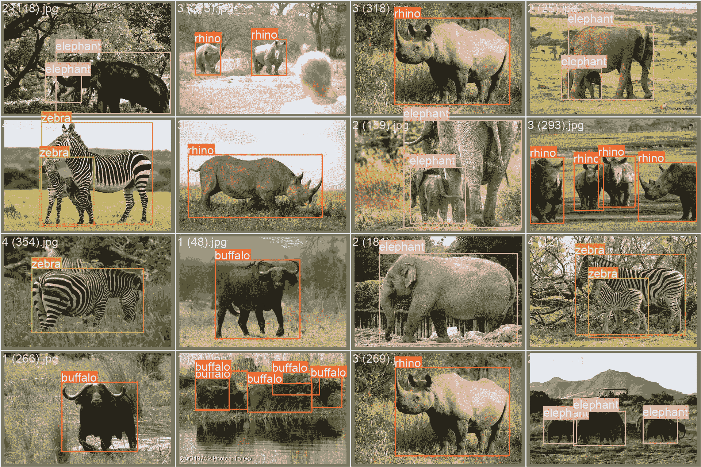

# 非洲野生动物数据集

> 原文：[`docs.ultralytics.com/datasets/detect/african-wildlife/`](https://docs.ultralytics.com/datasets/detect/african-wildlife/)

该数据集展示了南非自然保护区中四类常见动物，包括水牛、大象、犀牛和斑马的图像，深入了解它们的特征。对于训练计算机视觉算法至关重要，该数据集有助于在各种栖息地中识别动物，从动物园到森林，支持野生动物研究。

[`www.youtube.com/embed/biIW5Z6GYl0`](https://www.youtube.com/embed/biIW5Z6GYl0)

**观看：** 使用 Ultralytics YOLOv8 检测非洲野生动物

## 数据集结构

非洲野生动物对象检测数据集分为三个子集：

+   **训练集**：包含 1052 张图像，每张图像都有相应的标注。

+   **验证集**：包括 225 张图像，每张图像都有配对的标注。

+   **测试集**：包括 227 张图像，每张图像都有配对的标注。

## 应用

这个数据集可以应用于各种计算机视觉任务，如目标检测、目标跟踪和研究。具体来说，它可用于训练和评估模型，以识别图像中的非洲野生动物对象，这在野生动物保护、生态研究以及自然保护区和受保护区的监测工作中具有应用。此外，它还可以作为教育目的的宝贵资源，帮助学生和研究人员研究和理解不同动物物种的特征和行为。

## 数据集 YAML

一个 YAML（另一种标记语言）文件定义了数据集配置，包括路径、类别和其他相关细节。对于非洲野生动物数据集，`african-wildlife.yaml`文件位于[`github.com/ultralytics/ultralytics/blob/main/ultralytics/cfg/datasets/african-wildlife.yaml`](https://github.com/ultralytics/ultralytics/blob/main/ultralytics/cfg/datasets/african-wildlife.yaml)。

ultralytics/cfg/datasets/african-wildlife.yaml

```py
`# Ultralytics YOLO 🚀, AGPL-3.0 license # African-wildlife dataset by Ultralytics # Documentation: https://docs.ultralytics.com/datasets/detect/african-wildlife/ # Example usage: yolo train data=african-wildlife.yaml # parent # ├── ultralytics # └── datasets #     └── african-wildlife  ← downloads here (100 MB)  # Train/val/test sets as 1) dir: path/to/imgs, 2) file: path/to/imgs.txt, or 3) list: [path/to/imgs1, path/to/imgs2, ..] path:  ../datasets/african-wildlife  # dataset root dir train:  train/images  # train images (relative to 'path') 1052 images val:  valid/images  # val images (relative to 'path') 225 images test:  test/images  # test images (relative to 'path') 227 images  # Classes names:   0:  buffalo   1:  elephant   2:  rhino   3:  zebra  # Download script/URL (optional) download:  https://github.com/ultralytics/assets/releases/download/v0.0.0/african-wildlife.zip` 
```

## 使用

若要使用图像大小为 640 训练 100 个时期的 YOLOv8n 模型，可以使用提供的代码示例。有关可用参数的详细列表，请参阅模型的训练页面。

训练示例

```py
`from ultralytics import YOLO  # Load a model model = YOLO("yolov8n.pt")  # load a pretrained model (recommended for training)  # Train the model results = model.train(data="african-wildlife.yaml", epochs=100, imgsz=640)` 
```

```py
`# Start training from a pretrained *.pt model yolo  detect  train  data=african-wildlife.yaml  model=yolov8n.pt  epochs=100  imgsz=640` 
```

推理示例

```py
`from ultralytics import YOLO  # Load a model model = YOLO("path/to/best.pt")  # load a brain-tumor fine-tuned model  # Inference using the model results = model.predict("https://ultralytics.com/assets/african-wildlife-sample.jpg")` 
```

```py
`# Start prediction with a finetuned *.pt model yolo  detect  predict  model='path/to/best.pt'  imgsz=640  source="https://ultralytics.com/assets/african-wildlife-sample.jpg"` 
```

## 示例图像和标注

非洲野生动物数据集包括展示多样化动物物种及其自然栖息地的广泛图像。以下是数据集中的图像示例，每个图像都附有相应的标注。



+   **马赛克图像**：这里，我们展示了一个由马赛克数据集图像组成的训练批次。马赛克是一种训练技术，将多个图像合并成一个，丰富批次的多样性。这种方法有助于增强模型跨不同对象大小、长宽比和上下文的泛化能力。

这个例子展示了非洲野生动物数据集中图像的多样性和复杂性，强调了在训练过程中包含镶嵌技术的好处。

## 引用和致谢

数据集已在[AGPL-3.0 许可证](https://github.com/ultralytics/ultralytics/blob/main/LICENSE)下发布可用。

## 常见问题解答

### 非洲野生动物数据集是什么，如何在计算机视觉项目中使用它？

非洲野生动物数据集包括南非自然保护区中四种常见动物物种的图像：水牛、大象、犀牛和斑马。它是训练目标检测和动物识别的计算机视觉算法的宝贵资源。该数据集支持诸如目标跟踪、研究和保护工作等多种任务。有关其结构和应用的更多信息，请参阅数据集结构部分和数据集应用。

### 如何使用非洲野生动物数据集训练 YOLOv8 模型？

您可以使用`african-wildlife.yaml`配置文件在非洲野生动物数据集上训练 YOLOv8 模型。以下是如何为 100 个 epochs 训练 YOLOv8n 模型并使用 640 的图像尺寸的示例：

示例

```py
`from ultralytics import YOLO  # Load a model model = YOLO("yolov8n.pt")  # load a pretrained model (recommended for training)  # Train the model results = model.train(data="african-wildlife.yaml", epochs=100, imgsz=640)` 
```

```py
`# Start training from a pretrained *.pt model yolo  detect  train  data=african-wildlife.yaml  model=yolov8n.pt  epochs=100  imgsz=640` 
```

若要获取更多的训练参数和选项，请参阅训练文档。

### 我在哪里可以找到非洲野生动物数据集的 YAML 配置文件？

名为`african-wildlife.yaml`的非洲野生动物数据集的 YAML 配置文件可以在[此 GitHub 链接](https://github.com/ultralytics/ultralytics/blob/main/ultralytics/cfg/datasets/african-wildlife.yaml)找到。该文件定义了数据集配置，包括路径、类别和其他对训练机器学习模型至关重要的细节。有关更多细节，请参阅数据集 YAML 部分。

### 我可以看到非洲野生动物数据集的示例图像和注释吗？

是的，非洲野生动物数据集包括展示不同动物物种在其自然栖息地中的广泛图像。您可以在示例图像和其相应注释部分查看样本图像。本部分还展示了使用镶嵌技术将多个图像组合成一个以增强批量多样性，提升模型的泛化能力。

### 如何利用非洲野生动物数据集支持野生动物保护和研究？

非洲野生动物数据集通过训练和评估模型来识别不同栖息地中的非洲野生动物，是支持野生动物保护和研究的理想工具。这些模型可以帮助监测动物种群、研究它们的行为并识别保护需求。此外，该数据集还可用于教育目的，帮助学生和研究人员了解不同动物物种的特征和行为。更多详情请参见应用部分。
