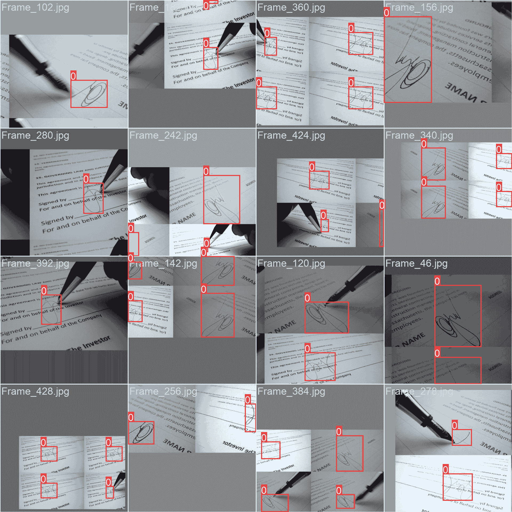

# 签名检测数据集

> 原文：[`docs.ultralytics.com/datasets/detect/signature/`](https://docs.ultralytics.com/datasets/detect/signature/)

该数据集专注于检测文档中的手写签名。它包含各种带注释的文档类型，为文档验证和欺诈检测应用提供了宝贵的见解。作为训练计算机视觉算法的基础数据集，该数据集帮助识别各种文档格式中的签名，支持文档分析的研究和实际应用。

## 数据集结构

签名检测数据集分为三个子集：

+   **训练集**：包含 143 张图像，每张图像均带有相应的注释。

+   **验证集**：包括 35 张图像，每张图像均附有对应的注释。

## 应用

该数据集可应用于各种计算机视觉任务，如目标检测、目标跟踪和文档分析。具体而言，它可用于训练和评估用于识别文档中签名的模型，这在文档验证、欺诈检测和档案研究等方面具有应用价值。此外，它还可以作为教育目的的宝贵资源，使学生和研究人员能够研究和了解不同文档类型中签名的特征和行为。

## 数据集 YAML

YAML（Yet Another Markup Language）文件定义了数据集配置，包括路径和类信息。对于签名检测数据集，`signature.yaml` 文件位于[`github.com/ultralytics/ultralytics/blob/main/ultralytics/cfg/datasets/signature.yaml`](https://github.com/ultralytics/ultralytics/blob/main/ultralytics/cfg/datasets/signature.yaml)。

ultralytics/cfg/datasets/signature.yaml

```py
`# Ultralytics YOLO 🚀, AGPL-3.0 license # Signature dataset by Ultralytics # Documentation: https://docs.ultralytics.com/datasets/detect/signature/ # Example usage: yolo train data=signature.yaml # parent # ├── ultralytics # └── datasets #     └── signature  ← downloads here (11.2 MB)  # Train/val/test sets as 1) dir: path/to/imgs, 2) file: path/to/imgs.txt, or 3) list: [path/to/imgs1, path/to/imgs2, ..] path:  ../datasets/signature  # dataset root dir train:  train/images  # train images (relative to 'path') 143 images val:  valid/images  # val images (relative to 'path') 35 images  # Classes names:   0:  signature  # Download script/URL (optional) download:  https://github.com/ultralytics/assets/releases/download/v0.0.0/signature.zip` 
```

## 使用方法

要在签名检测数据集上用 YOLOv8n 模型进行 100 个 epochs 的训练，图像大小设为 640，请使用提供的代码示例。有关可用参数的详细列表，请参阅模型的训练页面。

训练示例

```py
`from ultralytics import YOLO  # Load a model model = YOLO("yolov8n.pt")  # load a pretrained model (recommended for training)  # Train the model results = model.train(data="signature.yaml", epochs=100, imgsz=640)` 
```

```py
`# Start training from a pretrained *.pt model yolo  detect  train  data=signature.yaml  model=yolov8n.pt  epochs=100  imgsz=640` 
```

推理示例

```py
`from ultralytics import YOLO  # Load a model model = YOLO("path/to/best.pt")  # load a signature-detection fine-tuned model  # Inference using the model results = model.predict("https://ultralytics.com/assets/signature-s.mp4", conf=0.75)` 
```

```py
`# Start prediction with a finetuned *.pt model yolo  detect  predict  model='path/to/best.pt'  imgsz=640  source="https://ultralytics.com/assets/signature-s.mp4"  conf=0.75` 
```

## 样本图像和注释

签名检测数据集包含各种展示不同文档类型和带注释签名的图像。以下是数据集中的图像示例，每个示例都附有相应的注释。



+   **镶嵌图像**：在这里，我们展示了一个包含镶嵌数据集图像的训练批次。镶嵌是一种训练技术，将多个图像组合成一个，丰富了批次的多样性。这种方法有助于增强模型在不同签名大小、长宽比和上下文中的泛化能力。

本示例展示了签名检测数据集中图像的多样性和复杂性，强调了在训练过程中包含镶嵌技术的好处。

## 引用和致谢

该数据集已根据[AGPL-3.0 许可证](https://github.com/ultralytics/ultralytics/blob/main/LICENSE)发布。

## 常见问题解答

### **签名检测数据集**是什么，如何使用？

**签名检测数据集**是一个包含有注释图像的集合，旨在检测各种文档类型中的人类签名。它可以应用于计算机视觉任务，如对象检测和跟踪，主要用于文档验证、欺诈检测和档案研究。该数据集帮助训练模型识别不同背景下的签名，对研究和实际应用都具有价值。

### 如何在**签名检测数据集**上训练 YOLOv8n 模型？

要在**签名检测数据集**上训练 YOLOv8n 模型，请按以下步骤操作：

1.  从[signature.yaml](https://github.com/ultralytics/ultralytics/blob/main/ultralytics/cfg/datasets/signature.yaml)下载`signature.yaml`数据集配置文件。

1.  使用下面的 Python 脚本或 CLI 命令开始训练：

训练示例

```py
`from ultralytics import YOLO  # Load a pretrained model model = YOLO("yolov8n.pt")  # Train the model results = model.train(data="signature.yaml", epochs=100, imgsz=640)` 
```

```py
`yolo  detect  train  data=signature.yaml  model=yolov8n.pt  epochs=100  imgsz=640` 
```

欲了解更多详细信息，请参阅训练页面。

### **签名检测数据集**的主要应用是什么？

**签名检测数据集**可用于：

1.  **文档验证**：自动验证文档中人类签名的存在和真实性。

1.  **欺诈检测**：识别法律和金融文件中的伪造或欺诈签名。

1.  **档案研究**：协助历史学家和档案管理员对历史文档进行数字分析和编目。

1.  **教育**：支持计算机视觉和机器学习领域的学术研究和教学。

### 如何使用在**签名检测数据集**上训练的模型执行推断？

要使用在**签名检测数据集**上训练的模型执行推断，请按以下步骤操作：

1.  加载您的精调模型。

1.  使用下面的 Python 脚本或 CLI 命令执行推断：

推断示例

```py
`from ultralytics import YOLO  # Load the fine-tuned model model = YOLO("path/to/best.pt")  # Perform inference results = model.predict("https://ultralytics.com/assets/signature-s.mp4", conf=0.75)` 
```

```py
`yolo  detect  predict  model='path/to/best.pt'  imgsz=640  source="https://ultralytics.com/assets/signature-s.mp4"  conf=0.75` 
```

### **签名检测数据集**的结构是什么，如何获取更多信息？

**签名检测数据集**分为两个子集：

+   **训练集**：包含有 143 张带有注释的图像。

+   **验证集**：包含有 35 张带有注释的图像。

欲了解详细信息，请参考数据集结构部分。此外，您可以在位于[signature.yaml](https://github.com/ultralytics/ultralytics/blob/main/ultralytics/cfg/datasets/signature.yaml)的`signature.yaml`文件中查看完整的数据集配置。
