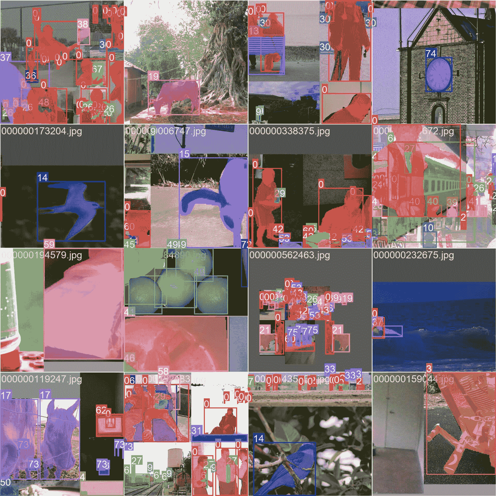

# COCO-Seg 数据集

> 原文：[`docs.ultralytics.com/datasets/segment/coco/`](https://docs.ultralytics.com/datasets/segment/coco/)

[COCO-Seg](https://cocodataset.org/#home) 数据集是 COCO（上下文中的常见对象）数据集的扩展，专门设计用于帮助对象实例分割的研究。它使用与 COCO 相同的图像，但引入了更详细的分割注释。该数据集是研究人员和开发人员在实例分割任务中，特别是在训练 YOLO 模型时的重要资源。

## COCO-Seg 预训练模型

| 模型 | 大小 ^((像素)) | mAP^(框 50-95) | mAP^(掩码 50-95) | 速度 ^(CPU ONNX

(毫秒)) | 速度 ^(A100 TensorRT

(毫秒)) | 参数 ^((M)) | FLOPs ^((B)) |

| --- | --- | --- | --- | --- | --- | --- | --- |
| --- | --- | --- | --- | --- | --- | --- | --- |
| [YOLOv8n-seg](https://github.com/ultralytics/assets/releases/download/v8.2.0/yolov8n-seg.pt) | 640 | 36.7 | 30.5 | 96.1 | 1.21 | 3.4 | 12.6 |
| [YOLOv8s-seg](https://github.com/ultralytics/assets/releases/download/v8.2.0/yolov8s-seg.pt) | 640 | 44.6 | 36.8 | 155.7 | 1.47 | 11.8 | 42.6 |
| [YOLOv8m-seg](https://github.com/ultralytics/assets/releases/download/v8.2.0/yolov8m-seg.pt) | 640 | 49.9 | 40.8 | 317.0 | 2.18 | 27.3 | 110.2 |
| [YOLOv8l-seg](https://github.com/ultralytics/assets/releases/download/v8.2.0/yolov8l-seg.pt) | 640 | 52.3 | 42.6 | 572.4 | 2.79 | 46.0 | 220.5 |
| [YOLOv8x-seg](https://github.com/ultralytics/assets/releases/download/v8.2.0/yolov8x-seg.pt) | 640 | 53.4 | 43.4 | 712.1 | 4.02 | 71.8 | 344.1 |

## 关键特性

+   COCO-Seg 保留了 COCO 的原始 330K 张图像。

+   数据集包含与原始 COCO 数据集相同的 80 个对象类别。

+   注释现在包括每个图像中每个对象的更详细的实例分割掩码。

+   COCO-Seg 提供标准化的评估指标，如对象检测的平均精度（mAP）和实例分割任务的平均召回率（mAR），以便有效比较模型性能。

## 数据集结构

COCO-Seg 数据集分为三个子集：

1.  **Train2017**：该子集包含 118K 张用于训练实例分割模型的图像。

1.  **Val2017**：该子集包括 5K 张用于模型训练期间验证目的的图像。

1.  **Test2017**：该子集包含 20K 张用于测试和基准训练模型的图像。该子集的真实注释未公开，结果提交至 [COCO 评估服务器](https://codalab.lisn.upsaclay.fr/competitions/7383) 进行性能评估。

## 应用

COCO-Seg 广泛用于训练和评估实例分割中的深度学习模型，如 YOLO 模型。大量的注释图像、对象类别的多样性以及标准化的评估指标使其成为计算机视觉研究人员和从业者不可或缺的资源。

## 数据集 YAML

使用 YAML（Yet Another Markup Language）文件定义数据集配置。它包含有关数据集路径、类别和其他相关信息的信息。在 COCO-Seg 数据集的情况下，`coco.yaml`文件位于[`github.com/ultralytics/ultralytics/blob/main/ultralytics/cfg/datasets/coco.yaml`](https://github.com/ultralytics/ultralytics/blob/main/ultralytics/cfg/datasets/coco.yaml)。

ultralytics/cfg/datasets/coco.yaml

```py
`# Ultralytics YOLO 🚀, AGPL-3.0 license # COCO 2017 dataset https://cocodataset.org by Microsoft # Documentation: https://docs.ultralytics.com/datasets/detect/coco/ # Example usage: yolo train data=coco.yaml # parent # ├── ultralytics # └── datasets #     └── coco  ← downloads here (20.1 GB)  # Train/val/test sets as 1) dir: path/to/imgs, 2) file: path/to/imgs.txt, or 3) list: [path/to/imgs1, path/to/imgs2, ..] path:  ../datasets/coco  # dataset root dir train:  train2017.txt  # train images (relative to 'path') 118287 images val:  val2017.txt  # val images (relative to 'path') 5000 images test:  test-dev2017.txt  # 20288 of 40670 images, submit to https://competitions.codalab.org/competitions/20794  # Classes names:   0:  person   1:  bicycle   2:  car   3:  motorcycle   4:  airplane   5:  bus   6:  train   7:  truck   8:  boat   9:  traffic light   10:  fire hydrant   11:  stop sign   12:  parking meter   13:  bench   14:  bird   15:  cat   16:  dog   17:  horse   18:  sheep   19:  cow   20:  elephant   21:  bear   22:  zebra   23:  giraffe   24:  backpack   25:  umbrella   26:  handbag   27:  tie   28:  suitcase   29:  frisbee   30:  skis   31:  snowboard   32:  sports ball   33:  kite   34:  baseball bat   35:  baseball glove   36:  skateboard   37:  surfboard   38:  tennis racket   39:  bottle   40:  wine glass   41:  cup   42:  fork   43:  knife   44:  spoon   45:  bowl   46:  banana   47:  apple   48:  sandwich   49:  orange   50:  broccoli   51:  carrot   52:  hot dog   53:  pizza   54:  donut   55:  cake   56:  chair   57:  couch   58:  potted plant   59:  bed   60:  dining table   61:  toilet   62:  tv   63:  laptop   64:  mouse   65:  remote   66:  keyboard   67:  cell phone   68:  microwave   69:  oven   70:  toaster   71:  sink   72:  refrigerator   73:  book   74:  clock   75:  vase   76:  scissors   77:  teddy bear   78:  hair drier   79:  toothbrush  # Download script/URL (optional) download:  |   from ultralytics.utils.downloads import download   from pathlib import Path    # Download labels   segments = True  # segment or box labels   dir = Path(yaml['path'])  # dataset root dir   url = 'https://github.com/ultralytics/assets/releases/download/v0.0.0/'   urls = [url + ('coco2017labels-segments.zip' if segments else 'coco2017labels.zip')]  # labels   download(urls, dir=dir.parent)   # Download data   urls = ['http://images.cocodataset.org/zips/train2017.zip',  # 19G, 118k images   'http://images.cocodataset.org/zips/val2017.zip',  # 1G, 5k images   'http://images.cocodataset.org/zips/test2017.zip']  # 7G, 41k images (optional)   download(urls, dir=dir / 'images', threads=3)` 
```

## 用法

要在 COCO-Seg 数据集上训练 100 个 epochs、图像大小为 640 的 YOLOv8n-seg 模型，您可以使用以下代码片段。有关可用参数的详细列表，请参考模型训练页面。

训练示例

```py
`from ultralytics import YOLO  # Load a model model = YOLO("yolov8n-seg.pt")  # load a pretrained model (recommended for training)  # Train the model results = model.train(data="coco-seg.yaml", epochs=100, imgsz=640)` 
```

```py
`# Start training from a pretrained *.pt model yolo  segment  train  data=coco-seg.yaml  model=yolov8n-seg.pt  epochs=100  imgsz=640` 
```

## 示例图像和注释

与其前身 COCO 一样，COCO-Seg 包含各种对象类别和复杂场景的图像。然而，COCO-Seg 为图像中的每个对象引入了更详细的实例分割蒙版。以下是数据集中一些图像的示例，以及它们对应的实例分割蒙版：



+   **拼接图像**：这张图片展示了由拼接数据集图像组成的训练批次。拼接是一种在训练过程中将多个图像合并成单个图像的技术，以增加每个训练批次中对象和场景的多样性。这有助于模型泛化到不同的对象大小、长宽比和上下文。

该示例展示了 COCO-Seg 数据集中图像的多样性和复杂性，以及在训练过程中使用拼接的好处。

## 引用和致谢

如果您在研究或开发工作中使用 COCO-Seg 数据集，请引用原始 COCO 论文，并承认其扩展到 COCO-Seg：

```py
`@misc{lin2015microsoft,   title={Microsoft COCO: Common Objects in Context},   author={Tsung-Yi Lin and Michael Maire and Serge Belongie and Lubomir Bourdev and Ross Girshick and James Hays and Pietro Perona and Deva Ramanan and C. Lawrence Zitnick and Piotr Dollár},   year={2015},   eprint={1405.0312},   archivePrefix={arXiv},   primaryClass={cs.CV} }` 
```

我们感谢 COCO 联盟为计算机视觉社区创建和维护这一宝贵资源。有关 COCO 数据集及其创建者的更多信息，请访问[COCO 数据集网站](https://cocodataset.org/#home)。

## 常见问题解答

### COCO-Seg 数据集是什么，与原始 COCO 数据集有何不同？

[COCO-Seg](https://cocodataset.org/#home)数据集是原始 COCO（Context 中的公共对象）数据集的扩展，专为实例分割任务设计。虽然使用与 COCO 数据集相同的图像，但 COCO-Seg 包括更详细的实例分割标注，使其成为专注于对象实例分割的研究人员和开发人员的强大资源。

### 如何使用 COCO-Seg 数据集训练 YOLOv8 模型？

要在 COCO-Seg 数据集上使用大小为 640 的图像，训练 100 个 epochs 的 YOLOv8n-seg 模型，您可以使用以下代码片段。有关可用参数的详细列表，请参考模型训练页面。

训练示例

```py
`from ultralytics import YOLO  # Load a model model = YOLO("yolov8n-seg.pt")  # load a pretrained model (recommended for training)  # Train the model results = model.train(data="coco-seg.yaml", epochs=100, imgsz=640)` 
```

```py
`# Start training from a pretrained *.pt model yolo  segment  train  data=coco-seg.yaml  model=yolov8n-seg.pt  epochs=100  imgsz=640` 
```

### COCO-Seg 数据集的关键特点是什么？

COCO-Seg 数据集包括几个关键特点：

+   保留了 COCO 数据集的原始 330K 张图像。

+   注释了原始 COCO 中发现的相同 80 个对象类别。

+   为每个对象提供更详细的实例分割掩模。

+   使用标准化的评估指标，如物体检测的平均精度（mAP）和实例分割任务的平均召回率（mAR）。

### 有关 COCO-Seg 的预训练模型及其性能指标是什么？

COCO-Seg 数据集支持多个预训练的 YOLOv8 分割模型，具有不同的性能指标。以下是可用模型及其关键指标的摘要：

| 模型 | 大小 ^((像素)) | mAP^(box 50-95) | mAP^(mask 50-95) | 速度 ^(CPU ONNX

(ms)) | 速度 ^(A100 TensorRT

(ms)) | 参数 ^((M)) | FLOPs ^((B)) |

| --- | --- | --- | --- | --- | --- | --- | --- |
| --- | --- | --- | --- | --- | --- | --- | --- |
| [YOLOv8n-seg](https://github.com/ultralytics/assets/releases/download/v8.2.0/yolov8n-seg.pt) | 640 | 36.7 | 30.5 | 96.1 | 1.21 | 3.4 | 12.6 |
| [YOLOv8s-seg](https://github.com/ultralytics/assets/releases/download/v8.2.0/yolov8s-seg.pt) | 640 | 44.6 | 36.8 | 155.7 | 1.47 | 11.8 | 42.6 |
| [YOLOv8m-seg](https://github.com/ultralytics/assets/releases/download/v8.2.0/yolov8m-seg.pt) | 640 | 49.9 | 40.8 | 317.0 | 2.18 | 27.3 | 110.2 |
| [YOLOv8l-seg](https://github.com/ultralytics/assets/releases/download/v8.2.0/yolov8l-seg.pt) | 640 | 52.3 | 42.6 | 572.4 | 2.79 | 46.0 | 220.5 |
| [YOLOv8x-seg](https://github.com/ultralytics/assets/releases/download/v8.2.0/yolov8x-seg.pt) | 640 | 53.4 | 43.4 | 712.1 | 4.02 | 71.8 | 344.1 |

### COCO-Seg 数据集的结构是如何的，它包含哪些子集？

COCO-Seg 数据集被划分为三个子集，用于特定的训练和评估需求：

1.  **Train2017**: 包含 118K 张图像，主要用于训练实例分割模型。

1.  **Val2017**: 包括 5K 张图像，在训练过程中用于验证。

1.  **Test2017**: 包括 20K 张图像，专门用于测试和基准测试已训练模型的性能。请注意，此子集的地面实况注释不公开提供，性能结果提交至[COCO 评估服务器](https://codalab.lisn.upsaclay.fr/competitions/7383)进行评估。
