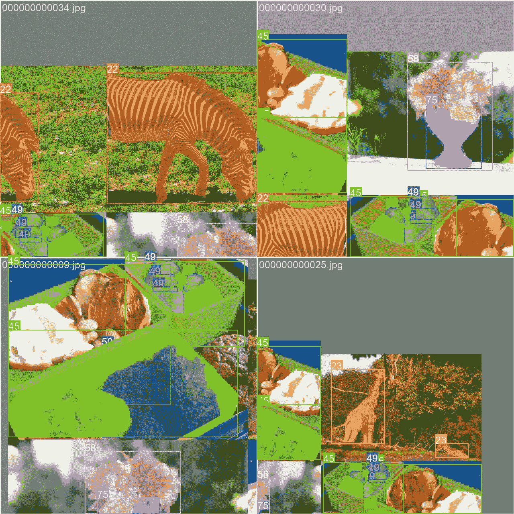

# COCO8-Seg 数据集

> 原文：[`docs.ultralytics.com/datasets/segment/coco8-seg/`](https://docs.ultralytics.com/datasets/segment/coco8-seg/)

## 介绍

[Ultralytics](https://ultralytics.com) COCO8-Seg 是一个小型但多功能的实例分割数据集，由 COCO 2017 年度训练集的前 8 张图像组成，其中 4 张用于训练，4 张用于验证。该数据集非常适合用于测试和调试分割模型，或者尝试新的检测方法。8 张图像足够小，易于管理，同时又足够多样化，可以用来检验训练流程中的错误，并在训练更大数据集之前进行健全性检查。

此数据集适用于使用 Ultralytics [HUB](https://hub.ultralytics.com) 和 [YOLOv8](https://github.com/ultralytics/ultralytics)。

## 数据集 YAML

YAML（另一种标记语言）文件用于定义数据集配置。它包含关于数据集路径、类别和其他相关信息的信息。对于 COCO8-Seg 数据集，`coco8-seg.yaml` 文件位于 [`github.com/ultralytics/ultralytics/blob/main/ultralytics/cfg/datasets/coco8-seg.yaml`](https://github.com/ultralytics/ultralytics/blob/main/ultralytics/cfg/datasets/coco8-seg.yaml)。

ultralytics/cfg/datasets/coco8-seg.yaml

```py
`# Ultralytics YOLO 🚀, AGPL-3.0 license # COCO8-seg dataset (first 8 images from COCO train2017) by Ultralytics # Documentation: https://docs.ultralytics.com/datasets/segment/coco8-seg/ # Example usage: yolo train data=coco8-seg.yaml # parent # ├── ultralytics # └── datasets #     └── coco8-seg  ← downloads here (1 MB)  # Train/val/test sets as 1) dir: path/to/imgs, 2) file: path/to/imgs.txt, or 3) list: [path/to/imgs1, path/to/imgs2, ..] path:  ../datasets/coco8-seg  # dataset root dir train:  images/train  # train images (relative to 'path') 4 images val:  images/val  # val images (relative to 'path') 4 images test:  # test images (optional)  # Classes names:   0:  person   1:  bicycle   2:  car   3:  motorcycle   4:  airplane   5:  bus   6:  train   7:  truck   8:  boat   9:  traffic light   10:  fire hydrant   11:  stop sign   12:  parking meter   13:  bench   14:  bird   15:  cat   16:  dog   17:  horse   18:  sheep   19:  cow   20:  elephant   21:  bear   22:  zebra   23:  giraffe   24:  backpack   25:  umbrella   26:  handbag   27:  tie   28:  suitcase   29:  frisbee   30:  skis   31:  snowboard   32:  sports ball   33:  kite   34:  baseball bat   35:  baseball glove   36:  skateboard   37:  surfboard   38:  tennis racket   39:  bottle   40:  wine glass   41:  cup   42:  fork   43:  knife   44:  spoon   45:  bowl   46:  banana   47:  apple   48:  sandwich   49:  orange   50:  broccoli   51:  carrot   52:  hot dog   53:  pizza   54:  donut   55:  cake   56:  chair   57:  couch   58:  potted plant   59:  bed   60:  dining table   61:  toilet   62:  tv   63:  laptop   64:  mouse   65:  remote   66:  keyboard   67:  cell phone   68:  microwave   69:  oven   70:  toaster   71:  sink   72:  refrigerator   73:  book   74:  clock   75:  vase   76:  scissors   77:  teddy bear   78:  hair drier   79:  toothbrush  # Download script/URL (optional) download:  https://github.com/ultralytics/assets/releases/download/v0.0.0/coco8-seg.zip` 
```

## 使用方法

要在 COCO8-Seg 数据集上使用图像大小为 640 的 YOLOv8n-seg 模型进行 100 个 epochs 的训练，可以使用以下代码片段。要获取可用参数的全面列表，请参阅模型训练页面。

训练示例

```py
`from ultralytics import YOLO  # Load a model model = YOLO("yolov8n-seg.pt")  # load a pretrained model (recommended for training)  # Train the model results = model.train(data="coco8-seg.yaml", epochs=100, imgsz=640)` 
```

```py
`# Start training from a pretrained *.pt model yolo  segment  train  data=coco8-seg.yaml  model=yolov8n-seg.pt  epochs=100  imgsz=640` 
```

## 示例图像和标注

这里展示了 COCO8-Seg 数据集中一些图像的示例，以及它们对应的标注：



+   **马赛克图像**：这幅图展示了由马赛克数据集图像组成的训练批次。马赛克是训练过程中使用的一种技术，将多个图像合并成单个图像，以增加每个训练批次中的对象和场景的多样性。这有助于提高模型对不同对象大小、长宽比和上下文的泛化能力。

此示例展示了 COCO8-Seg 数据集中图像的多样性和复杂性，以及训练过程中使用马赛克的好处。

## 引用和致谢

如果您在研究或开发工作中使用 COCO 数据集，请引用以下论文：

```py
`@misc{lin2015microsoft,   title={Microsoft COCO: Common Objects in Context},   author={Tsung-Yi Lin and Michael Maire and Serge Belongie and Lubomir Bourdev and Ross Girshick and James Hays and Pietro Perona and Deva Ramanan and C. Lawrence Zitnick and Piotr Dollár},   year={2015},   eprint={1405.0312},   archivePrefix={arXiv},   primaryClass={cs.CV} }` 
```

我们要感谢 COCO 联盟为计算机视觉社区创建和维护这一宝贵资源。有关 COCO 数据集及其创建者的更多信息，请访问 [COCO 数据集网站](https://cocodataset.org/#home)。

## 常见问题解答

### COCO8-Seg 数据集是什么，以及它在 Ultralytics YOLOv8 中的应用？

**COCO8-Seg 数据集**是 Ultralytics 提供的一个紧凑型实例分割数据集，由 COCO 2017 训练集中的前 8 张图像组成，其中 4 张用于训练，4 张用于验证。该数据集专为测试和调试分割模型或尝试新的检测方法而设计。在与 Ultralytics 的 [YOLOv8](https://github.com/ultralytics/ultralytics) 和 [HUB](https://hub.ultralytics.com) 配合使用时特别有用，可用于快速迭代和管道错误检查，以备在扩展到更大数据集之前。有关详细用法，请参阅模型训练页面。

### 如何使用 COCO8-Seg 数据集训练 YOLOv8n-seg 模型？

要在 COCO8-Seg 数据集上使用图像尺寸为 640 的 YOLOv8n-seg 模型进行 100 个 epoch 的训练，您可以使用 Python 或 CLI 命令。这里有一个快速示例：

训练示例

```py
`from ultralytics import YOLO  # Load a model model = YOLO("yolov8n-seg.pt")  # Load a pretrained model (recommended for training)  # Train the model results = model.train(data="coco8-seg.yaml", epochs=100, imgsz=640)` 
```

```py
`# Start training from a pretrained *.pt model yolo  segment  train  data=coco8-seg.yaml  model=yolov8n-seg.pt  epochs=100  imgsz=640` 
```

要详细了解可用参数和配置选项，请查看训练文档。

### COCO8-Seg 数据集对模型开发和调试有何重要性？

**COCO8-Seg 数据集**因其可管理性和多样性而非常理想，尽管规模较小。它仅包含 8 张图像，为测试和调试分割模型或新检测方法提供了快速途径，而不需要处理更大数据集的额外开销。这使其成为在承诺进行大规模数据集训练前进行健全性检查和管道错误识别的高效工具。关于数据集格式的更多信息，请点击[这里](https://docs.ultralytics.com/datasets/segment)。

### COCO8-Seg 数据集的 YAML 配置文件在哪里可以找到？

COCO8-Seg 数据集的 YAML 配置文件位于 Ultralytics 代码库中。您可以直接访问该文件[这里](https://github.com/ultralytics/ultralytics/blob/main/ultralytics/cfg/datasets/coco8-seg.yaml)。该 YAML 文件包含了关于数据集路径、类别和模型训练与验证所需的配置设置的基本信息。

### 在 COCO8-Seg 数据集训练中使用拼接技术有哪些好处？

在训练过程中使用**拼接技术**有助于增加每个训练批次中对象和场景的多样性和变化。这种技术将多个图像合成单个复合图像，增强了模型对不同对象大小、长宽比和场景背景的泛化能力。对于像 COCO8-Seg 这样的小数据集，拼接技术有助于提高模型的鲁棒性和准确性。有关拼接图像的示例，请参阅样本图像和注释部分。
