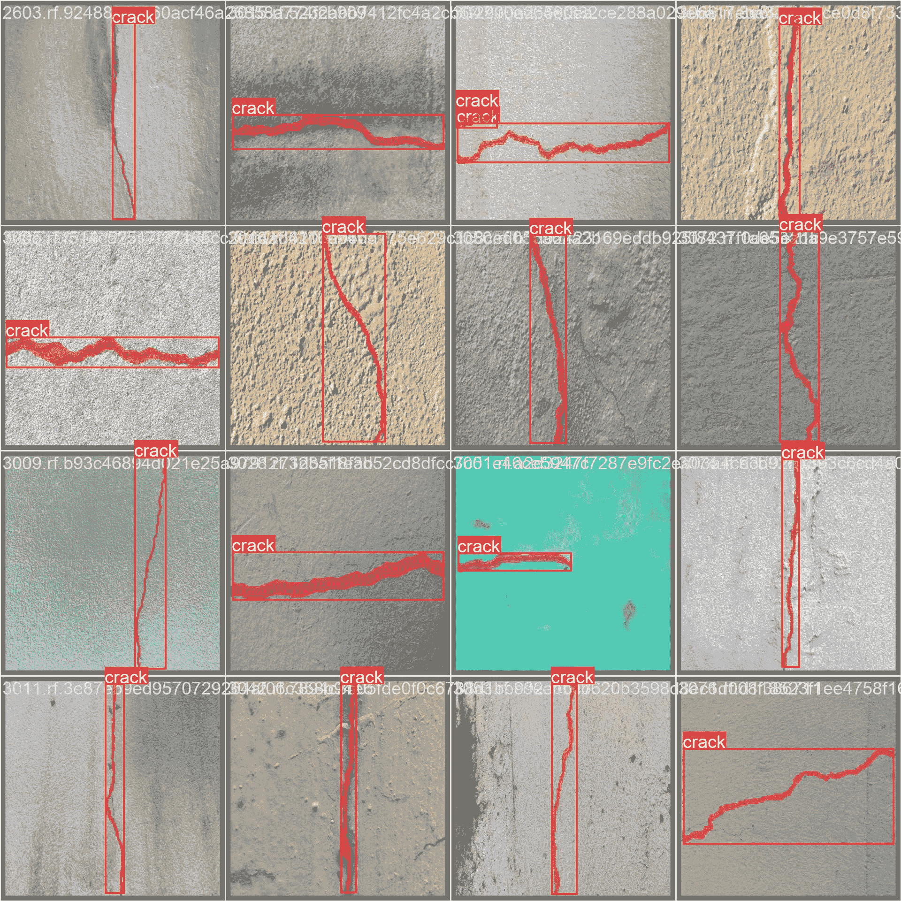

# Roboflow Universe 裂缝分割数据集

> 原文：[`docs.ultralytics.com/datasets/segment/crack-seg/`](https://docs.ultralytics.com/datasets/segment/crack-seg/)

[Roboflow](https://roboflow.com/?ref=ultralytics)的[裂缝分割数据集](https://universe.roboflow.com/university-bswxt/crack-bphdr)是专为参与交通和公共安全研究的个人设计的广泛资源。无论是开发自动驾驶汽车模型还是仅仅探索计算机视觉应用于娱乐目的，它都同样有益。

这个数据集包含来自不同道路和墙面场景的共 4029 张静态图像，对于裂缝分割相关任务而言是一项宝贵的资产。无论您是深入研究交通研究的复杂性，还是希望提高自动驾驶汽车模型的准确性，这个数据集都提供了丰富和多样的图像集合，支持您的努力。

## 数据集结构

裂缝分割数据集内的数据划分如下：

+   **训练集**：包括 3717 张带有对应注释的图像。

+   **测试集**：包括 112 张图像及其相应的注释。

+   **验证集**：包括 200 张带有对应注释的图像。

## 应用场景

裂缝分割在基础设施维护中有着实际应用，有助于识别和评估结构性损伤。它还通过使自动化系统能够检测和处理及时修复路面裂缝，从而在增强道路安全方面发挥着关键作用。

## 数据集 YAML

使用 YAML（另一种标记语言）文件来定义数据集的配置，包括路径、类别和其他相关信息。具体而言，对于裂缝分割数据集，管理和访问`crack-seg.yaml`文件位于[`github.com/ultralytics/ultralytics/blob/main/ultralytics/cfg/datasets/crack-seg.yaml`](https://github.com/ultralytics/ultralytics/blob/main/ultralytics/cfg/datasets/crack-seg.yaml)。

ultralytics/cfg/datasets/crack-seg.yaml

```py
`# Ultralytics YOLO 🚀, AGPL-3.0 license # Crack-seg dataset by Ultralytics # Documentation: https://docs.ultralytics.com/datasets/segment/crack-seg/ # Example usage: yolo train data=crack-seg.yaml # parent # ├── ultralytics # └── datasets #     └── crack-seg  ← downloads here (91.2 MB)  # Train/val/test sets as 1) dir: path/to/imgs, 2) file: path/to/imgs.txt, or 3) list: [path/to/imgs1, path/to/imgs2, ..] path:  ../datasets/crack-seg  # dataset root dir train:  train/images  # train images (relative to 'path') 3717 images val:  valid/images  # val images (relative to 'path') 112 images test:  test/images  # test images (relative to 'path') 200 images  # Classes names:   0:  crack  # Download script/URL (optional) download:  https://github.com/ultralytics/assets/releases/download/v0.0.0/crack-seg.zip` 
```

## 用途

要在裂缝分割数据集上使用 Ultralytics YOLOv8n 模型进行 100 个 epochs 的训练，并使用 640 的图像尺寸，您可以使用以下代码片段。有关可用参数的详细列表，请参考模型训练页面。

训练示例

```py
`from ultralytics import YOLO  # Load a model model = YOLO("yolov8n-seg.pt")  # load a pretrained model (recommended for training)  # Train the model results = model.train(data="crack-seg.yaml", epochs=100, imgsz=640)` 
```

```py
`# Start training from a pretrained *.pt model yolo  segment  train  data=crack-seg.yaml  model=yolov8n-seg.pt  epochs=100  imgsz=640` 
```

## 示例数据和注释

裂缝分割数据集包含多个角度捕获的图像和视频的多样化集合。以下是数据集中的数据示例及其相应的注释：



+   此图展示了图像对象分割的示例，显示了用于识别对象的标注边界框和掩模。该数据集包括了在不同位置、环境和密度下拍摄的多种图像，使其成为开发专用模型的综合资源。

+   该示例突显了裂缝分割数据集中所包含的多样性和复杂性，强调了高质量数据在计算机视觉任务中的关键作用。

## 引用和致谢

如果您将裂缝分割数据集纳入您的研究或开发工作中，请引用以下论文：

```py
`@misc{  crack-bphdr_dataset,   title  =  { crack Dataset },   type  =  { Open Source Dataset },   author  =  { University },   howpublished  =  { \url{ https://universe.roboflow.com/university-bswxt/crack-bphdr } },   url  =  { https://universe.roboflow.com/university-bswxt/crack-bphdr },   journal  =  { Roboflow Universe },   publisher  =  { Roboflow },   year  =  { 2022 },   month  =  { dec },   note  =  { visited on 2024-01-23 }, }` 
```

我们要感谢 Roboflow 团队创建和维护裂缝分割数据集，作为道路安全和研究项目的宝贵资源。有关裂缝分割数据集及其创建者的更多信息，请访问[裂缝分割数据集页面](https://universe.roboflow.com/university-bswxt/crack-bphdr)。

## 常见问题

### 什么是 Roboflow 裂缝分割数据集？

[Roboflow 裂缝分割数据集](https://universe.roboflow.com/university-bswxt/crack-bphdr)是一个专门设计用于交通和公共安全研究的综合性集合，包含了 4029 张静态图像。它非常适合于自动驾驶汽车模型开发和基础设施维护等任务。该数据集包括训练、测试和验证集，有助于准确的裂缝检测和分割。

### 如何使用 Ultralytics YOLOv8 训练裂缝分割数据集的模型？

要在裂缝分割数据集上训练 Ultralytics YOLOv8 模型，请使用以下代码片段。详细的说明和更多参数可以在模型训练页面找到。

训练示例

```py
`from ultralytics import YOLO  # Load a model model = YOLO("yolov8n-seg.pt")  # load a pretrained model (recommended for training)  # Train the model results = model.train(data="crack-seg.yaml", epochs=100, imgsz=640)` 
```

```py
`# Start training from a pretrained *.pt model yolo  segment  train  data=crack-seg.yaml  model=yolov8n-seg.pt  epochs=100  imgsz=640` 
```

### 我为什么要在我的自动驾驶汽车项目中使用裂缝分割数据集？

[裂缝分割数据集](https://universe.roboflow.com/university-bswxt/crack-bphdr)由 4029 张道路和墙壁图像组成，非常适用于自动驾驶汽车项目，提供了多种场景。这种多样性增强了用于裂缝检测的模型的准确性和鲁棒性，对于维护道路安全和确保及时基础设施修复至关重要。

### Ultralytics YOLO 为裂缝分割提供了哪些独特功能？

Ultralytics YOLO 提供了哪些先进的实时目标检测、分割和分类功能，使其在裂缝分割任务中非常理想？其处理大型数据集和复杂场景的能力确保了高准确性和效率。例如，模型的训练、预测和导出模式覆盖了从训练到部署的全面功能。

### 如何在我的研究论文中引用 Roboflow 裂缝分割数据集？

如果您在研究中使用了裂缝分割数据集，请使用以下 BibTeX 引用：

```py
`@misc{  crack-bphdr_dataset,   title  =  { crack Dataset },   type  =  { Open Source Dataset },   author  =  { University },   howpublished  =  { \url{ https://universe.roboflow.com/university-bswxt/crack-bphdr } },   url  =  { https://universe.roboflow.com/university-bswxt/crack-bphdr },   journal  =  { Roboflow Universe },   publisher  =  { Roboflow },   year  =  { 2022 },   month  =  { dec },   note  =  { visited on 2024-01-23 }, }` 
```

此引用格式确保了对数据集创建者的适当认可，并确认了其在您的研究中的使用。
