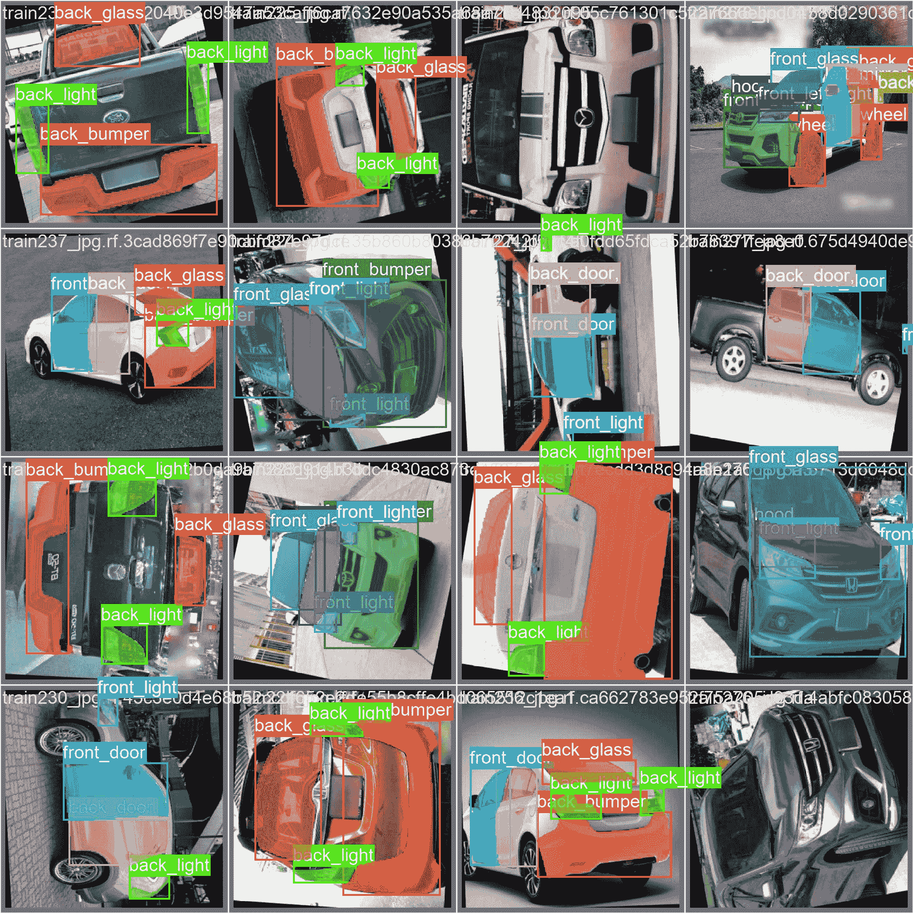

# Roboflow Universe Carparts 分割数据集

> 原文：[`docs.ultralytics.com/datasets/segment/carparts-seg/`](https://docs.ultralytics.com/datasets/segment/carparts-seg/)

[Roboflow](https://roboflow.com/?ref=ultralytics) [Carparts 分割数据集](https://universe.roboflow.com/gianmarco-russo-vt9xr/car-seg-un1pm) 是一个专为计算机视觉应用设计的图像和视频精选集，特别关注与汽车零件相关的分割任务。该数据集提供了从多个视角捕获的多样化视觉示例，为训练和测试分割模型提供了有价值的注释示例。

无论您是从事汽车研究、开发车辆维护的 AI 解决方案，还是探索计算机视觉应用，Carparts 分割数据集都是增强项目准确性和效率的宝贵资源。

[`www.youtube.com/embed/eHuzCNZeu0g`](https://www.youtube.com/embed/eHuzCNZeu0g)

**观看：** 使用 Ultralytics HUB 进行 Carparts 实例分割

## 数据集结构

Carparts 分割数据集内的数据分布如下所示：

+   **训练集**：包括 3156 张图像，每张图像都有相应的注释。

+   **测试集**：包括 276 张图像，每张图像都有相应的注释。

+   **验证集**：包括 401 张图像，每张图像都有相应的注释。

## 应用

Carparts 分割在汽车质量控制、汽车维修、电子商务目录、交通监控、自动驾驶车辆、保险处理、回收和智能城市倡议中找到了应用。它通过准确识别和分类不同的车辆组件，为各个行业的效率和自动化做出贡献。

## 数据集 YAML

YAML（另一种标记语言）文件用于定义数据集配置。它包含有关数据集路径、类别和其他相关信息。在 Package Segmentation 数据集中，`carparts-seg.yaml`文件位于[`github.com/ultralytics/ultralytics/blob/main/ultralytics/cfg/datasets/carparts-seg.yaml`](https://github.com/ultralytics/ultralytics/blob/main/ultralytics/cfg/datasets/carparts-seg.yaml)。

ultralytics/cfg/datasets/carparts-seg.yaml

```py
# Ultralytics YOLO 🚀, AGPL-3.0 license
# Carparts-seg dataset by Ultralytics
# Documentation: https://docs.ultralytics.com/datasets/segment/carparts-seg/
# Example usage: yolo train data=carparts-seg.yaml
# parent
# ├── ultralytics
# └── datasets
#     └── carparts-seg  ← downloads here (132 MB)

# Train/val/test sets as 1) dir: path/to/imgs, 2) file: path/to/imgs.txt, or 3) list: [path/to/imgs1, path/to/imgs2, ..]
path:  ../datasets/carparts-seg  # dataset root dir
train:  train/images  # train images (relative to 'path') 3516 images
val:  valid/images  # val images (relative to 'path') 276 images
test:  test/images  # test images (relative to 'path') 401 images

# Classes
names:
  0:  back_bumper
  1:  back_door
  2:  back_glass
  3:  back_left_door
  4:  back_left_light
  5:  back_light
  6:  back_right_door
  7:  back_right_light
  8:  front_bumper
  9:  front_door
  10:  front_glass
  11:  front_left_door
  12:  front_left_light
  13:  front_light
  14:  front_right_door
  15:  front_right_light
  16:  hood
  17:  left_mirror
  18:  object
  19:  right_mirror
  20:  tailgate
  21:  trunk
  22:  wheel

# Download script/URL (optional)
download:  https://github.com/ultralytics/assets/releases/download/v0.0.0/carparts-seg.zip 
```

## 用法

要在 Carparts 分割数据集上使用 Ultralytics YOLOv8n 模型进行 100 轮的训练，图像大小为 640，您可以使用以下代码片段。有关可用参数的全面列表，请参考模型训练页面。

训练示例

```py
from ultralytics import YOLO

# Load a model
model = YOLO("yolov8n-seg.pt")  # load a pretrained model (recommended for training)

# Train the model
results = model.train(data="carparts-seg.yaml", epochs=100, imgsz=640) 
```

```py
# Start training from a pretrained *.pt model
yolo  segment  train  data=carparts-seg.yaml  model=yolov8n-seg.pt  epochs=100  imgsz=640 
```

## 样本数据和注释

Carparts 分割数据集包括从多个视角拍摄的多样化图像和视频。下面，您将找到来自数据集的示例数据及其相应的注释：



+   本图展示了样本内的对象分割，显示了带有掩码的标注边界框围绕识别对象。该数据集包含在多个位置、环境和密度下拍摄的各种图像，为制作特定任务模型提供了全面的资源。

+   本例突显了数据集固有的多样性和复杂性，强调了高质量数据在计算机视觉任务中的关键作用，特别是在汽车部件分割领域。

## 引文和致谢

如果您将 Carparts Segmentation 数据集集成到研究或开发项目中，请参考以下论文：

```py
 @misc{  car-seg-un1pm_dataset,
  title  =  { car-seg Dataset },
  type  =  { Open Source Dataset },
  author  =  { Gianmarco Russo },
  howpublished  =  { \url{ https://universe.roboflow.com/gianmarco-russo-vt9xr/car-seg-un1pm } },
  url  =  { https://universe.roboflow.com/gianmarco-russo-vt9xr/car-seg-un1pm },
  journal  =  { Roboflow Universe },
  publisher  =  { Roboflow },
  year  =  { 2023 },
  month  =  { nov },
  note  =  { visited on 2024-01-24 },
  } 
```

我们衷心感谢 Roboflow 团队在开发和管理 Carparts Segmentation 数据集方面的奉献，这是车辆维护和研究项目的宝贵资源。关于 Carparts Segmentation 数据集及其创建者的更多详细信息，请访问[CarParts Segmentation Dataset Page](https://universe.roboflow.com/gianmarco-russo-vt9xr/car-seg-un1pm)。

## 常见问题

### Roboflow Carparts Segmentation Dataset 是什么？

[Roboflow Carparts Segmentation Dataset](https://universe.roboflow.com/gianmarco-russo-vt9xr/car-seg-un1pm)是专为计算机视觉中汽车部件分割任务设计的精选图像和视频集合。该数据集包括从多个视角捕获的多样化视觉内容，是训练和测试汽车应用分割模型的宝贵资源。

### 我如何使用 Ultralytics YOLOv8 处理 Carparts Segmentation 数据集？

若要在 Carparts Segmentation 数据集上训练 YOLOv8 模型，您可以按照以下步骤进行：

训练示例

```py
from ultralytics import YOLO

# Load a model
model = YOLO("yolov8n-seg.pt")  # load a pretrained model (recommended for training)

# Train the model
results = model.train(data="carparts-seg.yaml", epochs=100, imgsz=640) 
```

```py
# Start training from a pretrained *.pt model
yolo  segment  train  data=carparts-seg.yaml  model=yolov8n-seg.pt  epochs=100  imgsz=640 
```

欲了解更多详细信息，请参阅培训文档。

### Carparts Segmentation 的一些应用是什么？

Carparts Segmentation 可以广泛应用于各个领域，如：- **汽车质量控制** - **汽车维修与保养** - **电子商务目录编制** - **交通监控** - **自动驾驶车辆** - **保险理赔处理** - **回收倡议** - **智能城市项目**

这种分割有助于准确识别和分类不同的车辆部件，提升了这些行业的效率和自动化水平。

### 我在哪里可以找到 Carparts Segmentation 的数据集配置文件？

Carparts Segmentation 数据集的数据集配置文件`carparts-seg.yaml`可在以下位置找到：[carparts-seg.yaml](https://github.com/ultralytics/ultralytics/blob/main/ultralytics/cfg/datasets/carparts-seg.yaml)。

### 为什么要使用 Carparts Segmentation 数据集？

汽车零件分割数据集提供了丰富的注释数据，是开发高精度汽车计算机视觉分割模型所必不可少的。该数据集的多样性和详细的注释提升了模型训练效果，使其在车辆维护自动化、增强车辆安全系统以及支持自动驾驶技术等应用中表现出色。与强大的数据集合作可以加速人工智能的发展，并确保模型的更佳性能。

获取更多详细信息，请访问[汽车零件分割数据集页面](https://universe.roboflow.com/gianmarco-russo-vt9xr/car-seg-un1pm)。
