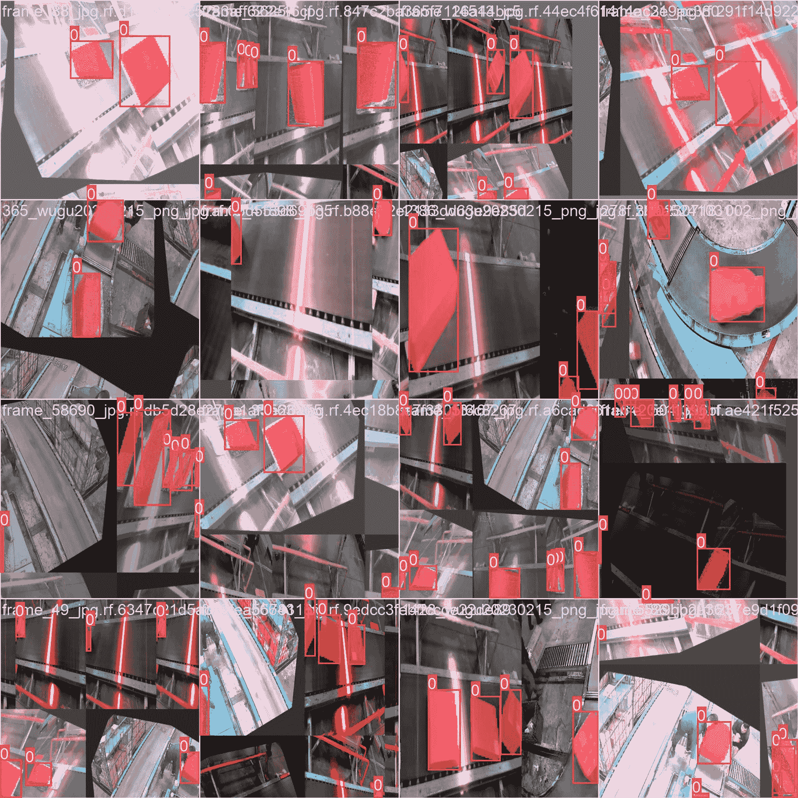

# Roboflow Universe Package Segmentation Dataset

> 原文：[`docs.ultralytics.com/datasets/segment/package-seg/`](https://docs.ultralytics.com/datasets/segment/package-seg/)

[Roboflow](https://roboflow.com/?ref=ultralytics)的[Package Segmentation Dataset](https://universe.roboflow.com/factorypackage/factory_package)是专门为与计算机视觉中的包分割相关任务定制的图像精选集。此数据集旨在帮助从事与包识别、分类和处理相关项目的研究人员、开发人员和爱好者。

数据集包含多种环境中展示各种包裹的图像，作为训练和评估分割模型的宝贵资源。无论您从事物流、仓储自动化或需要精确包裹分析的任何应用，Package Segmentation 数据集都提供了一个有针对性和全面性的图像集，以增强计算机视觉算法的性能。

## 数据集结构

在包分割数据集中，数据的分布结构如下：

+   **训练集**：包含 1920 张图像及其相应的注释。

+   **测试集**：包含 89 张图像，每张图像都有相应的注释。

+   **验证集**：包含 188 张图像，每张图像都有相应的注释。

## 应用场景

Package Segmentation Dataset 提供了包分割，对于优化物流、增强末端交付、改进制造质量控制以及促进智慧城市解决方案至关重要。从电子商务到安全应用，该数据集是关键资源，促进了多样化和高效的包裹分析应用的创新。

## 数据集 YAML

使用 YAML（另一种标记语言）文件来定义数据集配置。它包含有关数据集路径、类别和其他相关信息。对于 Package Segmentation 数据集，`package-seg.yaml`文件维护在[`github.com/ultralytics/ultralytics/blob/main/ultralytics/cfg/datasets/package-seg.yaml`](https://github.com/ultralytics/ultralytics/blob/main/ultralytics/cfg/datasets/package-seg.yaml)。

ultralytics/cfg/datasets/package-seg.yaml

```py
`# Ultralytics YOLO 🚀, AGPL-3.0 license # Package-seg dataset by Ultralytics # Documentation: https://docs.ultralytics.com/datasets/segment/package-seg/ # Example usage: yolo train data=package-seg.yaml # parent # ├── ultralytics # └── datasets #     └── package-seg  ← downloads here (102 MB)  # Train/val/test sets as 1) dir: path/to/imgs, 2) file: path/to/imgs.txt, or 3) list: [path/to/imgs1, path/to/imgs2, ..] path:  ../datasets/package-seg  # dataset root dir train:  images/train  # train images (relative to 'path') 1920 images val:  images/val  # val images (relative to 'path') 89 images test:  test/images  # test images (relative to 'path') 188 images  # Classes names:   0:  package  # Download script/URL (optional) download:  https://github.com/ultralytics/assets/releases/download/v0.0.0/package-seg.zip` 
```

## 用途

要在 Package Segmentation 数据集上使用 Ultralytics YOLOv8n 模型进行 100 个 epoch 的训练，图像大小为 640，请使用以下代码片段。有关可用参数的详细列表，请参考模型训练页面。

训练示例

```py
`from ultralytics import YOLO  # Load a model model = YOLO("yolov8n-seg.pt")  # load a pretrained model (recommended for training)  # Train the model results = model.train(data="package-seg.yaml", epochs=100, imgsz=640)` 
```

```py
`# Start training from a pretrained *.pt model yolo  segment  train  data=package-seg.yaml  model=yolov8n-seg.pt  epochs=100  imgsz=640` 
```

## 样本数据和注释

Package Segmentation 数据集包含从多个视角捕获的各种图像和视频。以下是数据集中的数据示例，附带其相应的注释：



+   这幅图显示了图像对象检测的实例，展示了带有掩码的标注边界框，勾画了识别物体。数据集包含在不同位置、环境和密度下拍摄的多样化图像，是开发专门模型的全面资源。

+   这个示例强调了 VisDrone 数据集中存在的多样性和复杂性，凸显了对涉及无人机的计算机视觉任务而言高质量传感器数据的重要性。

## 引用和感谢

如果您将裂缝分割数据集整合到您的研究或开发项目中，请引用以下论文：

```py
`@misc{  factory_package_dataset,   title  =  { factory_package Dataset },   type  =  { Open Source Dataset },   author  =  { factorypackage },   howpublished  =  { \url{ https://universe.roboflow.com/factorypackage/factory_package } },   url  =  { https://universe.roboflow.com/factorypackage/factory_package },   journal  =  { Roboflow Universe },   publisher  =  { Roboflow },   year  =  { 2024 },   month  =  { jan },   note  =  { visited on 2024-01-24 }, }` 
```

我们要感谢 Roboflow 团队为创建和维护包分割数据集所做的努力。对于有关包分割数据集及其创建者的更多详细信息，请访问[包分割数据集页面](https://universe.roboflow.com/factorypackage/factory_package)。

## 常见问题解答

### Roboflow 包分割数据集是什么，它如何帮助计算机视觉项目？

[Roboflow 包分割数据集](https://universe.roboflow.com/factorypackage/factory_package)是一个精心策划的图像集合，专为涉及包裹分割任务而设计。它包含各种背景下的包裹图像，对于训练和评估分割模型非常宝贵。这个数据集特别适用于物流、仓库自动化以及任何需要精确包裹分析的项目。它有助于优化物流并增强视觉模型，以便准确识别和分类包裹。

### 如何在包分割数据集上训练 Ultralytics YOLOv8 模型？

您可以使用 Python 和 CLI 方法训练 Ultralytics YOLOv8n 模型。对于 Python，使用下面的代码片段：

```py
`from ultralytics import YOLO  # Load a model model = YOLO("yolov8n-seg.pt")  # load a pretrained model  # Train the model results = model.train(data="package-seg.yaml", epochs=100, imgsz=640)` 
```

对于 CLI：

```py
`# Start training from a pretrained *.pt model yolo  segment  train  data=package-seg.yaml  model=yolov8n-seg.pt  epochs=100  imgsz=640` 
```

有关更多详情，请参阅模型训练页面。

### 什么是包分割数据集的组成部分，以及它的结构是怎样的？

数据集分为三个主要部分：- **训练集**：包含 1920 张带有注释的图像。- **测试集**：包括 89 张带有相应注释的图像。- **验证集**：包含 188 张带有注释的图像。

这种结构确保了一个平衡的数据集，用于彻底的模型训练、验证和测试，提升了分割算法的性能。

### 为什么应该使用 Ultralytics YOLOv8 与包分割数据集？

Ultralytics YOLOv8 提供了实时目标检测和分割任务的最先进准确性和速度。与 Package Segmentation Dataset 结合使用，可以充分利用 YOLOv8 的能力进行精确的包裹分割。这种组合特别适用于物流和仓库自动化等行业，准确的包裹识别对其至关重要。有关更多信息，请查阅我们关于 [YOLOv8 分割](https://docs.ultralytics.com/models/yolov8) 的页面。

### 如何访问和使用 `package-seg.yaml` 文件，用于 Package Segmentation Dataset？

`package-seg.yaml` 文件存放在 Ultralytics 的 GitHub 仓库中，包含有关数据集路径、类别和配置的重要信息。你可以从 [这里](https://github.com/ultralytics/ultralytics/blob/main/ultralytics/cfg/datasets/package-seg.yaml) 下载它。这个文件对于配置模型以有效利用数据集至关重要。

欲了解更多见解和实际示例，请查阅我们的 [使用](https://docs.ultralytics.com/usage/python/) 部分。
