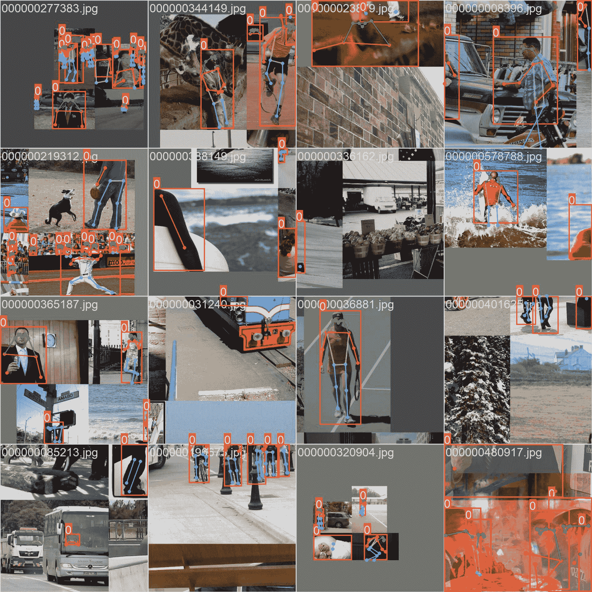

# COCO-Pose 数据集

> 原文：[`docs.ultralytics.com/datasets/pose/coco/`](https://docs.ultralytics.com/datasets/pose/coco/)

[COCO-Pose](https://cocodataset.org/#keypoints-2017) 数据集是 COCO（通用物体上下文）数据集的专业版本，专门设计用于姿态估计任务。它利用 COCO Keypoints 2017 的图像和标签，能够训练像 YOLO 这样的模型进行姿态估计任务。


## COCO-Pose 预训练模型

| 模型 | 尺寸 ^((像素)) | mAP^(姿态 50-95) | mAP^(姿态 50) | 速度 ^(CPU ONNX

(ms)) | 速度 ^(A100 TensorRT

(ms)) | 参数 ^((M)) | FLOPs ^((B)) |

| --- | --- | --- | --- | --- | --- | --- | --- |
| --- | --- | --- | --- | --- | --- | --- | --- |
| [YOLOv8n-pose](https://github.com/ultralytics/assets/releases/download/v8.2.0/yolov8n-pose.pt) | 640 | 50.4 | 80.1 | 131.8 | 1.18 | 3.3 | 9.2 |
| [YOLOv8s-pose](https://github.com/ultralytics/assets/releases/download/v8.2.0/yolov8s-pose.pt) | 640 | 60.0 | 86.2 | 233.2 | 1.42 | 11.6 | 30.2 |
| [YOLOv8m-pose](https://github.com/ultralytics/assets/releases/download/v8.2.0/yolov8m-pose.pt) | 640 | 65.0 | 88.8 | 456.3 | 2.00 | 26.4 | 81.0 |
| [YOLOv8l-pose](https://github.com/ultralytics/assets/releases/download/v8.2.0/yolov8l-pose.pt) | 640 | 67.6 | 90.0 | 784.5 | 2.59 | 44.4 | 168.6 |
| [YOLOv8x-pose](https://github.com/ultralytics/assets/releases/download/v8.2.0/yolov8x-pose.pt) | 640 | 69.2 | 90.2 | 1607.1 | 3.73 | 69.4 | 263.2 |
| [YOLOv8x-pose-p6](https://github.com/ultralytics/assets/releases/download/v8.2.0/yolov8x-pose-p6.pt) | 1280 | 71.6 | 91.2 | 4088.7 | 10.04 | 99.1 | 1066.4 |

## 主要特点

+   COCO-Pose 基于 COCO Keypoints 2017 数据集，该数据集包含 20 万张带有关键点标注的图像，用于姿态估计任务。

+   数据集支持人体图像的 17 个关键点，便于详细的姿态估计。

+   与 COCO 类似，它提供了标准化的评估指标，包括用于姿态估计任务的对象关键点相似性（OKS），适用于比较模型性能。

## 数据集结构

COCO-Pose 数据集分为三个子集：

1.  **Train2017**：此子集包含 COCO 数据集中的部分 11.8 万张图像，用于训练姿态估计模型的注释。

1.  **Val2017**：此子集包含用于在模型训练期间进行验证的图像的选择。

1.  **Test2017**：此子集包含用于测试和基准测试训练模型的图像。此子集的地面真实标注未公开，其结果将提交到[COCO 评估服务器](https://codalab.lisn.upsaclay.fr/competitions/7384)进行性能评估。

## 应用

COCO-Pose 数据集专门用于训练和评估深度学习模型在关键点检测和姿态估计任务中的表现，如 OpenPose。该数据集拥有大量带标注图像和标准化评估指标，是计算机视觉研究人员和从业者在姿态估计上的重要资源。

## **数据集 YAML**

使用 YAML（Yet Another Markup Language）文件来定义数据集配置。它包含关于数据集路径、类别和其他相关信息。在 COCO-Pose 数据集的情况下，`coco-pose.yaml`文件维护在[`github.com/ultralytics/ultralytics/blob/main/ultralytics/cfg/datasets/coco-pose.yaml`](https://github.com/ultralytics/ultralytics/blob/main/ultralytics/cfg/datasets/coco-pose.yaml)。

ultralytics/cfg/datasets/coco-pose.yaml

```py
`# Ultralytics YOLO 🚀, AGPL-3.0 license # COCO 2017 dataset https://cocodataset.org by Microsoft # Documentation: https://docs.ultralytics.com/datasets/pose/coco/ # Example usage: yolo train data=coco-pose.yaml # parent # ├── ultralytics # └── datasets #     └── coco-pose  ← downloads here (20.1 GB)  # Train/val/test sets as 1) dir: path/to/imgs, 2) file: path/to/imgs.txt, or 3) list: [path/to/imgs1, path/to/imgs2, ..] path:  ../datasets/coco-pose  # dataset root dir train:  train2017.txt  # train images (relative to 'path') 118287 images val:  val2017.txt  # val images (relative to 'path') 5000 images test:  test-dev2017.txt  # 20288 of 40670 images, submit to https://competitions.codalab.org/competitions/20794  # Keypoints kpt_shape:  [17,  3]  # number of keypoints, number of dims (2 for x,y or 3 for x,y,visible) flip_idx:  [0,  2,  1,  4,  3,  6,  5,  8,  7,  10,  9,  12,  11,  14,  13,  16,  15]  # Classes names:   0:  person  # Download script/URL (optional) download:  |   from ultralytics.utils.downloads import download   from pathlib import Path    # Download labels   dir = Path(yaml['path'])  # dataset root dir   url = 'https://github.com/ultralytics/assets/releases/download/v0.0.0/'   urls = [url + 'coco2017labels-pose.zip']  # labels   download(urls, dir=dir.parent)   # Download data   urls = ['http://images.cocodataset.org/zips/train2017.zip',  # 19G, 118k images   'http://images.cocodataset.org/zips/val2017.zip',  # 1G, 5k images   'http://images.cocodataset.org/zips/test2017.zip']  # 7G, 41k images (optional)   download(urls, dir=dir / 'images', threads=3)` 
```

## **用法**

要在 COCO-Pose 数据集上训练 YOLOv8n-pose 模型，进行 100 个 epochs 并设置图像大小为 640，您可以使用以下代码片段。要获取可用参数的全面列表，请参阅模型训练页面。

**训练示例**

```py
`from ultralytics import YOLO  # Load a model model = YOLO("yolov8n-pose.pt")  # load a pretrained model (recommended for training)  # Train the model results = model.train(data="coco-pose.yaml", epochs=100, imgsz=640)` 
```

```py
`# Start training from a pretrained *.pt model yolo  pose  train  data=coco-pose.yaml  model=yolov8n-pose.pt  epochs=100  imgsz=640` 
```

## **样本图像和注释**

COCO-Pose 数据集包含一组多样的图像，其中的人物用关键点进行注释。以下是数据集中一些图像的示例及其相应的注释：



+   **马赛克图像**：这幅图展示了由马赛克数据集图像组成的训练批次。在训练过程中，马赛克是一种技术，将多个图像合并成单个图像，以增加每个训练批次中对象和场景的多样性。这有助于提高模型对不同对象大小、长宽比和背景环境的泛化能力。

该示例展示了 COCO-Pose 数据集中图像的多样性和复杂性，以及在训练过程中使用马赛克的好处。

## **引用和致谢**

如果您在研究或开发工作中使用 COCO-Pose 数据集，请引用以下论文：

```py
`@misc{lin2015microsoft,   title={Microsoft COCO: Common Objects in Context},   author={Tsung-Yi Lin and Michael Maire and Serge Belongie and Lubomir Bourdev and Ross Girshick and James Hays and Pietro Perona and Deva Ramanan and C. Lawrence Zitnick and Piotr Dollár},   year={2015},   eprint={1405.0312},   archivePrefix={arXiv},   primaryClass={cs.CV} }` 
```

我们要感谢 COCO 联盟为计算机视觉社区创建和维护这一宝贵资源。有关 COCO-Pose 数据集及其创建者的更多信息，请访问[COCO 数据集网站](https://cocodataset.org/#home)。 

## **常见问题解答**

### COCO-Pose 数据集是什么，如何与 Ultralytics YOLO 用于姿态估计？

[COCO-Pose](https://cocodataset.org/#keypoints-2017) 数据集是专门用于姿态估计任务的 COCO（通用物体上下文）数据集的一个特殊版本。它基于 COCO Keypoints 2017 图像和注释，允许像 Ultralytics YOLO 这样的模型进行详细的姿态估计训练。例如，您可以使用 COCO-Pose 数据集通过加载预训练模型并使用 YAML 配置来训练 YOLOv8n-pose 模型。有关训练示例，请参阅训练文档。

### 如何在 COCO-Pose 数据集上训练 YOLOv8 模型？

使用 Python 或 CLI 命令可以在 COCO-Pose 数据集上训练 YOLOv8 模型。例如，要在图像大小为 640 的情况下训练 100 个 epochs 的 YOLOv8n-pose 模型，可以按照以下步骤进行：

**训练示例**

```py
`from ultralytics import YOLO  # Load a model model = YOLO("yolov8n-pose.pt")  # load a pretrained model (recommended for training)  # Train the model results = model.train(data="coco-pose.yaml", epochs=100, imgsz=640)` 
```

```py
`# Start training from a pretrained *.pt model yolo  pose  train  data=coco-pose.yaml  model=yolov8n-pose.pt  epochs=100  imgsz=640` 
```

欲了解更多关于训练过程和可用参数的详细信息，请查看训练页面。

### COCO-Pose 数据集提供了哪些用于评估模型性能的不同指标？

COCO-Pose 数据集为姿态估计任务提供了几个标准化评估指标，类似于原始的 COCO 数据集。关键指标包括对象关键点相似性（OKS），评估预测关键点与地面实况注释的准确性。这些指标允许对不同模型进行彻底的性能比较。例如，COCO-Pose 预训练模型如 YOLOv8n-pose、YOLOv8s-pose 等在文档中列出了特定的性能指标，如 mAP^(pose)50-95 和 mAP^(pose)50。

### COCO-Pose 数据集的结构和拆分如何？

COCO-Pose 数据集分为三个子集：

1.  **Train2017**: 包含 118K COCO 图像的一部分，用于训练姿态估计模型的注释。

1.  **Val2017**: 用于模型训练过程中验证目的的选定图像。

1.  **Test2017**: 用于测试和基准测试训练模型的图像。此子集的地面实况注释不公开；结果将提交至[COCO 评估服务器](https://codalab.lisn.upsaclay.fr/competitions/7384)进行性能评估。

这些子集有助于有效组织培训、验证和测试阶段。有关配置详细信息，请查看 GitHub 上的`coco-pose.yaml`文件，网址为[GitHub](https://github.com/ultralytics/ultralytics/blob/main/ultralytics/cfg/datasets/coco-pose.yaml)。

### COCO-Pose 数据集的关键特性和应用是什么？

COCO-Pose 数据集将 COCO Keypoints 2017 注释扩展到包括人物图像的 17 个关键点，实现了详细的姿态估计。标准化评估指标（例如 OKS）有助于跨不同模型进行比较。COCO-Pose 数据集的应用涵盖各种领域，如体育分析、医疗保健和人机交互，无论何处需要对人物图像进行详细的姿态估计。对于实际应用，利用文档中提供的预训练模型（例如 YOLOv8n-pose）可以显著简化流程（关键特性）。

如果您在研究或开发工作中使用 COCO-Pose 数据集，请引用以下 BibTeX 条目中的论文。
