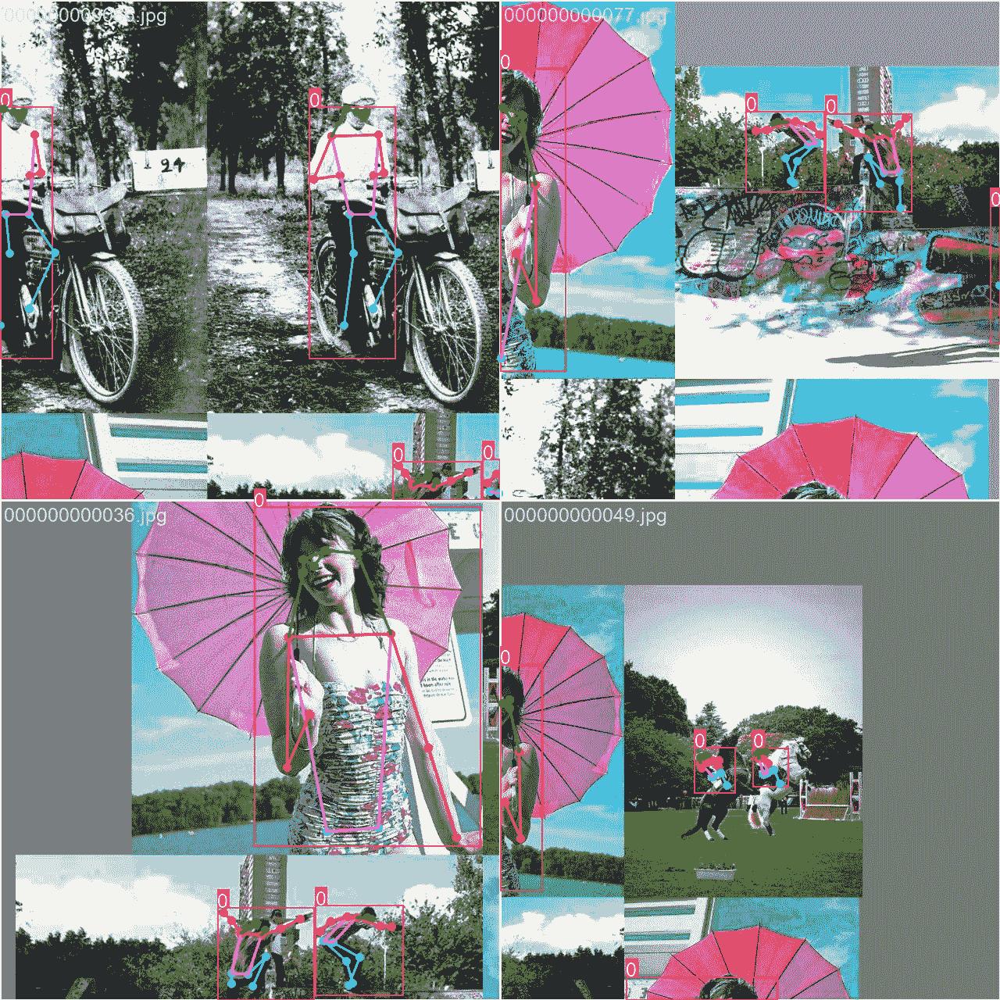

# COCO8-Pose 数据集

> 原文：[`docs.ultralytics.com/datasets/pose/coco8-pose/`](https://docs.ultralytics.com/datasets/pose/coco8-pose/)

## 简介

[Ultralytics](https://ultralytics.com) COCO8-Pose 是一个小型而多用途的姿态检测数据集，由 COCO 训练集 2017 年的前 8 张图像组成，其中 4 张用于训练，4 张用于验证。这个数据集非常适合测试和调试对象检测模型，或者尝试新的检测方法。只有 8 张图像，管理起来非常方便，同时又足够多样化，可以在训练更大数据集之前进行错误测试和健全性检查。

此数据集适用于 Ultralytics 的[HUB](https://hub.ultralytics.com)和[YOLOv8](https://github.com/ultralytics/ultralytics)。

## 数据集 YAML

一个 YAML（另一种标记语言）文件用于定义数据集配置。它包含关于数据集路径、类别和其他相关信息的信息。在 COCO8-Pose 数据集的情况下，`coco8-pose.yaml` 文件维护在[`github.com/ultralytics/ultralytics/blob/main/ultralytics/cfg/datasets/coco8-pose.yaml`](https://github.com/ultralytics/ultralytics/blob/main/ultralytics/cfg/datasets/coco8-pose.yaml)。

ultralytics/cfg/datasets/coco8-pose.yaml

```py
`# Ultralytics YOLO 🚀, AGPL-3.0 license # COCO8-pose dataset (first 8 images from COCO train2017) by Ultralytics # Documentation: https://docs.ultralytics.com/datasets/pose/coco8-pose/ # Example usage: yolo train data=coco8-pose.yaml # parent # ├── ultralytics # └── datasets #     └── coco8-pose  ← downloads here (1 MB)  # Train/val/test sets as 1) dir: path/to/imgs, 2) file: path/to/imgs.txt, or 3) list: [path/to/imgs1, path/to/imgs2, ..] path:  ../datasets/coco8-pose  # dataset root dir train:  images/train  # train images (relative to 'path') 4 images val:  images/val  # val images (relative to 'path') 4 images test:  # test images (optional)  # Keypoints kpt_shape:  [17,  3]  # number of keypoints, number of dims (2 for x,y or 3 for x,y,visible) flip_idx:  [0,  2,  1,  4,  3,  6,  5,  8,  7,  10,  9,  12,  11,  14,  13,  16,  15]  # Classes names:   0:  person  # Download script/URL (optional) download:  https://github.com/ultralytics/assets/releases/download/v0.0.0/coco8-pose.zip` 
```

## 使用

要在 COCO8-Pose 数据集上用图像大小为 640 训练 YOLOv8n-pose 模型 100 个 epochs，您可以使用以下代码片段。有关可用参数的全面列表，请参阅模型训练页面。

训练示例

```py
`from ultralytics import YOLO  # Load a model model = YOLO("yolov8n-pose.pt")  # load a pretrained model (recommended for training)  # Train the model results = model.train(data="coco8-pose.yaml", epochs=100, imgsz=640)` 
```

```py
`# Start training from a pretrained *.pt model yolo  pose  train  data=coco8-pose.yaml  model=yolov8n-pose.pt  epochs=100  imgsz=640` 
```

## 样本图像和注释

这里有一些 COCO8-Pose 数据集中的图像示例，以及它们对应的注释：



+   **马赛克图像**：这张图片展示了一个由马赛克数据集图像组成的训练批次。马赛克是一种训练期间使用的技术，将多个图像合并成单个图像，以增加每个训练批次中对象和场景的多样性。这有助于改善模型对不同对象大小、长宽比和上下文的泛化能力。

此示例展示了 COCO8-Pose 数据集中图像的多样性和复杂性，以及在训练过程中使用马赛克的好处。

## 引用和致谢

如果您在研究或开发工作中使用 COCO 数据集，请引用以下论文：

```py
`@misc{lin2015microsoft,   title={Microsoft COCO: Common Objects in Context},   author={Tsung-Yi Lin and Michael Maire and Serge Belongie and Lubomir Bourdev and Ross Girshick and James Hays and Pietro Perona and Deva Ramanan and C. Lawrence Zitnick and Piotr Dollár},   year={2015},   eprint={1405.0312},   archivePrefix={arXiv},   primaryClass={cs.CV} }` 
```

我们要感谢 COCO 联盟为计算机视觉社区创建和维护这一宝贵资源。有关 COCO 数据集及其创建者的更多信息，请访问[COCO 数据集网站](https://cocodataset.org/#home)。

## 常见问题解答

### COCO8-Pose 数据集是什么，以及它如何与 Ultralytics YOLOv8 一起使用？

COCO8-Pose 数据集是一个小型、多用途的姿势检测数据集，包括来自 COCO 2017 训练集的前 8 张图像，其中有 4 张用于训练，4 张用于验证。它设计用于测试和调试物体检测模型以及尝试新的检测方法。这个数据集非常适合使用[Ultralytics YOLOv8](https://docs.ultralytics.com/models/yolov8/)进行快速实验。有关数据集配置的详细信息，请查看此处的数据集 YAML 文件[链接](https://github.com/ultralytics/ultralytics/blob/main/ultralytics/cfg/datasets/coco8-pose.yaml)。

### 如何在 Ultralytics 中使用 COCO8-Pose 数据集训练 YOLOv8 模型？

要在 COCO8-Pose 数据集上使用 640 大小的图像训练 YOLOv8n-pose 模型 100 个 epochs，请参考以下示例：

训练示例

```py
`from ultralytics import YOLO  # Load a model model = YOLO("yolov8n-pose.pt")  # Train the model results = model.train(data="coco8-pose.yaml", epochs=100, imgsz=640)` 
```

```py
`yolo  pose  train  data=coco8-pose.yaml  model=yolov8n-pose.pt  epochs=100  imgsz=640` 
```

欲了解更多训练参数的详细列表，请参阅模型训练页面。

### 使用 COCO8-Pose 数据集的好处是什么？

COCO8-Pose 数据集提供了几个优点：

+   **紧凑尺寸**：仅有 8 张图像，易于管理，非常适合进行快速实验。

+   **多样数据**：尽管尺寸小，但包含多种场景，非常适合进行全面的管道测试。

+   **错误调试**：适用于识别训练错误并在扩展到更大数据集之前执行合理性检查。

欲了解更多关于其特性和用法，请参阅数据集介绍部分。

### 如何通过使用 COCO8-Pose 数据集进行 mosaicing 来改善 YOLOv8 训练过程？

Mosaicing 在 COCO8-Pose 数据集的样本图像中展示，将多个图像合并成一个，增加了每个训练批次中的对象和场景的多样性。这种技术有助于提高模型对各种对象大小、长宽比和背景环境的泛化能力，最终提升模型性能。请参阅样本图像和注释部分查看示例图像。

### 欲查找 COCO8-Pose 数据集的 YAML 文件及其使用方法，请访问何处？

COCO8-Pose 数据集的 YAML 文件可在此处找到[链接](https://github.com/ultralytics/ultralytics/blob/main/ultralytics/cfg/datasets/coco8-pose.yaml)。该文件定义了数据集配置，包括路径、类别和其他相关信息。按照训练示例部分所述，与 YOLOv8 训练脚本一起使用此文件。

欲了解更多常见问题解答和详细文档，请访问[Ultralytics 文档](https://docs.ultralytics.com/)。
