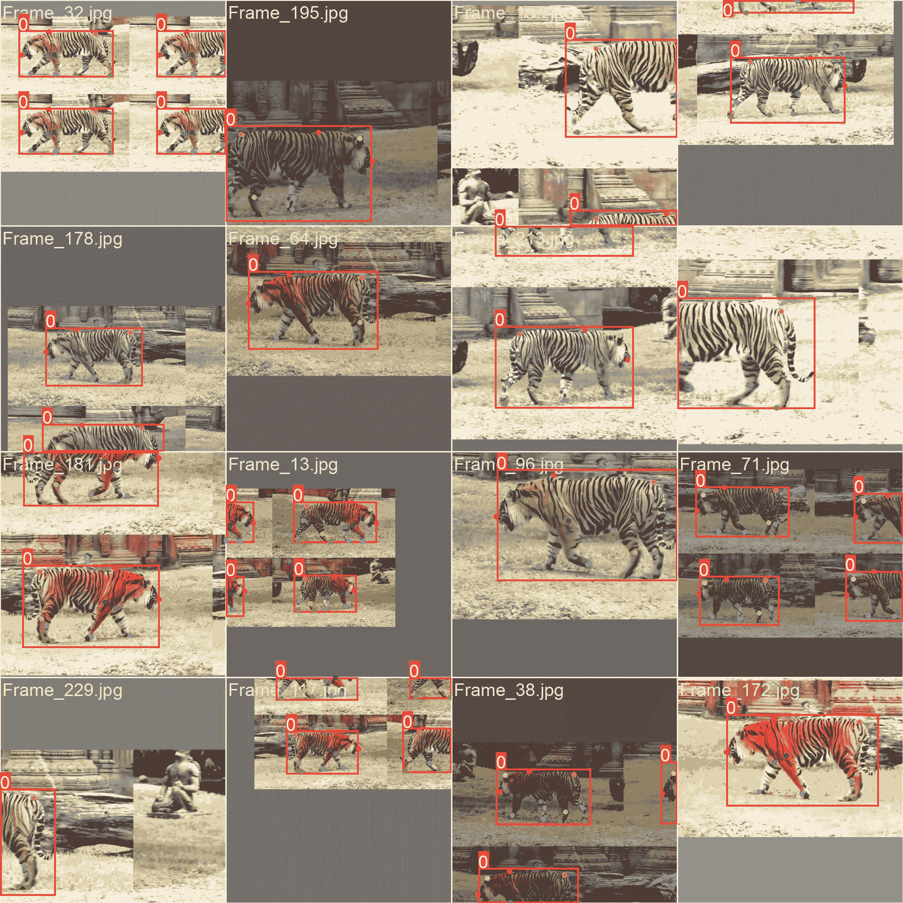

# 虎式姿势数据集

> 原文：[`docs.ultralytics.com/datasets/pose/tiger-pose/`](https://docs.ultralytics.com/datasets/pose/tiger-pose/)

## 简介

[Ultralytics](https://ultralytics.com)介绍了虎式姿势数据集，这是一个专为姿势估计任务设计的多功能集合。该数据集包括从[YouTube 视频](https://www.youtube.com/watch?v=MIBAT6BGE6U&pp=ygUbVGlnZXIgd2Fsa2luZyByZWZlcmVuY2UubXA0)中获取的 263 张图像，其中 210 张用于训练，53 张用于验证。它是测试和故障排除姿势估计算法的优秀资源。

尽管只有 210 张图像，但虎式姿势数据集具有多样性，适合评估训练流水线，识别潜在错误，并作为在与更大数据集进行姿势估计之前的宝贵初步步骤。

此数据集适用于[Ultralytics HUB](https://hub.ultralytics.com)和[YOLOv8](https://github.com/ultralytics/ultralytics)。

[`www.youtube.com/embed/Gc6K5eKrTNQ`](https://www.youtube.com/embed/Gc6K5eKrTNQ)

**观看：** 在 Ultralytics HUB 上使用 Tiger-Pose 数据集训练 YOLOv8 姿势模型

## 数据集 YAML 文件

YAML（另一种标记语言）文件用作指定数据集配置细节的手段。它包含关键数据，如文件路径、类定义和其他相关信息。具体而言，对于`tiger-pose.yaml`文件，您可以查看[Ultralytics Tiger-Pose 数据集配置文件](https://github.com/ultralytics/ultralytics/blob/main/ultralytics/cfg/datasets/tiger-pose.yaml)。

ultralytics/cfg/datasets/tiger-pose.yaml

```py
`# Ultralytics YOLO 🚀, AGPL-3.0 license # Tiger Pose dataset by Ultralytics # Documentation: https://docs.ultralytics.com/datasets/pose/tiger-pose/ # Example usage: yolo train data=tiger-pose.yaml # parent # ├── ultralytics # └── datasets #     └── tiger-pose  ← downloads here (75.3 MB)  # Train/val/test sets as 1) dir: path/to/imgs, 2) file: path/to/imgs.txt, or 3) list: [path/to/imgs1, path/to/imgs2, ..] path:  ../datasets/tiger-pose  # dataset root dir train:  train  # train images (relative to 'path') 210 images val:  val  # val images (relative to 'path') 53 images  # Keypoints kpt_shape:  [12,  2]  # number of keypoints, number of dims (2 for x,y or 3 for x,y,visible) flip_idx:  [0,  1,  2,  3,  4,  5,  6,  7,  8,  9,  10,  11]  # Classes names:   0:  tiger  # Download script/URL (optional) download:  https://github.com/ultralytics/assets/releases/download/v0.0.0/tiger-pose.zip` 
```

## 用法

要在图像大小为 640 的情况下，在 Tiger-Pose 数据集上使用以下代码片段训练 100 个 epoch 的 YOLOv8n-pose 模型，您可以参考模型训练页面以获取可用参数的全面列表。

训练示例

```py
`from ultralytics import YOLO  # Load a model model = YOLO("yolov8n-pose.pt")  # load a pretrained model (recommended for training)  # Train the model results = model.train(data="tiger-pose.yaml", epochs=100, imgsz=640)` 
```

```py
`# Start training from a pretrained *.pt model yolo  task=pose  mode=train  data=tiger-pose.yaml  model=yolov8n-pose.pt  epochs=100  imgsz=640` 
```

## 样本图像和注释

下面是虎式姿势数据集的一些图像示例，以及它们的相应注释：



+   **马赛克图像**：这张图展示了由马赛克数据集图像组成的训练批次。马赛克是一种在训练过程中使用的技术，将多个图像合并成单个图像，以增加每个训练批次中的对象和场景的多样性。这有助于提高模型对不同对象大小、长宽比和背景环境的泛化能力。

该示例展示了虎式姿势数据集图像的多样性和复杂性，以及在训练过程中使用马赛克的好处。

## 推理示例

推理示例

```py
`from ultralytics import YOLO  # Load a model model = YOLO("path/to/best.pt")  # load a tiger-pose trained model  # Run inference results = model.predict(source="https://youtu.be/MIBAT6BGE6U", show=True)` 
```

```py
`# Run inference using a tiger-pose trained model yolo  task=pose  mode=predict  source="https://youtu.be/MIBAT6BGE6U"  show=True  model="path/to/best.pt"` 
```

## 引用和致谢

该数据集已根据[AGPL-3.0 许可证](https://github.com/ultralytics/ultralytics/blob/main/LICENSE)发布。

## 常见问题解答

### 超轻量级 Tiger-Pose 数据集用途是什么？

Ultralytics Tiger-Pose 数据集专为姿势估计任务设计，包括来自[YouTube 视频](https://www.youtube.com/watch?v=MIBAT6BGE6U&pp=ygUbVGlnZXIgd2Fsa2luZyByZWZlcmVuY2UubXA0)的 263 张图像。该数据集分为 210 张训练图像和 53 张验证图像。它特别适用于使用[Ultralytics HUB](https://hub.ultralytics.com)和[YOLOv8](https://github.com/ultralytics/ultralytics)测试、训练和优化姿势估计算法。

### 如何在 Tiger-Pose 数据集上训练 YOLOv8 模型？

要在 Tiger-Pose 数据集上使用 640 像素大小训练 100 个 epochs 的 YOLOv8n-pose 模型，请使用以下代码片段。有关详细信息，请访问训练页面：

训练示例

```py
`from ultralytics import YOLO  # Load a model model = YOLO("yolov8n-pose.pt")  # load a pretrained model (recommended for training)  # Train the model results = model.train(data="tiger-pose.yaml", epochs=100, imgsz=640)` 
```

```py
`# Start training from a pretrained *.pt model yolo  task=pose  mode=train  data=tiger-pose.yaml  model=yolov8n-pose.pt  epochs=100  imgsz=640` 
```

### `tiger-pose.yaml`文件包含哪些配置？

`tiger-pose.yaml`文件用于指定 Tiger-Pose 数据集的配置详细信息，包括文件路径和类别定义。要查看确切的配置，请参阅[Ultralytics Tiger-Pose Dataset Configuration File](https://github.com/ultralytics/ultralytics/blob/main/ultralytics/cfg/datasets/tiger-pose.yaml)。

### 如何使用经过 Tiger-Pose 数据集训练的 YOLOv8 模型进行推断？

使用经过 Tiger-Pose 数据集训练的 YOLOv8 模型进行推断时，您可以使用以下代码片段。有关详细指南，请访问预测页面：

推断示例

```py
`from ultralytics import YOLO  # Load a model model = YOLO("path/to/best.pt")  # load a tiger-pose trained model  # Run inference results = model.predict(source="https://youtu.be/MIBAT6BGE6U", show=True)` 
```

```py
`# Run inference using a tiger-pose trained model yolo  task=pose  mode=predict  source="https://youtu.be/MIBAT6BGE6U"  show=True  model="path/to/best.pt"` 
```

### 使用 Tiger-Pose 数据集进行姿势估计的好处是什么？

尽管 Tiger-Pose 数据集的训练图像只有 210 张，但它提供了多样化的图像集合，非常适合测试姿势估计流水线。该数据集有助于识别潜在错误，并作为处理更大数据集之前的初步步骤。此外，该数据集支持使用高级工具如[Ultralytics HUB](https://hub.ultralytics.com)和[YOLOv8](https://github.com/ultralytics/ultralytics)训练和优化姿势估计算法，从而提高模型性能和准确性。
