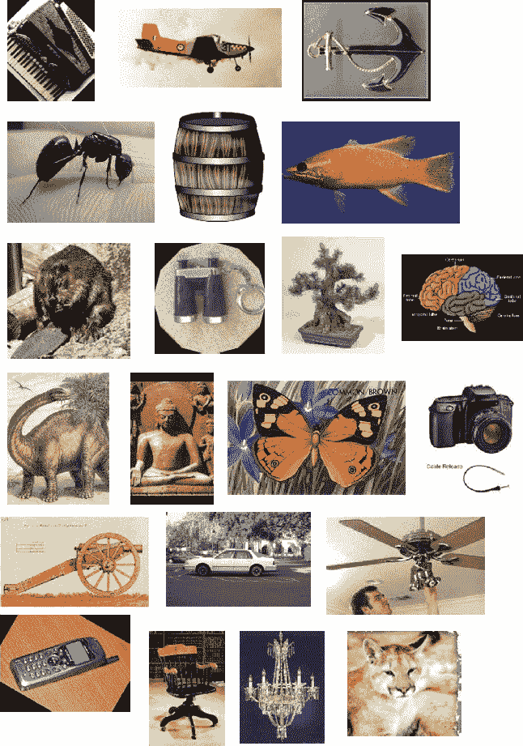

# Caltech-101 数据集

> 原文：[`docs.ultralytics.com/datasets/classify/caltech101/`](https://docs.ultralytics.com/datasets/classify/caltech101/)

[Caltech-101](https://data.caltech.edu/records/mzrjq-6wc02)数据集是广泛用于对象识别任务的数据集，包含大约 9,000 张来自 101 个对象类别的图像。选择这些类别是为了反映各种真实世界的物体，图像本身经过精心选择和注释，提供了一个具有挑战性的对象识别算法基准。

## 关键特点

+   Caltech-101 数据集包含大约 9,000 张彩色图像，分为 101 个类别。

+   这些类别涵盖了各种物体，包括动物、车辆、家居用品和人类。

+   每个类别的图像数量不同，每个类别大约有 40 到 800 张图像。

+   图像大小各异，大多数图像为中等分辨率。

+   Caltech-101 在机器学习领域广泛用于训练和测试，特别是用于对象识别任务。

## 数据集结构

不同于许多其他数据集，Caltech-101 数据集并未正式分为训练集和测试集。用户通常根据自己的需求创建自己的数据集拆分。然而，常见的做法是使用一部分随机图像进行训练（例如每个类别 30 张图像），其余的图像用于测试。

## 应用

Caltech-101 数据集广泛用于训练和评估深度学习模型在对象识别任务中的表现，例如卷积神经网络（CNNs）、支持向量机（SVMs）和其他各种机器学习算法。其多样的类别和高质量的图像使其成为机器学习和计算机视觉领域研究和开发的优秀数据集。

## 使用方法

要在 Caltech-101 数据集上训练一个 YOLO 模型进行 100 个 epochs，可以使用以下代码片段。要获取可用参数的详细列表，请参考模型训练页面。

训练示例

```py
`from ultralytics import YOLO  # Load a model model = YOLO("yolov8n-cls.pt")  # load a pretrained model (recommended for training)  # Train the model results = model.train(data="caltech101", epochs=100, imgsz=416)` 
```

```py
`# Start training from a pretrained *.pt model yolo  classify  train  data=caltech101  model=yolov8n-cls.pt  epochs=100  imgsz=416` 
```

## 样本图像和注释

Caltech-101 数据集包含各种对象的高质量彩色图像，为对象识别任务提供了结构良好的数据集。以下是数据集中的一些图像示例：



此示例展示了 Caltech-101 数据集中对象的多样性和复杂性，强调了对训练鲁棒的对象识别模型而言多样化数据集的重要性。

## 引用和致谢

如果您在研究或开发工作中使用 Caltech-101 数据集，请引用以下论文：

```py
`@article{fei2007learning,   title={Learning generative visual models from few training examples: An incremental Bayesian approach tested on 101 object categories},   author={Fei-Fei, Li and Fergus, Rob and Perona, Pietro},   journal={Computer vision and Image understanding},   volume={106},   number={1},   pages={59--70},   year={2007},   publisher={Elsevier} }` 
```

我们要感谢李飞飞、Rob Fergus 和 Pietro Perona 创建并维护 Caltech-101 数据集，作为机器学习和计算机视觉研究社区的宝贵资源。有关 Caltech-101 数据集及其创建者的更多信息，请访问[Caltech-101 数据集网站](https://data.caltech.edu/records/mzrjq-6wc02)。

## 常见问题

### Caltech-101 数据集在机器学习中用于什么目的？

[Caltech-101](https://data.caltech.edu/records/mzrjq-6wc02) 数据集在物体识别任务中被广泛应用于机器学习。它包含约 9,000 张跨越 101 个类别的图像，为评估物体识别算法提供了一个具有挑战性的基准。研究人员利用它来训练和测试模型，尤其是卷积神经网络（CNNs）和支持向量机（SVMs）在计算机视觉中的应用。

### 我如何在 Caltech-101 数据集上训练 Ultralytics YOLO 模型？

要在 Caltech-101 数据集上训练 Ultralytics YOLO 模型，您可以使用提供的代码片段。例如，为了进行 100 轮的训练：

训练示例

```py
`from ultralytics import YOLO  # Load a model model = YOLO("yolov8n-cls.pt")  # load a pretrained model (recommended for training)  # Train the model results = model.train(data="caltech101", epochs=100, imgsz=416)` 
```

```py
`# Start training from a pretrained *.pt model yolo  classify  train  data=caltech101  model=yolov8n-cls.pt  epochs=100  imgsz=416` 
```

获取更详细的论证和选项，请参考模型训练页面。

### Caltech-101 数据集的关键特征是什么？

Caltech-101 数据集包括： - 约 9,000 张跨越 101 个类别的彩色图像。 - 包含动物、车辆和家居物品等各种对象的类别。 - 每个类别的图像数量不定，通常在 40 到 800 之间。 - 变化的图像尺寸，大多数为中等分辨率。

这些特征使其成为机器学习和计算机视觉中训练和评估物体识别模型的优秀选择。

### 为什么我应该在我的研究中引用 Caltech-101 数据集？

引用 Caltech-101 数据集在您的研究中承认了创作者的贡献，并为可能使用该数据集的其他人提供了参考文献。推荐的引用格式如下：

```py
`@article{fei2007learning,   title={Learning generative visual models from few training examples: An incremental Bayesian approach tested on 101 object categories},   author={Fei-Fei, Li and Fergus, Rob and Perona, Pietro},   journal={Computer vision and Image understanding},   volume={106},   number={1},   pages={59--70},   year={2007},   publisher={Elsevier} }` 
```

引用有助于维护学术作品的完整性，并帮助同行找到原始资源。

### 我可以使用 Ultralytics HUB 来训练 Caltech-101 数据集的模型吗？

是的，您可以使用 Ultralytics HUB 来训练 Caltech-101 数据集的模型。Ultralytics HUB 提供了一个直观的平台，用于管理数据集、训练模型并无需复杂的编码即可部署它们。详细指南请参阅 [如何使用 Ultralytics HUB 训练自定义模型](https://www.ultralytics.com/blog/how-to-train-your-custom-models-with-ultralytics-hub) 博客文章。
