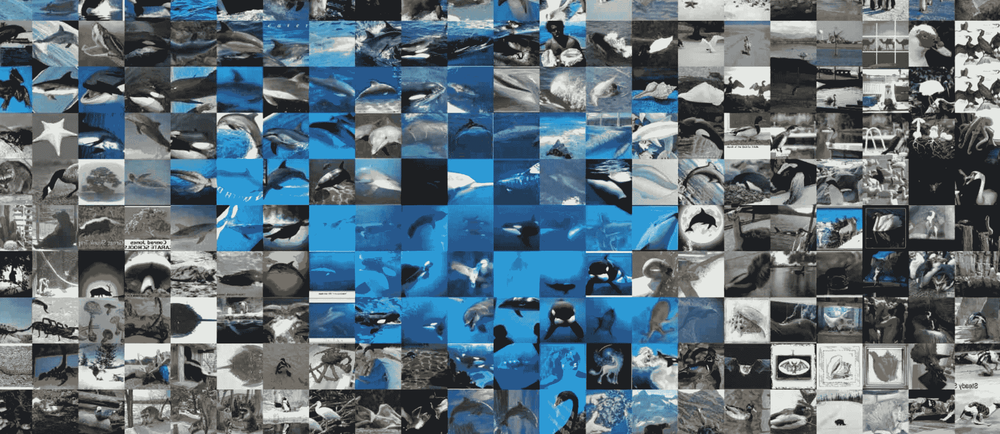

# Caltech-256 数据集

> 原文：[`docs.ultralytics.com/datasets/classify/caltech256/`](https://docs.ultralytics.com/datasets/classify/caltech256/)

[Caltech-256](https://data.caltech.edu/records/nyy15-4j048) 数据集是一组广泛的图像集合，用于目标分类任务。它包含大约 30,000 张图像，分为 257 个类别（256 个对象类别和 1 个背景类别）。这些图像经过精心筛选和注释，提供了一个具有挑战性和多样性的基准，用于测试目标识别算法。

[`www.youtube.com/embed/isc06_9qnM0`](https://www.youtube.com/embed/isc06_9qnM0)

**观看：** 如何使用 Caltech-256 数据集和 Ultralytics HUB 训练图像分类模型

## 关键特性

+   Caltech-256 数据集包含大约 30,000 张彩色图像，分为 257 个类别。

+   每个类别至少包含 80 张图像。

+   这些类别涵盖了各种真实世界的对象，包括动物、车辆、家庭物品和人物。

+   图像具有可变大小和分辨率。

+   Caltech-256 在机器学习领域，特别是在目标识别任务中被广泛用于训练和测试。

## 数据集结构

与 Caltech-101 类似，Caltech-256 数据集没有正式的训练集和测试集分割。用户通常根据自己的特定需求创建自己的数据集分割。常见的做法是使用随机子集图像进行训练，剩余图像用于测试。

## 应用场景

Caltech-256 数据集被广泛用于训练和评估深度学习模型，例如卷积神经网络（CNNs）、支持向量机（SVMs）以及各种其他机器学习算法，在目标识别任务中。其多样化的类别集合和高质量的图像使其成为机器学习和计算机视觉领域研究与开发中不可或缺的数据集。

## 使用方法

要在 Caltech-256 数据集上为 YOLO 模型训练 100 个 epoch，您可以使用以下代码片段。有关可用参数的全面列表，请参阅模型训练页面。

训练示例

```py
from ultralytics import YOLO

# Load a model
model = YOLO("yolov8n-cls.pt")  # load a pretrained model (recommended for training)

# Train the model
results = model.train(data="caltech256", epochs=100, imgsz=416) 
```

```py
# Start training from a pretrained *.pt model
yolo  classify  train  data=caltech256  model=yolov8n-cls.pt  epochs=100  imgsz=416 
```

## 样本图像和注释

Caltech-256 数据集包含各种对象的高质量彩色图像，为目标识别任务提供了全面的数据集。这里是来自数据集的一些示例图像（[来源](https://ml4a.github.io/demos/tsne_viewer.html)）:



这个例子展示了 Caltech-256 数据集中对象的多样性和复杂性，强调了用于训练鲁棒目标识别模型的多样化数据集的重要性。

## 引文和致谢

如果您在研究或开发工作中使用 Caltech-256 数据集，请引用以下论文：

```py
@article{griffin2007caltech,
  title={Caltech-256 object category dataset},
  author={Griffin, Gregory and Holub, Alex and Perona, Pietro},
  year={2007}
} 
```

我们要感谢 Gregory Griffin、Alex Holub 和 Pietro Perona 创建和维护 Caltech-256 数据集，作为机器学习和计算机视觉研究社区的宝贵资源。有关更多信息，请访问

有关 Caltech-256 数据集及其创建者的详细信息，请访问[Caltech-256 数据集网站](https://data.caltech.edu/records/nyy15-4j048)。

## 常见问题

### Caltech-256 数据集是什么，为什么对机器学习如此重要？

[Caltech-256](https://data.caltech.edu/records/nyy15-4j048)数据集是一个大型图像数据集，主要用于机器学习和计算机视觉中的目标分类任务。它包含约 30,000 张彩色图像，分为 257 个类别，涵盖了广泛的现实世界物体。数据集中多样且高质量的图像使其成为评估物体识别算法的优秀基准，这对于开发健壮的机器学习模型至关重要。

### 如何使用 Python 或 CLI 在 Caltech-256 数据集上训练 YOLO 模型？

要在 Caltech-256 数据集上为 YOLO 模型训练 100 个时期，您可以使用以下代码片段。有关其他选项，请参考模型训练页面。

训练示例

```py
from ultralytics import YOLO

# Load a model
model = YOLO("yolov8n-cls.pt")  # load a pretrained model

# Train the model
results = model.train(data="caltech256", epochs=100, imgsz=416) 
```

```py
# Start training from a pretrained *.pt model
yolo  classify  train  data=caltech256  model=yolov8n-cls.pt  epochs=100  imgsz=416 
```

### Caltech-256 数据集最常见的用例是什么？

Caltech-256 数据集被广泛用于各种物体识别任务，例如：

+   训练卷积神经网络（CNNs）

+   评估支持向量机（SVMs）的性能

+   新深度学习算法的基准测试

+   使用 Ultralytics YOLO 等框架开发目标检测模型

其多样性和全面的注释使其成为机器学习和计算机视觉研究与开发的理想选择。

### Caltech-256 数据集的结构和训练测试拆分是如何设计的？

Caltech-256 数据集没有预定义的训练和测试集拆分。用户通常根据自己的特定需求创建自己的拆分。常见的方法是随机选择一部分图像进行训练，剩余的图像用于测试。这种灵活性允许用户根据项目具体要求和实验设置来定制数据集。

### 为什么应该使用 Ultralytics YOLO 来训练 Caltech-256 数据集上的模型？

Ultralytics YOLO 模型在 Caltech-256 数据集上训练提供了几个优势：

+   **高准确性**：YOLO 模型以其在物体检测任务中的领先性能而闻名。

+   **速度**：它们提供实时推断能力，适用于需要快速预测的应用。

+   **易用性**：通过 Ultralytics HUB，用户可以在不需要大量编码的情况下进行模型的训练、验证和部署。

+   **预训练模型**：从像`yolov8n-cls.pt`这样的预训练模型开始，可以显著缩短训练时间并提高模型准确性。

欲了解更多详情，请浏览我们全面的培训指南。
