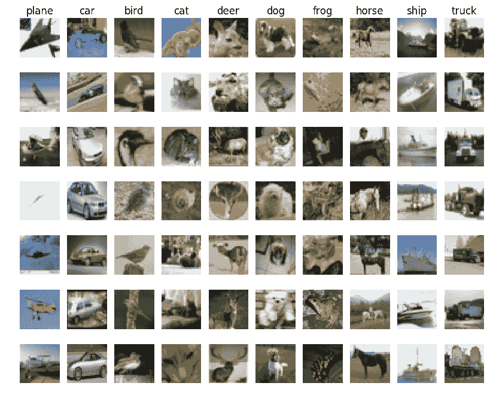

# CIFAR-10 数据集

> 原文：[`docs.ultralytics.com/datasets/classify/cifar10/`](https://docs.ultralytics.com/datasets/classify/cifar10/)

[CIFAR-10](https://www.cs.toronto.edu/~kriz/cifar.html)（加拿大高级研究所）数据集是广泛用于机器学习和计算机视觉算法的图像集合。由 CIFAR 研究所的研究人员开发，包含了 10 个不同类别的 32x32 彩色图像共 60,000 张。

[`www.youtube.com/embed/fLBbyhPbWzY`](https://www.youtube.com/embed/fLBbyhPbWzY)

**观看:** 如何使用 Ultralytics YOLOv8 训练 CIFAR-10 数据集的图像分类模型

## 关键特性

+   CIFAR-10 数据集包含 60,000 张图像，分为 10 个类别。

+   每个类别包含 6,000 张图像，分为 5,000 张用于训练和 1,000 张用于测试。

+   图像为彩色，尺寸为 32x32 像素。

+   这 10 个不同的类别分别代表飞机、汽车、鸟类、猫、鹿、狗、青蛙、马、船和卡车。

+   CIFAR-10 在机器学习和计算机视觉领域常用于训练和测试。

## 数据集结构

CIFAR-10 数据集分为两个子集：

1.  **训练集**: 这个子集包含用于训练机器学习模型的 50,000 张图像。

1.  **测试集**: 这个子集包含用于测试和评估训练模型的 10,000 张图像。

## 应用

CIFAR-10 数据集广泛用于训练和评估深度学习模型在图像分类任务中的表现，例如卷积神经网络（CNNs）、支持向量机（SVMs）以及其他各种机器学习算法。数据集的类别多样性和彩色图像的存在使其成为机器学习和计算机视觉领域研究和开发的理想数据集。

## 使用情况

若要在 CIFAR-10 数据集上用 YOLO 模型进行 100 个 epoch 的训练，图像尺寸为 32x32，可以使用以下代码片段。有关可用参数的详细列表，请参阅模型训练页面。

训练示例

```py
from ultralytics import YOLO

# Load a model
model = YOLO("yolov8n-cls.pt")  # load a pretrained model (recommended for training)

# Train the model
results = model.train(data="cifar10", epochs=100, imgsz=32) 
```

```py
# Start training from a pretrained *.pt model
yolo  classify  train  data=cifar10  model=yolov8n-cls.pt  epochs=100  imgsz=32 
```

## 样本图像和注释

CIFAR-10 数据集包含各种对象的彩色图像，为图像分类任务提供了结构良好的数据集。以下是数据集中的一些图像示例：



本示例展示了 CIFAR-10 数据集中对象的多样性和复杂性，突显了多样化数据集在训练鲁棒图像分类模型中的重要性。

## 引用和致谢

如果你在研究或开发工作中使用 CIFAR-10 数据集，请引用以下论文：

```py
@TECHREPORT{Krizhevsky09learningmultiple,
  author={Alex Krizhevsky},
  title={Learning multiple layers of features from tiny images},
  institution={},
  year={2009}
} 
```

我们要感谢 Alex Krizhevsky 创建并维护 CIFAR-10 数据集，作为机器学习和计算机视觉研究社区的宝贵资源。有关 CIFAR-10 数据集及其创建者的更多信息，请访问[CIFAR-10 数据集网站](https://www.cs.toronto.edu/~kriz/cifar.html)。

## 常见问题解答

### 如何在 CIFAR-10 数据集上训练 YOLO 模型？

要在 CIFAR-10 数据集上使用 Ultralytics 训练 YOLO 模型，可以按照 Python 和 CLI 提供的示例进行操作。以下是一个基本示例，用 32x32 像素的图像大小训练您的模型 100 个 epochs：

示例

```py
from ultralytics import YOLO

# Load a model
model = YOLO("yolov8n-cls.pt")  # load a pretrained model (recommended for training)

# Train the model
results = model.train(data="cifar10", epochs=100, imgsz=32) 
```

```py
# Start training from a pretrained *.pt model
yolo  classify  train  data=cifar10  model=yolov8n-cls.pt  epochs=100  imgsz=32 
```

如需更多详细信息，请参阅模型训练页面。

### CIFAR-10 数据集的主要特点是什么？

CIFAR-10 数据集包含 60,000 张彩色图像，分为 10 类。每个类别包含 6,000 张图像，其中 5,000 张用于训练，1,000 张用于测试。图像大小为 32x32 像素，并跨以下类别变化：

+   飞机

+   汽车

+   鸟类

+   猫

+   鹿

+   狗

+   青蛙

+   马匹

+   船

+   卡车

这个多样化的数据集对于训练机器学习和计算机视觉领域的图像分类模型至关重要。有关更多信息，请访问 CIFAR-10 数据集结构和应用部分。

### 为什么在图像分类任务中使用 CIFAR-10 数据集？

CIFAR-10 数据集因其多样性和结构而成为图像分类的优秀基准。它包含 60,000 张标记图像，涵盖 10 个不同的类别，有助于训练健壮且泛化能力强的模型。它广泛用于评估深度学习模型，包括卷积神经网络（CNNs）和其他机器学习算法。数据集相对较小，适合快速实验和算法开发。在应用部分探索其众多应用。

### CIFAR-10 数据集的结构是如何的？

CIFAR-10 数据集分为两个主要子集：

1.  **训练集**：包含 50,000 张用于训练机器学习模型的图像。

1.  **测试集**：包含 10,000 张图像，用于测试和评估训练模型。

每个子集包含分类为 10 个类别的图像，并提供其注释以便用于模型训练和评估。有关更详细的信息，请参阅数据集结构部分。

### 如何在我的研究中引用 CIFAR-10 数据集？

如果您在研究或开发项目中使用 CIFAR-10 数据集，请确保引用以下论文：

```py
@TECHREPORT{Krizhevsky09learningmultiple,
  author={Alex Krizhevsky},
  title={Learning multiple layers of features from tiny images},
  institution={},
  year={2009}
} 
```

表彰数据集的创作者有助于支持该领域的持续研究和发展。有关更多详细信息，请参阅引用和致谢部分。

### 如何使用 CIFAR-10 数据集的一些实际示例？

CIFAR-10 数据集通常用于训练图像分类模型，如卷积神经网络（CNNs）和支持向量机（SVMs）。这些模型可用于各种计算机视觉任务，包括目标检测、图像识别和自动标记。要查看一些实际示例，请检查使用部分的代码片段。
