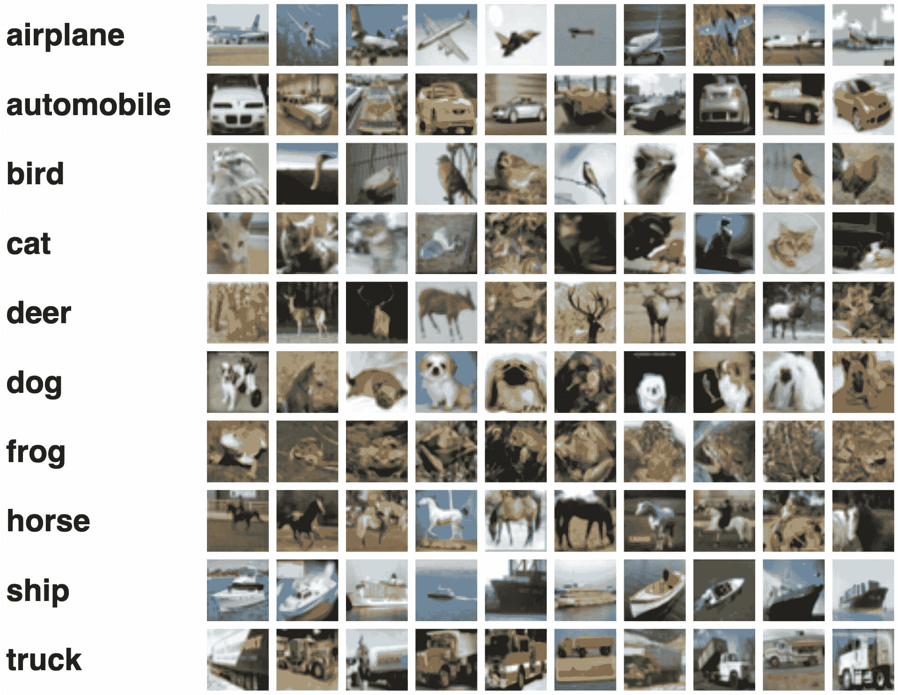

# CIFAR-100 数据集

> 原文：[`docs.ultralytics.com/datasets/classify/cifar100/`](https://docs.ultralytics.com/datasets/classify/cifar100/)

[CIFAR-100](https://www.cs.toronto.edu/~kriz/cifar.html)（加拿大先进研究所）数据集是 CIFAR-10 数据集的重要扩展，由 100 个不同类别的 60,000 张 32x32 彩色图像组成。该数据集由 CIFAR 研究所的研究人员开发，为更复杂的机器学习和计算机视觉任务提供了更具挑战性的数据集。

## 主要特性

+   CIFAR-100 数据集包含 60,000 张图像，分为 100 类。

+   每个类别包含 600 张图像，分为 500 张用于训练和 100 张用于测试。

+   这些图像为彩色，大小为 32x32 像素。

+   100 个不同的类别被分为 20 个粗略类别，用于高级别分类。

+   CIFAR-100 在机器学习和计算机视觉领域广泛用于训练和测试。

## 数据集结构

CIFAR-100 数据集被分为两个子集：

1.  **训练集**：这一子集包含 50,000 张用于训练机器学习模型的图像。

1.  **测试集**：这一子集包含 10,000 张用于测试和评估训练模型的图像。

## 应用场景

CIFAR-100 数据集广泛应用于深度学习模型的训练和评估，用于图像分类任务，如卷积神经网络（CNNs）、支持向量机（SVMs）以及其他各种机器学习算法。数据集在类别和颜色图像的多样性方面使其成为机器学习和计算机视觉领域研究与开发的更具挑战性和全面性的数据集。

## 使用方法

若要在 CIFAR-100 数据集上训练 YOLO 模型，进行 100 个 epoch 的训练，图像大小为 32x32，您可以使用以下代码片段。有关可用参数的全面列表，请参考模型训练页面。

训练示例

```py
`from ultralytics import YOLO  # Load a model model = YOLO("yolov8n-cls.pt")  # load a pretrained model (recommended for training)  # Train the model results = model.train(data="cifar100", epochs=100, imgsz=32)` 
```

```py
`# Start training from a pretrained *.pt model yolo  classify  train  data=cifar100  model=yolov8n-cls.pt  epochs=100  imgsz=32` 
```

## 样本图像与标注

CIFAR-100 数据集包含各种对象的彩色图像，为图像分类任务提供了一个结构良好的数据集。以下是数据集中一些图像的示例：



该示例展示了 CIFAR-100 数据集中物体的多样性和复杂性，突显了多样化数据集对训练健壮图像分类模型的重要性。

## 引用和致谢

如果您在研究或开发工作中使用 CIFAR-100 数据集，请引用以下论文：

```py
`@TECHREPORT{Krizhevsky09learningmultiple,   author={Alex Krizhevsky},   title={Learning multiple layers of features from tiny images},   institution={},   year={2009} }` 
```

我们要感谢 Alex Krizhevsky 创建和维护 CIFAR-100 数据集，作为机器学习和计算机视觉研究社区的宝贵资源。更多关于 CIFAR-100 数据集及其创建者的信息，请访问 [CIFAR-100 数据集网站](https://www.cs.toronto.edu/~kriz/cifar.html)。

## 常见问题解答

### CIFAR-100 数据集是什么，为什么如此重要？

[CIFAR-100 数据集](https://www.cs.toronto.edu/~kriz/cifar.html)是一组由 100 个类别分类的 60,000 张 32x32 彩色图像的大型集合。由加拿大高级研究所（CIFAR）开发，为复杂的机器学习和计算机视觉任务提供了具有挑战性的数据集。其重要性在于类别的多样性和图像的小尺寸，使其成为使用框架如 Ultralytics YOLO 训练和测试深度学习模型（如卷积神经网络 CNNs）的宝贵资源。

### 如何在 CIFAR-100 数据集上训练 YOLO 模型？

你可以使用 Python 或 CLI 命令在 CIFAR-100 数据集上训练 YOLO 模型。以下是详细步骤：

训练示例

```py
`from ultralytics import YOLO  # Load a model model = YOLO("yolov8n-cls.pt")  # load a pretrained model (recommended for training)  # Train the model results = model.train(data="cifar100", epochs=100, imgsz=32)` 
```

```py
`# Start training from a pretrained *.pt model yolo  classify  train  data=cifar100  model=yolov8n-cls.pt  epochs=100  imgsz=32` 
```

欲了解所有可用参数的全面列表，请参阅模型训练页面。

### CIFAR-100 数据集的主要应用是什么？

CIFAR-100 数据集广泛用于训练和评估用于图像分类的深度学习模型。其包含的 100 个类别分为 20 个粗略类别，为测试卷积神经网络（CNNs）、支持向量机（SVMs）和各种其他机器学习方法的算法提供了具有挑战性的环境。该数据集是机器学习和计算机视觉领域研究与开发的关键资源。

### CIFAR-100 数据集的结构是怎样的？

CIFAR-100 数据集分为两个主要子集：

1.  **训练集**：包含 50,000 张用于训练机器学习模型的图像。

1.  **测试集**：包含 10,000 张用于测试和基准测试训练模型的图像。

每个 100 个类别包含 600 张图片，其中 500 张用于训练，100 张用于测试，这使其非常适合进行严格的学术和工业研究。

### 我在哪里可以找到 CIFAR-100 数据集的示例图像和注释？

CIFAR-100 数据集包含各种物体的彩色图像，适合进行图像分类任务的结构化数据集。您可以查看文档页面以查看示例图像和注释。这些示例突显了数据集的多样性和复杂性，这对训练强大的图像分类模型至关重要。
