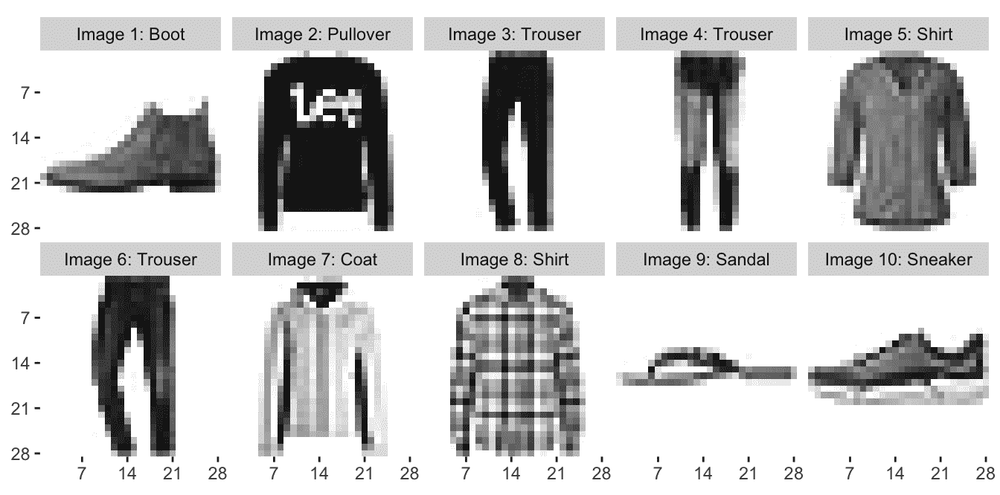

# Fashion-MNIST 数据集

> 原文：[`docs.ultralytics.com/datasets/classify/fashion-mnist/`](https://docs.ultralytics.com/datasets/classify/fashion-mnist/)

[Fashion-MNIST](https://github.com/zalandoresearch/fashion-mnist)数据集是 Zalando 服装图片的数据库，包括 60,000 个训练示例和 10,000 个测试示例。每个示例都是一个 28x28 的灰度图像，并与 10 个类别中的一个标签相关联。Fashion-MNIST 旨在作为原始 MNIST 数据集的直接替代，用于评估机器学习算法的基准。

[`www.youtube.com/embed/eX5ad6udQ9Q`](https://www.youtube.com/embed/eX5ad6udQ9Q)

**观看：**如何使用 Ultralytics YOLOv8 对时尚 MNIST 数据集进行图像分类

## 主要特点

+   Fashion-MNIST 包含 60,000 张 Zalando 服装图片的训练图像和 10,000 张测试图像。

+   数据集包括大小为 28x28 像素的灰度图像。

+   每个像素都有一个与之关联的单个像素值，表示该像素的亮度或暗度，数值越高表示越暗。这个像素值是介于 0 和 255 之间的整数。

+   Fashion-MNIST 广泛用于机器学习领域的训练和测试，特别是用于图像分类任务。

## 数据集结构

Fashion-MNIST 数据集分为两个子集：

1.  **训练集：**这个子集包含用于训练机器学习模型的 60,000 张图像。

1.  **测试集：**这个子集包含用于测试和基准测试训练模型的 10,000 张图像。

## 标签

每个训练和测试样本都被分配给以下标签之一：

1.  T 恤/上衣

1.  裤子

1.  毛衣

1.  连衣裙

1.  外套

1.  凉鞋

1.  衬衫

1.  运动鞋

1.  包

1.  短靴

## 应用

Fashion-MNIST 数据集广泛用于训练和评估深度学习模型在图像分类任务中的表现，如卷积神经网络（CNNs）、支持向量机（SVMs）和各种其他机器学习算法。数据集的简单和结构良好的格式使其成为机器学习和计算机视觉领域研究人员和从业者的重要资源。

## 使用

要在 Fashion-MNIST 数据集上使用 28x28 的图像大小对 CNN 模型进行 100 个 epoch 的训练，您可以使用以下代码片段。有关可用参数的详细列表，请参阅模型训练页面。

训练示例

```py
`from ultralytics import YOLO  # Load a model model = YOLO("yolov8n-cls.pt")  # load a pretrained model (recommended for training)  # Train the model results = model.train(data="fashion-mnist", epochs=100, imgsz=28)` 
```

```py
`# Start training from a pretrained *.pt model yolo  classify  train  data=fashion-mnist  model=yolov8n-cls.pt  epochs=100  imgsz=28` 
```

## 样本图像和注释

Fashion-MNIST 数据集包含 Zalando 服装图片的灰度图像，为图像分类任务提供了一个结构良好的数据集。以下是数据集中的一些图像示例：



此示例展示了 Fashion-MNIST 数据集中图像的多样性和复杂性，突显了多样化数据集对训练强大的图像分类模型的重要性。

## 致谢

如果您在研究或开发工作中使用时尚-MNIST 数据集，请通过链接到[GitHub 仓库](https://github.com/zalandoresearch/fashion-mnist)来承认该数据集。这个数据集由 Zalando Research 提供。

## FAQ

### 时尚-MNIST 数据集是什么，与 MNIST 有何不同？

[时尚-MNIST](https://github.com/zalandoresearch/fashion-mnist)数据集是 Zalando 的文章图片的集合，共有 70,000 张灰度图像，旨在作为原始 MNIST 数据集的现代替代品。它用于机器学习模型在图像分类任务中的基准测试。与手写数字的 MNIST 不同，Fashion-MNIST 包含了 28x28 像素的图像，分为 10 个与时尚相关的类别，例如 T 恤/上衣、裤子和短靴。

### 我如何在时尚-MNIST 数据集上训练 YOLO 模型？

要在时尚-MNIST 数据集上训练 Ultralytics YOLO 模型，您可以使用 Python 和 CLI 命令。以下是一个快速示例，帮助您入门：

训练示例

```py
`from ultralytics import YOLO  # Load a pretrained model model = YOLO("yolov8n-cls.pt")  # Train the model on Fashion-MNIST results = model.train(data="fashion-mnist", epochs=100, imgsz=28)` 
```

```py
`yolo  classify  train  data=fashion-mnist  model=yolov8n-cls.pt  epochs=100  imgsz=28` 
```

要了解更详细的训练参数，请参考训练页面。

### 我为什么应该使用时尚-MNIST 数据集来评估我的机器学习模型的基准性能？

[时尚-MNIST](https://github.com/zalandoresearch/fashion-mnist)数据集被深度学习社区广泛认可为 MNIST 的强大替代品。它提供了更复杂和多样化的图像集，是评估图像分类模型性能的绝佳选择。数据集由 60,000 个训练图像和 10,000 个测试图像组成，每个图像都标有 10 个类别之一，适合在更具挑战性的环境中评估不同机器学习算法的性能。

### 我可以使用 Ultralytics YOLO 进行像时尚-MNIST 这样的图像分类任务吗？

是的，Ultralytics YOLO 模型可用于包括时尚-MNIST 数据集在内的图像分类任务。例如，YOLOv8 支持各种视觉任务，如检测、分割和分类。要开始进行图像分类任务，请参考[分类页面](https://docs.ultralytics.com/tasks/classify/)。

### 时尚-MNIST 数据集的关键特性和结构是什么？

时尚-MNIST 数据集分为两个主要子集：60,000 个训练图像和 10,000 个测试图像。每个图像都是一个 28x28 像素的灰度图片，代表 10 个与时尚相关的类别之一。其简单和良好结构的格式使其非常适合在机器学习和计算机视觉任务中训练和评估模型。有关数据集结构的更多详细信息，请参阅数据集结构部分。

### 我如何在我的研究中承认使用时尚-MNIST 数据集？

如果你在研究或开发项目中使用 Fashion-MNIST 数据集，重要的是通过链接到 [GitHub 代码库](https://github.com/zalandoresearch/fashion-mnist) 来承认它。这有助于将数据归属于 Zalando Research，他们将该数据集公开供使用。
