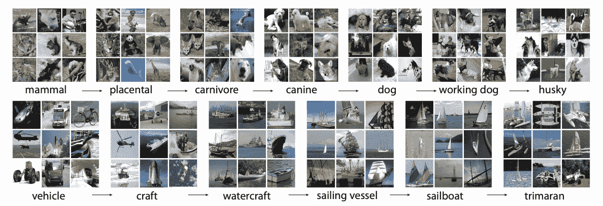

# ImageNet 数据集

> 原文：[`docs.ultralytics.com/datasets/classify/imagenet/`](https://docs.ultralytics.com/datasets/classify/imagenet/)

[ImageNet](https://www.image-net.org/)是一个大规模的带注释图像数据库，专为视觉对象识别研究而设计。它包含超过 1400 万张图像，每张图像都使用 WordNet 同义词集进行注释，使其成为在计算机视觉任务中训练深度学习模型的最广泛资源之一。

## ImageNet 预训练模型

| 模型 | 尺寸 ^((像素)) | 精度 ^(top1) | 精度 ^(top5) | 速度 ^(CPU ONNX

(ms)) | 速度 ^(A100 TensorRT

(ms)) | 参数 ^((M)) | FLOPs ^((B) at 640) |

| --- | --- | --- | --- | --- | --- | --- | --- |
| --- | --- | --- | --- | --- | --- | --- | --- |
| [YOLOv8n-cls](https://github.com/ultralytics/assets/releases/download/v8.2.0/yolov8n-cls.pt) | 224 | 69.0 | 88.3 | 12.9 | 0.31 | 2.7 | 4.3 |
| [YOLOv8s-cls](https://github.com/ultralytics/assets/releases/download/v8.2.0/yolov8s-cls.pt) | 224 | 73.8 | 91.7 | 23.4 | 0.35 | 6.4 | 13.5 |
| [YOLOv8m-cls](https://github.com/ultralytics/assets/releases/download/v8.2.0/yolov8m-cls.pt) | 224 | 76.8 | 93.5 | 85.4 | 0.62 | 17.0 | 42.7 |
| [YOLOv8l-cls](https://github.com/ultralytics/assets/releases/download/v8.2.0/yolov8l-cls.pt) | 224 | 76.8 | 93.5 | 163.0 | 0.87 | 37.5 | 99.7 |
| [YOLOv8x-cls](https://github.com/ultralytics/assets/releases/download/v8.2.0/yolov8x-cls.pt) | 224 | 79.0 | 94.6 | 232.0 | 1.01 | 57.4 | 154.8 |

## 主要特点

+   ImageNet 包含超过 1400 万高分辨率图像，涵盖数千个对象类别。

+   数据集按照 WordNet 层次结构进行组织，每个 synset 代表一个类别。

+   ImageNet 在计算机视觉领域广泛用于训练和基准测试，特别是用于图像分类和目标检测任务。

+   每年的 ImageNet 大规模视觉识别挑战(ILSVRC)对推动计算机视觉研究起到了重要作用。

## 数据集结构

ImageNet 数据集使用 WordNet 层次结构进行组织。层次结构中的每个节点表示一个类别，每个类别由一个同义词集描述（synset）。ImageNet 中的图像带有一个或多个 synset 注释，为训练模型识别各种对象及其关系提供了丰富的资源。

## ImageNet 大规模视觉识别挑战(ILSVRC)

每年的[ImageNet 大规模视觉识别挑战(ILSVRC)](https://image-net.org/challenges/LSVRC/)在计算机视觉领域是一个重要事件。它为研究人员和开发人员提供了一个平台，可以在大规模数据集上使用标准化评估指标评估其算法和模型。ILSVRC 推动了深度学习模型在图像分类、目标检测和其他计算机视觉任务中的显著进展。

## 应用

ImageNet 数据集广泛用于训练和评估各种计算机视觉任务中的深度学习模型，如图像分类、对象检测和对象定位。一些流行的深度学习架构，如 AlexNet、VGG 和 ResNet，是使用 ImageNet 数据集开发和基准测试的。

## 用法

要在 ImageNet 数据集上使用图像尺寸为 224x224 的图像进行 100 个 epoch 的深度学习模型训练，您可以使用以下代码片段。有关可用参数的全面列表，请参阅模型训练页面。

训练示例

```py
`from ultralytics import YOLO  # Load a model model = YOLO("yolov8n-cls.pt")  # load a pretrained model (recommended for training)  # Train the model results = model.train(data="imagenet", epochs=100, imgsz=224)` 
```

```py
`# Start training from a pretrained *.pt model yolo  classify  train  data=imagenet  model=yolov8n-cls.pt  epochs=100  imgsz=224` 
```

## 样例图像和注释

ImageNet 数据集包含数千种对象类别的高分辨率图像，为训练和评估计算机视觉模型提供了多样化和广泛的数据集。以下是数据集中的一些图像示例：



此示例展示了 ImageNet 数据集中图像的多样性和复杂性，突显了多样化数据集对训练健壮的计算机视觉模型的重要性。

## 引用和致谢

如果您在研究或开发工作中使用 ImageNet 数据集，请引用以下论文：

```py
`@article{ILSVRC15,   author  =  {Olga Russakovsky and Jia Deng and Hao Su and Jonathan Krause and Sanjeev Satheesh and Sean Ma and Zhiheng Huang and Andrej Karpathy and Aditya Khosla and Michael Bernstein and Alexander C. Berg and Li Fei-Fei},   title={ImageNet Large Scale Visual Recognition Challenge},   year={2015},   journal={International Journal of Computer Vision (IJCV)},   volume={115},   number={3},   pages={211-252} }` 
```

我们要感谢由 Olga Russakovsky、Jia Deng 和 Li Fei-Fei 领导的 ImageNet 团队，他们创建并维护了 ImageNet 数据集，作为机器学习和计算机视觉研究社区的宝贵资源。有关 ImageNet 数据集及其创建者的更多信息，请访问 [ImageNet 网站](https://www.image-net.org/)。

## 常见问题解答

### ImageNet 数据集是什么，如何在计算机视觉中使用？

[ImageNet 数据集](https://www.image-net.org/)是一个大规模数据库，包含超过 1400 万张高分辨率图像，使用 WordNet 同义词集进行分类。它广泛用于视觉对象识别研究，包括图像分类和对象检测。该数据集的注释和数量之多为深度学习模型的训练提供了丰富的资源。特别地，像 AlexNet、VGG 和 ResNet 这样的模型已经使用 ImageNet 进行了训练和基准测试，展示了它在推动计算机视觉中的作用。

### 如何在 ImageNet 数据集上使用预训练的 YOLO 模型进行图像分类？

要在 ImageNet 数据集上使用预训练的 Ultralytics YOLO 模型进行图像分类，请按照以下步骤操作：

训练示例

```py
`from ultralytics import YOLO  # Load a model model = YOLO("yolov8n-cls.pt")  # load a pretrained model (recommended for training)  # Train the model results = model.train(data="imagenet", epochs=100, imgsz=224)` 
```

```py
`# Start training from a pretrained *.pt model yolo  classify  train  data=imagenet  model=yolov8n-cls.pt  epochs=100  imgsz=224` 
```

欲了解更详细的训练说明，请参阅我们的训练页面。

### 为什么我应该在我的 ImageNet 数据集项目中使用 Ultralytics YOLOv8 预训练模型？

Ultralytics YOLOv8 预训练模型在速度和准确性方面表现出色，适用于各种计算机视觉任务。例如，YOLOv8n-cls 模型的 top-1 准确率达到 69.0%，top-5 准确率为 88.3%，针对实时应用进行了优化。预训练模型减少了从头开始训练所需的计算资源，并加速了开发周期。了解更多关于 YOLOv8 模型在 ImageNet 预训练模型部分的性能指标。

### 图像网（[ImageNet](https://image-net.org/challenges/LSVRC/)）数据集的结构是怎样的，以及它为何如此重要？

图像网数据集使用 WordNet 层次结构组织，层次结构中的每个节点表示由 synset（一组同义词术语）描述的类别。这种结构允许详细的注释，使其非常适合训练模型识别各种物体。图像网的多样性和注释丰富性使其成为开发健壮和通用深度学习模型的宝贵数据集。有关该组织的更多信息，请参阅数据集结构部分。

### 图像网大规模视觉识别挑战赛（ILSVRC）在计算机视觉中扮演着什么角色？

每年一度的[图像网大规模视觉识别挑战赛（ILSVRC）](https://image-net.org/challenges/LSVRC/)通过提供一个大规模、标准化的数据集上的竞争平台，对评估算法起着关键作用，推动了计算机视觉的进步。它提供了标准化的评估指标，促进了图像分类、目标检测和图像分割等领域的创新和发展。这一挑战不断推动深度学习和计算机视觉技术的发展边界。
