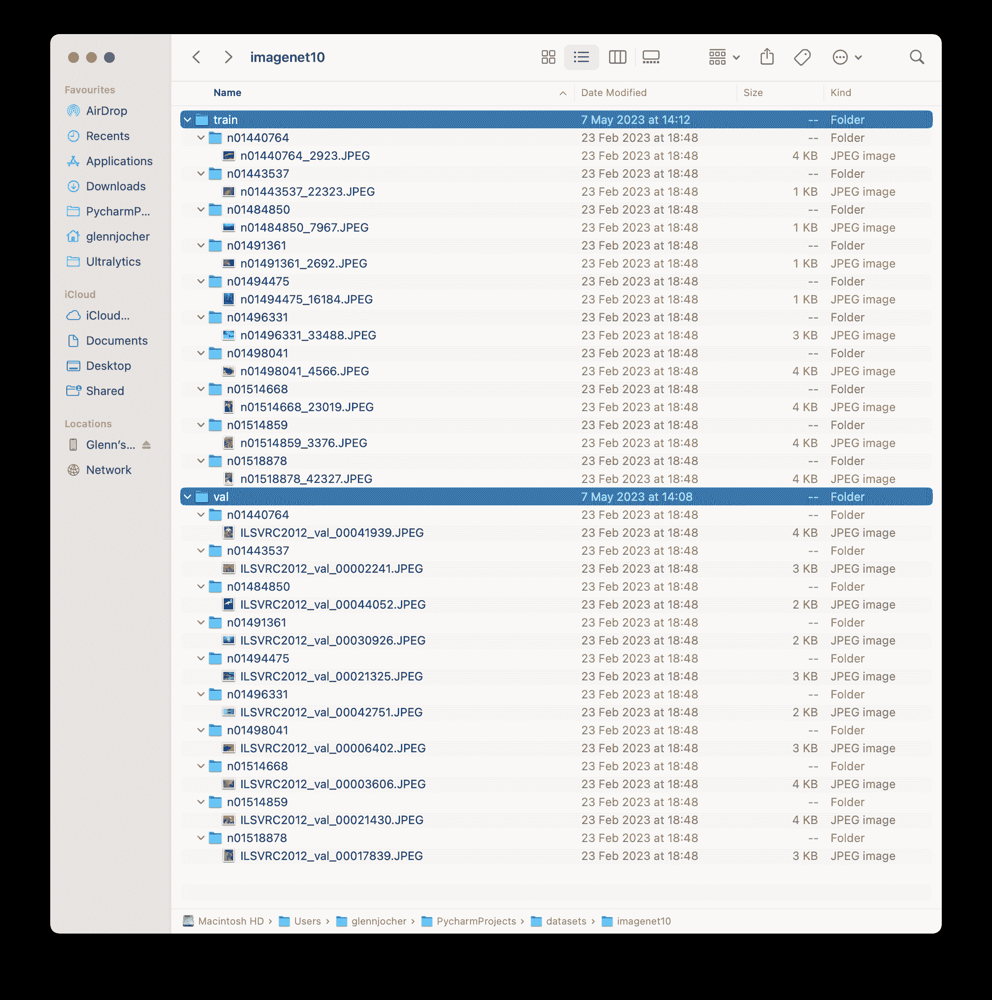

# ImageNet10 数据集

> 原文：[`docs.ultralytics.com/datasets/classify/imagenet10/`](https://docs.ultralytics.com/datasets/classify/imagenet10/)

[ImageNet10](https://github.com/ultralytics/assets/releases/download/v0.0.0/imagenet10.zip) 数据集是[ImageNet](https://www.image-net.org/) 数据库的一个小规模子集，由[Ultralytics](https://ultralytics.com) 开发，旨在进行 CI 测试、健全性检查和快速训练流程测试。该数据集由 ImageNet 的前 10 个类别中的训练集第一张图像和验证集第一张图像组成。虽然规模显著较小，但保留了原始 ImageNet 数据集的结构和多样性。

## 主要特点

+   ImageNet10 是 ImageNet 的一个紧凑版本，包含原始数据集前 10 个类别的 20 张图像。

+   数据集按照 WordNet 层次结构进行组织，反映了完整 ImageNet 数据集的结构。

+   在计算机视觉任务中，它非常适合进行 CI 测试、健全性检查和训练流程的快速测试。

+   虽然不是为模型基准测试设计的，但可以快速指示模型的基本功能和正确性。

## 数据集结构

ImageNet10 数据集与原始 ImageNet 一样，采用 WordNet 层次结构进行组织。ImageNet10 的每个类别都由一个同义词集（synset）描述。ImageNet10 中的图像带有一个或多个同义词集的注释，为测试模型识别各种对象及其关系提供了紧凑的资源。

## 应用

ImageNet10 数据集非常适用于快速测试和调试计算机视觉模型和流程。其小规模允许快速迭代，非常适合连续集成测试和健全性检查。它还可用于新模型或现有模型更改的快速初步测试，然后再进行完整的 ImageNet 数据集测试。

## 使用

若要在 224x224 的图像大小上测试深度学习模型在 ImageNet10 数据集上的效果，可以使用以下代码片段。有关可用参数的详细列表，请参阅模型训练页面。

测试示例

```py
`from ultralytics import YOLO  # Load a model model = YOLO("yolov8n-cls.pt")  # load a pretrained model (recommended for training)  # Train the model results = model.train(data="imagenet10", epochs=5, imgsz=224)` 
```

```py
`# Start training from a pretrained *.pt model yolo  classify  train  data=imagenet10  model=yolov8n-cls.pt  epochs=5  imgsz=224` 
```

## 样本图像和注释

ImageNet10 数据集包含原始 ImageNet 数据集中的一部分图像子集。这些图像被选为代表数据集中的前 10 个类别，为快速测试和评估提供了多样且紧凑的数据集。

 该示例展示了 ImageNet10 数据集中图像的多样性和复杂性，突显了它在健全性检查和快速测试计算机视觉模型时的实用性。

## 引用和致谢

如果您在研究或开发工作中使用 ImageNet10 数据集，请引用原始 ImageNet 论文：

```py
`@article{ILSVRC15,   author  =  {Olga Russakovsky and Jia Deng and Hao Su and Jonathan Krause and Sanjeev Satheesh and Sean Ma and Zhiheng Huang and Andrej Karpathy and Aditya Khosla and Michael Bernstein and Alexander C. Berg and Li Fei-Fei},   title={ImageNet Large Scale Visual Recognition Challenge},   year={2015},   journal={International Journal of Computer Vision (IJCV)},   volume={115},   number={3},   pages={211-252} }` 
```

我们要感谢由 Olga Russakovsky、Jia Deng 和 Li Fei-Fei 领导的 ImageNet 团队，他们创建并维护了 ImageNet 数据集。虽然 ImageNet10 数据集是一个紧凑的子集，但在机器学习和计算机视觉研究社区中，它是一个用于快速测试和调试的宝贵资源。关于 ImageNet 数据集及其创建者的更多信息，请访问[ImageNet 网站](https://www.image-net.org/)。

## 常见问题

### ImageNet10 数据集是什么，与完整的 ImageNet 数据集有何不同？

[ImageNet10](https://github.com/ultralytics/assets/releases/download/v0.0.0/imagenet10.zip)数据集是原始[ImageNet](https://www.image-net.org/)数据库的紧凑子集，由 Ultralytics 创建，用于快速 CI 测试、健全性检查和训练流水线评估。ImageNet10 仅包括 20 张图像，代表 ImageNet 前 10 个类别的训练和验证集中的第一张图像。尽管规模小，但它保持了完整数据集的结构和多样性，非常适合快速测试，但不适用于模型基准测试。

### 如何使用 ImageNet10 数据集测试我的深度学习模型？

要在 224x224 的图像尺寸上使用 ImageNet10 数据集测试您的深度学习模型，请使用以下代码片段。

测试示例

```py
`from ultralytics import YOLO  # Load a model model = YOLO("yolov8n-cls.pt")  # load a pretrained model (recommended for training)  # Train the model results = model.train(data="imagenet10", epochs=5, imgsz=224)` 
```

```py
`# Start training from a pretrained *.pt model yolo  classify  train  data=imagenet10  model=yolov8n-cls.pt  epochs=5  imgsz=224` 
```

请参阅培训页面以获取可用参数的全面列表。

### 为什么我应该在 CI 测试和健全性检查中使用 ImageNet10 数据集？

ImageNet10 数据集专为深度学习流水线中的 CI 测试、健全性检查和快速评估而设计。其小规模使得可以快速迭代和测试，非常适合速度至关重要的持续集成流程。通过保持原始 ImageNet 数据集的结构复杂性和多样性，ImageNet10 能够可靠地指示模型的基本功能和正确性，而无需处理大型数据集带来的额外开销。

### ImageNet10 数据集的主要特点是什么？

ImageNet10 数据集具有以下几个关键特点：

+   **紧凑大小**：仅有 20 张图像，可进行快速测试和调试。

+   **结构化组织**：遵循 WordNet 层次结构，类似于完整的 ImageNet 数据集。

+   **CI 和健全性检查**：非常适合连续集成测试和健全性检查。

+   **非基准测试**：虽然用于快速模型评估很有用，但不适用于广泛的基准测试。

### 我从哪里可以下载 ImageNet10 数据集？

您可以从[Ultralytics GitHub 发布页面](https://github.com/ultralytics/assets/releases/download/v0.0.0/imagenet10.zip)下载 ImageNet10 数据集。有关其结构和应用的更详细信息，请参阅 ImageNet10 数据集页面。
