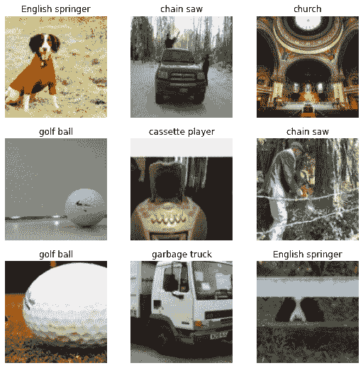

# ImageNette 数据集

> 原文：[`docs.ultralytics.com/datasets/classify/imagenette/`](https://docs.ultralytics.com/datasets/classify/imagenette/)

[ImageNette](https://github.com/fastai/imagenette) 数据集是较大的 [Imagenet](https://www.image-net.org/) 数据集的子集，但仅包括 10 个易于区分的类别。它被创建为 Imagenet 的更快、更易于使用的版本，用于软件开发和教育。

## 主要特点

+   ImageNette 包含来自十个不同类别的图像，例如 tench（鲑鱼）、English springer（英国斯普林格犬）、cassette player（卡带播放器）、chain saw（链锯）、church（教堂）、French horn（法国号）、garbage truck（垃圾车）、gas pump（加油泵）、golf ball（高尔夫球）、parachute（降落伞）。

+   该数据集包含尺寸不同的彩色图像。

+   ImageNette 在机器学习领域广泛用于训练和测试，特别是图像分类任务。

## 数据集结构

ImageNette 数据集分为两个子集：

1.  **训练集**：该子集包含数千张用于训练机器学习模型的图像。每个类别的确切数量会有所变化。

1.  **验证集**：该子集包含数百张图像，用于验证和评估训练模型。同样，每个类别的确切数量会有所变化。

## 应用

ImageNette 数据集在图像分类任务中广泛用于训练和评估深度学习模型，如卷积神经网络（CNNs）和其他各种机器学习算法。该数据集直观的格式和精心选择的类别，使其成为机器学习和计算机视觉领域的初学者和经验丰富从业者的便捷资源。

## 用法

要在 ImageNette 数据集上使用标准的图像大小为 224x224，训练模型 100 个 epoch，可以使用以下代码片段。有关可用参数的详细列表，请参阅模型训练页面。

训练示例

```py
from ultralytics import YOLO

# Load a model
model = YOLO("yolov8n-cls.pt")  # load a pretrained model (recommended for training)

# Train the model
results = model.train(data="imagenette", epochs=100, imgsz=224) 
```

```py
# Start training from a pretrained *.pt model
yolo  classify  train  data=imagenette  model=yolov8n-cls.pt  epochs=100  imgsz=224 
```

## 样本图像和注释

ImageNette 数据集包含各种对象和场景的彩色图像，为图像分类任务提供了多样化的数据集。以下是数据集中的一些示例图像：



该示例展示了 ImageNette 数据集中图像的多样性和复杂性，突显了多样化数据集对训练健壮图像分类模型的重要性。

## ImageNette160 和 ImageNette320

为了更快的原型设计和训练，ImageNette 数据集还提供了两个缩减版本：ImageNette160 和 ImageNette320。这些数据集与完整的 ImageNette 数据集具有相同的类别和结构，但图像被调整到较小的尺寸。因此，这些数据集版本特别适用于初步模型测试，或者在计算资源有限时使用。

要使用这些数据集，只需在训练命令中用 'imagenette160' 或 'imagenette320' 替换 'imagenette'。以下代码片段说明了这一点：

使用 ImageNette160 的训练示例

```py
from ultralytics import YOLO

# Load a model
model = YOLO("yolov8n-cls.pt")  # load a pretrained model (recommended for training)

# Train the model with ImageNette160
results = model.train(data="imagenette160", epochs=100, imgsz=160) 
```

```py
# Start training from a pretrained *.pt model with ImageNette160
yolo  classify  train  data=imagenette160  model=yolov8n-cls.pt  epochs=100  imgsz=160 
```

使用 ImageNette320 进行训练示例

```py
from ultralytics import YOLO

# Load a model
model = YOLO("yolov8n-cls.pt")  # load a pretrained model (recommended for training)

# Train the model with ImageNette320
results = model.train(data="imagenette320", epochs=100, imgsz=320) 
```

```py
# Start training from a pretrained *.pt model with ImageNette320
yolo  classify  train  data=imagenette320  model=yolov8n-cls.pt  epochs=100  imgsz=320 
```

这些数据集的较小版本允许在开发过程中快速迭代，同时仍提供有价值和现实的图像分类任务。

## 引用和致谢

如果您在研究或开发工作中使用 ImageNette 数据集，请适当地加以确认。有关 ImageNette 数据集的更多信息，请访问[ImageNette 数据集 GitHub 页面](https://github.com/fastai/imagenette)。

## 常见问题解答

### 什么是 ImageNette 数据集？

[ImageNette 数据集](https://github.com/fastai/imagenette)是较大的[ImageNet 数据集](https://www.image-net.org/)的简化子集，仅包含 10 个易于区分的类别，例如 tench、English springer 和 French horn。它旨在为高效的训练和评估图像分类模型提供更可管理的数据集。该数据集特别适用于快速软件开发以及机器学习和计算机视觉的教育目的。

### 我如何使用 ImageNette 数据集训练 YOLO 模型？

要在 ImageNette 数据集上为 YOLO 模型训练 100 个时期，您可以使用以下命令。确保已设置好 Ultralytics YOLO 环境。

训练示例

```py
from ultralytics import YOLO

# Load a model
model = YOLO("yolov8n-cls.pt")  # load a pretrained model (recommended for training)

# Train the model
results = model.train(data="imagenette", epochs=100, imgsz=224) 
```

```py
# Start training from a pretrained *.pt model
yolo  classify  train  data=imagenette  model=yolov8n-cls.pt  epochs=100  imgsz=224 
```

欲了解更多详细信息，请参阅训练文档页面。

### 我为什么要在图像分类任务中使用 ImageNette？

ImageNette 数据集有几个优点：

+   **快速简便**：仅包含 10 个类别，比大型数据集更简单和节省时间。

+   **教育用途**：适合学习和教授图像分类基础知识，因为它需要较少的计算资源和时间。

+   **多功能性**：广泛用于训练和基准测试各种机器学习模型，尤其是在图像分类中。

欲了解有关模型训练和数据集管理的详细信息，请探索数据集结构部分。

### ImageNette 数据集可以用不同的图像尺寸吗？

是的，ImageNette 数据集也有两个调整大小的版本：ImageNette160 和 ImageNette320。这些版本有助于更快地进行原型设计，并在计算资源有限时特别有用。

使用 ImageNette160 进行训练示例

```py
from ultralytics import YOLO

# Load a model
model = YOLO("yolov8n-cls.pt")

# Train the model with ImageNette160
results = model.train(data="imagenette160", epochs=100, imgsz=160) 
```

```py
# Start training from a pretrained *.pt model with ImageNette160
yolo  detect  train  data=imagenette160  model=yolov8n-cls.pt  epochs=100  imgsz=160 
```

欲了解更多信息，请参阅使用 ImageNette160 和 ImageNette320 进行训练。

### ImageNette 数据集的一些实际应用是什么？

ImageNette 数据集被广泛用于：

+   **教育设置**：用于教授机器学习和计算机视觉初学者。

+   **软件开发**：用于快速原型设计和图像分类模型开发。

+   **深度学习研究**：评估和基准测试各种深度学习模型的性能，尤其是卷积神经网络（CNN）。

探索应用程序部分以获取详细的使用案例。
