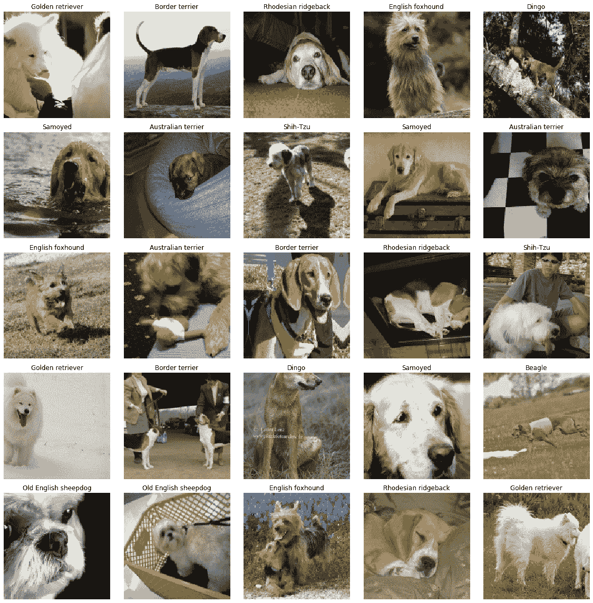

# ImageWoof 数据集

> 原文：[`docs.ultralytics.com/datasets/classify/imagewoof/`](https://docs.ultralytics.com/datasets/classify/imagewoof/)

[ImageWoof](https://github.com/fastai/imagenette) 数据集是 ImageNet 的一个子集，包含 10 个具有挑战性的狗类别。这些类别很难分类，旨在鼓励开发更先进的模型。

## 主要特点

+   ImageWoof 包含 10 种不同的狗类：澳大利亚梗、边境梗、萨摩耶、比格犬、狮子狗、英国猎狐犬、罗得西亚脊背犬、澳大利亚野狗、金毛寻回犬和英国牧羊犬。

+   该数据集提供各种分辨率的图像（全尺寸、320px、160px），以适应不同的计算能力和研究需求。

+   还包括一个带有嘈杂标签的版本，提供一个更真实的场景，其中标签可能并不总是可靠的。

## 数据集结构

ImageWoof 数据集的结构基于狗种类，每个品种都有自己的图像目录。

## 应用

ImageWoof 数据集广泛用于训练和评估图像分类任务中的深度学习模型，特别是在处理更复杂和相似类别时。该数据集的挑战在于狗品种之间的微妙差异，推动模型性能和泛化能力的极限。

## 使用

要在 ImageWoof 数据集上使用 CNN 模型进行 100 个 epochs 的训练，图像尺寸为 224x224，可以使用以下代码片段。有关可用参数的全面列表，请参阅模型训练页面。

训练示例

```py
`from ultralytics import YOLO  # Load a model model = YOLO("yolov8n-cls.pt")  # load a pretrained model (recommended for training)  # Train the model results = model.train(data="imagewoof", epochs=100, imgsz=224)` 
```

```py
`# Start training from a pretrained *.pt model yolo  classify  train  data=imagewoof  model=yolov8n-cls.pt  epochs=100  imgsz=224` 
```

## 数据集变种

ImageWoof 数据集提供三种不同尺寸，以适应各种研究需求和计算能力：

1.  **全尺寸（imagewoof）**：这是 ImageWoof 数据集的原始版本。它包含全尺寸图像，非常适合最终训练和性能基准测试。

1.  **中等尺寸（imagewoof320）**：此版本包含将图像调整大小至最大边长为 320 像素的图像。它适用于更快的训练，而不会显著牺牲模型性能。

1.  **小尺寸（imagewoof160）**：此版本包含将图像调整大小至最大边长为 160 像素的图像。它专为快速原型设计和实验而设计，其中训练速度是优先考虑的。

要在训练中使用这些变体，只需将数据集参数中的 'imagewoof' 替换为 'imagewoof320' 或 'imagewoof160'。例如：

```py
`from ultralytics import YOLO  # Load a model model = YOLO("yolov8n-cls.pt")  # load a pretrained model (recommended for training)  # For medium-sized dataset model.train(data="imagewoof320", epochs=100, imgsz=224)  # For small-sized dataset model.train(data="imagewoof160", epochs=100, imgsz=224)` 
```

重要提示：使用较小的图像可能会降低分类准确性的性能。然而，在模型开发和原型设计的早期阶段，这是迭代快速的绝佳方式。

## 样本图像和注释

ImageWoof 数据集包含各种狗类的彩色图像，为图像分类任务提供了具有挑战性的数据集。以下是数据集中的一些示例图像：



该示例展示了 ImageWoof 数据集中不同狗品种之间的细微差别和相似之处，突显了分类任务的复杂性和困难。

## 引用和致谢

如果您在研究或开发工作中使用 ImageWoof 数据集，请务必通过链接到[官方数据集存储库](https://github.com/fastai/imagenette)来致谢数据集的创建者。

我们要感谢 FastAI 团队为机器学习和计算机视觉研究社区创建和维护了 ImageWoof 数据集，作为宝贵的资源。有关 ImageWoof 数据集的更多信息，请访问[ImageWoof 数据集存储库](https://github.com/fastai/imagenette)。

## 常见问题

### ImageWoof 数据集在 Ultralytics 中是什么？

[ImageWoof](https://github.com/fastai/imagenette)数据集是 ImageNet 的一个具有挑战性的子集，专注于 10 种特定的狗品种。旨在推动图像分类模型的极限，包括比格犬、狮子狗和金毛寻回犬等品种。该数据集包括不同分辨率（全尺寸、320px、160px）的图像，甚至包含用于更真实训练场景的噪声标签。这种复杂性使得 ImageWoof 非常适合开发更先进的深度学习模型。

### 如何使用 Ultralytics YOLO 训练 ImageWoof 数据集的模型？

要在图像大小为 224x224 的情况下使用 Ultralytics YOLO 在 ImageWoof 数据集上训练一个卷积神经网络（CNN）模型进行 100 个 epochs，可以使用以下代码：

训练示例

```py
`from ultralytics import YOLO  model = YOLO("yolov8n-cls.pt")  # Load a pretrained model results = model.train(data="imagewoof", epochs=100, imgsz=224)` 
```

```py
`yolo  classify  train  data=imagewoof  model=yolov8n-cls.pt  epochs=100  imgsz=224` 
```

要获取关于可用训练参数的更多详细信息，请参考训练页面。

### ImageWoof 数据集有哪些版本可用？

ImageWoof 数据集有三种尺寸：

1.  **全尺寸（imagewoof）**：适合最终训练和基准测试，包含全尺寸图像。

1.  **中等尺寸（imagewoof320）**：调整大小后的图像，最大边长为 320 像素，适合更快的训练速度。

1.  **小尺寸（imagewoof160）**：调整大小后的图像，最大边长为 160 像素，非常适合快速原型设计。

通过相应替换数据集参数中的'imagewoof'来使用这些版本。然而，较小的图像可能会导致较低的分类准确性，但对于快速迭代可能会更有用。

### ImageWoof 数据集中的噪声标签如何有益于训练？

ImageWoof 数据集中的噪声标签模拟了现实世界中可能不准确的标签条件。使用这些数据训练模型有助于开发图像分类任务中的鲁棒性和泛化能力。这使得模型能够有效处理模糊或误标记的数据，在实际应用中经常遇到这种情况。

### 使用 ImageWoof 数据集的主要挑战是什么？

ImageWoof 数据集的主要挑战在于其中包含的犬种之间的细微差异。由于它集中于 10 个密切相关的品种，区分它们需要更高级和精细调整的图像分类模型。这使得 ImageWoof 成为测试深度学习模型能力和改进的优秀基准。
